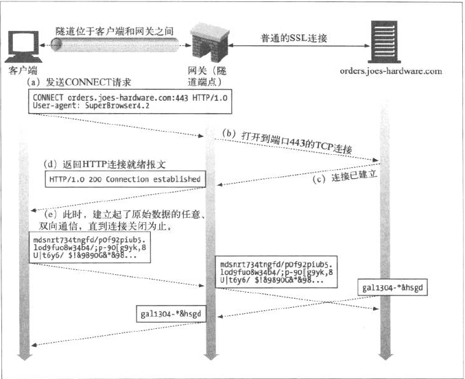
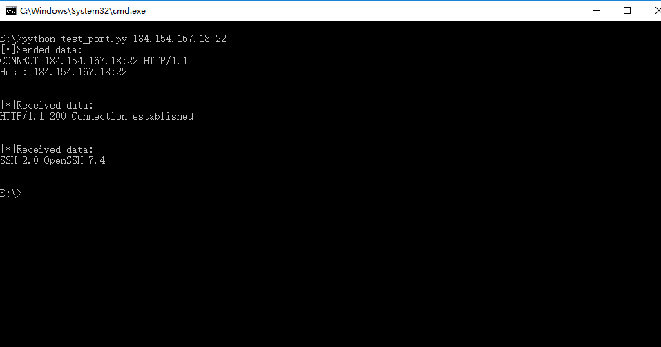
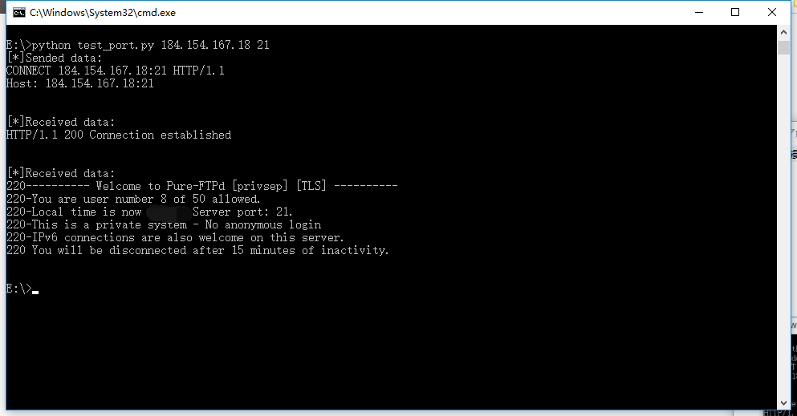
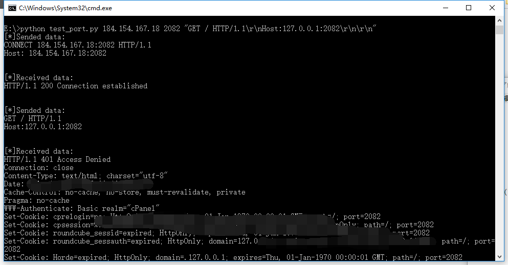
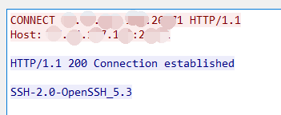
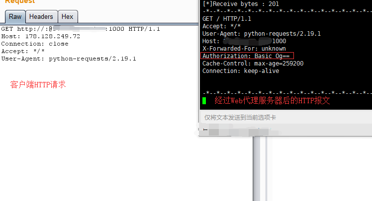
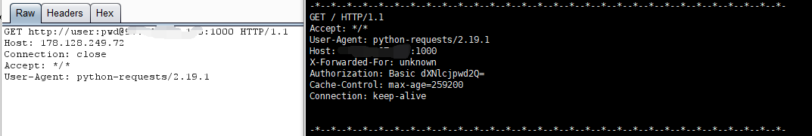

在这里，和大家聊聊我自己所知道的一些关于Web代理的知识。

## WEB代理的类型

Web代理，有普通代理和隧道代理两种，下面简单说说这两种类型。

#### 普通代理

该类型最为简单，代理服务器作为中间人，转发客户端的HTTP请求给目标主机，之后将目标主机的HTTP响应报文回送给客户端。

普通代理这里有个“小坑”，放到后面和大家说。

#### 隧道代理

首先，客户端向代理服务器发送HTTP请求，方法为CONNECT，表示请求代理服务器与目的服务器的特定端口建立TCP连接，之后代理服务器对客户端与目标服务器之间的数据进行盲转发。

具体如下图（《HTTP权威指南》第八章）：



假如我们为浏览器设置了WEB代理，在访问HTTPS类型网站时，会使用隧道代理的方式来进行访问；遇到HTTP类型网站，为了减小不必要的开销，浏览器则通常采用普通代理的方式来进行访问。

这里有篇文章，写得很详细：

<https://imququ.com/post/web-proxy.html>

## 扫端口

在渗透测试时，遇到某些WAF时，你会发现连扫端口都没法扫，而WEB扫描/暴力破解，在遇到有WAF时则可以通过Web代理服务器（大量）来进行绕过。于是笔者就幻想着有没有类似WEB代理的东西，能够解决扫端口时被WAF屏蔽的情况。起初我想了想，摇了摇头，“不可能，WEB代理服务器不是与HTTP协议相关吗，这是应用层的东西，扫端口的话，应该是传输层的东西”

现在想想也是好笑，当时都没搞明白Web代理具体是个什么样的东西，实现方法都有哪些。

其实，通过`WebSocket代理`就可以做到“通过代理进行端口扫描”，当然，该种情况下只能进行TCP端口的信息嗅探，而扫描的结果不只是端口是否存活，同样可以判别端口的服务类型。

原理十分简单。

第一步判断端口是否开放。

```
CONNECT http://www.test.com:8080 HTTP/1.1
Host: www.test.com:8080
```

如果目标端口为开放的状态，会返回200；未开放的，代理服务器会返回`503`状态信息，大致分别如下。

```
HTTP/1.1 200 Connection established
HTTP/1.1 503 Service Unavailable
Server: squid/3.3.8
...
```

这里有一个很大的问题：很多代理服务器似乎对访问的域名/IP/端口做了一些限制，完全“开放”的websocket代理服务器数量上就可能更少了。之前笔者收集代理服务器都是通过对一些免费的网站进行爬取，这种收集到的代理在这种用途中的可用性惨不忍睹，选择收费的或是通过Shodan搜索Header中的关键字来进行收集整理或许是更好的方法。

在建立套接字后，有的服务会直接返回banner数据，这种情况下，直接选择接收下一个TCP包即可；有的就需要客户端这边发送些数据才能探测到关于该服务的信息；以及还有其他情况。笔者写了一个简单的py脚本，进行了一些测试，结果如下：







banner信息在代理服务器返回状态码的时候就返回的情况：



脚本：

<https://pan.baidu.com/s/1U9MeVfrZgwDsq43EGTGYUA>

到头想来，这样搞端口扫描成本太大了，目标得重要到啥程度啊。

## 一个小坑

前阵子，笔者在写代码时，被这个坑了大半天，当时解决了这个问题，但还是云里雾里的。之后翻开《Web之困》，发现书中已有说明。

引用《Web之困》一书`3.1.3`小节中的一段话：

> GET <http://www.fuzzybunnies.com/> HTTP/1.1
> Host: [www.fuzzybunnies.com](http://www.fuzzybunnies.com/)
> …
>
> 上述例子和普通的HTTP请求最大的语法差异，就是请求内容里的第一行，这时候是一个完整的URL，通过这项信息代理服务器才知道用户要连接的目标服务器在哪里。这项信息实际上有点多余，因为在Host请求头里也标识了主机名称；这种重复是因为这两套机制其实是相互独立发展起来的。为了避免客户端和服务器串通一气，如果Host请求头的信息与请求行里的URL不匹配时，代理服务器应以请求行里的URL为准，或者用特定的“URL-Host”数据对和缓存内容联起来，而不能只根据其中一项信息做出判断。

至此，笔者才恍然大悟，又回想起很久之前在浏览一些网站发生的“奇怪的事情”。有那么一两个网站，笔者在浏览器中进行访问是正常的，但用`BurpSuit`的`Repeater`去访问时却发生`HTTP 400`的情况，之后尝试把请求行中的URI改为完整的URL，访问就正常了，当时也不知道啥回事，没深究就这样过去了…由于问题复现不了，具体症结现在也理不清了，但很可能是Web代理引发的问题。问了一些朋友，有的遇到过，不过没解决。不知道同学们遇到过没。

## 反向代理

反向代理，按照笔者的理解，客户端把反向代理服务器当作真正的后台服务器即可。反向代理服务接收到客户端的请求后，如有需要会向真正的后台服务器请求资源，并返回给客户端，而客户端无需感知这是不是一台反向代理服务器。

笔者问了一些渗透测试得朋友在工作中遇到反向代理这种情况，很多说太高大上了，基本没遇到。但笔者经常遇到啊…难道是他们没发现？(懵逼)

测试时，遇到一些网站HTTP响应报文的头部有`Ngnix`字样，则很可能存在反向代理，而要发现反向代理背后的服务器中间件类型也很简单，只要让后端服务器发送一些非200的响应报文就好，似乎反向代理服务器对非200的报文是直接返回的，这可能是配置问题。比如发送一些代理服务器觉得正常但后端服务器无法识别的报文，例如让后端服务器返回400。

```
HTTP /% HTTP/1.1
Host: www.test.com
...
```

关于反向代理，有些地方很有意思。反代如果配置不当，就可能变为正代，然后就发生了内网漫游的安全问题。国外与国内都有类型的案例。贴两篇国内的文章：

<http://wooyun.jozxing.cc/static/bugs/wooyun-2016-0191121.html> （lijiejie)

[https://mp.weixin.qq.com/s/EtUmfMxxJjYNl7nIOKkRmA（ChaMd5）](https://mp.weixin.qq.com/s/EtUmfMxxJjYNl7nIOKkRmA%EF%BC%88ChaMd5%EF%BC%89)

把HTTP请求的URI改为完整URI形式即可测试，如：

```
GET http://office.test.com HTTP/1.1
Host: www.test.com
...
```

而`lijiejie`的漏洞POC比较有意思，他给出的POC是这样的（后来学习了更多的知识，笔者才知道这是Apache的一个SSRF漏洞）

```
GET :@office.test.com HTTP/1.1
Host: www.test.com
...
```


熟悉URL结构的同学们知道，`:@`在这里是指认证信息。而，`lijiejie`还额外删去了协议名称与分隔符`scheme://`，笔者也不知道其中具体原因，正常来说，只会返回400。
而添加了认证信息的HTTP请求被代理服务器接收到后，会将认证信息取出，设置给`Authorization` header字段，如：





另外，笔者发现有些人的HTTP请求喜欢加上`Authorization: Basic Og==`头部字段，难道这里有什么猫腻吗…

协议类型`scheme`还可以更改为其他，诸如 ftp、gopher、file等，具体情况要看代理服务器的支持能力。

关于反向代理，还有一个比较有意思的地方。有些程序员为了降低服务的的带宽压力，在客户端发送HTTP POST 数据包之前，会将客户端请求体内的数据进行压缩，然后在头部指明压缩类型，如gzip，数据包类似下面这样

```
POST /index.php HTTP/1.1
Host: www.test.com
Content-Type: application/x-www-form-urlencoded; charset=UTF-8
Content-Encoding: gzip
Content-Length: 38

...._.{[...L.-....S(N.IM.Q0....0.
....
```

当防火墙处于最外层，流量先经过防火墙后再经过反向代理，假如防火墙不支持解压HTTP Request的包体，或是无法识别该类型的压缩，则十分可能发生安全问题。

另外提一下，有些同学可能对URI与URL有点混淆，记住URL是URI的子集即可。

## HTTP转发扩展

RFC7239文档中说到，在很多情况下，用户网络中存在着代理，而这些代理又屏蔽了客户端的很多信息，诸如IP地址。所以文档提议增加X-Forwarded-For等字段，方便进行访问控制、诊断等。其中还说到，这些字段对反向代理也应起作用。

<https://tools.ietf.org/html/rfc7239>

在提供Web代理IP的网站上，我们可以发现其提供的代理存在匿名与非匿名两种，通过查看代理服务器的HTTP请求是否带有`X-Forwarded-For`字段即可判断代理是否匿名。很多代理是非开放的，需要认证信息`Proxy-Authorization`

关于代理转发扩展，除了`X-Forwarded-For`该种的，还有很多，比如

```
X-Originating-IP: 127.0.0.1
X-Remote-IP: 127.0.0.1
X-Remote-Addr: 127.0.0.1
X-Client-IP: 127.0.0.1
```

除了`X-Forwarded-For`，其他都是非标准字段。在`BurpSuit`插件商店中，有款名为`Bypass WAF`的插件，能让Burp的所有请求自动添加这些头部字段，还做了其他很多扩展，感兴趣的同学可以看看。

<https://www.codewatch.org/blog/?p=408>

## 结语

刚刚接触HTTP时，Web代理的相关知识一直获取到的不多，后来慢慢发现其实还是很重要的。这篇文章也是对自己在web代理知识方面的一个小结，由于笔者水平有限，如果有错误的地方，欢迎大家指出。