## 引言

之前看了看Apache是如何解析HTTP请求的，整理了一下笔记，说说其中的一些要点。

首先，在最新版本的Apache服务器http2.4.41中，似乎移除了对HTTP的许多“兼容特性”，这些特性是不符合RFC标准的，而笔者当时阅读的代码为2.4.3，本文记录了笔者在阅读代码时认为十分重要的一些解析细节。

## read a line

Apache读到LF字符时，就判断一行已经读完了。

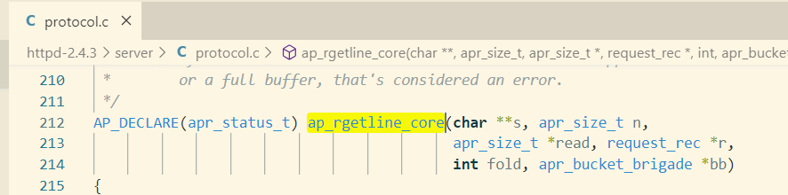

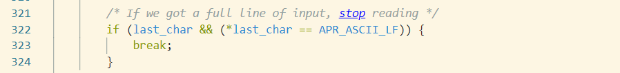

## before request line

读取请求行时，会跳过blank line，默认为DEFAULT_LIMIT_BLANK_LINES 次 （limit_req_fields没有被初始化），奇怪的是在2.4.3源码中没有搜索到定义值，在2.4.41中倒是搜索到了。

Apache之所以会这样做，代码中解释说，浏览器在发POST请求时，会在末尾添加CRLF，如果形成一个pileline请求，request line前面就会有空行。

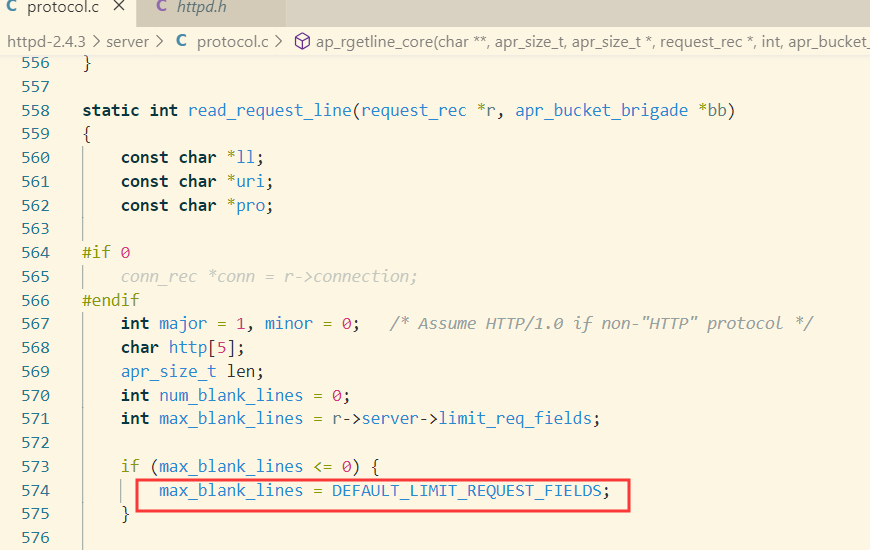

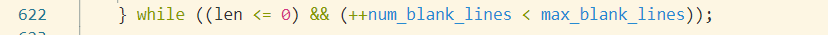

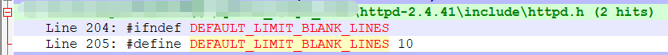

## request line

请求行默认长度最大为8190字节，请求行由三部分组成 method、uri、version

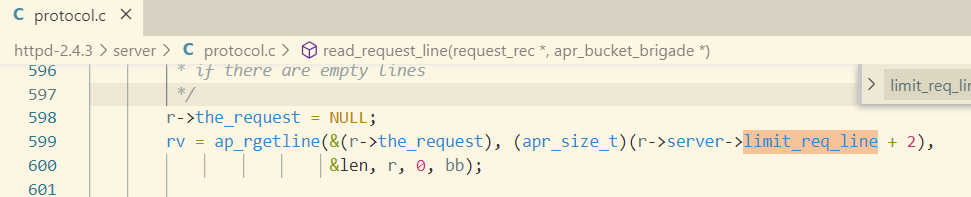

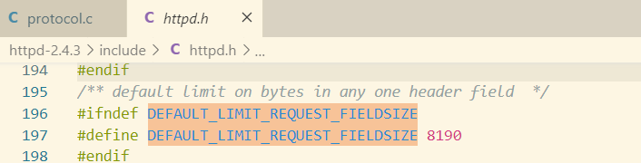

在获取method 、uri的时候，需要判断是否空白字符，2.4.3使用isspace来判断是否空白字符。

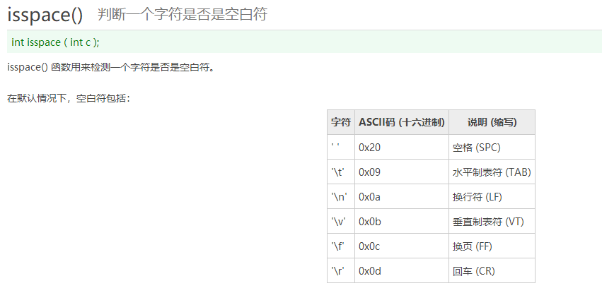

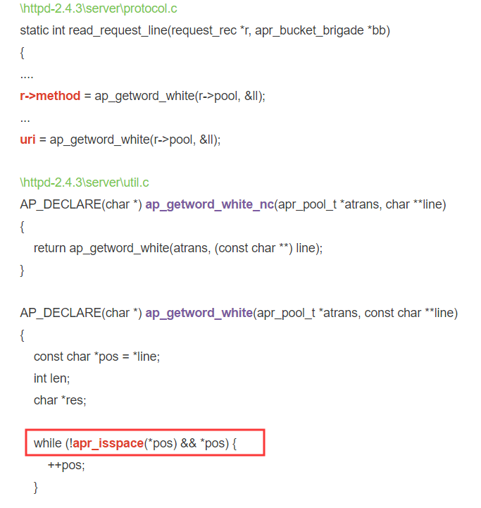

内置method有26个，未被识别时返回UNKNOWN_METHOD（为啥phpstudy搭建的2.4.23 瞎写method都可以...）

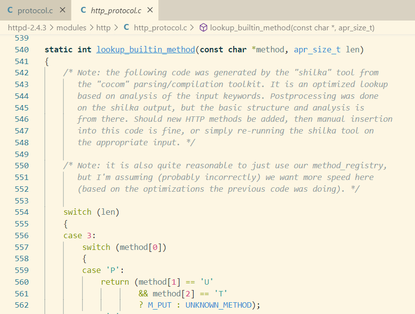

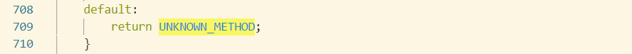

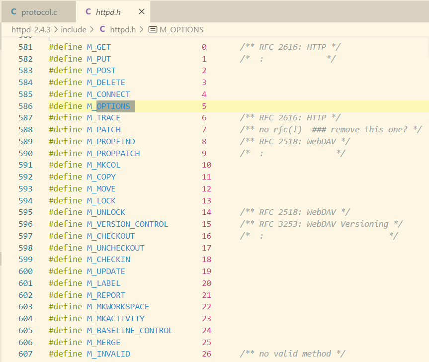

version没被解析成功的情况下，被设置为HTTP1.0

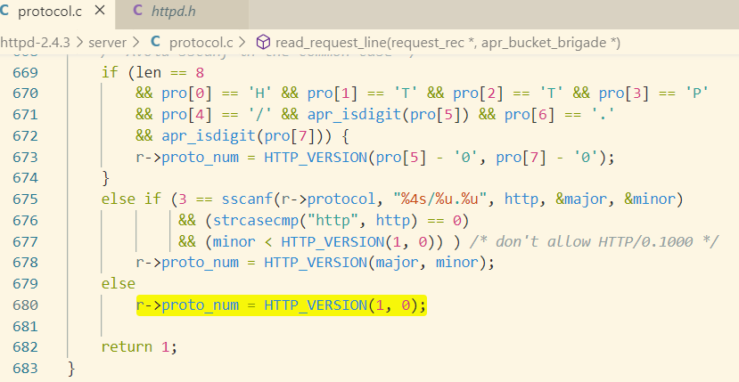

URI是如何解析的，没有看到具体代码，相应的函数是个钩子函数。

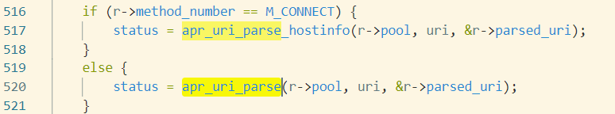

在URL路径中，即？前面的字符串中，如果存在畸形URL编码，如%fg，则直接返回400；如果存在0字符，则返回404

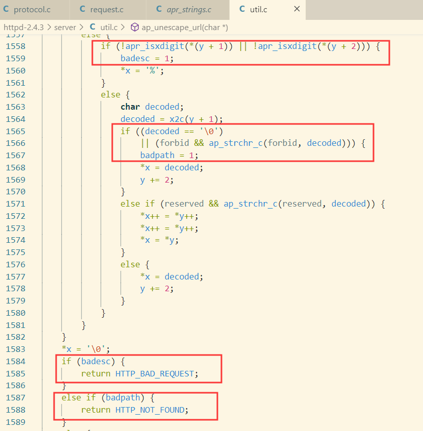

## header filed

每个头部默认长度最大为8190字节，头部个数最大默认为100

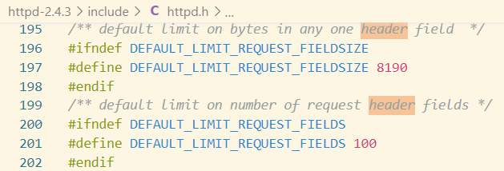

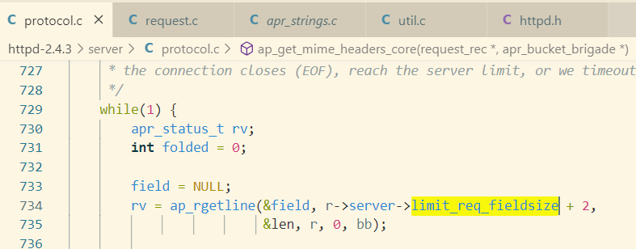

如果一个头部以SP或HT字符开头，表示该头部是上一个头部的extended，或者说是一个continue header line，该行将被合并到上一行，符合RFC。

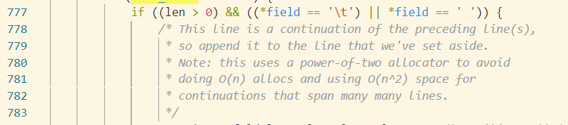

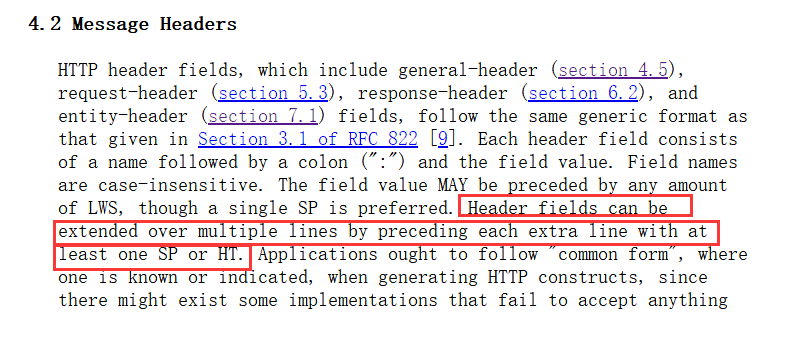

请求域行中必须要有冒号 :

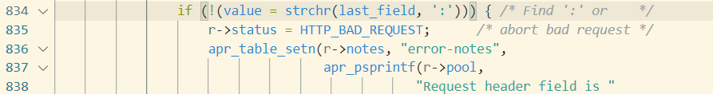

头部中的多个LWS字符会被跳过。

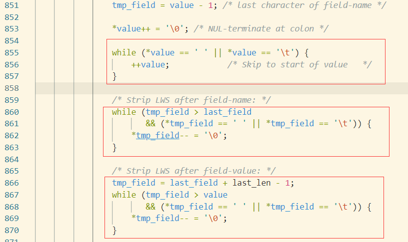

相同头部字段名的头部行将被合并，缓冲区大小不变

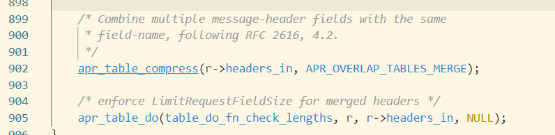

## TE

Transfer-Encoding存在时忽略Content-Length

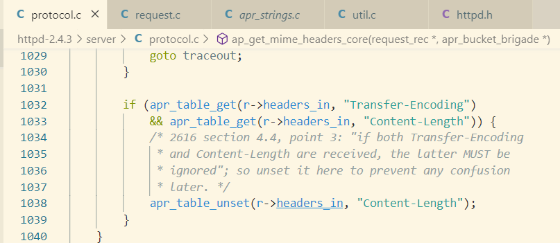

TE头部的值必须为chunked

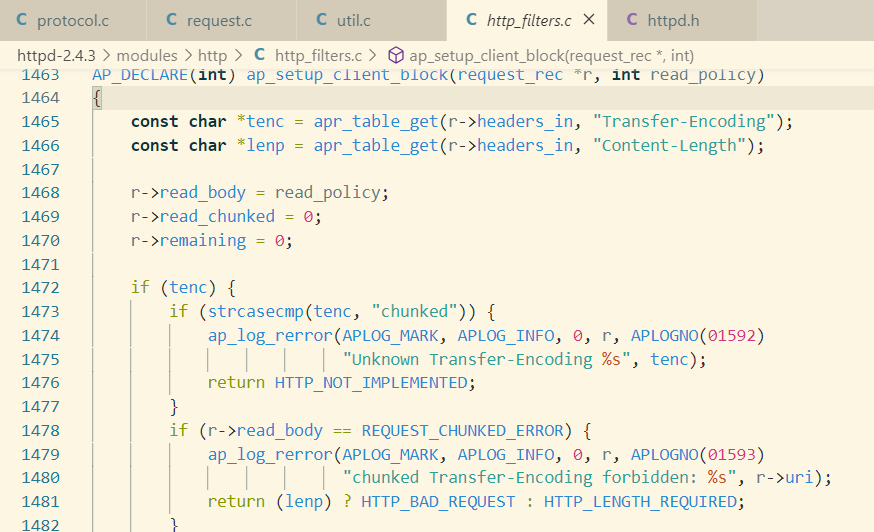

## must hostname

http 1.1必须要有host头部字段，否则返回400

当Content-Type不为空且前面33个字符值为application/x-www-form-urlencoded时，会将Body认为为表单，并以"&"符号分割表单，“=”区分key value，并且会对二者都进行URL解码，详细代码冗长，就不贴出来了。

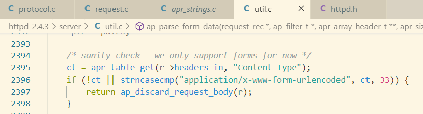

## 结语

代码最后看下来，在HTTP解析这块，我们需要关注的要点不是很繁多，而C代码只以业务功能的视角来浏览的话，不难。

不过没有看到Apache解析multipart/form-data的代码，说明这种内容格式是web语言处理的。