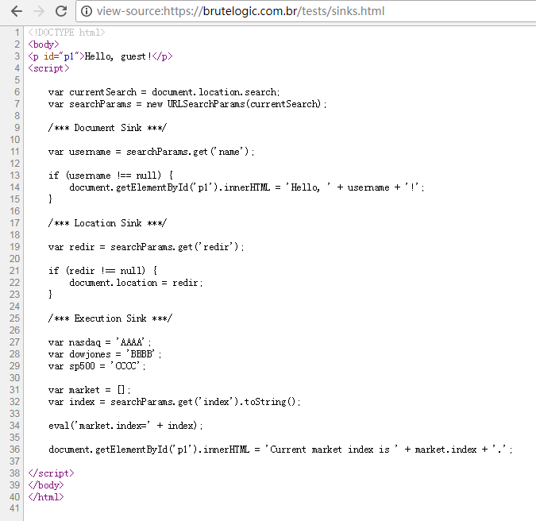
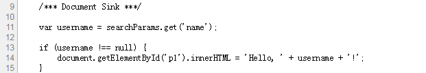
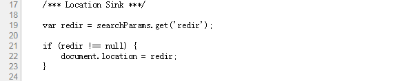
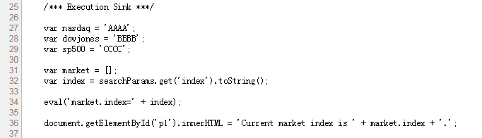

# DOM型XSS的三个接收器

> 翻译
>
> 原文链接 <https://brutelogic.com.br/blog/dom-based-xss-the-3-sinks/>

### 前言

最常见的XSS是基于源的（普通XSS），这意味着被注入的JavaScript代码被传输到服务器后又传输到客户端，并在客户端这里被执行。
但还有另外一种主要类型————DOM型XSS，被注入的恶意代码的输入来源，与服务器无关，DOM型XSS既不是反射也不是存储：该种XSS是由客户端的原生JavaScript代码产生的。
DOM型XSS与基于原码的XSS（普通XSS）十分相似，所以它也被归纳为反射型XSS和存储型XSS的子类。当浏览器通过JS引擎与本地端的存储，提供反射/存储机制时，DOOM型XSS与基于原码的XSS就基本没有什么区别了。
然而，不同于简单的请求/响应模型，想要发现DOM型XSS，可能需要对代码进行大量分析。而通过静态甚至是动态的分析工具，都难以发现DOM型XSS漏洞。

### 源与接收器（Sources and sinks）

DOM（文档对象模型）是由服务器传输过来的HTML文档与JavaScript代码生成的。也许你知道，JavaScript代码以脚本块和/或导入库的方式嵌入到HTML文档中。通过将所有HTML元素转换为对象后，我们可以通过JavaScript对其进行操作，即便是在浏览器运行期间的也可对其进行更改。

XSS的触发逻辑，在服务端与客户端下都是一样（普通与DOM型）：我们需要找到相应的输入点与输出点。例如，在PHP服务端中，我们通常认为`$_GET["var"]`或`$_POST["var"]`这些是输入点，而`echo`或`print`这些命令是输出点，这也构成了XSS触发的条件。

在客户端源这边，我们有源与接收器（sources and sinks）。源指的是DOM对象的众多属性，比如document.location,document.referer,window.name 甚至还有url参数（在处理后）这好比服务端的XSS。该列表非常庞大，因为HTML所有的内容都能被JavaScript所操作，并成为潜在的接收源（source of sinks）。

因此，为了让我们更容易研究基于DOM的XSS，我们先来看看接收器，因为只有3个主要情况。下面是一个演示它们的页面。如果你对XSS有足够的经验或者只想训练自己，请立即停止阅读，并按照`#hack2learn`原则对其进行XSS。

```
演示界面：
https://brutelogic.com.br/tests/sinks.html
```

### 三个接收器

在我们的演示页面中，我们有如下的源码：



body中只有一个p元素，这个元素被该页面下的JS代码动态更新，这里并没有导入，也没有使用库。源码中通过三行注释分别标记出了三个示例，分别标记每个案例的代码片段的起始位置。

在第一个案例文档接收器（Document Sink）之前，该代码通过API来处理URL参数的值：在获取`document.location.search`属性之后，我们创建一个实现了[URLSearchParams](https://developer.mozilla.org/en-US/docs/Web/API/URLSearchParams)的对象。


#### 文档接收器 （DOCUMENT SINK）

在文档接收器中，本机JavaScript代码使用受攻击者控制或提供的数据来更新当前文档。它可以在DOM中插入带有JS代码的全新HTML标记或是一个新的带有JS代码事件的属性。



URL参数`name`的值被存在`username`变量中，以便稍后用于更新文档。如果该变量不为null，则使用字符串`Hello`拼接URL中`name`参数的值来更新p元素。这使得攻击者可以插入HTML代码：

```
https://brutelogic.com.br/tests/sinks.html?name=
```

需要注意的是，经典的`<script>alert(1)</script>`不起作用。还有其他几个XSS向量也如此，因为它是一个DOM插入而不是简单的源反射。只有少数情况下，上面的payload才会有作用。

文档接收器可以以多种方式出现：使用innerHTML和outerHTML元素属性，使用document.write()，document.writeln()函数以及JavaScript库提供的任何其他方式来更新元素或文档。

#### 位置接收器（LOCATION SINK）

在位置接收器中，本机JavaScript代码使用受攻击者控制或提供的数据更新文档的位置。通过这种方式，可以使用现代浏览器的一个有趣功能：JavaScript伪协议。



通过获取`redir`参数的值，上面的代码可以将浏览器重定向到另一个地址，加载另一个文档。在跳转后的地址站点中攻击目标应用程序是没有用的，因为我们脱离了上下文。

但是通过使用JavaScript伪协议，这是一种将JavaScript代码直接运行到浏览器地址栏中的方法，可以在当前文档中运行JS代码。

```
https://brutelogic.com.br/tests/sinks.html?redir=javascript:alert(1）
```

过去，当应用程序过滤器和WAF（Web应用程序防火墙）过滤`javascript`关键字时，可使用data URI技巧来替换。但是现代浏览器做了一些安全措施，如为JS执行提供空白上下文（空白上下文应该是指没有数据），甚至不再允许跳转（应该指data URI情况下）。

#### 执行接收器（EXECUTION SINK）

在执行接收器（Execution Sink）中，本机JavaScript代码使用受攻击者控制或提供的数据来更新其自己的代码流。



通常`eval`会是一个庞大复杂代码的一部分，在这里只使用一个非常简单的代码：仅有3个变量，变量名分别是三个股票的名称：Nasdaq, Dow Jones and S&P 500 。它们的值并不来自于一个真实应用程序的数据库，因此它们不会变化。

创建`market`对象，从URL获取`index`参数的值后，这里使用`toString()`尝试确保该值最终是字符串（只是一种愚蠢的方式）。该代码之后使用`eval`函数动态地为`market`对象创建`index`属性。最后，获取`market.index`的值显示在p标签中。

攻击者可以通过以下代码来进行XSS：

```
https://brutelogic.com.br/tests/sinks.html?index=alert(1）
```

因为该代码将被执行，所以看起来很简单。在现实世界的应用程序中，很可能需要根据代码流程进行一些测试才能找到漏洞点。

除`eval`之外的其他执行接收器(execution sinks)是`setInterval`和`setTimeout`函数和模板文字。

以上所诉的就是我们在寻找DOM型的XSS时应该注意的3个接收器(sinks)。