JAVA的XML解析，底层用的是*xerces*，而xml本身的特性及xerces的一些特性，可以用来造成WAF与后台代码的解析不一致。

文章是在看完代码后的三个月写的，所以并没有尝试把所有绕过手法的代码逻辑点列出。

# 1. Charset

## 1.1 Magic Charset

XML文档可以通过头部标签声明版本与字符集，常见的有UTF-8、GBK、ISO-8859-1。

JAVA的底层XML解析库xerces在在读取XML文档时，首先会根据XML文档的头4个字节选择对应的字符流Reader来读取XML文档，如果XML文档有XML标签头，该Reader只是用于读取XML标签头，后续的XML内容选用什么字符流Reader则会另外根据XML标签头来决定；如果XML文档没有标签头，则该Reader将会用于读取整个XML文档。

根据XML文档头4个字节选择字符流读取器的关键代码位于 jdk1.8.0_191\src.zip!\com\sun\org\apache\xerces\internal\impl\XMLEntityManager.java：

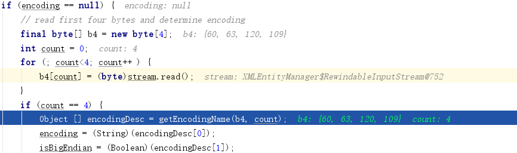

判断字符集的getEncodingName方法代码如下，其中UCS-4 2143、UCS-4 3412字最后是会抛异常提示不支持的字符编码。

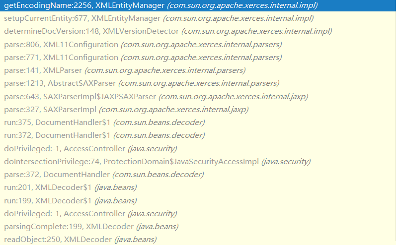


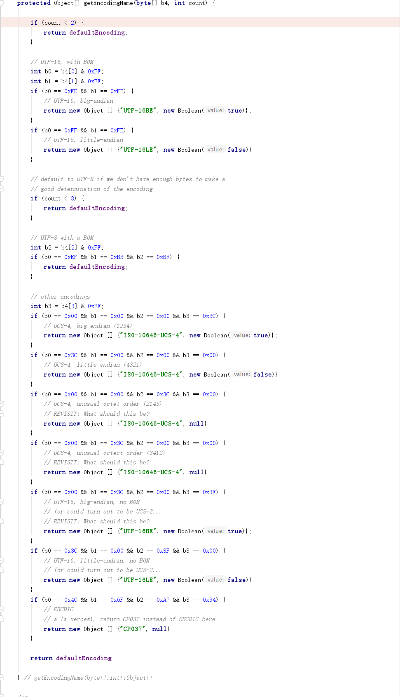

所以最后看来，我们可以得到下面这个表，而为了方面区分，笔者将该手法称为**Magic Charset**。


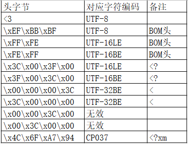


## 1.2 Declare Charset

如果用户在XML文档的XML头标签中中通过encoding指定了字符集，后续的XML文档读取将会根据该属性值选择一个字符流读取器。

最后设置Reader的关键代码位于

jdk1.8.0_191\src.zip!\com\sun\org\apache\xerces\internal\impl\XMLDocumentFragmentScannerImpl.java

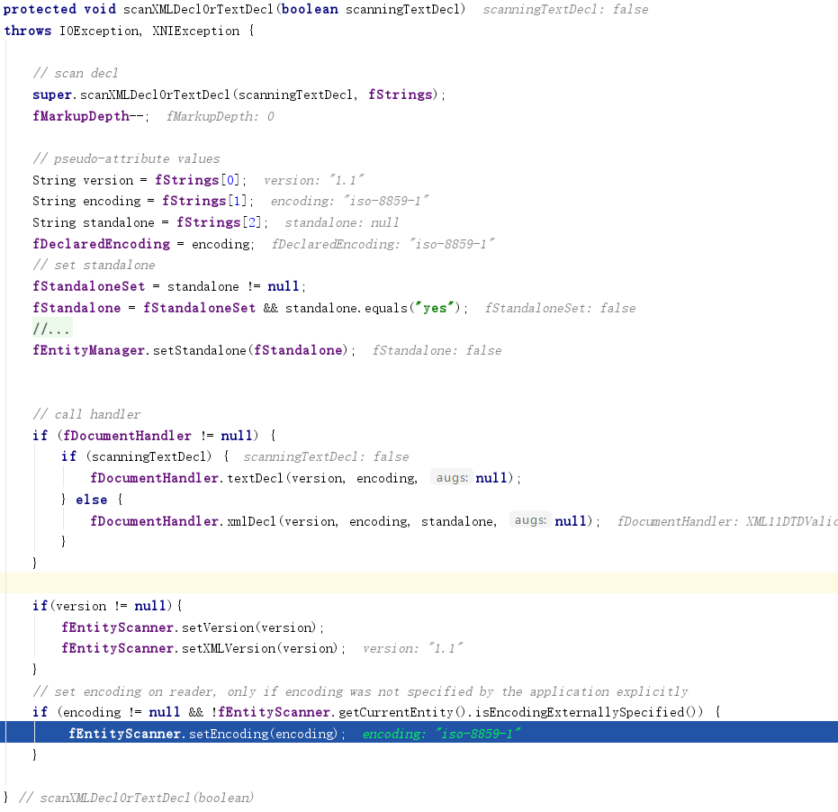

jdk1.8.0_191\src.zip!\com\sun\org\apache\xerces\internal\impl\XMLEntityScanner.java

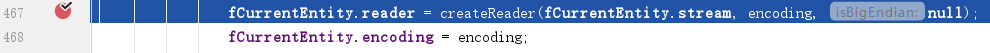


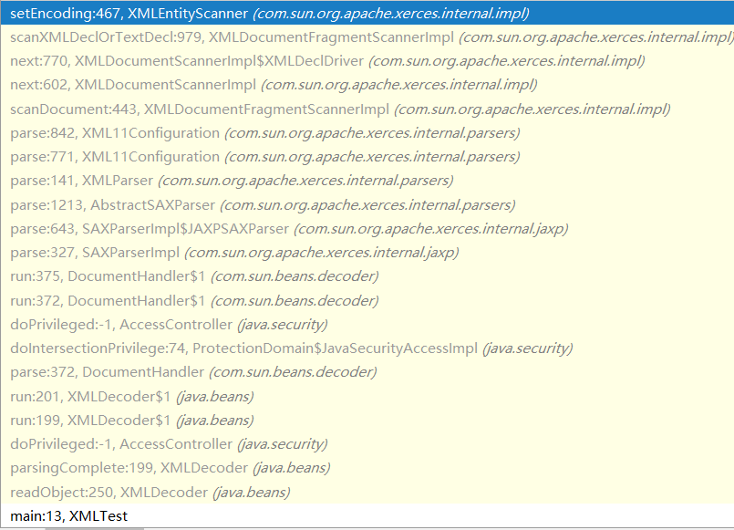

在这里，我们还另外需要关注一下createReader中的EncodingMap，这里对字符集名称做了别名的映射，如IBM037与CP037实际上是同一个字符集。

jdk1.8.0_191\src.zip!\com\sun\org\apache\xerces\internal\util\EncodingMap.java：

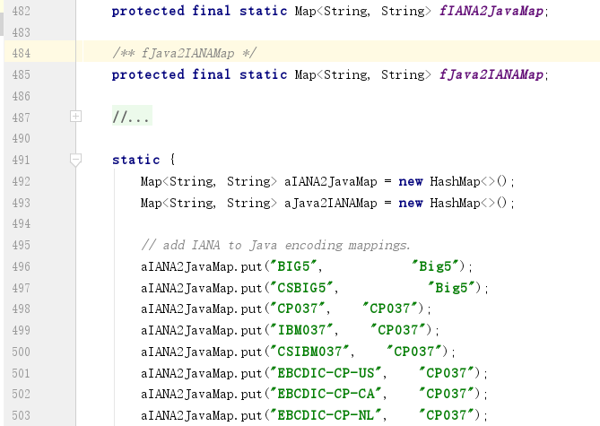


## 1.3 Double Charset

由于magic charset与declare charset的逻辑是独立的，我们可以分别对XML头标签与XML内容使用不同的编码。

# 2. String Split

## 2.1 LABEL INSERT

```xml
<?xml version="1.0" encoding="UTF-8"?>
<root>
<test att="foo">" union select 1 -- -</test>
</root>
```
添加额外标签进行字符串分割：

```xml
<?xml version="1.0" encoding="UTF-8"?>
<root>
<test att="foo">" uni<foo>foo1 foo2</foo><foofoo/>on select 1 -- -</test>
</root>
```

使用注释进行字符串分割：

```xml
<?xml version="1.0" encoding="UTF-8"?>
<root>
<test att="foo">" uni<!--foo-->on select 1 -- -</test>
</root>
```

使用PI标签进行字符串分割：

```xml
<?xml version="1.0" encoding="UTF-8"?>
<root>
<test att="foo">" uni<?foo1 foo2 ?>on select 1 -- -</test>
</root>
```

jdk1.8.0_191\src.zip!\com\sun\org\apache\xerces\internal\impl\XMLDocumentScannerImpl.java：

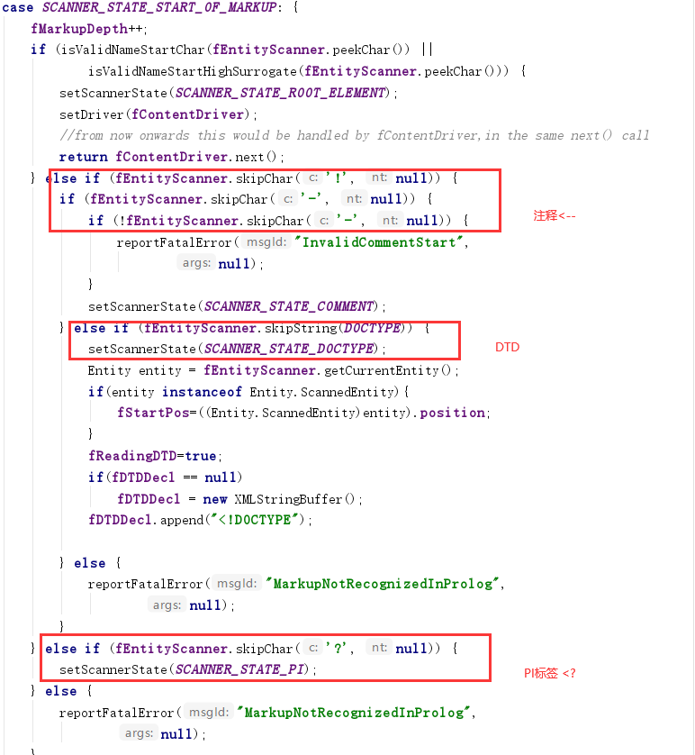

## 2.2 CDATA

使用CDATA标签进行字符串分割：

```xml
<?xml version="1.0" encoding="UTF-8"?>
<root>
<test att="foo">" uni<![CDATA[o]]>n select 1 -- -</test>
</root>
```

# 3. DTD

值得注意的是，xstream默认关闭DTD；XMLDecoder虽然没有关闭，但是对于Weblogic XMLDecoder，由于其特色的解析流程，对于Weblogic XMLDecoder是无法利用的。

这里不贴代码了，有的是来源RFC，而且代码是三个月前看的，不想找啊。

## 3.1 ATTLIST

标签的属性与值，可以通过DTD进行定义，原始XML文档：

```xml
<?xml version="1.1" encoding="ISO-8859-1" ?>
<root>
<test att="foo"></test>
</root>
```
使用DTD ATTLIST，写作：

```xml
<?xml version="1.1" encoding="ISO-8859-1" ?>
<!DOCTYPE foo [
<!ATTLIST test att CDATA #FIXED "foo">
]>
<root>
<test></test>
</root>
```
使用HTML编码、CDATA也可以：

```xml
<?xml version="1.1" encoding="ISO-8859-1" ?>
<!DOCTYPE foo [
<!ATTLIST test att CDATA #FIXED "<![CDATA[f]]>&#x6f;o">
]>
<root>
<test></test>
</root>
```

## 3.2 local entity

通过在DTD中定义本地实体，可在标签属性值、标签内容、DTD字符串值，这些字符串区域引用。

```xml
<?xml version="1.0" encoding="UTF-8"?>
<root>
<test>" union select 1 -- -</test>
</root>
```
使用本地实体：

```xml
<?xml version="1.0" encoding="UTF-8"?>
<!DOCTYPE root[
<!ENTITY test1 "select">
<!ENTITY test2 "union">
]>
<root>
<test>" &test2; &test1; 1 -- -</test>
</root>
```


使用HTML编码、CDATA也可以：

```xml
<?xml version="1.0" encoding="UTF-8"?>
<!DOCTYPE root[
<!ENTITY test1 "<![CDATA[el]]>ect">
<!ENTITY test2 "&#x75;&#x6e;&#x69;&#x6f;&#x6e;">
]>
<root>
<test>" &test2; &test1; 1 -- -</test>
</root>
```

# 4. XML1.1

## 4.1 space char

当XML版本被声明为1.1时，XML的解析将支持一些额外的空白字符、控制字符。

jdk1.8.0_191\src.zip!\com\sun\org\apache\xerces\internal\impl\XML11EntityScanner.java：

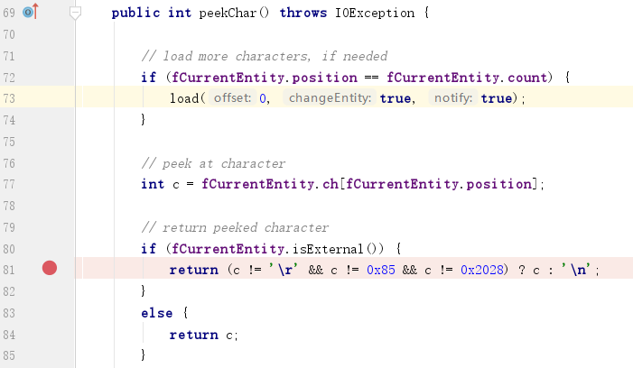

jdk1.8.0_191\src.zip!\com\sun\org\apache\xerces\internal\parsers\XML11Configuration.java：

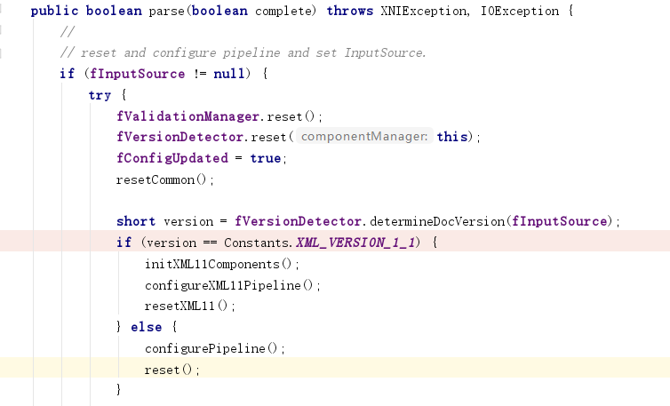

代码中的\x85是指码点，而非我们平时所见的unicdoe字符。而\x85二进制为‭10000101‬，高位为1，根据笔者认知，UTF-8无法使得8比特码点成为UTF-8字符，因此我们无法在UTF-8中使用它，但在ISO-8859-1、UTF-16等字符集中我们可以使用它：

```xml
<?xml version="1.1" encoding="iso-8859-1"?>%85<root%85>foo</root%85>
```

在UTF-16BE中对应的unicode字符为\x00\x85：

同样的，\x28\x20是指码点，其UTF-8编码字符为%E2%80%A8，推导过程如下：

\x20 \x28转2进制比特：
00100000 00101000
UTF-8中三个字节的编码规范：
1110XXXX 10XXXXXX 10XXXXXX
\x20\x28转UTF-8的2进制比特：
11100010 10000000 10101000
\x20\x28的UTF-8编码为:
%E2%80%A8

于是我们可以对XML文档进行如下修改：

```xml
<?xml version="1.1" encoding="utf-8"?>%E2%80%A8<root%E2%80%A8>foo</root%E2%80%A8>
```

# 结语

除开JAVA外，还有.NET、PHP，而作为XML的子集SOAP，不知SOAP自身是否还有其他特性。