# 1.引言

最近看了看OpenRASP（JAVA版），而网上关于OpenRASP已有一些文章，但纸上得来终觉浅，自己阅读一番再另外写篇文章，也还行，算是总结算是笔记。如文中有错误，还望同学们指出，十分感谢。

# 2.阅读前准备工作

一开始还需要将open-rasp安装到Tomcat，这里按照官方文档指引即可。

## 2.1编译

### 编译V8引擎

笔者在这里花了半天时间，一度十分懵逼，不懂C++编译这块的东西，按照官方文档来弄又不得行。

笔者的编译环境

```
Debian 4.9.18 (kali)
OpenJDK 1.8
gcc version 8.3.0
```

编译获取v8引擎jar包：

```

curl -L  https://github.com/Kitware/CMake/releases/download/v3.15.3/cmake-3.15.3-Linux-x86_64.tar.gz | tar zx -C /tmp
export PATH=/tmp/cmake-3.15.3-Linux-x86_64/bin:$PATH

git clone https://github.com/baidu-security/openrasp-v8.git
~/openrasp-v8# mkdir -p openrasp-v8/build64 && cd openrasp-v8/build64
~/openrasp-v8/openrasp-v8# cmake -DCMAKE_BUILD_TYPE=RelWithDebInfo -DENABLE_LANGUAGES=java ..
~/openrasp-v8/openrasp-v8# make
~/openrasp-v8/openrasp-v8# mkdir -p ../java/src/main/resources/natives/linux_64 && cp java/libopenrasp_v8_java.so $_
~/openrasp-v8/java# mvn install

```

### 编译项目

本文使用的是`1.3.4`版本。

Injellij IDEA打开 \openrasp-master\agent\java

Help > Find Action ，输入并打开 `Maven Project`

由于V8是在虚拟机上编译的，不在本地物理机的maven仓库中，需要先将其加入仓库

```
mvn install:install-file -Dfile=D:\share\v8-1.0-SNAPSHOT.jar -DgroupId=com.baidu.openrasp -DartifactId=v8 -Dpackaging=jar -Dversion=1.0-SNAPSHOT
```

编译`rasp-boot`

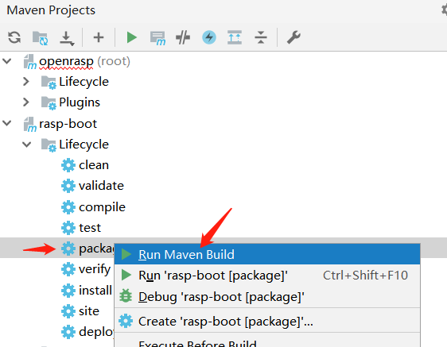

由于`rasp-engine`依赖`rasp-boot`，所以需要将`rasp-boot`加入到maven仓库中

```

mvn install:install-file -Dfile=D:\turn1tup\program_java\RASP\openrasp\agent\java\boot\target\rasp-boot-1.3.4-shaded.jar -DgroupId=com.baidu.openrasp -DartifactId=rasp-boot -Dpackaging=jar -Dversion=1.3.4
```

同样操作编译`rasp-engine`即可。

### Debug

Windows下，在Tomcat的catalina.bat的open-rasp配置后添加一行JDWP配置：

```
if "%ACTION%" == "start" set JAVA_OPTS="-javaagent:%CATALINA_HOME%\rasp\rasp.jar" %JAVA_OPTS%
if "%ACTION%" == "start" set JAVA_OPTS=-agentlib:jdwp=transport=dt_socket,address=1043,server=y,suspend=y %JAVA_OPTS%
```

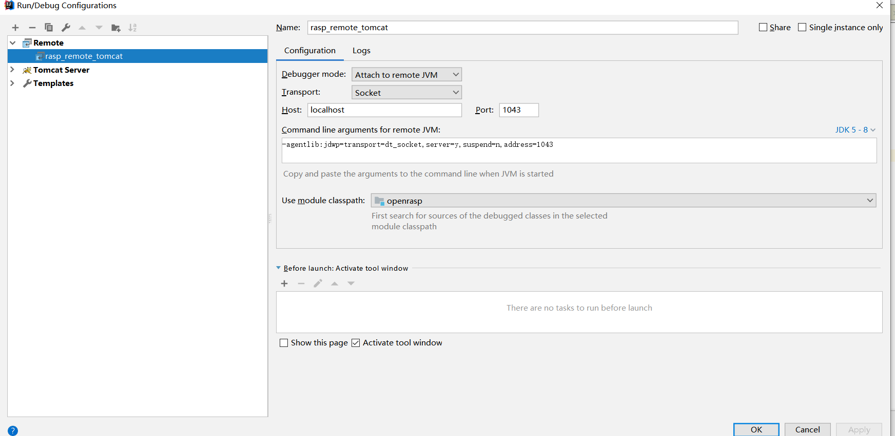

IDEA中将编译后的JAR包加入到项目Libraries，随后配置远程调试

断点打到程序最开始执行的地方，从最开始的地方看起。

openrasp\agent\java\boot\src\main\java\com\baidu\openrasp\Agent.java

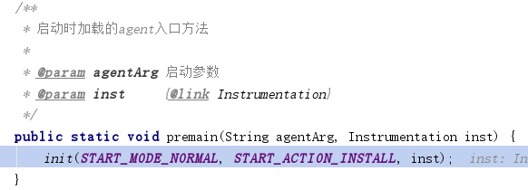

# 3.工作原理

这块技术之前没接触过，笔者翻阅了前辈们写的文章与官方文档，大致了解了一番，这里也简单叙述一下。

## JVM TI接口

JAVA虚拟机开放了一个叫 JVM Tool Interface (JVM TI)  的接口，通过该接口，对于运行于JVM的程序，我们可以查看和控制。

实现了JVM TI接口的程序，称为agent，agent与jvm运行在同一进程并直接与jvm进行通信。agent能通过三种方式被执行，①Agent Start-Up (OnLoad phase)：在JAVA程序的main函数执行之前执行agent，java命令中需通过-javaagent参数来指定agent，实现方式为premain ②Agent Start-Up (Live phase) ：对于正在运行的JAVA程序，通过JVM进程间通信，动态加载agent，实现方式为attatch机制 ③Agent Shutdown：在虚拟机的library 将要被卸载时执行，该方式忽略。

OpenRASP实现了前面两种加载方式，在比较第一种与第二种方式的优劣势时，[浅谈RASP](https://www.anquanke.com/post/id/187415)文中说明到，attatch机制由于JVM本身的进程保护机制，会导致重复字节码的插入问题，造成重复告警，增加业务压力，而解决该问题的方法又另外会带来业务压力。

## 字节码操作

### ASM

备注：OpenRASp使用的Javaassit。

通过agent，我们可以访问与修改JVM中的JAVA类，这时候获取到的相关的数据为JAVA字节码，通常通过asm字节码操作框架进行字节码操作。

引用[浅谈RASP](https://www.anquanke.com/post/id/187415)中对ASM的说明：

> 通过该图可以清晰的看出调用顺序，对于新手来说可以简单的理解为下面这样的调用顺序：
> - 需要访问类，所以要声明ClassReader，来“获取”类。
> - 如果需要对类中的内容进行修改，就需要声明ClassWriter它是继承于ClassReader的。
> - 然后实例化“访问者”ClassVisitor来进行类访问，至此就以“访问者”的身份进入了类，你可以进行以下工作：
>   - 如果需要访问注解，则实例化AnnotationVisitor
>   - 如果需要访问参数，则实例化FieldVisitor
>   - 如果需要访问方法，则实例化MethodVisitro

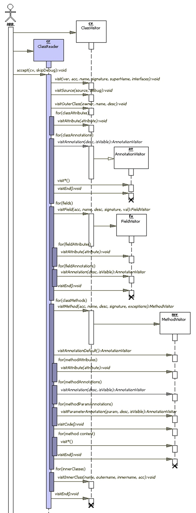

### Javassist

引用 [字节码增强技术探索](https://tech.meituan.com/2019/09/05/java-bytecode-enhancement.html)

>ASM是在指令层次上操作字节码的，阅读上文后，我们的直观感受是在指令层次上操作字节码的框架实现起来比较晦涩。故除此之外，我们再简单介绍另外一类框架：强调源代码层次操作字节码的框架Javassist。
>
>利用Javassist实现字节码增强时，可以无须关注字节码刻板的结构，其优点就在于编程简单。直接使用java编码的形式，而不需要了解虚拟机指令，就能动态改变类的结构或者动态生成类。其中最重要的是ClassPool、CtClass、CtMethod、CtField这四个类：
>
>- CtClass（compile-time class）：编译时类信息，它是一个class文件在代码中的抽象表现形式，可以通过一个类的全限定名来获取一个CtClass对象，用来表示这个类文件。
>- ClassPool：从开发视角来看，ClassPool是一张保存CtClass信息的HashTable，key为类名，value为类名对应的CtClass对象。当我们需要对某个类进行修改时，就是通过pool.getCtClass(“className”)方法从pool中获取到相应的CtClass。
>- CtMethod、CtField：这两个比较好理解，对应的是类中的方法和属性。
>
>了解这四个类后，我们可以写一个小Demo来展示Javassist简单、快速的特点。我们依然是对Base中的process()方法做增强，在方法调用前后分别输出”start”和”end”，实现代码如下。我们需要做的就是从pool中获取到相应的CtClass对象和其中的方法，然后执行method.insertBefore和insertAfter方法，参数为要插入的Java代码，再以字符串的形式传入即可，实现起来也极为简单。
>
>```java
>import com.meituan.mtrace.agent.javassist.*;
>
>public class JavassistTest {
>    public static void main(String[] args) throws NotFoundException, CannotCompileException, IllegalAccessException, InstantiationException, IOException {
>        ClassPool cp = ClassPool.getDefault();
>        CtClass cc = cp.get("meituan.bytecode.javassist.Base");
>        CtMethod m = cc.getDeclaredMethod("process");
>        m.insertBefore("{ System.out.println(\"start\"); }");
>        m.insertAfter("{ System.out.println(\"end\"); }");
>        Class c = cc.toClass();
>        cc.writeFile("/Users/zen/projects");
>        Base h = (Base)c.newInstance();
>        h.process();
>    }
>}
>```

# 4.实现

## 4.1框架逻辑

这里就偷懒不写了，直接上官方链接：

https://rasp.baidu.com/doc/hacking/architect/java.html

## 4.2 代码逻辑

### manifest

rasp.jar的MANIFEST.MF文件：

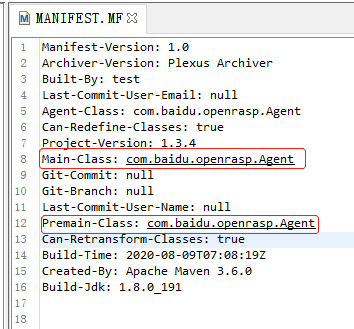

rasp-engine.jar：

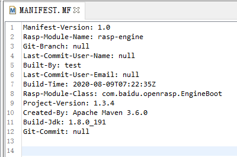

### 1 premain

从premain启动的OnLoad phase方式，调用了init进行了如下操作：addJarToBootstrap（打破双亲委派机制）、readVersion、启动engine。

```
堆栈信息：
init:92, Agent (com.baidu.openrasp)
premain:71, Agent (com.baidu.openrasp)
invoke0:-1, NativeMethodAccessorImpl (sun.reflect)
invoke:62, NativeMethodAccessorImpl (sun.reflect)
invoke:43, DelegatingMethodAccessorImpl (sun.reflect)
invoke:498, Method (java.lang.reflect)
loadClassAndStartAgent:386, InstrumentationImpl (sun.instrument)
loadClassAndCallPremain:401, InstrumentationImpl (sun.instrument)
```

`init:92, Agent (com.baidu.openrasp)`

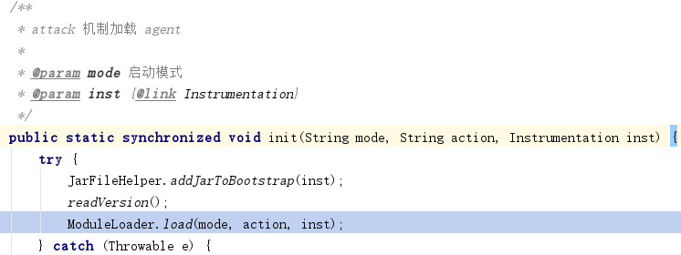

`premain:71, Agent (com.baidu.openrasp)`


另外没看懂attach方式（agentmain）是怎么实现的，有点奇怪，先放着，后面再回顾。

### 1-1 打破双亲委派机制

将rasp.jar添加到BootstrapClassLoader，这样做是由于双亲委派机制的存在，类加载器在加载类时无法往下委派加载。用户自定义的类使用的类加载器SystemClassLoader。而当被hook的类需要去调用检测方法，如果该hook类为BootstrapClassLoader加载的，则无法成果调用该检测方法。官方文档也有说明：

> 当去 hook 像 java.io.File 这样由 BootstrapClassLoader 加载的类的时候，无法从该类调用非 BootstrapClassLoader 加载的类中的接口，所以 agent.jar 会先将自己添加到 BootstrapClassLoader 的ClassPath下，这样 hook 由 BootstrapClassLoader 加载的类的时候就能够成功调用到 agent.jar 中的检测入口

```
addJarToBootstrap:40, JarFileHelper (com.baidu.openrasp)
init:92, Agent (com.baidu.openrasp)
premain:71, Agent (com.baidu.openrasp)
```

`addJarToBootstrap:40, JarFileHelper (com.baidu.openrasp)`

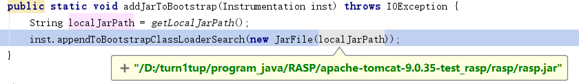


### 1-2-1 装载engine

使用moduleClassLoader（ExtClassLoader）装载rasp-engine.jar，并且将EngineBoot实例化，赋值给module变量，为后续启动rasp模块做准备。

```
<init>:54, ModuleContainer (com.baidu.openrasp)
<init>:88, ModuleLoader (com.baidu.openrasp)
load:118, ModuleLoader (com.baidu.openrasp)
init:94, Agent (com.baidu.openrasp)
premain:71, Agent (com.baidu.openrasp)
```

`<init>:54, ModuleContainer (com.baidu.openrasp)`

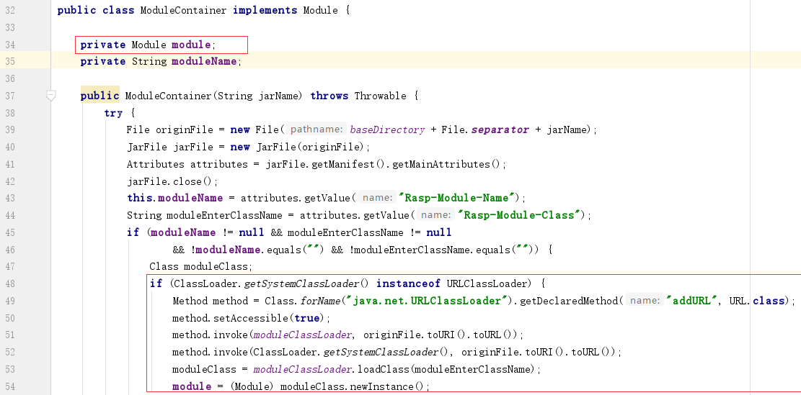

`<init>:88, ModuleLoader (com.baidu.openrasp)`

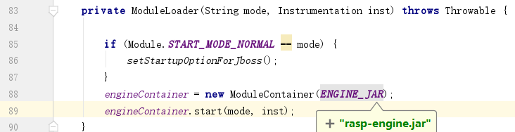

### 1-2-2 启动engine

ModuleContainer调用了rasp-engine.jar的入口类EngineBoot 的start方法，start方法中进行了如下操作：加载V8引擎、加载配置与基线检测、初始化插件系统、检测器初始化、插桩、云管理初始化。

```
start:49, EngineBoot (com.baidu.openrasp)
start:78, ModuleContainer (com.baidu.openrasp)
<init>:89, ModuleLoader (com.baidu.openrasp)
load:118, ModuleLoader (com.baidu.openrasp)
init:94, Agent (com.baidu.openrasp)
premain:71, Agent (com.baidu.openrasp)
```

`start:49, EngineBoot (com.baidu.openrasp)`

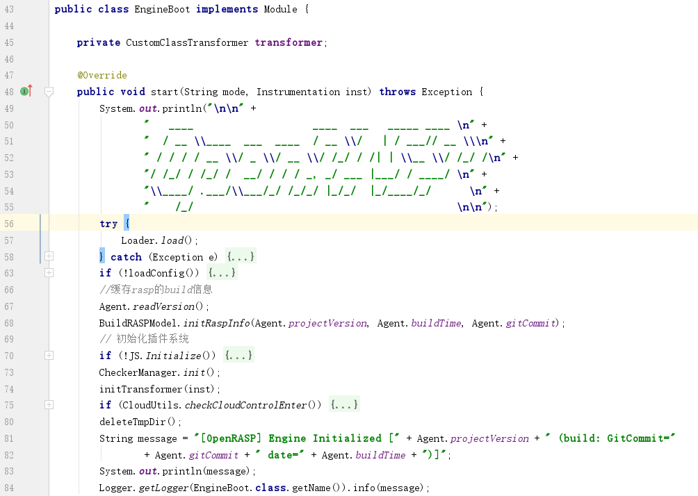

### 1-2-2-1 加载V8引擎

加载V8 JS引擎，V8为native实现，本文这里不关注，具体代码在[openrasp-v8](https://github.com/baidu-security/openrasp-v8)。

```
load:9, Loader (com.baidu.openrasp.v8)
start:57, EngineBoot (com.baidu.openrasp)
start:78, ModuleContainer (com.baidu.openrasp)
<init>:89, ModuleLoader (com.baidu.openrasp)
load:118, ModuleLoader (com.baidu.openrasp)
init:94, Agent (com.baidu.openrasp)
premain:71, Agent (com.baidu.openrasp)
```

### 1-2-2-2 加载配置与基线检测

大致是初始化本地日志系统，如果用户配置了syslog，则添syslog appender；还会读取用户配置`openrasp.yml`，赋值相关配置变量，包括hook类的开关等；另外会做一些安全基线检测。这里不是关注点，不多描述。

```
loadConfigFromFile:207, Config (com.baidu.openrasp.config)
init:144, Config (com.baidu.openrasp.config)
<clinit>:124, Config (com.baidu.openrasp.config)
setLogMaxBackup:234, DynamicConfigAppender (com.baidu.openrasp.cloud.syslog)
initLog4jLogger:133, DynamicConfigAppender (com.baidu.openrasp.cloud.syslog)
ConfigFileAppender:36, LogConfig (com.baidu.openrasp.messaging)
loadConfig:118, EngineBoot (com.baidu.openrasp)
start:63, EngineBoot (com.baidu.openrasp)
start:78, ModuleContainer (com.baidu.openrasp)
<init>:89, ModuleLoader (com.baidu.openrasp)
load:118, ModuleLoader (com.baidu.openrasp)
init:94, Agent (com.baidu.openrasp)
premain:71, Agent (com.baidu.openrasp)
invoke0:-1, NativeMethodAccessorImpl (sun.reflect)
invoke:62, NativeMethodAccessorImpl (sun.reflect)
invoke:43, DelegatingMethodAccessorImpl (sun.reflect)
invoke:498, Method (java.lang.reflect)
loadClassAndStartAgent:386, InstrumentationImpl (sun.instrument)
loadClassAndCallPremain:401, InstrumentationImpl (sun.instrument)
```

`loadConfigFromFile:207, Config (com.baidu.openrasp.config)`

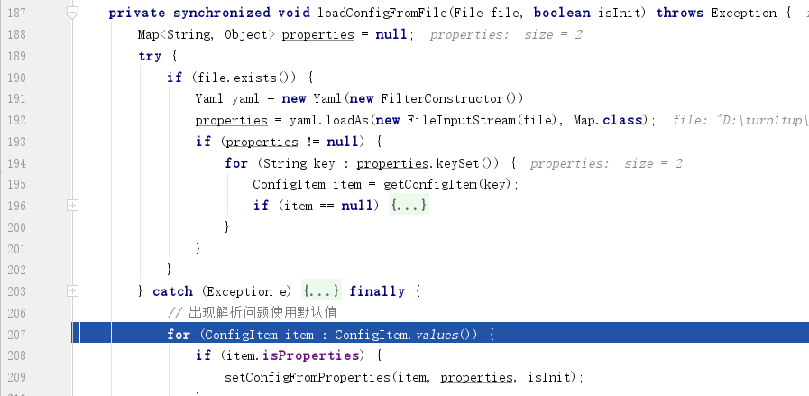

`loadConfig:125, EngineBoot (com.baidu.openrasp)`

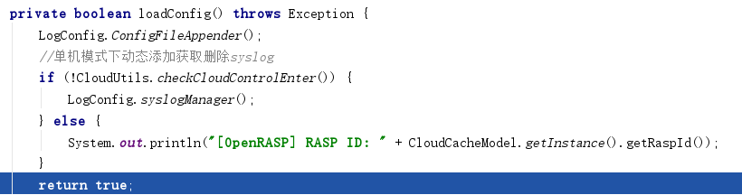

### 1-2-2-3 初始化插件系统

```
Initialize:66, JS (com.baidu.openrasp.plugin.js)
start:70, EngineBoot (com.baidu.openrasp)
start:78, ModuleContainer (com.baidu.openrasp)
<init>:89, ModuleLoader (com.baidu.openrasp)
load:118, ModuleLoader (com.baidu.openrasp)
init:94, Agent (com.baidu.openrasp)
premain:71, Agent (com.baidu.openrasp)
```

`Initialize:66, JS (com.baidu.openrasp.plugin.js)`

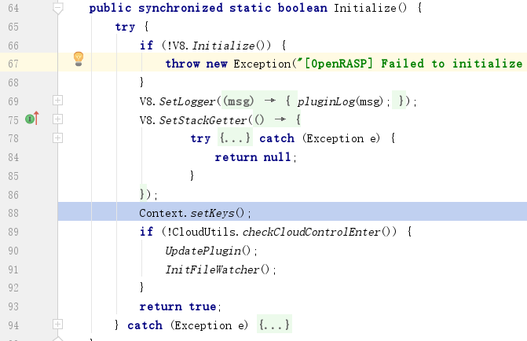

#### 1-2-2-3-1 初始化传参变量

插件JS中，获取到的数据来源于V8引擎的传递，这里先对传递的一些参数变量进行初始化，其中server（系统环境变量）为全局静态保存的数据，parameter、header等则为根据请求动态获取的数据。

```
setKeys:39, Context (com.baidu.openrasp.plugin.js)
Initialize:88, JS (com.baidu.openrasp.plugin.js)
start:70, EngineBoot (com.baidu.openrasp)
start:78, ModuleContainer (com.baidu.openrasp)
<init>:89, ModuleLoader (com.baidu.openrasp)
load:118, ModuleLoader (com.baidu.openrasp)
init:94, Agent (com.baidu.openrasp)
premain:71, Agent (com.baidu.openrasp)
```

`setKeys:39, Context (com.baidu.openrasp.plugin.js)`

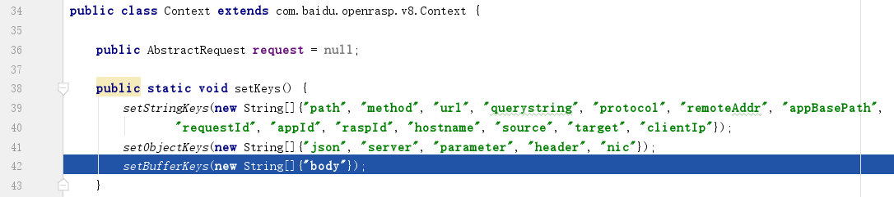

#### 1-2-2-3-2 执行JS插件

加载`plugins`目录下“.js”结尾的JS插件。

```
UpdatePlugin:239, JS (com.baidu.openrasp.plugin.js)
UpdatePlugin:218, JS (com.baidu.openrasp.plugin.js)
Initialize:90, JS (com.baidu.openrasp.plugin.js)
start:70, EngineBoot (com.baidu.openrasp)
start:78, ModuleContainer (com.baidu.openrasp)
<init>:89, ModuleLoader (com.baidu.openrasp)
load:118, ModuleLoader (com.baidu.openrasp)
init:94, Agent (com.baidu.openrasp)
premain:71, Agent (com.baidu.openrasp)
```

`UpdatePlugin:218, JS (com.baidu.openrasp.plugin.js)`

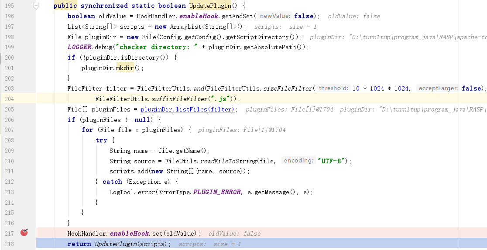

#### 1-2-2-3-3 JS插件热部署

添加文件目录监控器，JS插件目录`plugins`的文件新增、修改、删除都会触发`UpdatePlugin`方法，更新JS插件。文件监控这块底层用的是第三方库`JnotifyWatcher`。

```
InitFileWatcher:243, JS (com.baidu.openrasp.plugin.js)
Initialize:91, JS (com.baidu.openrasp.plugin.js)
start:70, EngineBoot (com.baidu.openrasp)
start:78, ModuleContainer (com.baidu.openrasp)
<init>:89, ModuleLoader (com.baidu.openrasp)
load:118, ModuleLoader (com.baidu.openrasp)
init:94, Agent (com.baidu.openrasp)
premain:71, Agent (com.baidu.openrasp)
```

`InitFileWatcher:243, JS (com.baidu.openrasp.plugin.js)`

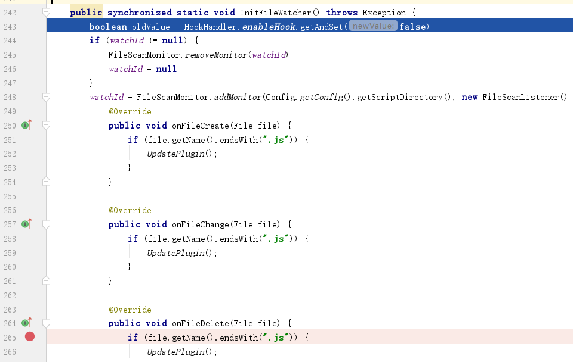

### 1-2-2-4 检测器初始化

当Hook住一些方法后，调用对应检测器，检测器内的代码决定了后面如何进行安全检测，如可以直接在JAVA这边完成安全检测，或将检测逻辑交给JS插件。

检测器初始化中，遍历已经初始化好的检测器JavaBean对象（封装了名称、id、检测方法），放到字典`checkers` 中以备后续使用。

```
init:34, CheckerManager (com.baidu.openrasp.plugin.checker)
start:73, EngineBoot (com.baidu.openrasp)
start:78, ModuleContainer (com.baidu.openrasp)
<init>:89, ModuleLoader (com.baidu.openrasp)
load:118, ModuleLoader (com.baidu.openrasp)
init:94, Agent (com.baidu.openrasp)
premain:71, Agent (com.baidu.openrasp)
```

`init:34, CheckerManager (com.baidu.openrasp.plugin.checker)`

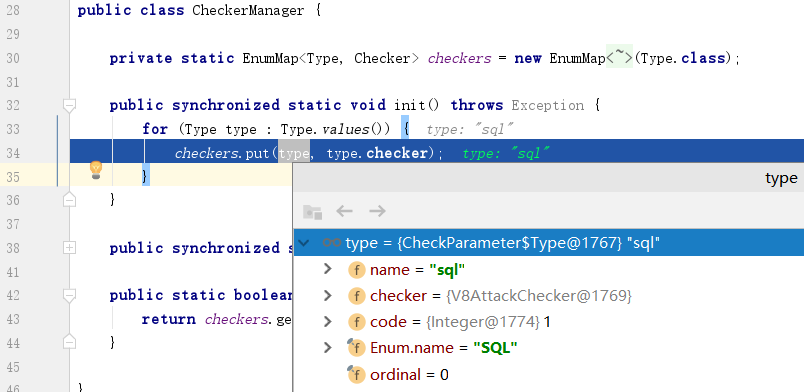

### 1-2-2-5 插桩

`initTransformer`中，实例化`CustomClassTransformer`，该类实现了`ClassFileTransformer`接口（JVM TI接口）。其中的`restransform`方法用于遍历所有已经加载的类并进行插桩操作，而第一次加载的类直接使用`transform`方法。这里就不另外说明第一次加载的过程情况了，二者后续核心代码一致。可以分别尝试debug命令执行漏洞与XXE漏洞的hook方法来了解二者。

```
<init>:76, CustomClassTransformer (com.baidu.openrasp.transformer)
initTransformer:134, EngineBoot (com.baidu.openrasp)
start:74, EngineBoot (com.baidu.openrasp)
start:78, ModuleContainer (com.baidu.openrasp)
<init>:89, ModuleLoader (com.baidu.openrasp)
load:118, ModuleLoader (com.baidu.openrasp)
init:94, Agent (com.baidu.openrasp)
premain:71, Agent (com.baidu.openrasp)
```

`<init>:76, CustomClassTransformer (com.baidu.openrasp.transformer)`

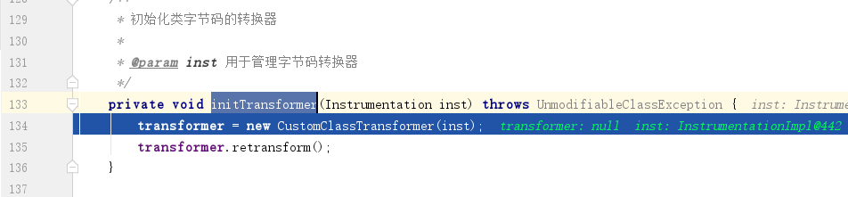

#### 1-2-2-5-1 获取hook点

`CustomClassTransformer`在实例化时会获取相关Hook类。

```
addAnnotationHook:123, CustomClassTransformer (com.baidu.openrasp.transformer)
<init>:77, CustomClassTransformer (com.baidu.openrasp.transformer)
initTransformer:134, EngineBoot (com.baidu.openrasp)
start:74, EngineBoot (com.baidu.openrasp)
start:78, ModuleContainer (com.baidu.openrasp)
<init>:89, ModuleLoader (com.baidu.openrasp)
load:118, ModuleLoader (com.baidu.openrasp)
init:94, Agent (com.baidu.openrasp)
premain:71, Agent (com.baidu.openrasp)
```

`addAnnotationHook:123, CustomClassTransformer (com.baidu.openrasp.transformer)`：获取`com.baidu.openrasp.hook`包下的`AbstractClassHook`子类，如果子类不是配置文件中忽略的hook（配置文件`Config.getConfig().getIgnoreHooks()`），则将该类放入私有成员`hooks`中（HashSet）。

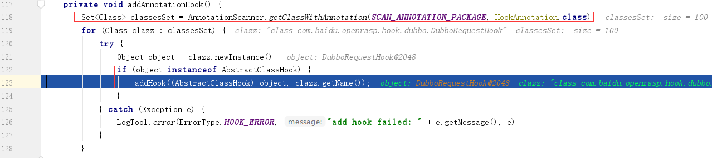

`<init>:77, CustomClassTransformer (com.baidu.openrasp.transformer)`：实例化前与实例化所做的操作

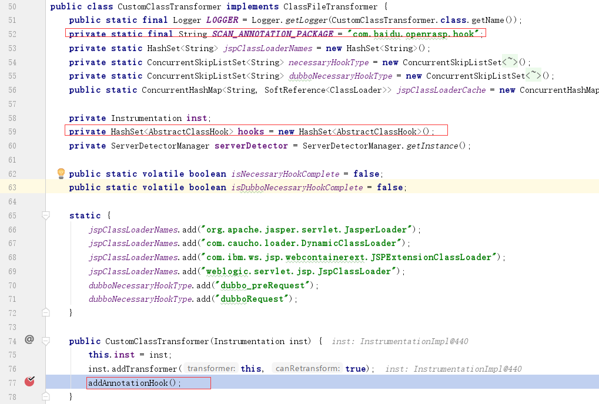

#### 1-2-2-5-2 过滤并hook

对于已经被加载的类，会经由`retransform`方法到`transform`，而对于第一次加载的类，会直接被`transform`捕获，对于第一次加载的类这里不另外展现，到了`tranform`这里，对于`OpenRASP`来说，二者就没差别了。

`CustomClassTransformer`在实例化后，调用方法`retransform` -> `transform`，方法中筛选需要hook的类后进行插桩操作。

```
transform:155, CustomClassTransformer (com.baidu.openrasp.transformer)
transform:188, TransformerManager (sun.instrument)
transform:428, InstrumentationImpl (sun.instrument)
retransformClasses0:-1, InstrumentationImpl (sun.instrument)
retransformClasses:144, InstrumentationImpl (sun.instrument)
retransform:93, CustomClassTransformer (com.baidu.openrasp.transformer)
initTransformer:135, EngineBoot (com.baidu.openrasp)
start:74, EngineBoot (com.baidu.openrasp)
start:78, ModuleContainer (com.baidu.openrasp)
<init>:89, ModuleLoader (com.baidu.openrasp)
load:118, ModuleLoader (com.baidu.openrasp)
init:94, Agent (com.baidu.openrasp)
premain:71, Agent (com.baidu.openrasp)
```

`transform:155, CustomClassTransformer (com.baidu.openrasp.transformer)`：CustomClassTransformer 实现了ClassFileTransformer接口，在transorm方法中，通过遍历`hooks`获取所有价值的Hook类，并通过Hook类的`isClassMatched`方法判断当前类是否Hook类的关注类，如果是，之后的具体操作则交由Hook类的`tranformClass`方法

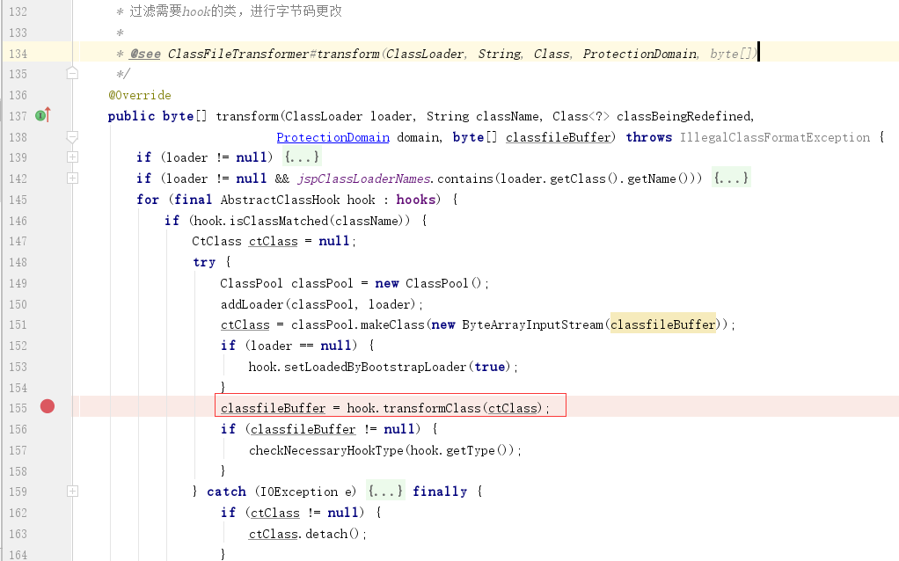

`retransform:93, CustomClassTransformer (com.baidu.openrasp.transformer)`

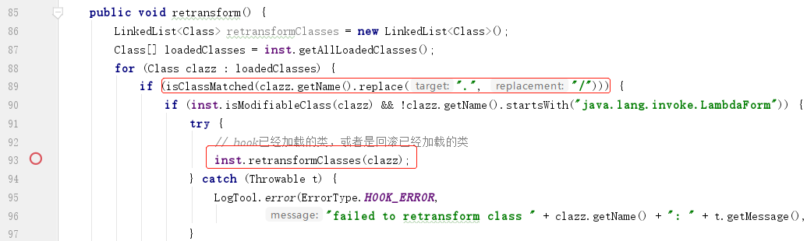

#### 1-2-2-5-2-1 Javassit实现hook

`hookMethod`中先通过``getInvokeStaticSrc`方法获取“桩”的JAVA代码，再调用`insertBefore`方法进行“插”的操作（使用Javassist），如插入在构造方法前，被hook的类在实例化前会调用该插入的方法。

```
hookMethod:69, FileOutputStreamHook (com.baidu.openrasp.hook.file)
transformClass:83, AbstractClassHook (com.baidu.openrasp.hook)
transform:155, CustomClassTransformer (com.baidu.openrasp.transformer)
transform:188, TransformerManager (sun.instrument)
transform:428, InstrumentationImpl (sun.instrument)
retransformClasses0:-1, InstrumentationImpl (sun.instrument)
retransformClasses:144, InstrumentationImpl (sun.instrument)
retransform:93, CustomClassTransformer (com.baidu.openrasp.transformer)
initTransformer:135, EngineBoot (com.baidu.openrasp)
start:74, EngineBoot (com.baidu.openrasp)
start:78, ModuleContainer (com.baidu.openrasp)
<init>:89, ModuleLoader (com.baidu.openrasp)
load:118, ModuleLoader (com.baidu.openrasp)
init:94, Agent (com.baidu.openrasp)
premain:71, Agent (com.baidu.openrasp)
```

`hookMethod:69, FileOutputStreamHook (com.baidu.openrasp.hook.file)`


`transformClass:83, AbstractClassHook (com.baidu.openrasp.hook)`：调用在子类中重写的hookMethod

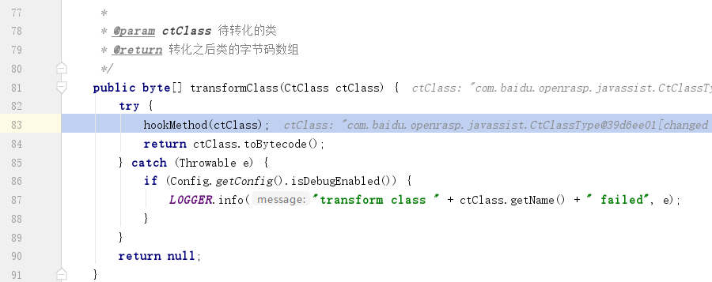

### 1-2-2-6 云管理初始化

如果配置了集中管理，这里会进行一个云管理的配置加载，好像还涉及到`IAST`技术，本文忽略。

`start:75, EngineBoot (com.baidu.openrasp)`


### 2 请求处理 

这里以官方的文件上传为例，简要概述。

文件上传的后缀名检测流程前会触发ApplicationFilterHook，但是这里最后调用的检测器是`request`，未看到该检测器的逻辑实现，应该是未起作用的，这里就不关注了。

后面流程中，先触发FileUploadHook插桩于FileUploadBase的parseRequest方法前的cacheFileUploadParam方法，这里对当前HTTP请求做了解析并保存到HookHandler，不过这里的requestCache只有获取请求ID的作用，并没有用作检测判断的数据。

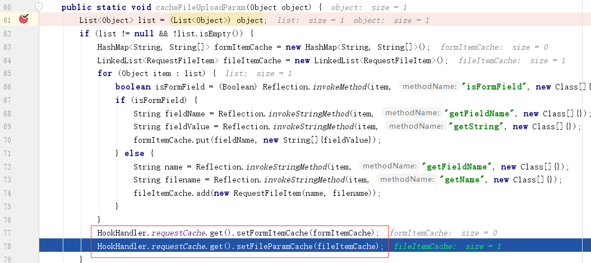

之后触发HookHandler 的doRealCheckWithoutRequest，这里调用CheckManger.check进行文件后缀检测，底层走到了JS引擎。

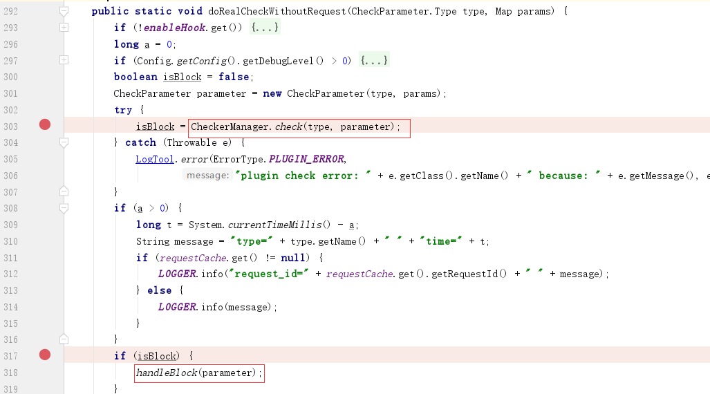

handleBlock用于加载自定义的HTTP响应页面，提示用户当前请求被识别为恶意请求，并向上抛安全异常，记录本次攻击事件。

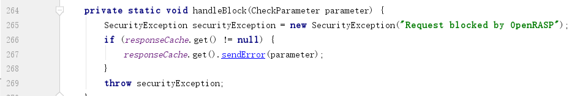

JS中通过`pulgin.register`注册回调函数，而JAVA代码中通过调用native方法来调用该注册函数，获取是否判黑的结果。下面是文件上传部分JS代码，获取到的文件名后通过正则判断文件名是否非法，返回的JSON数据中指明action、message等消息即可：

```js
var plugin  = new RASP(plugin_name)
var algorithmConfig = {
...
    // 写文件操作 - NTFS 流
    writeFile_NTFS: {
        name:   '算法1 - 拦截 NTFS ::$DATA 写入操作',
        action: 'block'
    },
        writeFile_script: {
        name:      '算法2 - 拦截 php/jsp 等脚本文件的写入操作',
        reference: 'https://rasp.baidu.com/doc/dev/official.html#case-file-write',
        action:    'block',
        userinput:  true,
        lcs_search: false
    },
    ...
}
...
// 配置挂载到全局 RASP 变量
RASP.algorithmConfig = algorithmConfig
const clean = {
    action:     'ignore',
    message:    'Looks fine to me',
    confidence: 0
}
...
var scriptFileRegex = /\.(aspx?|jspx?|php[345]?|phtml|sh|py|pl|rb)\.?$/i
var ntfsRegex       = /::\$(DATA|INDEX)$/
...
plugin.register('writeFile', function (params, context) {
    // 写 NTFS 流文件，通常是为了绕过限制
    if (algorithmConfig.writeFile_NTFS.action != 'ignore')
    {
        if (ntfsRegex.test(params.realpath))
        {
            return {
                action:     algorithmConfig.writeFile_NTFS.action,
                message:    _("File write - Writing NTFS alternative data streams", [params.realpath]),
                confidence: 95,
                algorithm:  'writeFile_NTFS'
            }
        }
    }
    ...
    return clean
...
```

# 5.绕过分析

### 5.1 已知手法

[多种姿势openrasp命令执行绕过](https://www.anquanke.com/post/id/195016)一文中，作者给出了两种命令执行的绕过手法

①创建新线程，在新线程中进行命令执行，比如在spring中使用如下代码进行命令执行

```java
@RequestMapping(value = "testCmd.do")
@ResponseBody
public String testCmd(final String cmd){
    Thread t = new Thread(new Runnable(){
        public void run() {
            try {
                Runtime.getRuntime().exec(cmd);
            } catch (IOException e) {
                e.printStackTrace();
            }
        }});
    t.start();
    return "testCmd";
}
```

②通过全局的Hook开关关闭rasp，如：

```
<%@ page import="com.baidu.openrasp.HookHandler" %>
<%
    HookHandler.enableHook.getAndSet(false);
%>
```

笔者的看法是，OpenRASP的目标应该是漏洞防护，漏洞防护也不能影响业务。如果存在业务的命令执行漏洞如①场景一致，那么应该确实是问题。另外被入侵成功后如何防护，对于该项目可能不是当前重点甚至意义不大。OpenRASP有后台管理（集中），不过目前看不到各主机的hook开关情况。

### 5.2 Hook点

RASP核心是hook并插桩，如果有漏洞的类未被hook到或是hook的类非底层关键类，则该技术会被绕过。如在命令执行中，对于JAVA版本<JDK8的，代码hook了`java.lang.ProcessImpl`与`java.lang.UNIXProcess`。此处只是一提，笔者对于这块没有发现绕过点。

`isClassMatched:65, ProcessBuilderHook (com.baidu.openrasp.hook.system)`

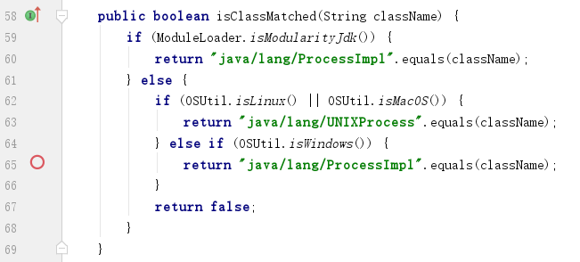

### 5.3 规则缺陷

OpenRASP还是不免用到了一些规则，如果规则未黑名单形式，比较难避免遗漏。如针对文件上传有文件后缀过滤正则，其中针对脚本文件的黑名单正则：

```
var scriptFileRegex = /\.(aspx?|jspx?|php[345]?|phtml|sh|py|pl|rb)\.?$/i
```

使用官方的vulns.war中的`008 - 任意文件上传漏洞 - commons.io 方式`进行漏洞测试，在windows下上传文件名“test.jsp...”可成功上传。另外可以通过“../test.war”的方式成功上传war包到webapp目录下，但由于该漏洞案例写文件的Writer为字符流而非二进制流，所以上传后的war不能成功执行。

# 6.其他说明

代码中`OpenRasp`使用的JS引擎还是V8，不符合官方文档所说的`Rhnio`引擎，后来在官方QQ群中，群主`c0de::bre@k`回应到：“是j2v8太慢，优化过的v8比rhino快很多，js兼容性也强”。

# 7.结语

通篇学习下来，笔者认为，对于普通人来说，实践与维护RASP的难度对比传统WAF来说，省去了大量请求解析与解码的工作，且安全效果会比较显著，毕竟其深入嵌入产品代码。但方案比较狭隘，不同用户可能会有自己的hook需求与安全功能需求，另外语言的变化还会付出额外维护成本。而OpenRASP已经比较成熟，除了攻击检测外还支持安全基线检测、类库信息收集等功能，其JS插件也简单易上手（除了需要吐槽整坨代码写一个文件），还具备后台管理功能与IAST功能，令笔者意想不到的强大。

另外打下广告，本人目前求职中，求职意向为web安全岗，一线城市皆可...


 相关参考

https://rasp.baidu.com/doc/ OpenRASP官方文档

https://docs.oracle.com/javase/8/docs/platform/jvmti/jvmti.html JVMTM Tool Interface

https://xz.aliyun.com/t/4290  浅谈RASP技术攻防之基础篇  

https://tech.meituan.com/2019/09/05/java-bytecode-enhancement.html 字节码增强技术探索

https://www.anquanke.com/post/id/187415 浅谈RASP
