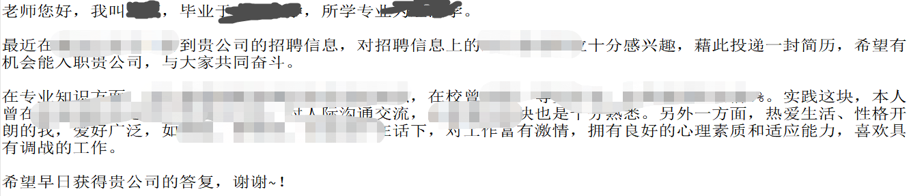
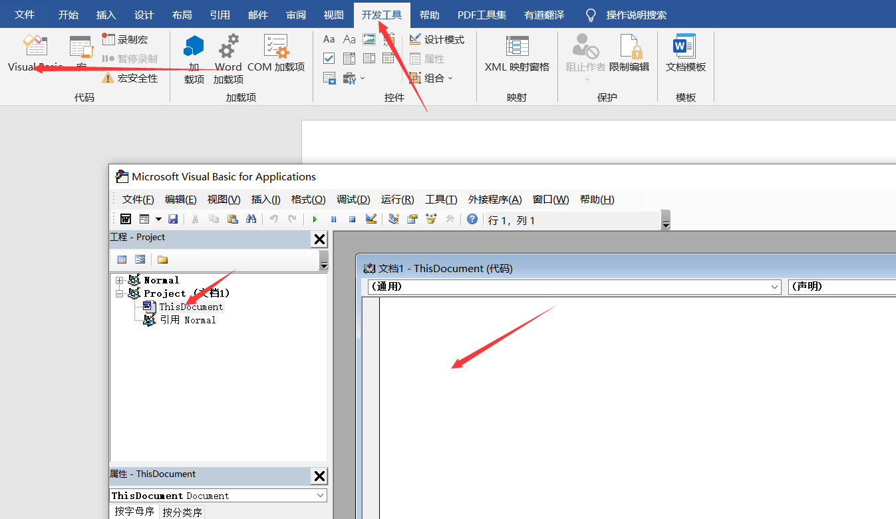
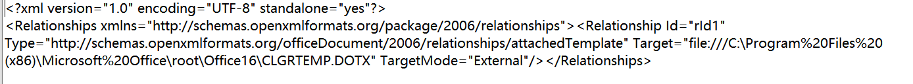
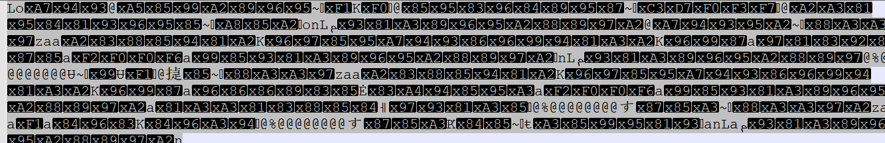

## 前言

前段时间有幸向一位师傅学习钓鱼手法，而钓鱼也是一门比较深的手艺，在笔者目前看来，涉及到社会工程（语言技巧、诱导欺骗）、样本免杀（包括过邮件沙箱、邮件网关、终端EDR免杀等）、C2（云函数、云转发、能否出网）等。尤其在大公司中，对于邮件钓鱼已经有较多的防范，我们前期的样本制作就更需要费一番心思。

笔者使用GadgetToJScript + ColbatStrike 的方式进行木马制作，钓鱼手法为word宏+图片诱导+远程模板加载+hta命令执行，在近期red team行动中也成功钓到重要公司的的员工。 

本文主要描写笔者如何进行word宏邮件钓鱼，记录笔者的一些心得，也是一篇笔记。

## 确定目标

知道目标公司后，笔者通常喜欢通过投递简历的方式进行钓鱼，其中较为麻烦的就是简历编造的这一过程了，有时需要写得华丽、专业，有时需要写得朴素、简单，根据岗位投其所好，实乃耗费精力。有人对我说简历上不必花费过多精力，只要有人点击[启用]即可，不必管太多。但笔者认为，一方面，合理的简历可以降低鱼儿的警惕，避免让其发现异常找”网关“，而如果样本被分析，泄露C2了云转发地址，对我们这次的钓鱼行动是致命的。毕竟云服务供应商是有限的，公司安全运营人员一直在尝试封禁所有能利用的云转发地址，我们手头能利用的云服务商也见底了，即便见底后采用社交论坛C2回连方式也不太实用，不到万不得已我想没人喜欢这样玩。另外一方面，

通过在google/baidu/soso(wechat)中搜索 ”xx招聘“ 等关键字，尽量搜寻个人邮箱，且时间上最好是近一个月的。而我们邮件钓鱼需要尽量避免向群邮件投递或者通过网站进行投递，群邮件投递容易被发现异常，网站投递可能会对word进行转换导致样本失效。

搜寻信息过程中，将收集到到得信息先一一记录，并标注好招聘发布的时间、岗位、目标邮箱、岗位信息。

## 简历编写与投递

简历创建时，建议选择word官方模板”蓝色球简历“，它直接带有本地模板加载的res，方面我们后面直接修改为远程模板加载。

简历模板样式建议参考BOSS直聘的在线简历模板。

工作经历这块，可以在相关招聘网站中查找相关工作，直接修改为工作经历。

简历投递时，邮件内的介绍十分重要，需要引起对方感兴趣，另外也为了避免被邮件网关判断为垃圾邮件。

## 远程模板（宏）

首先制作dotm，在word中新建一个空白文档，之后在此出编写vba脚本。此处的脚本主要作用是执行命令，进行后门植入与持久化工作。

另外，让人纠结的一点是，如果不添加诱导，通常是不大可能会有人上当的；而添加了诱导，会增加我们钓鱼行动暴露的风险。笔者通常会选择添加诱导点击，做法是在vba脚本中编写一段函数，用于自动删除前面文档前面两张图片，其中一种图片是简历得模糊图片，另外一张是提示用户启用宏。一旦用户启用宏后，脚本自动删除图片后，用户看到的是一封正常的简历。

随后修改前面我们编写的简历（docx）的/word/_rels/settings.xml.rels文件，将其修改为远程加载，为了避免被检测，我们可以通过利用一些XML的特性来进行混淆，相关手法参考笔者的一些文章或者在互联网进行搜索即可。这里使用CP037进行混淆：

## C2

由于目标公司出网限制得十分严格，也对CDN域名前置做了严格的检测，且出于让C2匿名的目的，我们必须使用云转发类的云服务，对C2流量进行中转。

通过搜寻”serveless"、“云函数”查找相关厂商，以下是目前笔者知晓的服务商：

| 服务商   | 缺陷         |
| -------- | ------------ |
| 腾讯云   |              |
| 阿里云   | 无法匿名     |
| 华为云   | 需要营业执照 |
| 平安云   | 需要营业执照 |
| 亚马逊云 |              |
| 微软云   |              |
| vercel   |              |
| 七牛云？ |              |

## 结语

对于笔者这种愣头青，在钓鱼时比较痛苦的还是文章杜撰这块，其他方面还是比较欢乐的。

另外，直接的外网入口迟迟无法拿到的情况下，通过钓鱼的方式拿到内网入口也让人稍许欣慰。