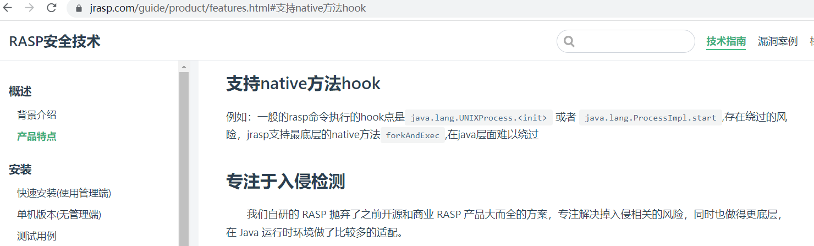
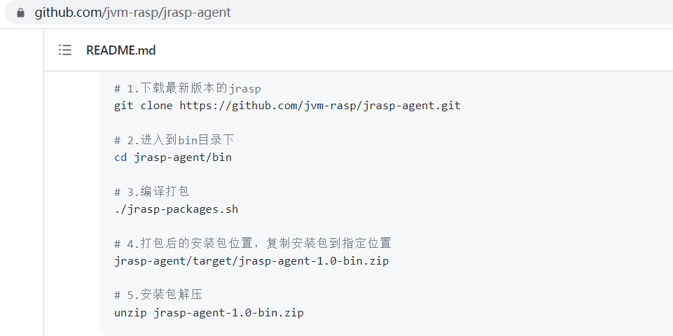
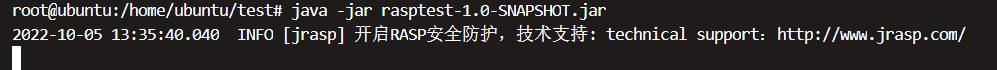
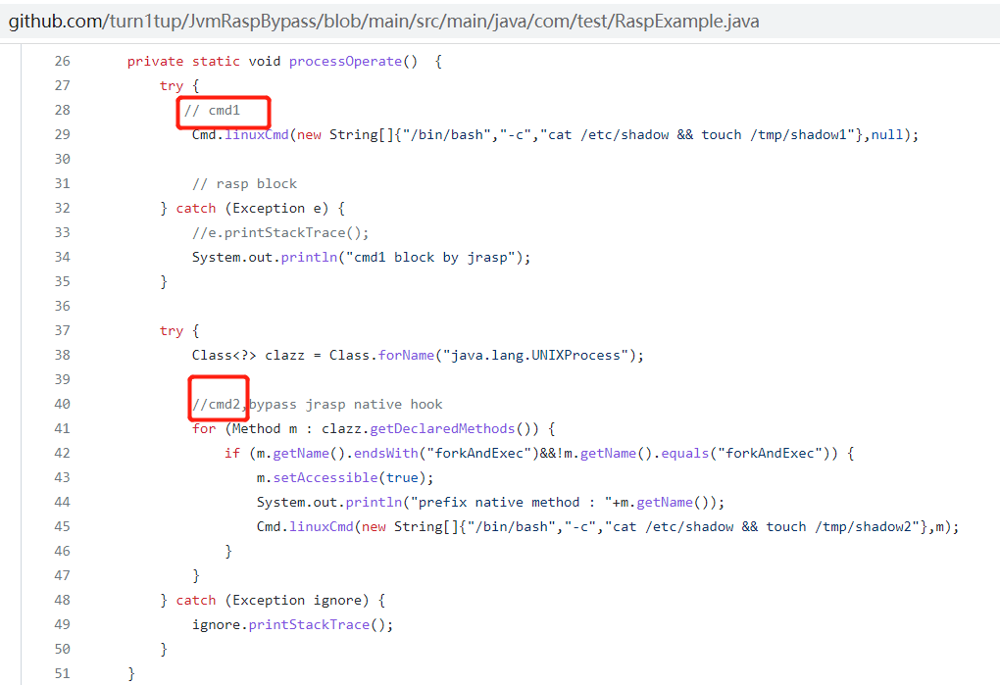
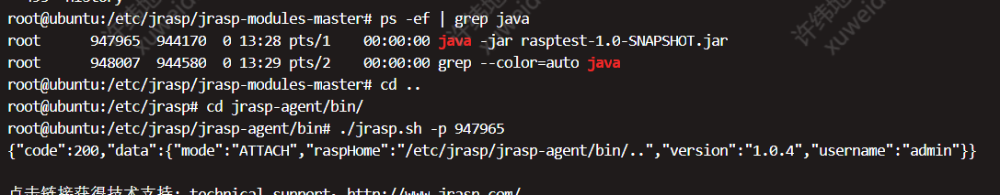
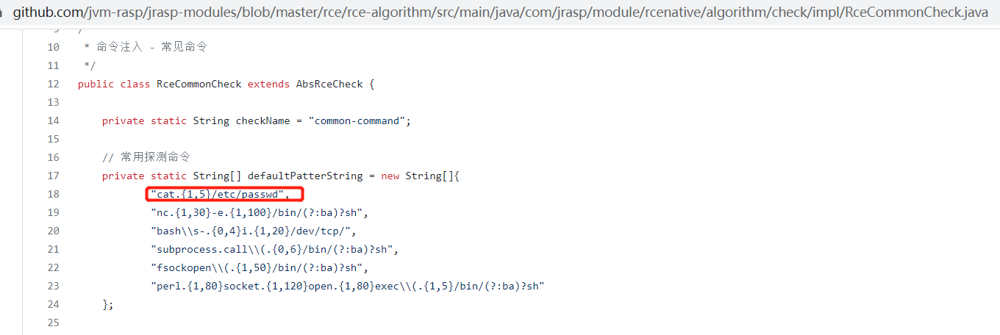
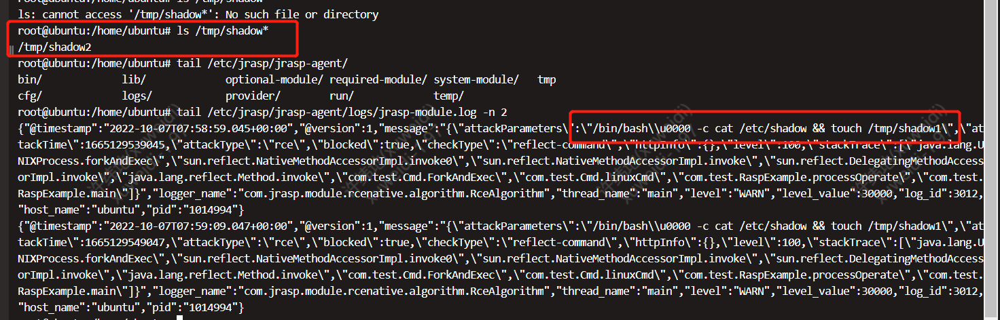

# JRASP Native Method Hook Bypass

## 引言


事情的开头是这样的，在21年年末，笔者与另外一些人，几乎同一时间发表了 java rasp的一个hook点bypass手法：利用 unsafe 在不调用类实例化方法的情况下我们可以直接获得一个class的实例化对象，随后调用其底层的native方法，从而进行命令执行等操作，由于native方法没有方法体无法被hook，当时的RASP都没有处理这种问题。

JRASP是某公司推出的RASP产品，使用了 “native method hook” 技术，可对抗这种 rasp bypass 手法，该技术方案在今年的KCON上也有提到。本文阐述绕过该产品的 native method hook。





## 安装JRASP

在linux下安装JRASP，且提前安装好maven zip

JRASP安装过程可参考 https://github.com/jvm-rasp/jrasp-agent

 

由于插件项目依赖jrasp-agent项目，在编译插件前需要在jrasp-agent下执行mvn install，添加本地依赖。

下载插件项目 https://github.com/jvm-rasp/jrasp-modules，编译完成后将 deploy/* 下的jar包拷贝到 jrasp-agent/required-module ，注意修改pom.xml中的jrasp-module为1.0.4 ：

```xml
 <groupId>com.jrasp.module</groupId>  
 <artifactId>jrasp-module</artifactId>  
 <packaging>pom</packaging>  
 <version>1.0.4</version>
```


 ## 原理描述

实现native method hook可参考jrasp中的文档 https://www.jrasp.com/guide/technology/native_method.html 。

JDK的Instrumentation源码中，该方法的英文注释阐述了这么一个机制：JDK>=1.6情况下，JVM在查找一个native方法对应的C代码映射方法时，为 ` native boolean foo(int x);` ->`Java_somePackage_someClass_foo(JNIEnv* env, jint x)` ；而如果我们通过 setNativeMethodPrefix  对一个native 方法进行了重命名(设置了prefix) ，jvm后续在执行该 prefix native method时，即进行  ` native boolean prefixfoo(int x);` ->`Java_somePackage_someClass_prefixfoo(JNIEnv* env, jint x)` 映射解析 是会失败的，但其随后会去除本Instrumentation中的prefix，然后重新尝试 ，即  ` native boolean prefixfoo(int x);` ->`Java_somePackage_someClass_foo(JNIEnv* env, jint x)` 。

```java
public interface Instrumentation {  
    ... ...
	void setNativeMethodPrefix(ClassFileTransformer transformer, String prefix);
    ... ...
}
```

通过这种动态的native方法映射，JDK 解决了 native 方法无法被hook的问题，即有如下源码：

```java
final class UNIXProcess extends Process {
    ... ...
	private final native int forkAndExec(int paramInt1, byte[] paramArrayOfbyte1, byte[] paramArrayOfbyte2, byte[] paramArrayOfbyte3, int paramInt2, byte[] paramArrayOfbyte4, int paramInt3, byte[] paramArrayOfbyte5, int[] paramArrayOfint, boolean paramBoolean);
    ... ...
}
```

我们在ClassFileTransformer中调用setNativeMethodPrefix设置了prefix后，可将代码修改如下：

```java
final class UNIXProcess extends Process {
    ... ...
  private int forkAndExec(int paramInt1, byte[] paramArrayOfbyte1, byte[] paramArrayOfbyte2, byte[] paramArrayOfbyte3, int paramInt2, byte[] paramArrayOfbyte4, int paramInt3, byte[] paramArrayOfbyte5, int[] paramArrayOfint, boolean paramBoolean) throws IOException {
    return RASPforkAndExec(paramInt1, paramArrayOfbyte1, paramArrayOfbyte2, paramArrayOfbyte3, paramInt2, paramArrayOfbyte4, paramInt3, paramArrayOfbyte5, paramArrayOfint, paramBoolean);
  }
  
  private final native int RASPforkAndExec(int paramInt1, byte[] paramArrayOfbyte1, byte[] paramArrayOfbyte2, byte[] paramArrayOfbyte3, int paramInt2, byte[] paramArrayOfbyte4, int paramInt3, byte[] paramArrayOfbyte5, int[] paramArrayOfint, boolean paramBoolean);
    ... ...
}
```

如此一来 `forkAndExec` 已经不是 native 方法，我们可以hook它；但如果攻击者换成调用 `RASPforkAndExec` ，则依然可以绕过我们的 hook 检测。


## 复现

https://github.com/turn1tup/JvmRaspBypass

下载该maven项目并编译打包，之后在linux下运行（JDK8）：

  

 

bypass原理为找到修改后的native方法。这里的cmd1后面会被jrasp拦截，cmd2则不会被拦截。

https://github.com/turn1tup/JvmRaspBypass/blob/main/src/main/java/com/test/RaspExample.java

 

 

attach注入jrasp：

 

 

jrasp默认拦截cat /etc/shadow

https://github.com/jvm-rasp/jrasp-modules/blob/master/rce/rce-algorithm/src/main/java/com/jrasp/module/rcenative/algorithm/check/impl/RceCommonCheck.java

 

 

 

我们在注入jrasp成功后 rm -rf /tmp/shadow*，随后等待一段时间，可以发现cmd2执行成功（创建了/tmp/shadow2），无拦截日志；cmd1被jrasp拦截，且有拦截日志。

