# codeql-java的进阶知识

笔者在阅读了codeql的官方文档，熟悉相关语法后，对codeql中的java进行了一番简单的研究，本文分享了这一过程的一些收获。

## 规则的封装

通过`class`我们可以封装一系列的谓词方法，这方便我们组织并编写一系列的规则。

### 递归调用

class可以通过`extends`关键字申明其继承来自另外一个或多个class，我们通过使用父类或父类的谓词方法，codeql就会帮我们自动递归使用其子类。

class使用abstract进行修饰则表示该class的构造函数谓词将不起功能作用，该方式通常用于修饰Node节点、AST节点，因为它们的构造函数谓词起到类型的判断作用(instanceof)。同样的，我们也可以使用abstract修饰class中封装的谓词方法，这样一来该谓词方法在被使用时本身不具备谓词判断逻辑，但codeql会递归使用其子类的谓词。我们可根据需要选择是否使用abstract修饰词，另外子类也可被abstract修饰，更多的注解可参考官方[annotations](https://codeql.github.com/docs/ql-language-reference/annotations/)。

如下例子中编写了多个class并声明继承RemoteFlowSource，父类RemoteFlowSource即可在使用时表示其所有子类。

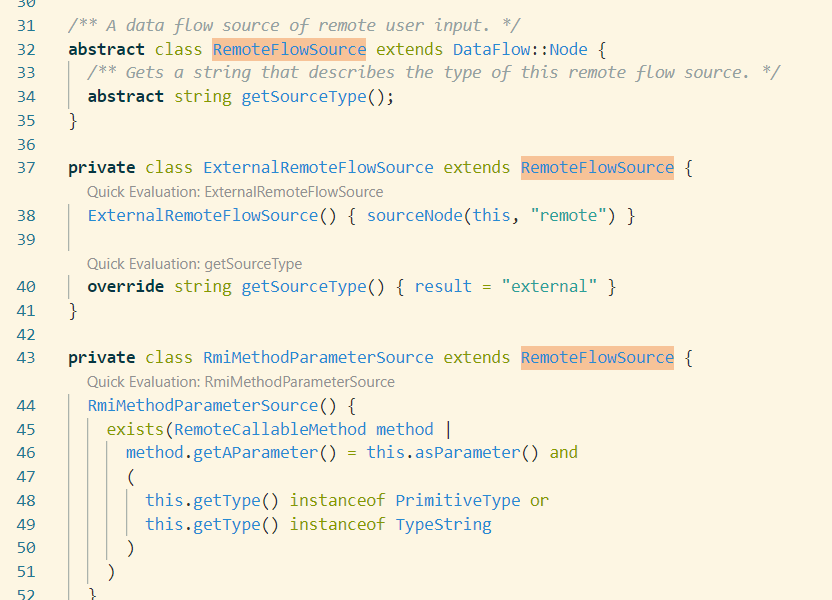

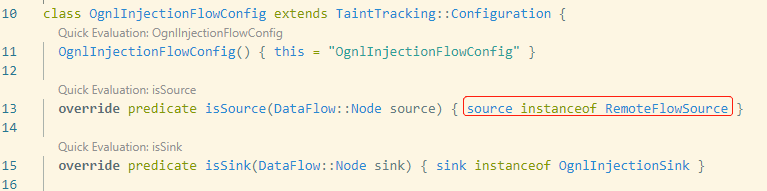


流中继step只是做方法的封装，构造函数谓词不起作用，所以不需要abstract的修饰：

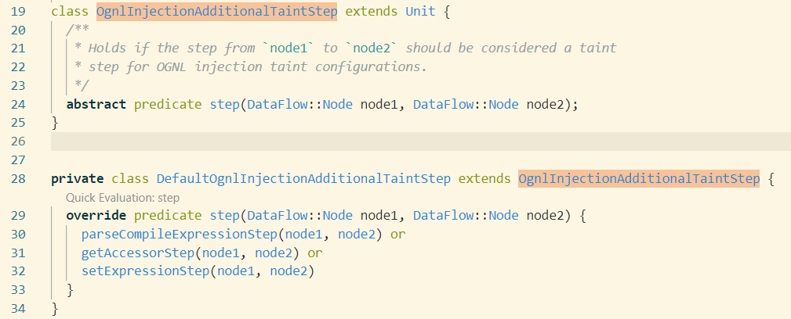


### ModelCsv

通过`ModelCsv`，我们可以简化代码定义sink、source、flow step，并通过`kind`来使用它，简单说一下对应的三种`ModelCsv`（可以在`ExtenalFlow.qll`找到它们）。

`SourceModelCsv`：定义`source`，列值为`namespace(); type; subtypes; name; signature; ext; output; kind`。

`SinkModelCsv`：定义`sink`，列值为`namespace; type; subtypes; name; signature; ext; input; kind`。

`SummaryModelCsv`： 定义`FlowStep`，列值为`namespace; type; subtypes; name; signature; ext; input; output; kind`。

关于列值有如下说明：

```
namespace：包名
type：类名
subtypes：true或false，表示是否关注子类
name：方法名或构造函数名
signature(方法参数描述符，无需描述返回值)
input、output：表示流跟踪过程中上游的input(source)与下游的output(sink)，值可为Argument、Argument[n1..n2]、Argument[n]、Argument[-1]、ReturnValue，其中Argument[-1]表示方法调用者qualifier，可能是变量、类名、this等
ext：值为空或Annotated，仅在library-test中出现过，暂不深究
kind：本条row的标签，同个ModelCsv中可定义多个kind值不同的row，kind值也可以是已经在其他ModelCsv中定义过的
```

这里的class使用了kink值为`ognl-injection`的`SinkModelCsv` row

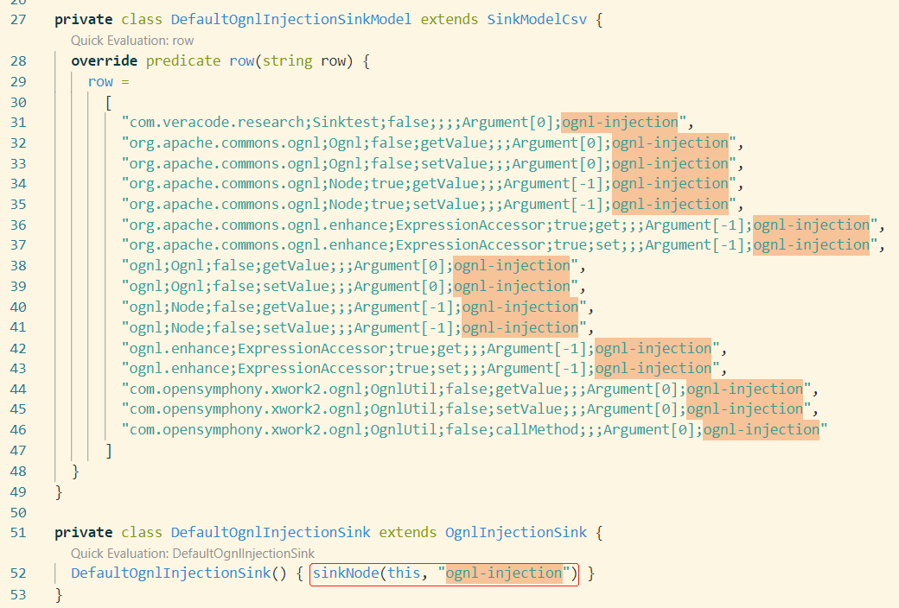

## 流处理

讲讲笔者理解到的codeql的流处理。

### 流自动传递逻辑

我们可以发现codeql污点到源点的数据流走动遵从这样一个简单的规则：从一个节点走到另外一个节点，对象类型发生变化时，如果没有相应的流中继step，则该流会断掉。

另外，当流走到我们规则定义的source点后，如果source点为Parameter类型，codeql还会将该Parameter所在方法作为节点，尝试继续找source，而如果source点不为Parameter类型，则不会继续走流。

### flow step

简单说一下如何理解并编写一个流中继步骤。

下面的代码的污点为 `ognl;Node;false;setValue;;;Argument[-1];ognl-injection`，该污点跟踪到`expr`变量后就会断开。

```java
OgnlContext context = (OgnlContext) Ognl.createDefaultContext(null);
Node expr = Ognl.compileExpression(context, null, str);
expr.getValue(context, null);
```

而我们需要将数据流跟踪到`str`字符串的传递上，这种跨类型（从Node到String）的情况，codeql默认是不支持的，所以需要添加新的流步骤。理解并编写一个flow setp的关键点就是，你需要假设n1为数据流的上方，n2为数据流的下方，而下方靠近sink，然后我们需要什么就假设n1、n2在我们想要的数据流节点位置，最后想办法通过一系列谓词说明n1、n2之间的逻辑关系即可。

如下的流步骤中，可以理解为：污点规则命中后，随后跟踪到数据类型与`Node expr`类型一致的`Ognl.compileExpression(context, null, str)`，该节点为`MethodAccess` ，然后我们假设Node `n2`为该方法调用，即有 ` n2.asExpr() = ma`，`n1`为方法的字符串参数，即有`n1.asExpr() = ma.getArgument(index)` 。

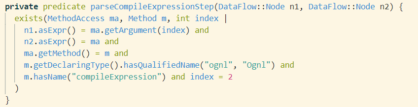


### 浅尝DataFlow

稍微看看codeql底层流处理库DataFlow。

针对接口情况， codeql会关联Interface与其implements，这点似乎是codeql的基础机制，可能其构建节点关系的时候就会进行这一步处理（主要笔者没有在lib代码中找到这部分的逻辑，所以暂时做此猜想），后面sink到souce的流跟踪过程会触发这种节点上的逻辑关联。

下图中，sinkMethod为污点，数据流随后跟踪到 `myClass.getS()`，并发现`IMyClass`为Interface时，关联节时会关联到implements该接口的类`MyClass`的`getS`。

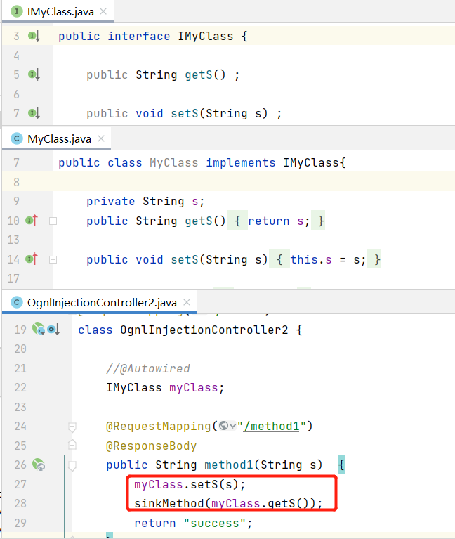

codeql甚至还会自动分析`getS`与`setS`两个方法间是否存在数据关联，从而决定是否进行流跳转。

本例中，codeql实际通过`DataFlowPrivate.qll`中的`storeStep`谓词判断这一情况。该谓词的逻辑方法逻辑为，上游节点node1，即`this.s = s`中右边的赋值变量，下游节点node2，即`myClass.get()`的`myClass`，也是`this.s = s`中的`this`。

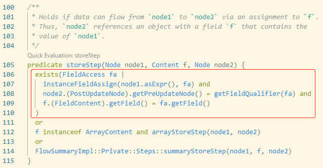

但目前这种功能无法针对lib库的class进行分析，如本例中的接口类与接口实现类在jar包中的话，我们就需要另外编写flow step。但相信我们在真正深入了解codeql后，这一问题能够解决。

lookmok

##  规则案例

### 丰富传播规则

codeql提供了一系列通用的核心基础 source、flow，但我们在使用过程中，也需要不断完善其中的不足。

下图案例中，存在污点方法`sinkMethod`，其source来源于`request`，由于codeql关于`java.io.InputStream`、`ByteArrayOutputStream`的flow step不完善，所以在进行污点跟踪时会断掉（真实漏洞案例）。

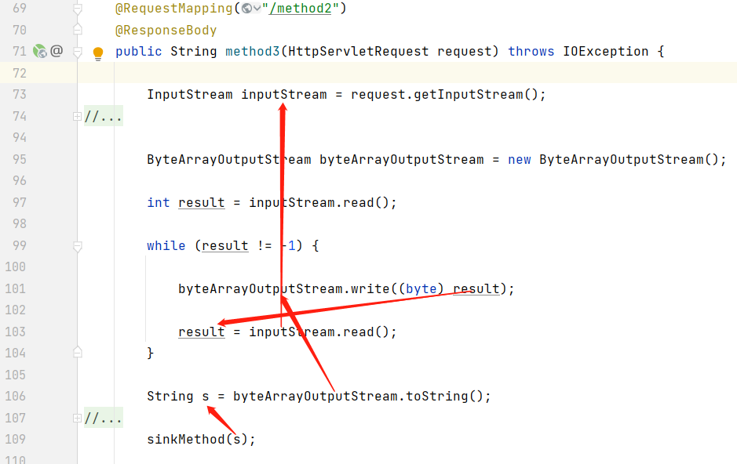

此时，我们自己需要完善这块的规则，如下图中，我们在`ExternalFlow.qll`中添加两条流中继规则，分别是针对`InputStream#read`、`ByteArrayOutputStream#write(byte[])`

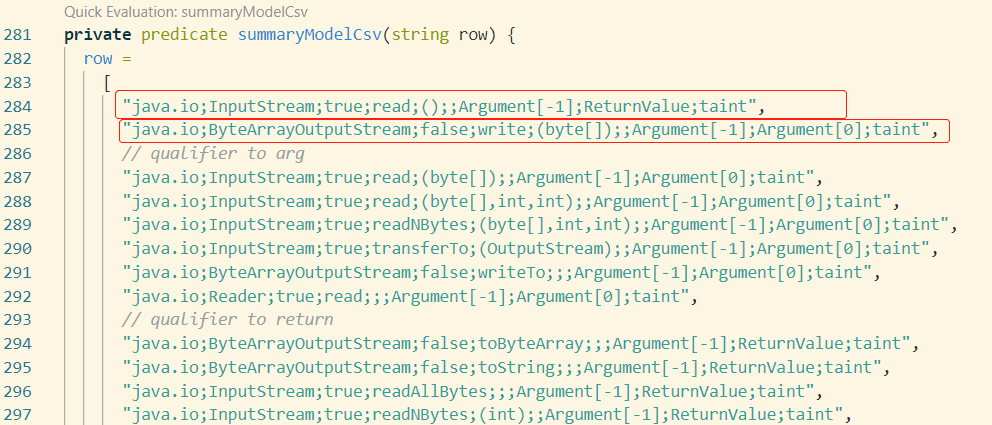

另外，如果过滤器`isSanitizer`中不能过滤`int`类型（可能不能一股脑过滤这些数据类型）：

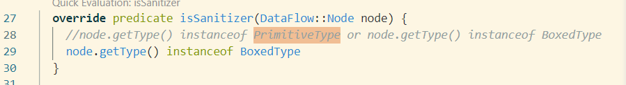

### 非典型污点

起初笔者在编写AST代码审计工具时，认为污点跟踪只需要针对类的方法或构造函数的跟踪，由于该认知的局限，之后的实践使用过程中，就遇到了尴尬的问题。与之鲜明对比的是codeql中污点的使用：数据流中的节点都可以是污点，甚至即便某个节点即便不是数据经过的节点，你也只需要阐明该节点与某个具备流跟踪逻辑的节点的关系，之后返回具备流跟踪逻辑关系的节点即可，codeql引擎将遵从代码流逻辑，从具备流跟踪逻辑的节点向上走流。

我们可以从SpringBoot Thymeleaf漏洞加深理解这一点，漏洞demo为 [spring-view-manipulation](https://github.com/veracode-research/spring-view-manipulation/blob/master/src/main/java/com/veracode/research/HelloController.java)，codeql提供的规则案例为[SpringViewManipulationLib.qll](https://github.com/github/codeql/blob/main/java/ql/src/experimental/Security/CWE/CWE-094/SpringViewManipulationLib.qll)，不过不知道为什么作者少判断了PathVariable的情况，笔者给出的代码已补全了这一问题（spring默认视图设置为thymeafleaf后，当符合某些情况会存在模板注入漏洞，漏洞情形可参考污点与过滤器中的代码逻辑）。

下图中可以看到，return代码块拼接用户输入时，return代码块可直接作为一个污点；另外参数Parameter也可作为污点，也得益于SpringRequestMappingParameter源点的匹配。

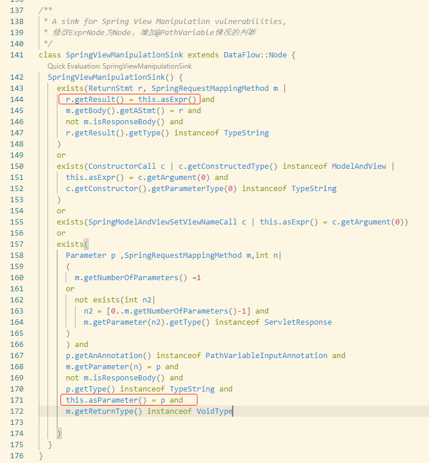

### 看规则学web

当研究了别人的规则之后，笔者才发现自己没有真正把java 漏洞“弄懂”，包括其中涉及到的污点类、web框架，缺少工程性系统性地研究漏洞，并转换为能力上积累。

这里举例，Spring MVC中的`@RequestMapping`用于标记一个控制器的入口方法，codeql判断一个注解是否为`@RequestMapping`时使用的是下图中的`SpringRequestMappingAnnotationType`。当笔者看到`91行`这行代码时，就有点懵：难道一个注解，被`@RequestMapping`注解后，也是有效的`@RequestMapping`注解了?Spring框架这也认？

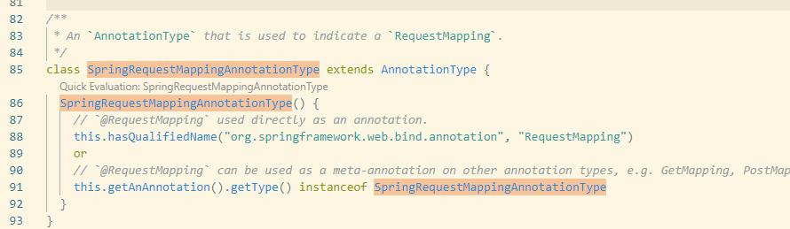

这里编写了一个`MyMapping`，添加了`@RequestMapping`与`@Retention`注解，启动SrpingBoot后，确实可以访问/Mymapping应用。

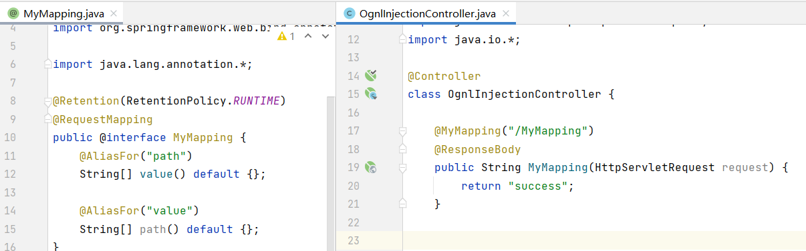

Spring注册Controller的前端入口方法的代码在`o.s.w.s.h.AbstractHandlerMethodMapping#detectHandlerMethods`，debug看了看，底层代码会通过 `o.s.c.a.TypeMappedAnnotations#scan`方法确定是否存在`@RequestMapping`注解。但后面想了想，其实就是为了兼容`RequestMapping`、`PostMapping`、`PutMapping`等情况而已。

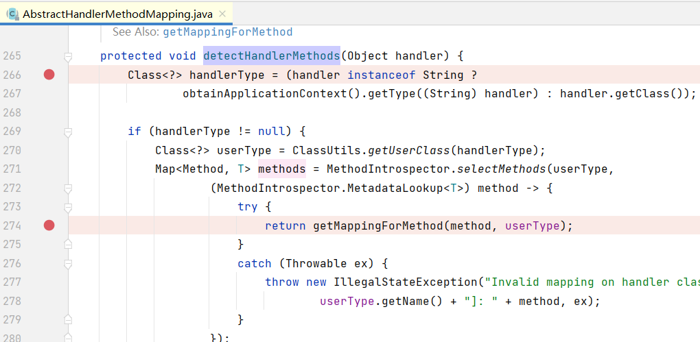

如果方法使用了`ModelAttribute`、`InitBinder`、`RequestMapping`这类注解，或者该方法所在类的父类的对应方法使用了这类注解，则该方法都是有效的入口方法。

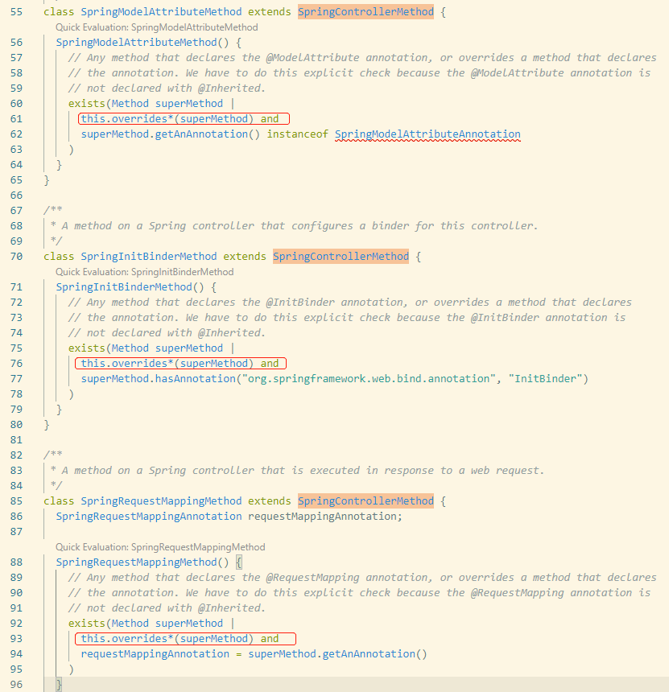

这里的`BController`继承了`AController`，我们给出的路径`/B`与`/MethodB`会进行对应的覆盖，如果不写注解Mapping，则沿用AController的路径，但URI路径不能完全一致，不能出现/A/MethodA。Spring的这种机制是为了让用户方便管理自己的Controller。（这里的BController去掉`@Controller`注解，图片代码给错了）

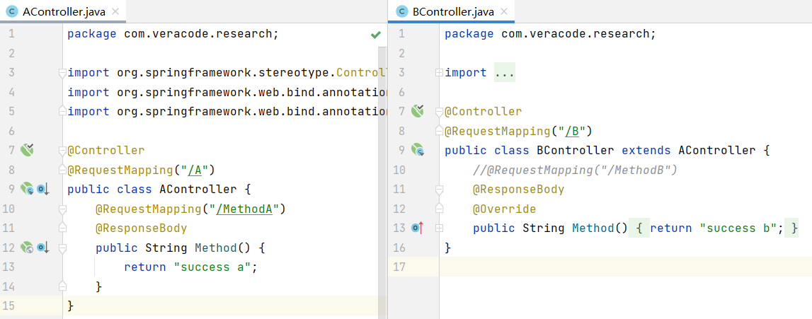代码逻辑关键点在`o.s.c.a.AnnotationsScanner#processMethodHierarchy`，确实是有这么一回事。

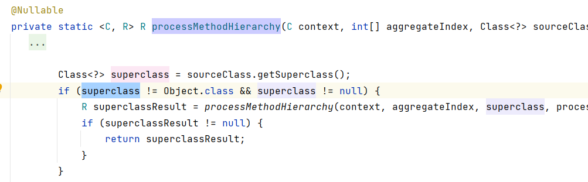

像很多注入漏洞，我们平时也只关注其中触发漏洞的一两个方法，但看看codeql的规则：

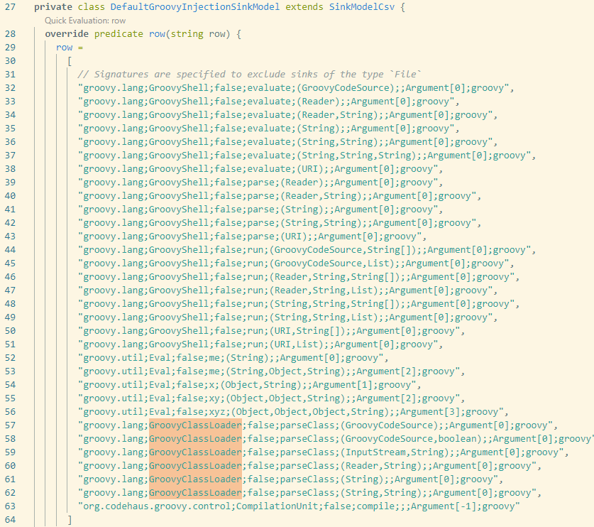

## 结语

什么叫专业，这就叫专业，得紧跟时代。
