# JAVA-RASP高效检测SQL注入

## 1. 前言

笔者在八月份时编写了一系列RASP Hook点及处理方式，这个过程中需要笔者去debug各lib库的代码流程，也协助笔者去做更多的思考。关于这些SQL注入检测方式的检测方案，本文做此分享。

本文首先说说单纯针对MyBatis框架的一种SQL注入检测方案，但这种方案除了局限性外，对复杂SQL业务（动态插入SQL语句片段）会误报；之后讲一下引入Druid SQL语法引擎，而引入的语法引擎我们有两种技术路线，一种是只使用其基础的词法分析引擎，将SQL参数化，去除SQL语句中的数据，然后上报云端检测，另外一种则是 再引入 其[WallVisitor](https://github.com/alibaba/druid/wiki/简介_WallFilter)语法引擎，对SQL中不符合预期的语法行为进行告警拦截。

 

## 2. MyBatis SQL注入检测

起初想法中，该方案十分高效，且RASP设计方案中，云端拥有规则引擎，可以处理方案中的误报问题，但最终考虑到局限性，最后还是放弃该方案，本节仅作一个有趣的设想的分享。

### 2.1 思路整理

有如下UserMapper.xml

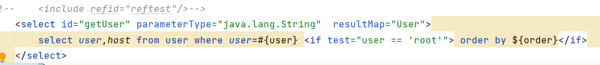


在SQL执行过程中，其会被解析成一个树状的 rootSqlNode (图片最下面) , Mybatis会遍历rootSqlNode下的node节点，将其拼接成一个完整的sql语句，而这些node节点中只有StaticTextSqlNode、TextSqlNode保存SQL片段，StaticTextSqlNode单纯保存SQL片段，TextSqlNode会调用dollar token替换函数来处理SQL片段中的 ${...} 数据。

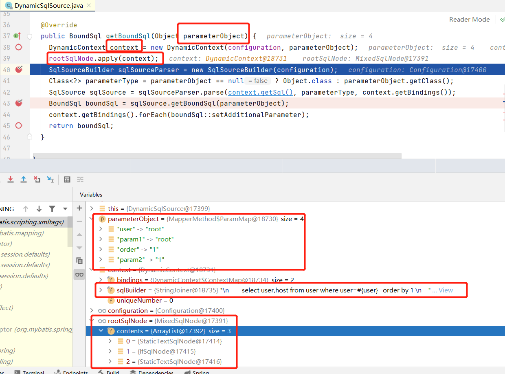

我们通过插桩StaticTextSqlNode、TextSqlNode，拼接其中的原始SQL片段可以获得本次SQL执行的raw sql：

```sql
select username,password from user where username=#{username} order by ${order}
```

另外，其后，我们可以获取到处理dollar token后的SQL语句parsed sql：

```
select user,host from user where user=#{user}   order by 1 
```

于是，我们可以有这么一个构想：获取mybatis sql执行过程中的 raw sql 与 parsed sql，判断出${}处替换后的地方sql结构有没有变化，如果sql结构发生变化则认为该sql为需要关注的，且该raw sql 单位时间内未上报过，则上报云端处理（但如果业务复杂，${}拼接的就是多个SQL词，则会误报，如开源的若依后台系统）。

### 2.2 流程逻辑与插桩

SqlSource有多种，而我们只需要关注DynamicSqlSource，且主要逻辑点在 `DynamicSqlSource#getBoundSql`。

末尾的`context.getSql()`函数拿到的是 dollar token (${}) 被替换处理后的parsed sql语句，而我们想拿到raw sql语句则需要我们自己跟踪 SqlNode的 sql 拼接过程，在`StaticTextSqlNode#apply`、`TextSqlNode#apply`方法前插桩，获取text（sql片段），然后手动拼接。

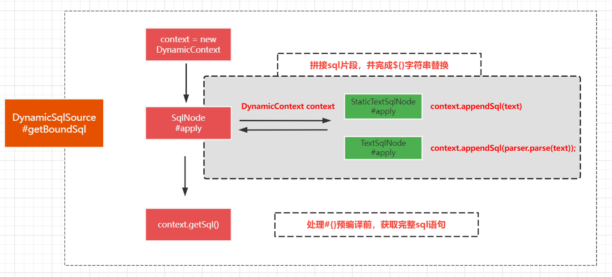

Hook点如下，其中`StaticTextSqlNode#apply`、`TextSqlNode#apply`方法的前后都使用同一函数逻辑处理。

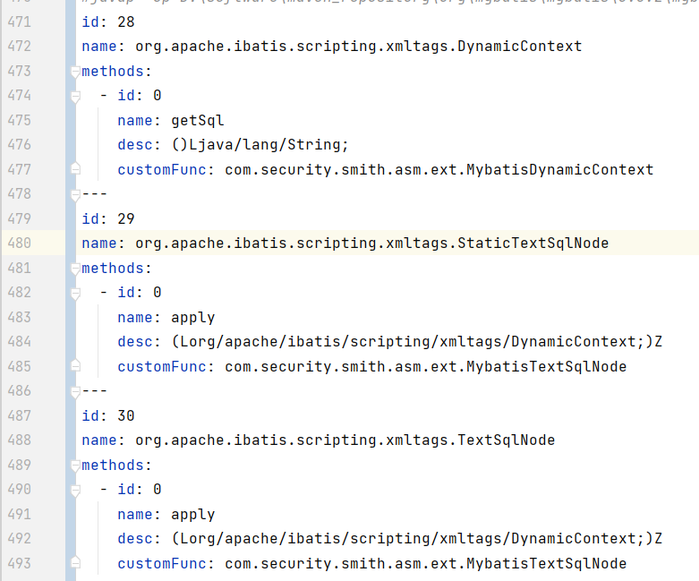

### 2.3 Hook点处理

在整个逻辑流程前，先初始化StringJoiner或StringBuilder，用于raw sql的拼接，在整个逻辑流程处理完成后，需要将对应的数据remove清空。在整个逻辑流程处理完成后，对获取到的 rawSql 与 parsedSql 进行sql结构检测。

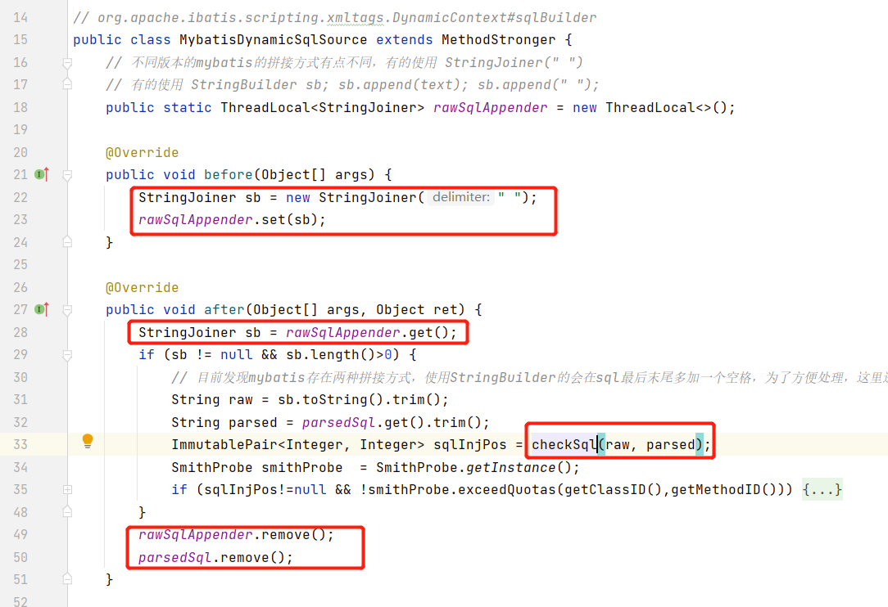

在`StaticTextSqlNode#apply`、`TextSqlNode#apply`方法前调用前，获取 this.text ，然后拼接进来即可。

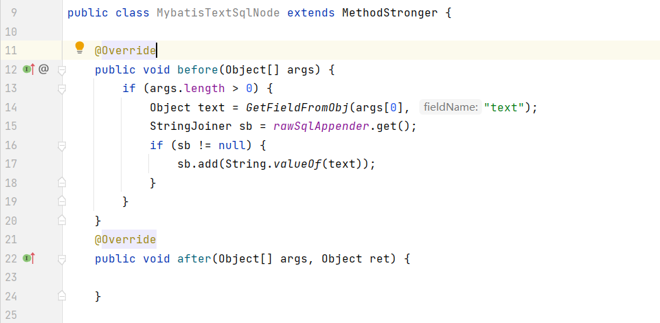

通过插桩context.getSql，获取 parsedSql

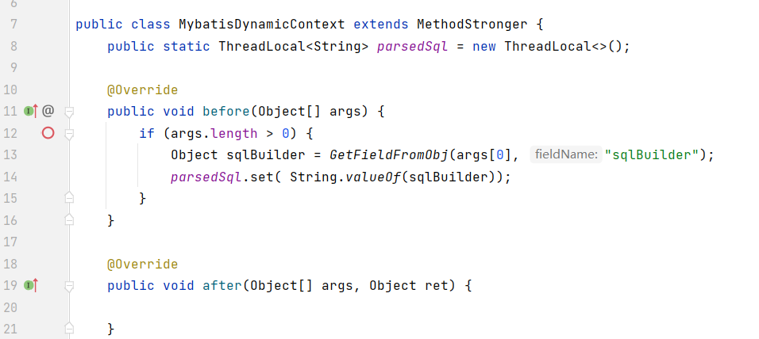

### 2.4 SQL结构检测（思路）

dollar token之间，dollar token与末尾之间，可以称为缝隙 gap ，通过 raw sql 我们可以获取这些 gap 的长度，gap长度将用于协助判断parsed sql结构是否发生变化。

 parsed sql 这块的解析，针对替换后的dollar token，需要考虑其是否在引号包裹内，如果是，则需要考虑忽略被转义的引号，笔者认为的合法字符集为`(Character.isDigit(c)|| Character.isLetter(c) || c=='_' || c=='$'|| c=='-'|| c>='\u0080')`。

如果raw sql 与 parsed sql的 gap 数量或内容不一致，则认为SQL发生变化。

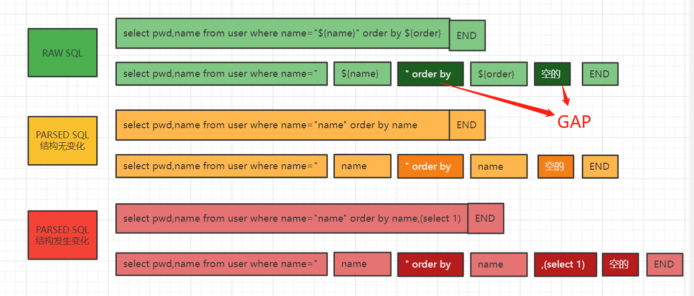

demo展示，运行结果显示第 1 组、第 4 组未发生SQL结构变化：

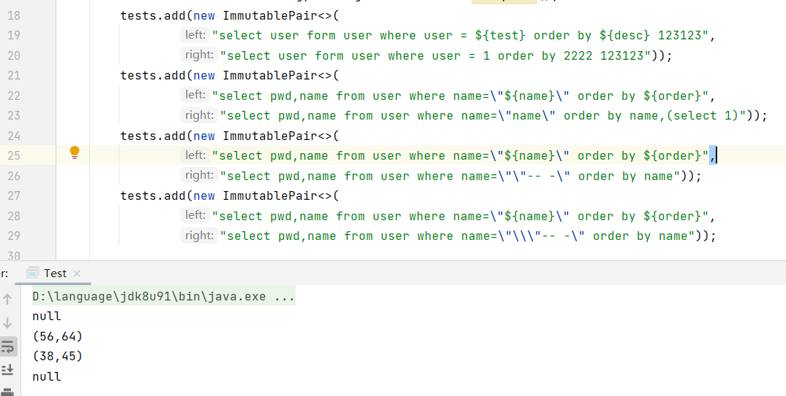


### 2.5 SQL结构检测（代码）

    private class PosItem{
        public int start;
        public int end;
        public int leftQuotePos;
        public int rightQuotePos;
        public char quote ='\u0000';
    
        public PosItem(int start, int end ){
            this.start = start;
            this.end = end;
        }
    
        public PosItem(int start, int end, int leftQuotePos, int rightQuotePos, char quote) {
            this.start = start;
            this.end = end;
            this.leftQuotePos = leftQuotePos;
            this.rightQuotePos = rightQuotePos;
            this.quote = quote;
        }
    }
    
    String openToken = "${";
    String closeToken = "}";
    
    /**
     *
     * @param raw 动态SQL中，拼接后的SQL
     * @param parsed mybatis插入变量后的SQL，不带有${}
     * @return 如果结构发生变化，则返回raw sql中变化位置的 startPos,endPos
     */
    private ImmutablePair<Integer, Integer> checkSql(String raw, String parsed) {
        if (raw == null || raw.isEmpty() || parsed==null || parsed.isEmpty()) {
            return null;
        }
        // 当前 ${的起始点
        int start = raw.indexOf(openToken);
        if (start == -1) {
            return null;
        }
        char[] rawCs = raw.toCharArray();
        char[] parsedCs = parsed.toCharArray();
    
        List<PosItem> rawPosItems = new ArrayList<>();
    
        while (start > -1) {
    
            if (start > 0 && rawCs[start - 1] == '\\') {
                // this open token is escaped. remove the backslash and continue.
                start = start + openToken.length();
            }else{
                // found open token. let's search close token.
                int tmpPos = start + openToken.length();
    
                int end = raw.indexOf(closeToken, tmpPos);
                boolean matchEnd = false;
                while (end > -1) {
                    if (end > tmpPos && rawCs[end - 1] == '\\') {
                        end += closeToken.length();
                        end = raw.indexOf(closeToken, end);
                    }else{
                        //
                        end += closeToken.length();
                        matchEnd = true;
                        break;
                    }
                }
    
                char leftQuote = 0;
                int leftQuotePos=0;
                int rightQuotePos=0;
                // 查看 ${前面有没有闭合符号
                for (int i = start-1; i > 0; i--) {
                    // 先忽略 空白字符，这一步可能没有必要？
                    if (rawCs[i] == '\u0020'
                            ||rawCs[i] == '\u0009'
                    ) {
                        //continue;
                    }else if (rawCs[i] == '"' || rawCs[i] == '\'') {
                        leftQuote = rawCs[i];
                        leftQuotePos = i;
                        break;
                    }else{
                        // 匹配到其他字符则认为没有闭合符号
                        break;
                    }
                }
             
                char rightQuote= 0;
                if (leftQuote != 0) {
                    for (int i = end; i < rawCs.length; i++) {
                        // 先忽略 空白字符，这一步可能没有必要？
                        if (rawCs[i] == '\u0020'
                                ||rawCs[i] == '\u0009'
                        ) {
                            //continue;
                        }else if (rawCs[i] == leftQuote) {
                            rightQuote = leftQuote;
                            rightQuotePos=i;
                            break;
                        }else{
                            // 匹配到其他字符则认为没有闭合符号
                            break;
                        }
                    }
                    // SQL语句原本就有错误的，后面没有引号，不做处理
                    if (rightQuotePos == 0) {
                        return null;
                    }
                }
    
                if (matchEnd ) {
                    rawPosItems.add(new PosItem(start, end,leftQuotePos,rightQuotePos,rightQuote));
                }
                start = raw.indexOf(openToken, end);
              
            }
        }
        // 没有${
        if (rawPosItems.size() == 0) {
            return null;
        }
        int currPos = rawPosItems.get(0).start;
    
        int indexItem = 0 ;
        PosItem itemRef = rawPosItems.get(indexItem);
    
        int countGapMatch = 0;
        while (currPos < parsedCs.length) {
            itemRef = rawPosItems.get(indexItem);
            char c = parsedCs[currPos];
            int startGap;
            int add = 0;
            // 是否结构发生变化
            boolean wordEnd = false;
            if (itemRef.quote!= 0 ) {
                if (c == itemRef.quote) {
                    wordEnd = true;
                } else if (c == '\\') {
                    add = 2;
                } else {
                    add = 1;
                }
            }else if (Character.isDigit(c)|| Character.isLetter(c)
                    || c=='_' || c=='$'|| c=='-'
                    || c>='\u0080') {
                add = 1;
            }else{
                wordEnd = true;
            }
    
            if (wordEnd || currPos == parsedCs.length-1) {
                int rawEndGap = raw.length();
                int rawEndGapElse = raw.length();
                if (indexItem+1<rawPosItems.size()) {
                    PosItem itemNext = rawPosItems.get(indexItem + 1);
                    rawEndGap = itemNext.quote == 0? itemNext.start : itemNext.leftQuotePos;
                    rawEndGapElse = itemNext.start;
                    indexItem += 1;
    
                }
                int rawStartGap = itemRef.quote == 0 ? itemRef.end : itemRef.rightQuotePos;
                String rawGap =raw.substring(rawStartGap , rawEndGap);
                int rawGapLen = rawEndGap - rawStartGap;
                //遇到len 0的情况，这里为
                add = rawEndGapElse - rawStartGap;
                if (currPos + rawGapLen <= parsedCs.length) {
    
                    String parsedGap = parsed.substring(currPos, currPos + rawGapLen);
                    if (parsedGap.equals(rawGap)) {
                        countGapMatch += 1;
                    }else{
                        return new ImmutablePair<>(itemRef.start,itemRef.end);
                    }
                }else{
                    return new ImmutablePair<>(itemRef.start,itemRef.end);
                }
            }
            if (add == 0) {
                add = 1;
            }
            currPos += add;
        }
        if (rawPosItems.size() != countGapMatch) {
            return new ImmutablePair<>(itemRef.start,itemRef.end);
        }
        return null;
    }


## 3. Druid SQL语法引擎

3.1、3.2小节稍微讲讲笔者移植的druid sql语法引擎，之后讲一下SQL注入的检测方案。

### 3.1 性能与兼容

基础的SQL Parser，包括SQL参数化（去除数据），兼容广泛的数据库，且速度十分快；进阶功能为WallFilter则需要耗费更多处理时间，兼容的数据库少很多，但也很不错。

性能方面，如果单纯使用SQL Parser，对SQL语句进行参数化，处理时间约为600ns，使用WallFilter，处理时间约为50us，

>https://github.com/alibaba/druid/wiki/SQL-Parser
>
>Druid的SQL Parser是手工编写，性能非常好，目标就是在生产环境运行时使用的SQL Parser，性能比antlr、javacc之类工具生成的Parser快10倍甚至100倍以上。
>
>```
>SELECT ID, NAME, AGE FROM USER WHERE ID = ?
>```
>
>这样的SQL，druid parser处理大约是600纳秒，也就是说单线程每秒可以处理1500万次以上。在1.1.3~1.1.4版本中，SQL Parser的性能有极大提升，完全可以适用于生产环境中对SQL进行处理。


>https://github.com/alibaba/druid/wiki/%E7%AE%80%E4%BB%8B_WallFilter
>
>WallFilter在运行之后，会使用LRU Cache算法维护一个白名单列表，白名单最多1000个SQL。正常的SQL在白名单中，每次检测只需要一次加锁和一次hash查找，预计在50 nano以内。在白名单之外的SQL检测，预计在50微秒以内。


数据库兼容方面，druid sql-parser 支持众多的数据库，缺省支持sql-92标准的语法。

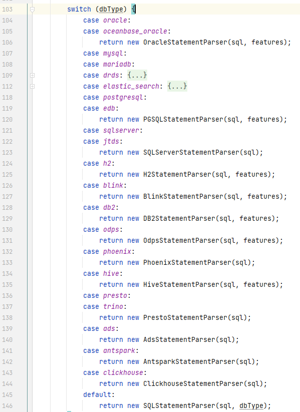

WallFilter目前则支持主流数据库。

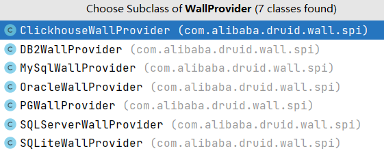

### 3.2 WallFilter


用户开启druid的wall功能后，将启动WallFilter进行SQL注入的检测。

```
spring:
  datasource:
    name: mysql
    type: com.alibaba.druid.pool.DruidDataSource
    druid:
      filters: stat,wall
      ... ...
```

官方文档给出了Druid WallFilter的配置项

https://github.com/alibaba/druid/wiki/%E9%85%8D%E7%BD%AE-wallfilter

#### 3.2.1 SQL黑白名单

WallFilter首先会判断当前的sql语句，是否在黑名单、白名单内，如果在黑名单内则直接拦截，如在白名单内则直接放行，这一步骤可大量减少正常业务的SQL语句经过WallVisitor，提升了性能。

判断黑名单的方法getBlackSql只是将整条SQL语句取哈希后查看是否在blackList LRUCache 中；getWhiteSql则还会将SQL语句参数化，之后查看是否在 whiteList LRUCache 中，LRUCache默认最大数量1000，空间不足时覆盖旧的数据。

通过 ParameterizedOutputVisitorUtils.parameterize 方法将SQL进行参数化：

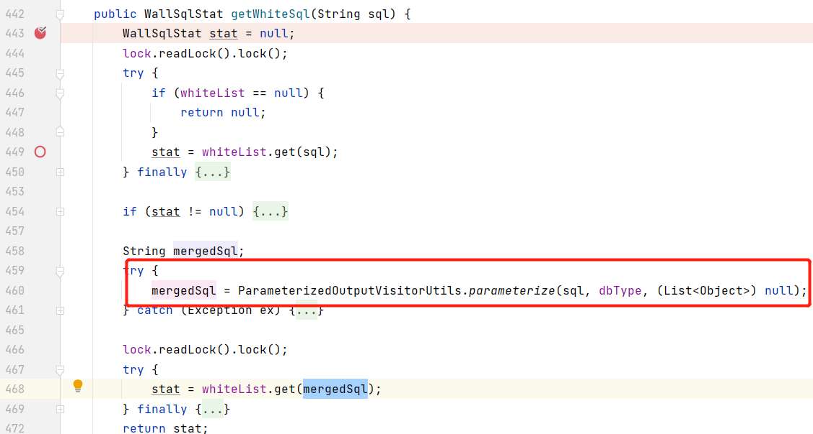

参数化前SQL语句：

```
select * from user where user='root' and 1=1 order by 1
```

参数化后的SQL语句：

```
SELECT *
FROM user
WHERE user = ?
	AND 1 = 1
ORDER BY 1
```

#### 3.2.2 语法防火墙


com.alibaba.druid.wall.WallProvider#checkInternal ：该方法下的这段代码就是 WallFilter 的核心功能，先根据配置情况拦截 带有注释的SQL语句、堆叠查询的SQL语句，随后创建 WallVisitor，而 WallVisitor 拥有多种检查项，包括禁止变量访问或是变量黑名单、禁止永真语句、禁止黑名单函数、禁止访问黑名单表（数据库系统表）等，其中一些复杂的情况则被设置成配置选项，如禁止写文件。检测不通过则SQL语句会被加入黑名单，检测通过则SQL语句与参数化后的SQL语句都会被加入黑名单。

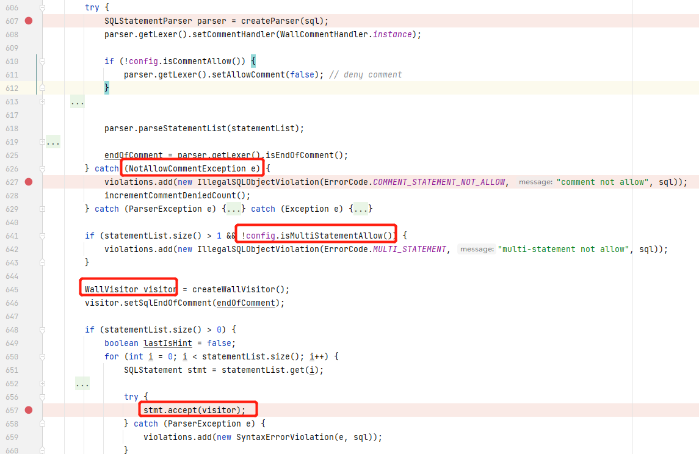

我们可以配置语法防火墙中的 函数、表、变量 黑名单：

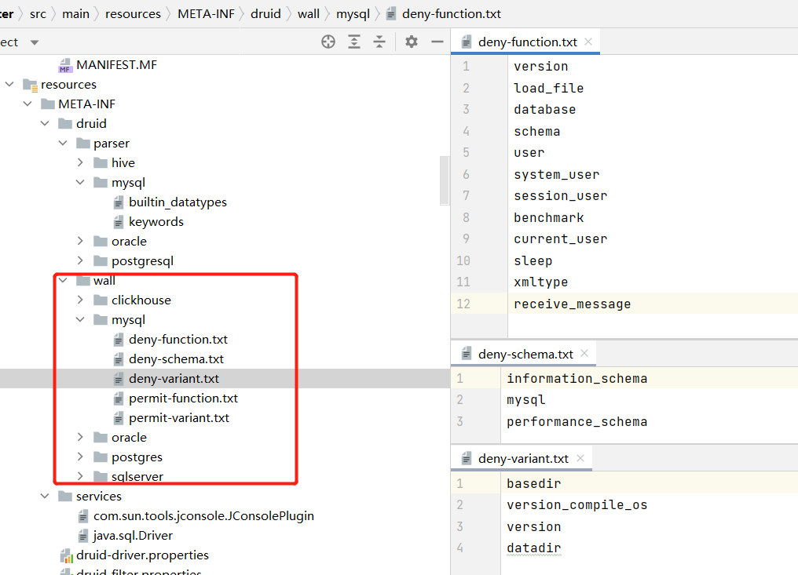

配置选项则可参考 https://github.com/alibaba/druid/wiki/%E9%85%8D%E7%BD%AE-wallfilter ，或是com.alibaba.druid.wall.WallConfig


### 3.3 上报参数化SQL

本节的 SQL参数化方案 兼容更多数据库，RASP端性能也会更好，缺点是占用网络资源，然后不好做本地拦截，容易误报。

起初想的是RASP端不必做太多检测工作，移植Druid参数化语法引擎过来，然后在云端写规则做SQL检测即可。但后面RASP端功能越来完善，就想把顺便把SQL注入检测这块做得更好，把WallVisitor移植进来，所以本节得方案目前可能暂时不会使用，转而使用WallVisitor进行告警拦截，然后上报。

整个代码的实现逻辑很简单，获取参数化后的SQL语句，然后判断该merged sql是否在单位时间内出现过，如果出现过则不上报云端：

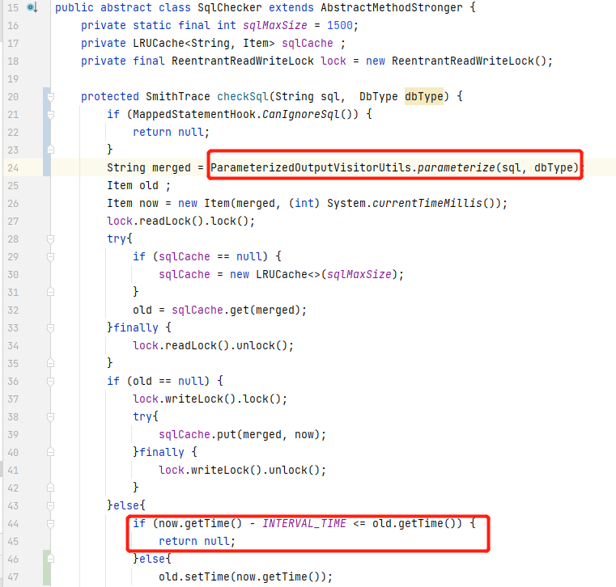

### 3.4 WallVisitor拦截SQL注入

由于Druid依赖库过多，且为了方便管理，笔者对其  SQL参数化 与 WallVisitor 模块进行了代码移植。

这里将druid相关代码、resource文件移植过来并重命名顶层包名，其中的 druid.wall 包含了本节 语法防火墙的重点代码 ，通过这样的移植，我们没有引入其他任何三方依赖库。

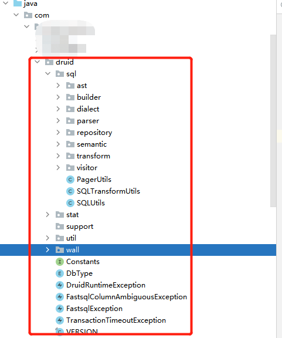

防护的代码如下：

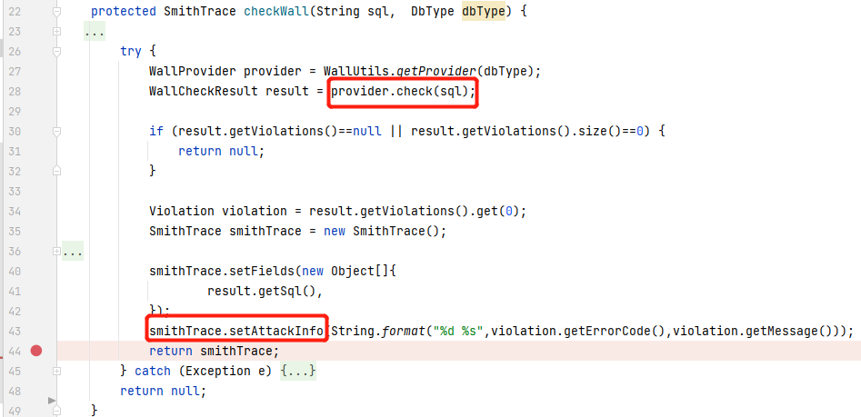

sql wall的配置这块，不同数据库的sql wall对象需要单独维护一个 wall config：

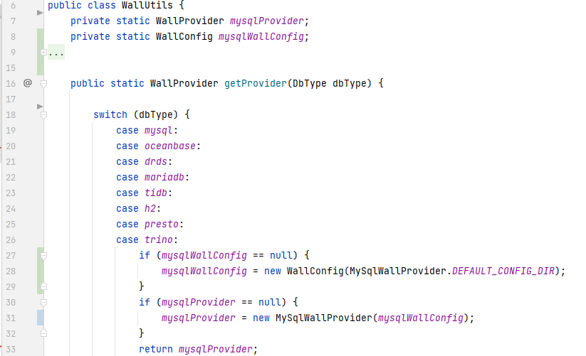

wall conifg包含了通用的开关配置与差异化的配置 (deny-function.txt deny-schema.txt deny-variant.txt permit-funtion permit-variant等)，且差异化的配置这块的数据类型还比较复杂，所以目前仅将这些通用配置云端化，后续再将差异化配置这块补全。

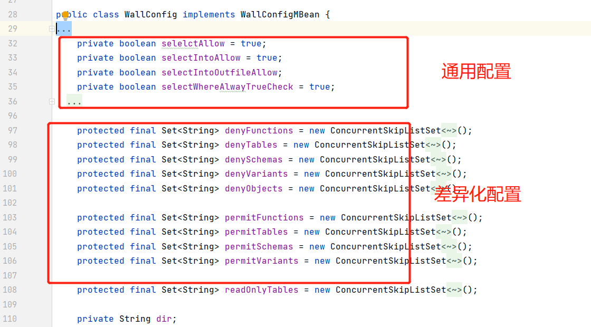

上报到云端的攻击信息：

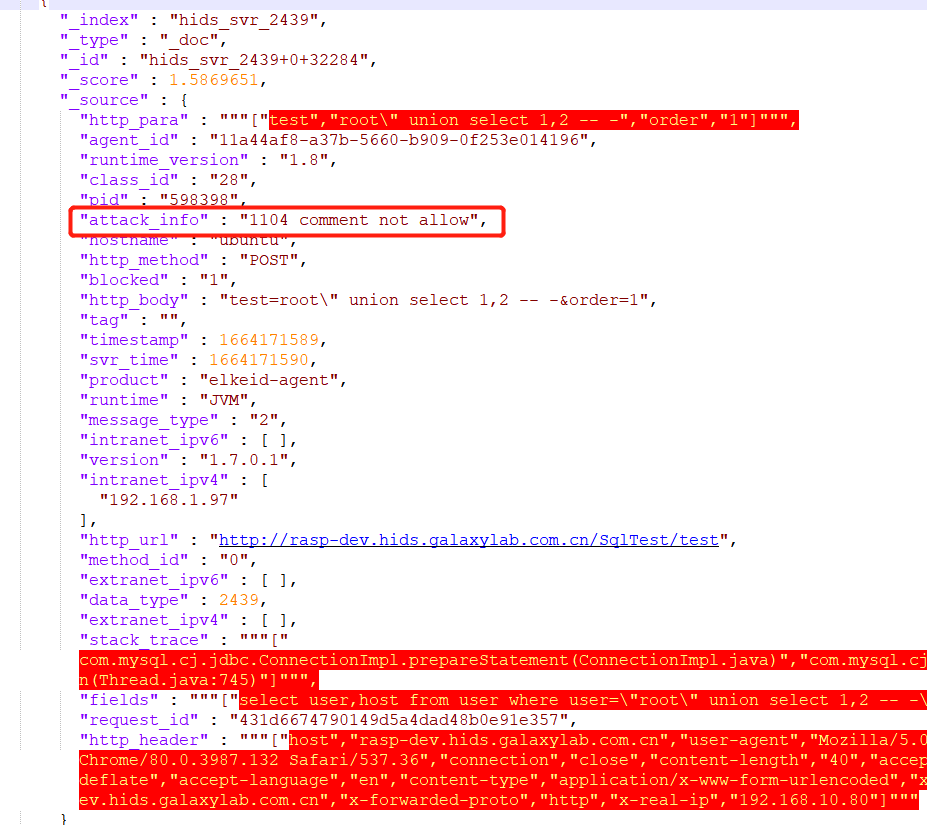


当然，通过WallVisitor进行拦截，我们就不可避免地引出一个问题：我们难以做到完全不漏过SQL注入攻击的同时不产生误报。如，业务的语句中存在注释符号，如果我开启注释拦截，则可能会误报，而不开启则会漏过一些语句。另外，仔细测试WallVisitor，我们还是可以发现某些可利用的函数它没有拦截，但即使出现漏洞，仅靠这些 “漏掉” 的函数，我们也很难进行漏洞利用 （或许这样的SQL注入拦截也足够了？）。

 

## 4. 加速SQL注入检测

第二节的mybatis方案被废弃了，但我们可以二次利用，加速mybatis框架下的SQL注入检测，其他ORM框架应该也可利用该思路。

下图是我们的Hook点

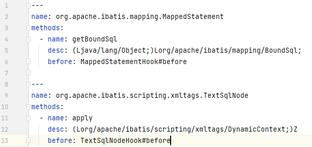


含有 ${..} 的SQL片段只会保存在TextSqlNode中， 我们继续hook TextSqlNode，如果触发了该hook点，则认为本次sql不可忽略

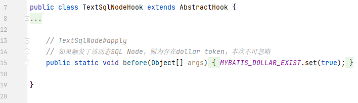

另外我们Hook MappedStatement，在整个mybatis mapping流程开始时，先假设本次sql是可忽略的

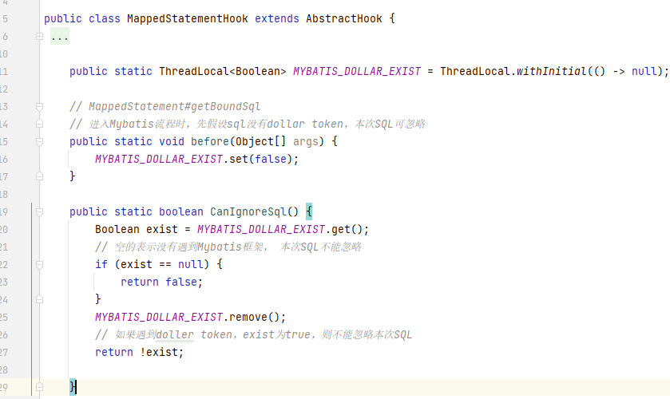

最后，我们在做SQL注入检测时，判断 CanIgnoreSql 是否为 true ，为 true 则不需要对本次SQL执行进行SQL注入检测，以此加快了我们RASP的SQL注入检测。

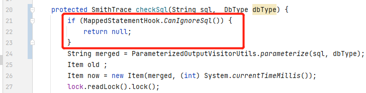


## 5.结语

在RASP防护中，通过了解相关框架的一些流程，我们即可优化我们的检测思路；通过参考引用优秀的开源项目，也能帮助我们站得更高。
