# 剖析Dongtai IAST的实现

 @turn1tup 

[TOC]


## 1. 开言

&emsp;&emsp;IAST有主动式的与被动式的，典型的开源代码分别有OpenRASP与Dongtai IAST，通常认为被动式的优势在于不产生脏数据，不干扰业务方的工作，可部署于测试环境。笔者最近一周弄清楚了dongtai iast的实现，虽然代码没有注释且有点乱，但渐入佳境后就感觉还好，以此文作为对此的学习记录。

&emsp;&emsp;本文主要关注其中的“链路式”功能，对于其他的SCA、硬编码检测等则不进行介绍。本文首先尝试阐述DongTai IAST启动后的前期工作，包括 插桩的策略及相关字段业务目标、插桩、桩，其后便是具体IAST的功能实现。测试时所用版本为 agent-1.14.1、server-1.16.0。

## 2. IAST前期工作

RASP/IAST 这类都会有两个重要的东西，插桩 与 桩，前者为agent如何选择性地钩挂类方法，后者的话就是具体的业务功能实现。

- 插桩
  - 查找定位：找到目标插桩点的过程通常为，找到目标类，项目代码中体现在`DispatchPlugin#dispatch`；随后时找到目标方法，项目使用的ASM框架体现在`ClassVisitor#visitMethod`中，因为这里可以拿到方法名与方法描述符，
  - 执行修改：通过asm的 MethodVisitor或AdviceAdapter 来修改方法字节码、进行钩挂操作，如通过onMethodEnter、onMethodExit可在进入方法时与退出方式时执行我们自定义的代码 。
- 桩：桩可以在运行时获取目标方法的上下文，也是我们具体业务功能实现的承载者。
- 插桩策略：插桩过程还依赖一个“数据集”，该数据集保存我们希望钩挂的相关类方法，所以我们下面先从这点说起。

### 2.1. 插桩策略

#### 2.1.1. 钩挂策略数据格式

首先这里展示其中2个JSON格式的配置，本节内容阅读过程中 可以回顾看看：

```json
{
    "stack_blacklist": [],
    "ignore_blacklist": false,
    "signature": "java.net.URL.<init>(java.net.URL,java.lang.String,java.net.URLStreamHandler)",
    "inherit": "false",
    "untags": [],
    "source": "P1,2",
    "type": 1,
    "vul_type": "URL",
    "ignore_internal": false,
    "command": "",
    "target": "O",
    "tags": []
  }
,
  {
    "stack_blacklist": [],
    "ignore_blacklist": false,
    "signature": "javax.servlet.http.HttpServletRequest.getHeader(java.lang.String)",
    "inherit": "true",
    "untags": [],
    "source": "P1",
    "type": 2,
    "vul_type": "javax.servlet.http.HttpServletRequest",
    "ignore_internal": false,
    "command": "",
    "target": "R",
    "tags": [
      "cross-site"
    ]
  }
```

type 字段含义如下：

```java
public enum PolicyNodeType {
    SOURCE(2, "source"),
    PROPAGATOR(1, "propagator"),//传播者
    VALIDATOR(3, "validator"),
    SINK(4, "sink"),
```


#### 2.1.2. Policy与PolicyNode

AgentEngine保存着一个单例对象PolicyManager

```java
public class AgentEngine {
    private static AgentEngine instance;
    private PolicyManager policyManager;
```

PolicyManager通过loadPolicy从 本地或远程服务器 的配置实例化一个Policy对象。

```java
public class PolicyManager {
    private Policy policy;
	public void loadPolicy(String policyPath) {
        try {
            JSONArray policyConfig;
            if (StringUtils.isEmpty(policyPath)) {
                policyConfig = PolicyBuilder.fetchFromServer();
            } else {
                policyConfig = PolicyBuilder.fetchFromFile(policyPath);
            }
            this.policy = PolicyBuilder.build(policyConfig);
```

Policy对象保存一系列数据，包括与 源、污点、验证、传播 有关的策略，JSON格式的配置可看作其中的PolicyNode，在遍历多个JSON对象的过程中，将它们封装在Policy的sources/sinks/propagators字段中：

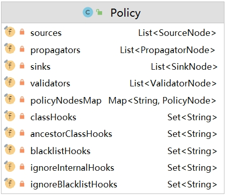

到了我们最关键的部分 `PolicyNode`，其子类包括SourceNode、PropagaorNode、SinkNode、ValidatorNode，该类的子类决定了具体的插桩策略，策略选项包括 以下内容，这些先简述，后面后面会有进一步的描述：

- Inheritable：类的继承策略，包括 ALL、SUBCLASS、SELF 三种
- MethodMatcher：匹配具体的方法，实际通过子类 SignatureMethodMatcher 实现
- TaintPosition：标记钩挂点方法中需要关注的入参或返回，分为 sources 、targets两种
  - `sources`：数据类型为`Set<TaintPosition>`，表示数据流中的上游节点、入口节点
  - `targets`：数据类型为`Set<TaintPosition>`，表示数据流中的下游节点、出口节点，只被 传播者TaintFlowNode 持有，因为其处于 流中继 中。
- String[] tags：
- ignoreBlacklist：是否忽略黑名单，在插桩时，会先进行一系列的黑名单过滤再走到我们配置的插桩策略（没有任何一个插桩策略说开启该选项的）
- ignoreInternal：不知道是干什么用的，当这个为 false 时，ignoreBlacklist 的 false 值才生效，因为其和 ignoreBlacklist  一同出现在条件判断中；另外 插入的 字节码代码中，该值为 true则会调用 enterIgnoreInternal。
- TaintCommandRunner：

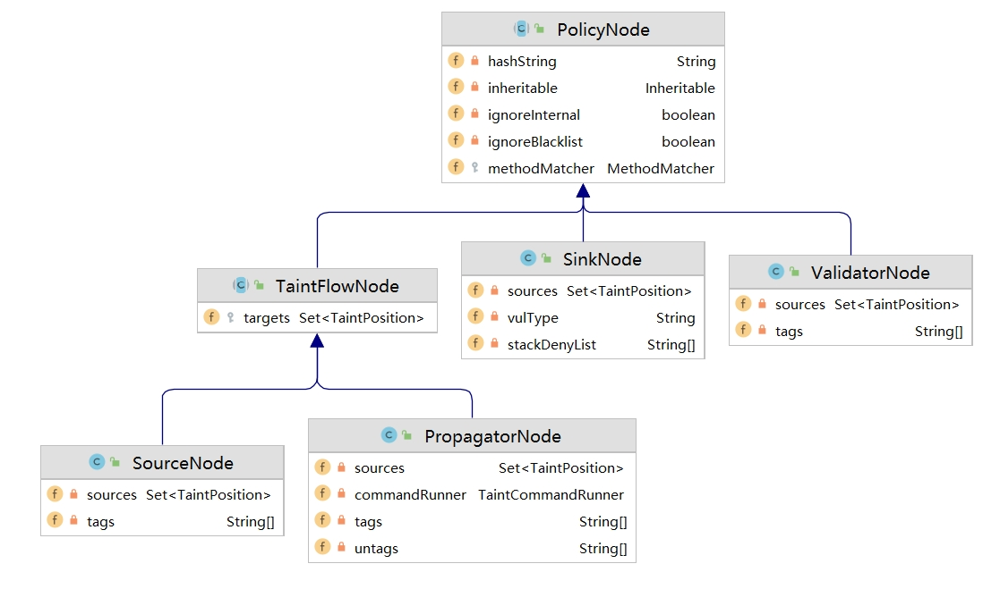

####  2.1.3.继承策略类型 Inheritable

继承策略类型，包括 

- SUBCLASS ：只关注该类的子类
- SELF ：只关注该类本身
- ALL：关注 SUBCLASS 、SELF 两种情况

```java
public enum Inheritable {
    ALL("all"),
    SUBCLASS("true"),
    SELF("false"),
```

在读取插桩策略配置后，根据其Inheritable类型选择性地将类名放到 classHooks、ancestorClassHooks 中：

```java
public class Policy {
    private final Set<String> classHooks = new HashSet<String>();
    private final Set<String> ancestorClassHooks = new HashSet<String>();
```


#### 2.1.4.类方法匹配模型 SignatureMethodMatcher

类方法匹配的数据模型，存储的类名 、方法名、方法参数类型：

```java
public class SignatureMethodMatcher implements MethodMatcher {
    private final Signature signature;
... ...    
}

public class Signature {
    private String signature; // className+methodName+parameters
    private String className;
    private String methodName;
    private String[] parameters;

    public Signature(String className, String methodName, String[] parameters) {
        this.className = className;
        this.methodName = methodName;
        this.parameters = parameters;
    }
... ...
}
```

#### 2.1.5.跟踪点类型 TaintPosition

跟踪点，即我们钩挂的方法 sink/source/propagator 中“危险”的数据源，可能是对象字段、方法参数等。

跟踪点TaintPosition，这里的代码写的让人摸不着头脑，但是细细阅读理解后可以总结下来：

- 方法的跟踪点关注的类型分为3种，分别为 this对象、方法入参、方法的返回，分别用 OBJECT、RETURN、PARAM_PREFIX来标记
- 跟踪点的配置内容可以写作如下形式  **`O | R | P1,2,3`** ，通过相关方法解析后，该形式可得到5个TaintPosition

```java
public class TaintPosition {
    public static final String OBJECT = "O";
    public static final String RETURN = "R";
    public static final String PARAM_PREFIX = "P";

    public static final String OR = "\\|";

    public static final TaintPosition POS_OBJECT = new TaintPosition(OBJECT);
    public static final TaintPosition POS_RETURN = new TaintPosition(RETURN);

    public static final String ERR_POSITION_EMPTY = "taint position can not empty";
    public static final String ERR_POSITION_INVALID = "taint position invalid";
    public static final String ERR_POSITION_PARAMETER_INDEX_INVALID = "taint position parameter index invalid";

    private final String value;
    private final int parameterIndex;

```


#### 2.1.6.字符串跟踪操作 TaintCommand

但我们关注的 数据对象  发生字符串操作，如 拼接、插入 时，dongtai iast会标记其在新字符串内容中的相应位置，该功能通过 ThreadLocal、TaintRanges 及这里的 TaintCommand协作进行完成。

TaintCommand ，标记该钩挂点触发时，需要进行何种操作来 进行 标记操作，以保持对字符串位置的准确跟踪。这个跟踪功能的意义，目前看来只是用于最后输出告警时给用户展示。

```java
public enum TaintCommand {
    KEEP,
    APPEND,
    SUBSET,
    INSERT,
    REMOVE,
    REPLACE,
    CONCAT,
    OVERWRITE,
    TRIM,
    TRIM_RIGHT,
    TRIM_LEFT,
```

通过switch case语句找到对应的算法，通过对应的算法来完成该跟踪操作，这一系列的算法应该是项目最复杂的地方：

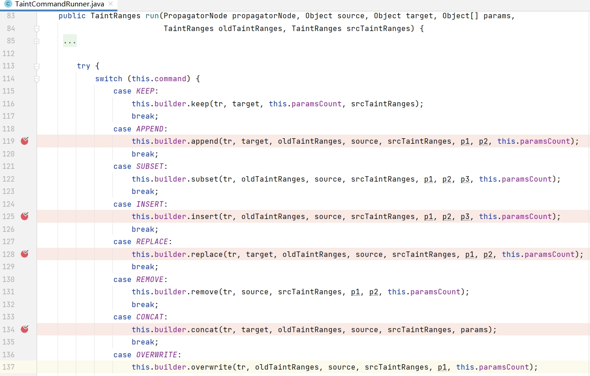

### 2.2. 插桩（查找定位）

#### 2.2.1.ASM基础知识

&emsp;&emsp;说一下ASM的基本使用，方便理解本节内容。

&emsp;&emsp;如何通过ASM框架修改字节码，直接体现在前10行代码中，我们通过自定义的 ClassVisitor 来处理该类，后续在ClassVisitor中可以获取到该类的各个方法，所以通常修改字节码的逻辑是：获取到一个类的字节码、类名后，判断该类是否是我们感兴趣，如果是则创建ClassReader并传入该类的字节码，后续通过 ClassVisitor.visitMethod 来判断各个方法中哪个是我们感兴趣的，如果是则返回我们自定义的 MethodVisitor/AdviceAdapter，而最终通过MethodVisitor/AdviceAdapter来描述如何修改方法的字节码。

```java
{
        public static byte[] transform(byte[] classBytes) {
        ClassReader classReader = new ClassReader(classBytes);
        ClassWriter classWriter = new ClassWriter(classReader, ClassWriter.COMPUTE_MAXS | ClassWriter.COMPUTE_FRAMES);
        ClassVisitor classVisitor = new MyClassVisitor(classWriter);

        classReader.accept(classVisitor, ClassReader.EXPAND_FRAMES);
        return classWriter.toByteArray();
    }
}


    public static class MyClassLoader extends ClassLoader {
        public Class<?> defineClass(String name, byte[] b) {
            return defineClass(name, b, 0, b.length);
        }
    }


    public static class MyClassVisitor extends ClassVisitor {

        public MyClassVisitor(ClassVisitor cv) {
            super(Opcodes.ASM5, cv);
        }

        @Override
        public MethodVisitor visitMethod(int access, String name, String desc, String signature, String[] exceptions) {
            // 在访问方法时，创建一个新的MethodVisitor
            MethodVisitor mv = cv.visitMethod(access, name, desc, signature, exceptions);
            // 在方法体前插入一段代码
            return new MyMethodVisitor(mv);
        }
    }

    public static class MyMethodVisitor extends MethodVisitor {

        public MyMethodVisitor(MethodVisitor mv) {
            super(Opcodes.ASM5, mv);
        }

        @Override
        public void visitCode() {
            // 在方法体前插入一段代码
            mv.visitFieldInsn(Opcodes.GETSTATIC, "java/lang/System", "out", "Ljava/io/PrintStream;");
            mv.visitLdcInsn("Hello, ASM!");
            mv.visitMethodInsn(Opcodes.INVOKEVIRTUAL, "java/io/PrintStream", "println", "(Ljava/lang/String;)V", false);
            super.visitCode();
        }
    }


}

```


#### 2.2.2.DispatchPlugin接口类

从`IastClassFileTransformer#transform`方法走到本方法前还有一系列逻辑，包括一系列的黑名单过滤（项目相关包名前缀）、忽略项目agent线程触发的类加载、canHook中忽略动态代理类 lambda类等，这里就不详细说明。

代码中针对不同类别的类会专门使用相应的ClassVisitor来修改其代码，DispatchPlugin.dipatch()接口方法负责获取该类名的ClassVisitor，DsipatchPlugin有多个实现类：

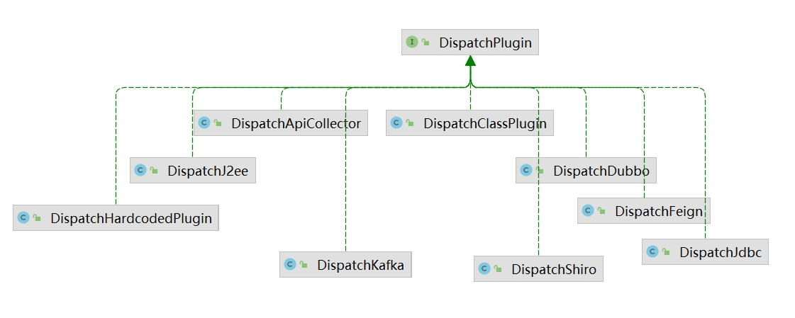

多个不同的DispatchPlugin会被封装在 List类型的plugins对象中，这里需要注意，由于是数组，放入的顺序十分重要，因为某个DispatchPlugin先返回了新的ClassVisitor则 initial 中的 for循环 会被 break，最后 return 该值。我们关注这里的 DispatchJ2ee、DispatchClassPlugin

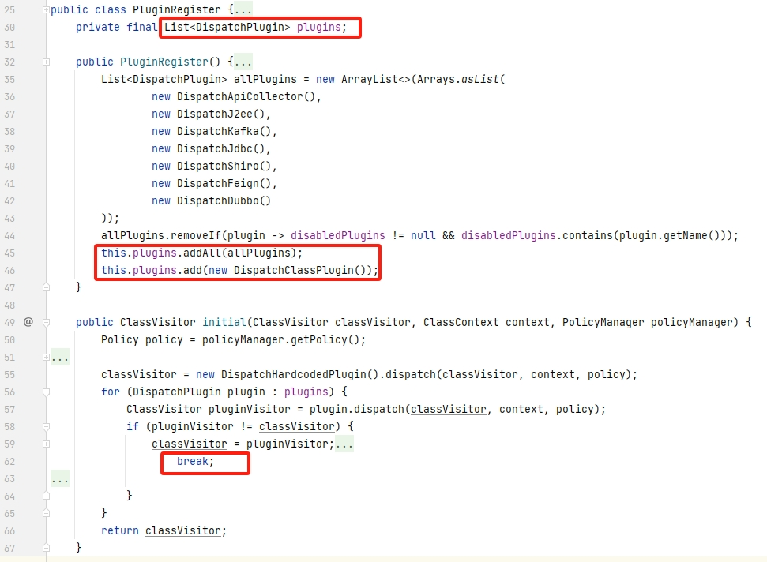

#### 2.2.3.DispatchJ2ee

&emsp;&emsp;部分web中间件的钩挂策略并未显示地展示出来，而是以代码形式混合在 DispatchJ2ee 等代码中，相关代码看着让人头疼，所以这里也不过多说明，抽离其中关键要素展示给大家看看即可。

&emsp;&emsp;依赖关系图：DispatchJ2ee在找到HTTP流量入口或输出方法后，返回相应的 AdviceAdapter 进行插桩，通过`ServletDispatcherAdviceAdapter`埋入的桩还起到标记“起始点”的功能，如果未有起始点标记则当前线程不启动IAST策略。

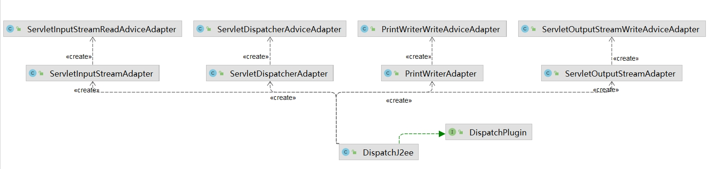

```
<init>:24, ServletDispatcherAdapter (io.dongtai.iast.core.bytecode.enhance.plugin.framework.j2ee.dispatch)
dispatch:34, DispatchJ2ee (io.dongtai.iast.core.bytecode.enhance.plugin.framework.j2ee.dispatch)
initial:57, PluginRegister (io.dongtai.iast.core.bytecode.enhance.plugin)
transform:190, IastClassFileTransformer (io.dongtai.iast.core.bytecode)
```


#### 2.2.4.DispatchClassPlugin

DispatchClassPlugin负责实现上文所说的**插桩策略** ：

- 下图代码值得注意的是，这里根据 className、ancestors获取到了集合 matchedClassNameSet，这是由于一个类可能同时命中多个插桩策略（子类、多接口实现、或是插桩策略的类就是父子关系）
- 最后构造一个 ClassVisit 对象并返回，在ASM后续解析该Class的字节码过程中，会调用 ClassVisit#visitMethod 来处理遇到的类方法事件。 

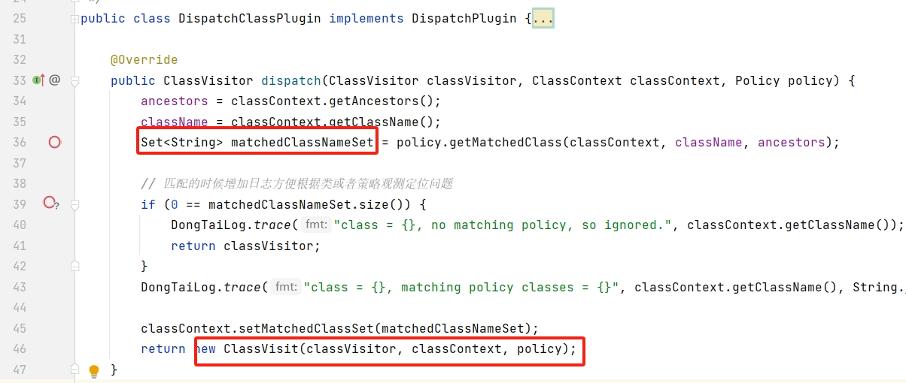

visitMethod：忽略JDK<=6的字节码方法，对于已经被本agent修改过的方法也忽略掉，这里也做了一些过滤（blacklist/ignoreBlacklist/ignoreInternal），这个过滤实际上没有什么作用，至少笔者看到的是这样的。可以 看到，最后通过 lazyAop() 来获取实际的 MethodVisitor 对象。

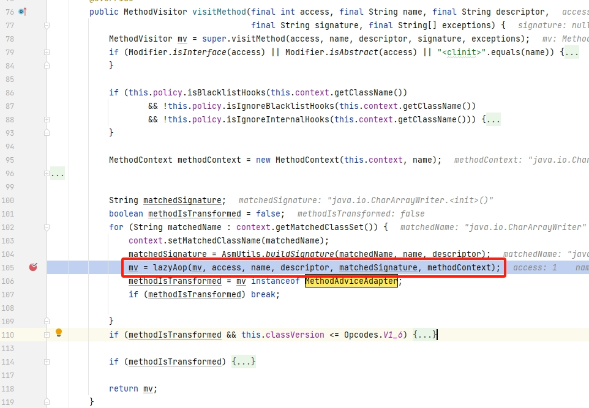

lazyAop：获取命中的 PolicyNode 集合后，返回 MethodAdviceAdpter实例，构造函数的参数包括该集合对象

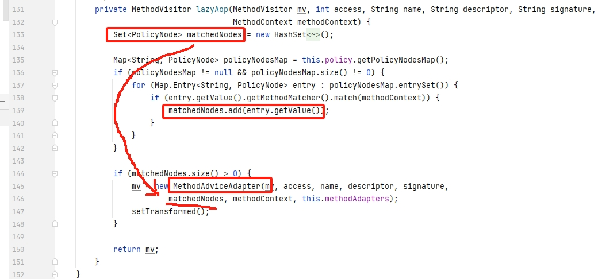

### 2.3.插桩（执行修改）

`ClassVisitor#visitMethod`返回的`MethodVisitor`负责执行修改方法字节码。

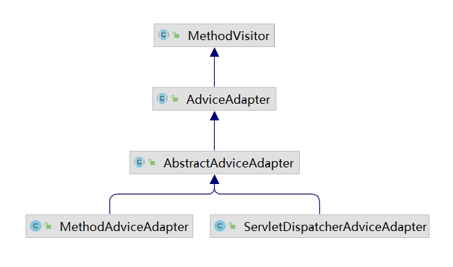

#### 2.3.1.起始点与终点

&emsp;&emsp;`ServletDispatcherAdviceAdapter`在Web中间件流量入口方法前后进行埋点，修改字节码插入Spy实例对象的 `collectHttpRequest `、`leaveHttp`，collectHttpRequest方法的关键功能之一就是标记IAST流程的开始，leaveHttp方法种则会负责上报本次流程生成的告警。

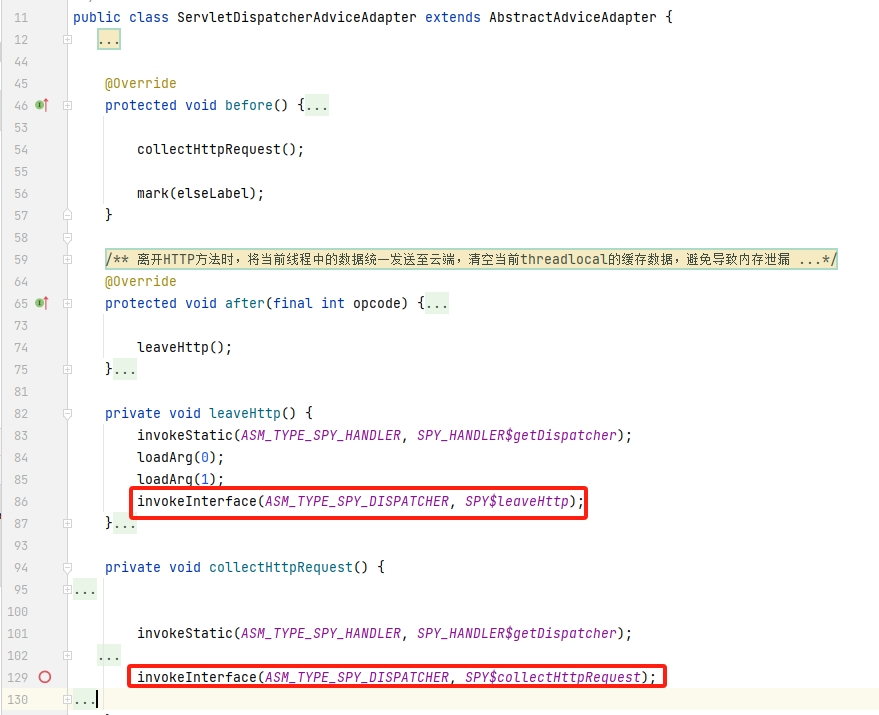

#### 2.3.2.流程跟踪

我们在后面的“IAST功能实现”再讲述流程跟踪中的source/progator/sink，这里对与此有关的插桩代码进行分析。

下面看一张接口关系图，有如下说明：

- 根据前面所说，MethodAdviceAdapter负责修改方法的字节码
-  `MethodAdviceAdapter` 中 通过不同的 MethodAdapter 对 不同的钩挂点 执行字节码的修改
- `MethodAdviceAdapter`遍历这四种MethodAdapter来执行插桩操作，就是说一个 钩挂点 的可能存在 4次的“桩”调用

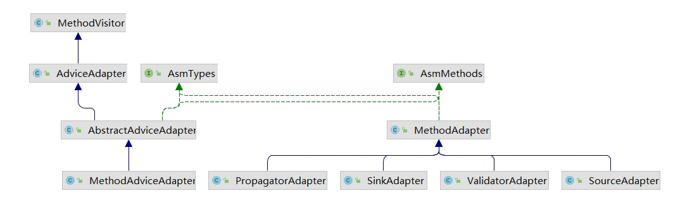

MethodAdviceAdapter遍历4种MethodAdapter来执行插桩操作：

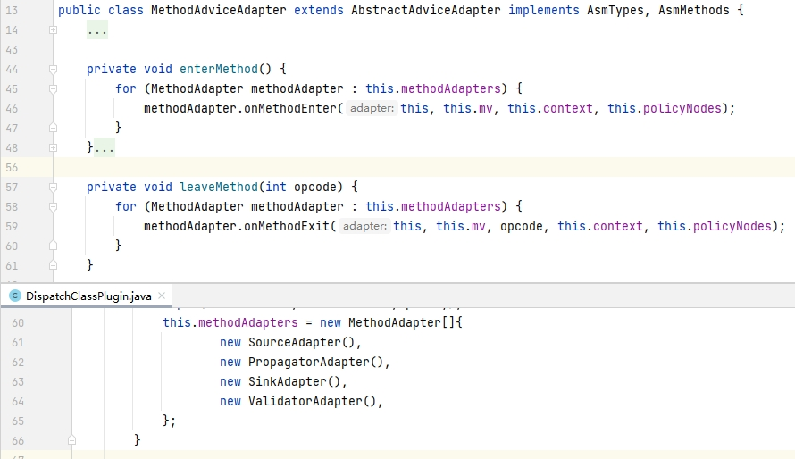

实际上，这4个MethodAdaptor最终都会通过 `AbstractAdviceAdapter#trackMethod ` 在字节码插入 collectMethod 方法 

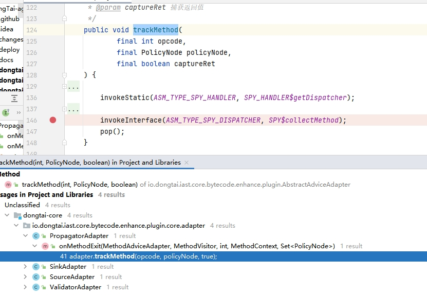

## 3. IAST功能实现

### 3.1. 梳理数据类型

&emsp;&emsp;这里先梳理实现IAST功能中重要的数据类型，理解它们的业务目标，有此基础下理解代码流程就轻而易举了。

#### 3.1.1. ThreadLocaal

&emsp;&emsp;IAST功能的实现过程中，会依赖一系列的ThreadLocal数据类型对象来保存数据流程中需要关注的对象、数据，这里先介绍以下者几个ThreadLocal类型。

- TaintRangesPool 对应字段为 EngineManager.TAINT_RANGES_POOL：存放Map，钩挂点（source/propagator）下游出口对象的哈希映射到 TaintRanges
- IastTaintHashCodes 对应字段为 EngineManager.TAINT_HASH_CODES：存放Set，钩挂点（source/progator）下游出口对象的哈希 的集合
- IastTrackMap 对应字段为 EngineManager.TRACK_MAP：两个作用
  - 限制线程的IAST功能，当跟踪点数量达到为5000则污点跟踪功能不启用，数量值对应为 REPORT_MAX_METHOD_POOL_SIZE  
  - convertToReport中使用，上报跟踪流程中的 source/propagator/sink 事件，python后台据此生成告警
- SCOPE_TRACKER 功能之一就是当 TRACK_MAP 超额时，记录 overCapacity 布尔值为true，后续可以直接从这里判断

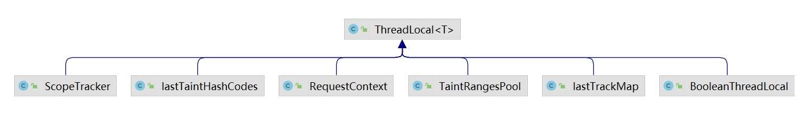

#### 3.1.2. TaintRanges

TaintRanges：

- 该对象会与出口点数据对象绑定，即为出口点对象打上一系列TaintRange；而这个绑定操作实际是通过 TAINT_RANGES_POOL 映射对象哈希到TaintRanges来实现的。

TaintRange：

- name表示tag，tag的相关作用见“标签tags”
- 字符串range，即通过start、stop表示当前对象数据实际来自上一个输入（source/propagator）的部分，方便后面生成告警时，标记实际来源用户的数据

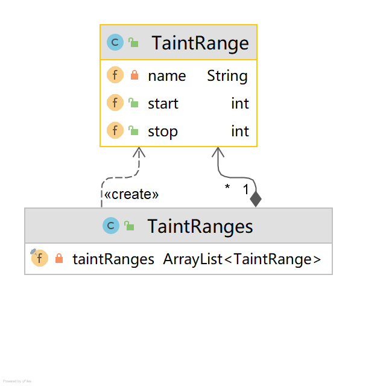


#### 3.1.3. 标签tags

&emsp;&emsp;当本文说到“返回的数据对象”指钩挂点方法针对 入口数据 进行修改，方法调用者在执行该方法后使用该方法返回值进行后续操作，当然，实际有的情况可能是 方法为void，后续通过引用类型来获取修改后的值，本文这里为了方便描述，统一使用“返回的数据对象”来进行描述。

tag的作用

- source/propagator 钩挂点触发时，会进行会根据情况创建 TaintRanges 对象并封装着TaintRange，TaintRange的name字段就是 tag 值

- source钩挂点自身配置种包含tags字段（参考 插桩策略 一节），为出口数据打上相关标签，部分漏洞类型依赖此项，如XSS漏洞要求相关对象带有 XSS标签，即source点需带有 XSS标签

- 编码类型的tag（propagator ）：相关编码类型的钩挂点触发时（base64/HTML Entity/...），钩挂点返回的数据对象绑定的 TaintRanges 添加该tag记录

- 解码（propagator ）：相关解码钩挂点触发时，进行untag操作，即去除1次该tag


```java
 // VulnType => List<TAGS, UNTAGS>
    private static final Map<String, List<TaintTag[]>> TAINT_TAG_CHECKS = new HashMap<String, List<TaintTag[]>>() {{
        put(VulnType.REFLECTED_XSS.getName(), Arrays.asList(
                new TaintTag[]{TaintTag.UNTRUSTED, TaintTag.CROSS_SITE},
                new TaintTag[]{TaintTag.BASE64_ENCODED, TaintTag.HTML_ENCODED, TaintTag.LDAP_ENCODED,
                        TaintTag.SQL_ENCODED, TaintTag.URL_ENCODED, TaintTag.XML_ENCODED, TaintTag.XPATH_ENCODED,
                        TaintTag.XSS_ENCODED, TaintTag.HTTP_TOKEN_LIMITED_CHARS, TaintTag.NUMERIC_LIMITED_CHARS}
        ))
```

#### 3.1.4. 污点类型

功能实现上，污点类型有3种

- SAFE_CHECKERS：
  - 数据来源于source后，检查该点对象的相关选项开启情况、版本情况
- TAINT_TAG_CHECKS：
  - 该字段的数据类型为HaspMap<String,List<TaintTag[]> ，key值为漏洞类型，value值的 value[0] 表示 污点对象 需要带有的标签， value[1] 则表示 污点对象不能携带的标签
  - 数据来源于source后，如XSS漏洞的判断，需要污点数据带有 untrusted、xss标签，且不带有一系列的编码标签（不能经过编码）
- SOURCE_CHECKERS：
  - 不检查tag，对污点对象的相关敏感字段数据进行一一排查，查看它们是否来自source（是否命中TAINT_HASH_CODES）
  - 这个的意义应该是，有的污点的数据来源的解析过程十分复杂，不好理清楚其解析过程，所以需要在最后的污点处（结果处）详细地排查

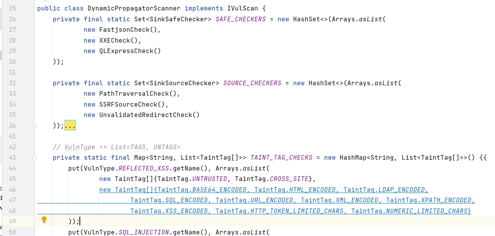

#### 3.1.5. MethodEvent

&emsp;&emsp;被钩挂的方法触发的触发SpyDispatcherImpl.collectXXXX方法，collect方法开头会封装一个MethodEvent，相关有用字段含义如下：

- policyType，钩挂点类型 source 、sink ..
- originClassName，当前方法所在类的类名
- matchedClassName，匹配到的插桩策略的类名
- parameterInstances 钩挂点的入参对象
- objectInstance，当前this对象
- objectValue，当前this对象的字符串值，可忽略

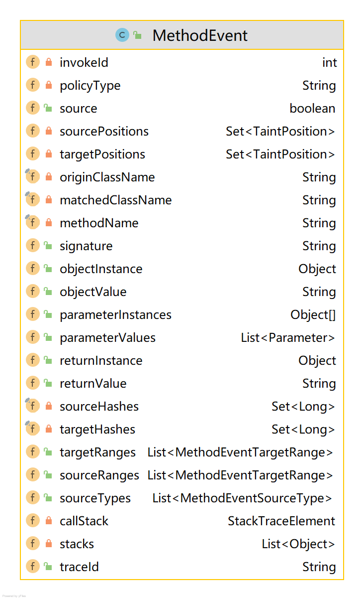


### 3.2.事件分发

&emsp;&emsp;根据前文所说，被钩挂的方法执行完成并在退出时会调用 collectMethod 方法，这里会针对不同钩挂点封装MethodEvent事件，并调用对应的 Impl 来处理，各类型事件的处理者如下代码所见，分别有SourceImpl、PropatatorImpl、SinkImpl，由于Validator类型实际没有看到使用，所以后续不作介绍。

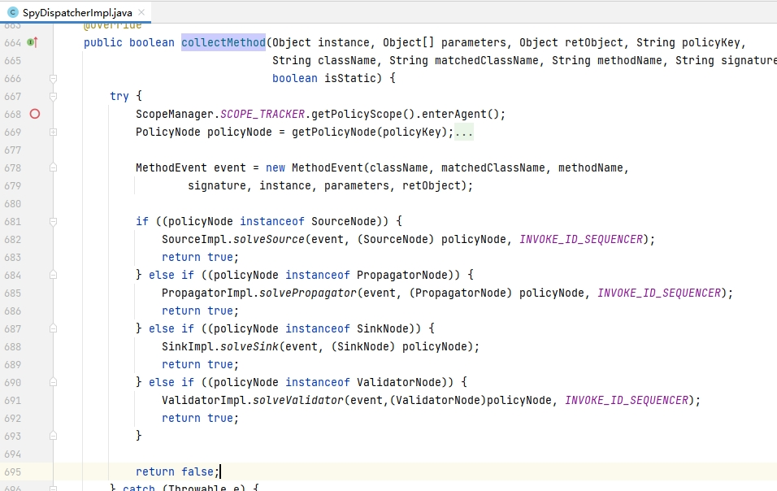

### 3.3.聚合说明功能机制

&emsp;&emsp;这里对一些功能函数或机制进行“聚合式”地说明，在后续单独的sink/source中就不必费事说明这些东西了。

#### 3.3.1.哈希

&emsp;&emsp;哈希，是项目功能实现中一个简单但贯穿始终而十分重要的功能函数，这里有必要进行一番说明。

&emsp;&emsp;`java.langObject#hashCode` 没有重写的情况下，获取的值和 `System#identityHashCode` 一样，该值为内存地址转换为int值所获得的，即该值与对象内存地址有关。而`String`重写了`hashCode`方法，该方法获得的值只与字符串内容，而字符串类型十分重要，所以下面的代码中针`String`类型的哈希获取做了调整，其为 内存地址与字符串值 关联的值。与String情况类似的可能还有Map等，所以项目代码几处都有此类哈希逻辑。

&emsp;&emsp;简而言之，项目对于数据流的传播跟踪思想为尽量关注 引用。 

```java

    public static Long getStringHash(Object obj) {
        long hash;
        if (obj instanceof String) {
            hash = TaintPoolUtils.toStringHash(obj.hashCode(), System.identityHashCode(obj));
        } else {
            hash = System.identityHashCode(obj);
        }
        return hash;
    }
    
    public static Long toStringHash(long objectHashCode, long identityHashCode) {
        return (objectHashCode << 32) | (identityHashCode & 0xFFFFFFFFL);
    }
```

#### 3.2.2.拆分对象

&emsp;&emsp;本小节的“拆分对象”指，对于数据流跟踪的上下游对象，其可能不是一个简单的数据类型，为了更加准确地跟踪其内部更有价值的数据对象，所以需要获取其内部有价值的对象来进行数据跟踪。拆分对象后得到的“颗粒度对象”被哈希后的值 放入`TAINT_RANGES_POOL` 中，用于后续事件触发时判断 上游数据是否在该 TAINT_RANGES_POOL 中，如在则说明上游数据是 untrusted ，即有用的。 

&emsp;&emsp;实现 拆分对象 功能的方法有 `TaintPoolUtils#trackObject` 与 `IastTaintHashCodes#addObject`，前者被source类型事件所使用，后者被 propagator事件 所使用。开发者使用两个拆分方式可能是认为 source 的拆分需要细致点，propagator则通常不需要那么复杂。但逻辑上业务功能相似的代码，开发者却让他们乱糟糟放在不同地方，也是让人头疼。

&emsp;&emsp; `TaintPoolUtils#trackObject` 的实现有递归调用算法，代码中为此设置了最大深度 10。代码中为数组、迭代、字典、集合等数据类型都一一做了判断并进行处理，当处理到不在系列数据类型中时(else)，将其添加到 TAINT_RANGES_POOL 中。trackObject 方法中还有创建系列标签的功能（179-195），这点在后面的 source章节 中讲述

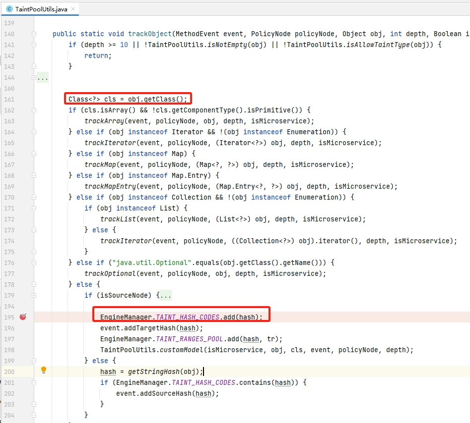

&emsp;&emsp;前文的数据类型有提到 TAINT_RANGES_POOL 为 IastTaintHashCodes 的实例化对象，所以下面的 this.add(..) 也是向 TAINT_RANGES_POOL 添加数据，而代码中存在递归操作 this.addObject(...) 。从代码逻辑上来看，也是尽量希望获取与对象引用有关系的哈希值来放入数据集合中。

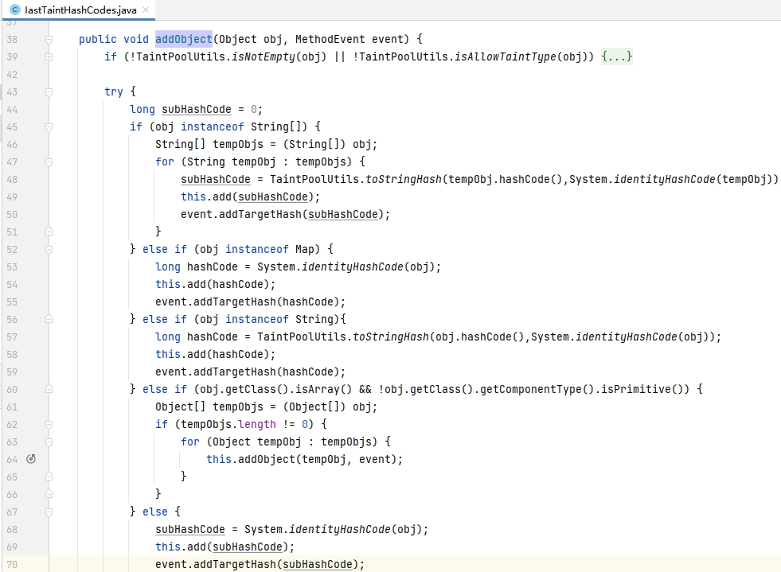

#### 3.3.3.起始点

&emsp;&emsp;前面有讲到“起始点”，实际实现为，如果前面没有进入HTTP入口，当前线程中的数据对象就没有初始化，sink/progator触发时则不会继续后续流程。

起始点的初始化：

```java
 // io.dongtai.iast.core.EngineManager#enterHttpEntry
 		REQUEST_CONTEXT.set(requestMeta);
        TRACK_MAP.set(new HashMap<Integer, MethodEvent>(1024));
        TAINT_HASH_CODES.set(new HashSet<Long>());
        TAINT_RANGES_POOL.set(new HashMap<Long, TaintRanges>());
```

在事件分发前，如果相关数据没有初始化则退出

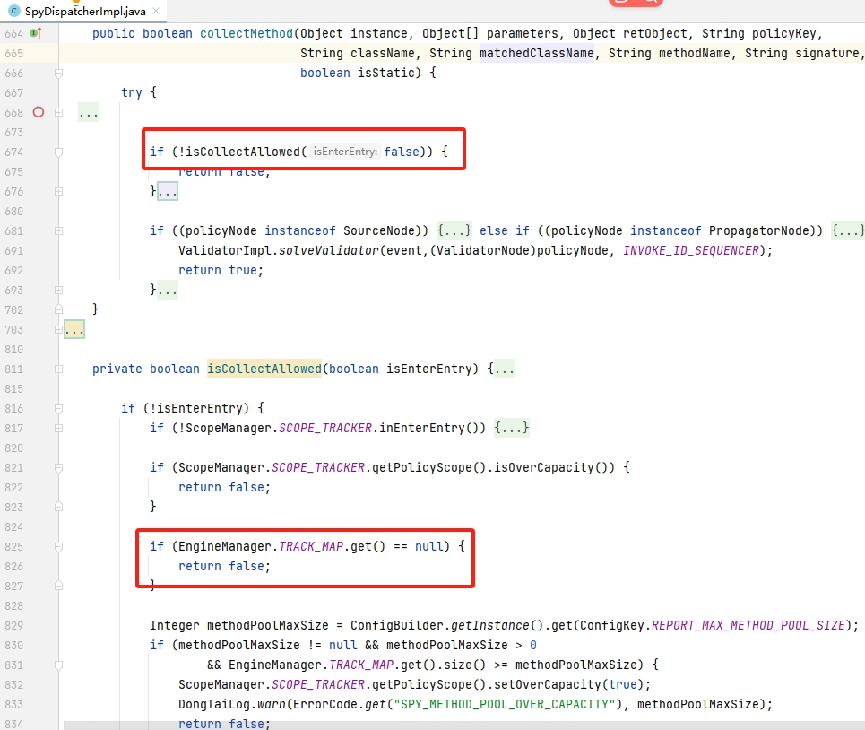

#### 3.3.4.跟踪点数量限制

&emsp;&emsp;在“梳理数据类型”中我们有讲解到TRACK_MAP的跟踪点限制，可以看到，在数据分发前会检查是否超额：

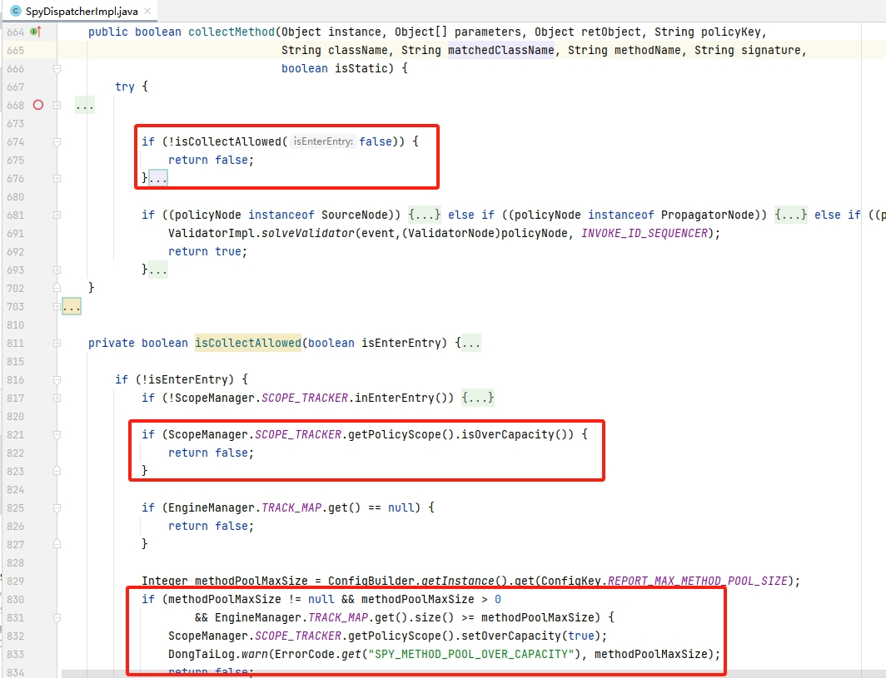

source/propagator 的跟踪点会增加 TRACK_MAP 的数量：

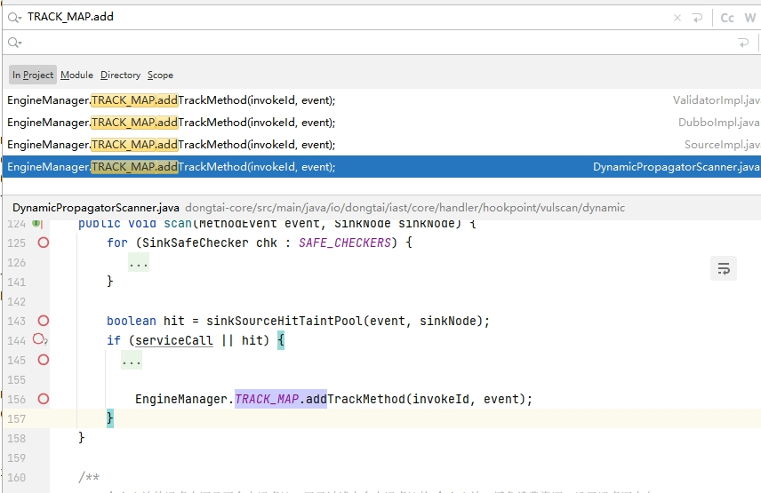

### 3.4.source

&emsp;&emsp;source类型的处理关键点就是将该钩挂点的方法的返回值传入前文所说的 trackObject，进行对象拆分，最后将数据添加到  TAINT_RANGES_POOL  中进行跟踪。

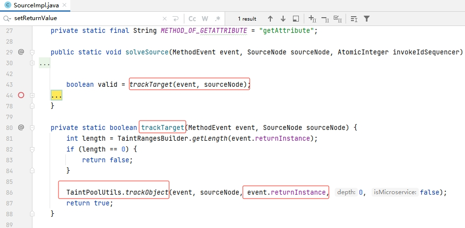

&emsp;&emsp;在拆分对象记录哈希的同时，还会保持哈希到TaintRanges 的映射关系，插桩策略配置中带有 tags 字段，这里同时保存该 tags ，并记录字符串偏移。

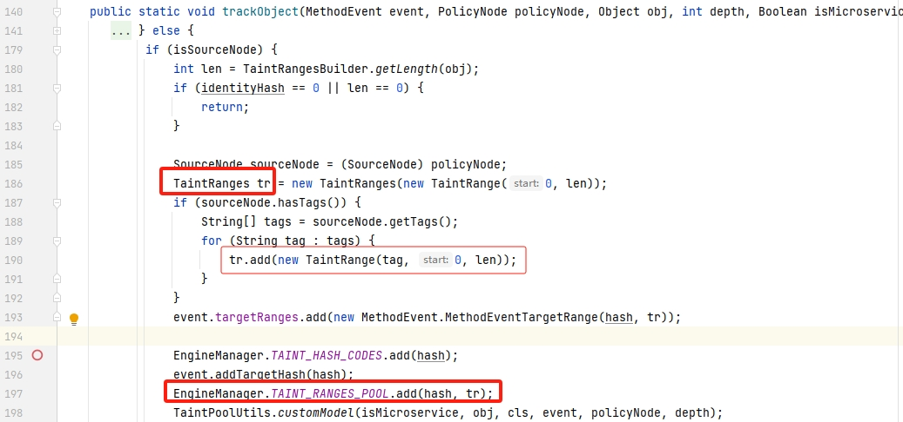

### 3.5.propagator

&emsp;&emsp;对于传播者，或是说流中继，其存在上游与下游，因此对于上游，我们需要确认其数据来源是否为 不可信的；对于下游，我们则使用类似source的处理，将下游数据放入 TAINT_RANGES_POOL  即可。

#### 3.6.上游

&emsp;&emsp;下图代码可以清晰了解上游数据的处理逻辑：这里的 `isObject()` 表示 this 、`isParameter()`表示方法入参，通过 poolContains 判断上游数据来源于不可信后，hasTaint则置为fasle，接着就到我们的下游数据处理，即 setTarget(....)  方法。

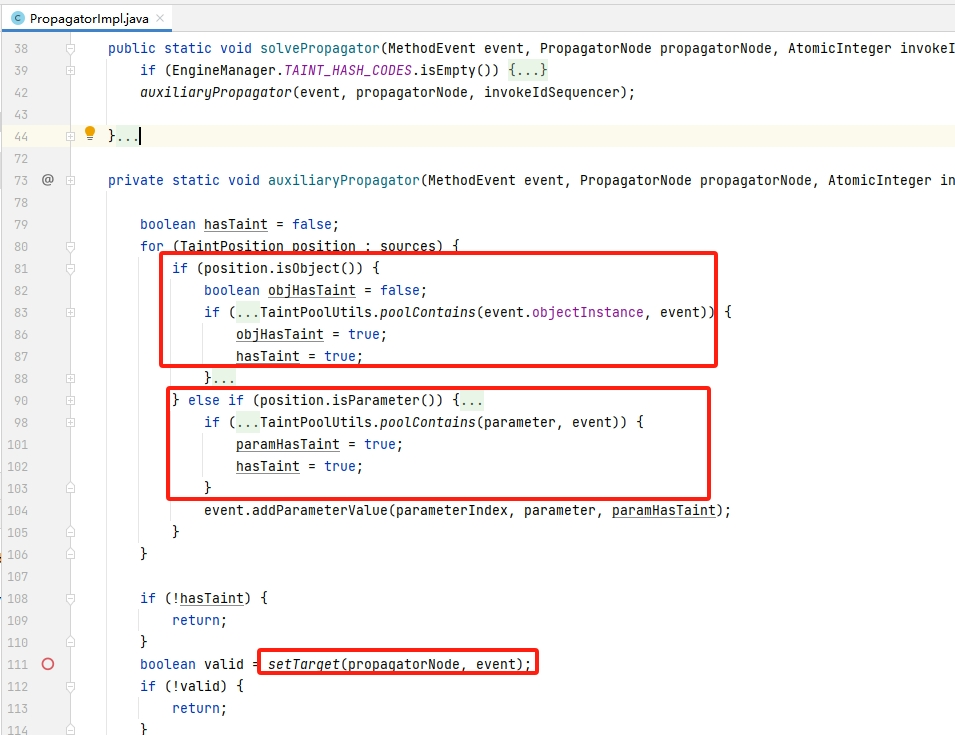


#### 3.7.下游

&emsp;&emsp;下游数据的处理主要多了根据钩挂策略来判断下游数据出口从而获得出口数据对象（但这里的代码比较冗余..），关键点还是添加数据集的操作 addObject ，前面的“拆分对象”对此已有提及，这里就不再叙述。

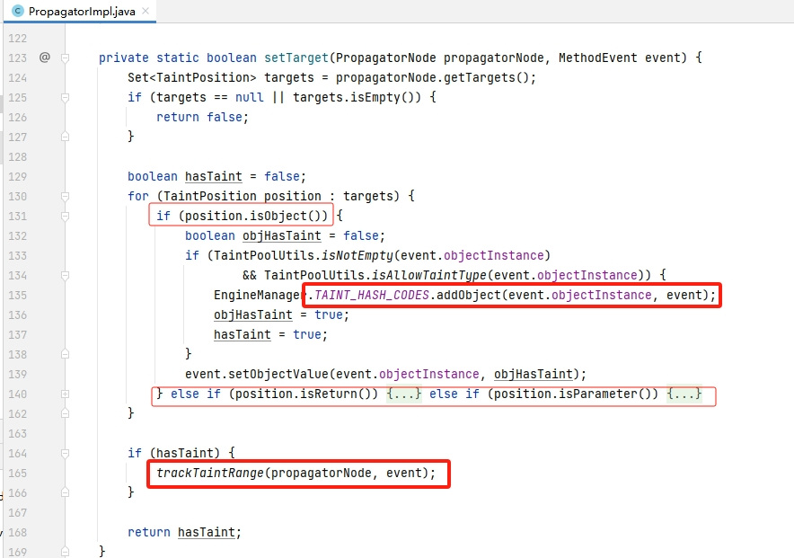

&emsp;&emsp;整个项目最复杂的函数就是trackTaintRange，该方法的功能与source末尾的的功能一致，都是记录哈希到TaintRanges的映射关系。

&emsp;&emsp;下图代码collaspe冗长的逻辑分支，这样情况下代码逻辑较为清晰了： srcTaintRanges 为入口流量生成的，oldTaintRanges为出口流量生成的。开头还有一个 TaintCommandRunner，从插桩策略配置的 command 生成的，前文也有讲到TaintCommand，用于追踪记录字符串偏移情况，这里就不赘述。而通过 run(..) 方法得到的新 TaintRanges 即 tr变量 为进行了字符串偏移记录的，其后将所有标签都进行记录（addAll），最后也是保持映射关系到 TAINT_RANGES_POOL  。

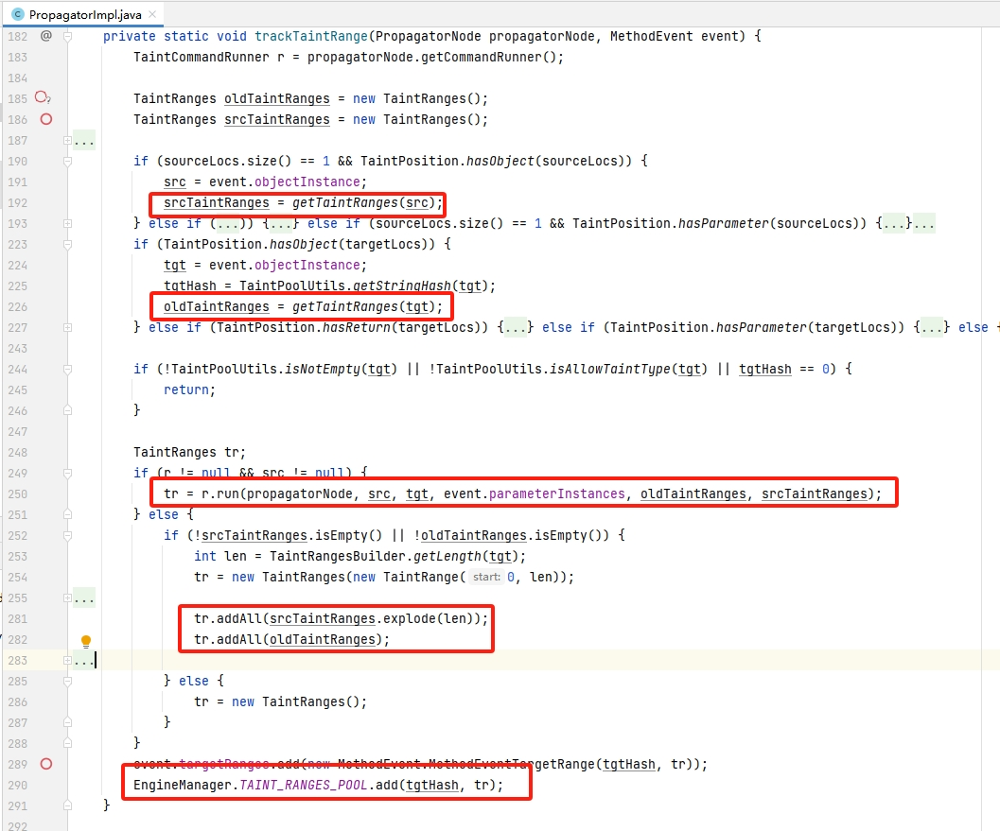

### 3.8.sink

#### 分析

&emsp;&emsp;前面流程分支中，对其中的弱随机数、弱哈希等情况进行处理，我们主要关注这里的 动态数据传播。

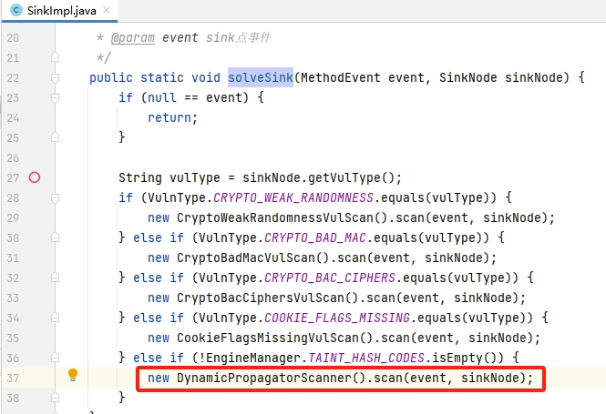

&emsp;&emsp;动态数据的传播中，处理了我们前面所说的三种污点类型，包括  SAFE_CHECKERS 、SOURCE_CHECKERS 、TAINT_TAG_CHECKS，我们说说TAINT_TAG_CHECKS。

&emsp;&emsp;下面代码中的TAINT_TAG_CHECKS 是map类型， 在前面的 3.1.3 中我们对其进行了详细说明，这里不赘述。

两个红框概况了tag类型污点检查的整体关键逻辑

- 确保上游数据来源有记录，并且获取对应的 TaintRanges，即该数据的标签情况
- 检查标签是否符合该漏洞类型预定义的情况，即required的标签须有，disallowed的标签不能有

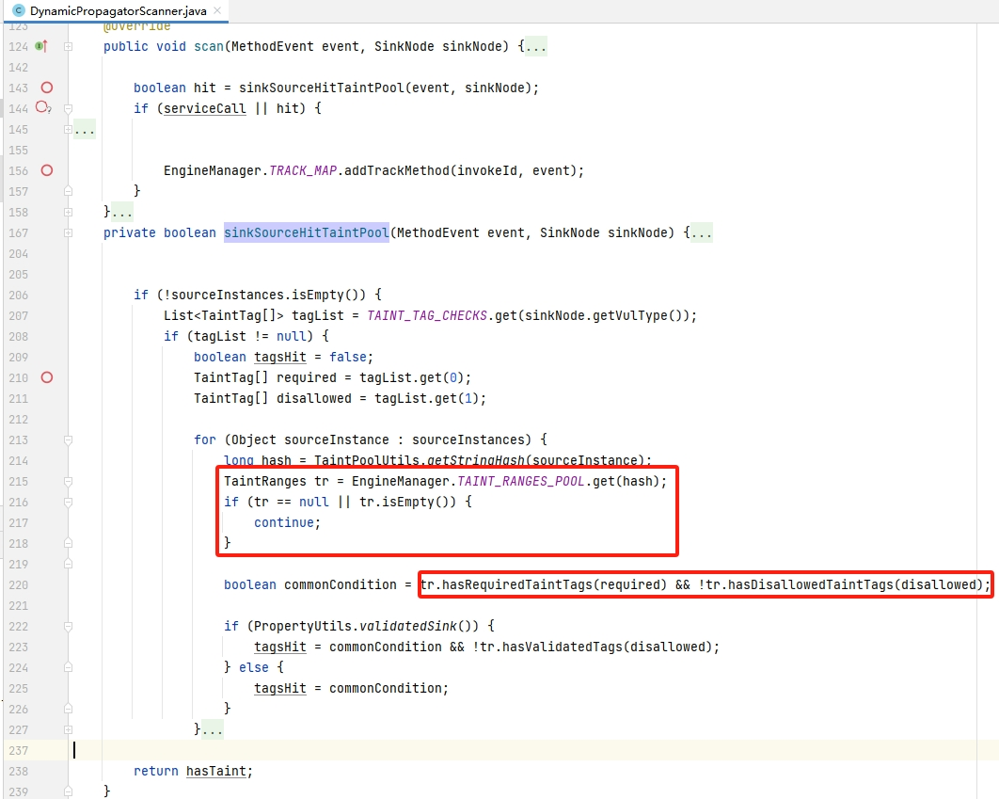


#### 上报与图分析

&emsp;&emsp;在流程“终点”，会通过 `GraphBuilder#buildAndReport` 方法通过线程池启动新线程来向后台服务上报数据，数据内容包括本次线程的 TRACK_MAP 中记录的数据，涵盖 source/propagator/sink 。

&emsp;&emsp;从分析来看， 由于部分sink没有检查 上游数据来源情况，如 SAFE_CHECKERS 中的 xxe 等，所以从这点上来看，后台服务器的图分析是有用的，但是对于 TAINT_TAG_CHECKS 的污点类型则看起来是没有意义的。当然，图分析可能还有前端展示的价值，但前端展示链条似乎也不必图分析。另外笔者对SAFE_CHECKERS 不检查上游数据感到奇怪。

&emsp;&emsp;笔者也没继续了解后台python代码中的图分析，我粗略认为为找一条source到sink的通路即可，潜意识认为价值不大，暂未深入理解。

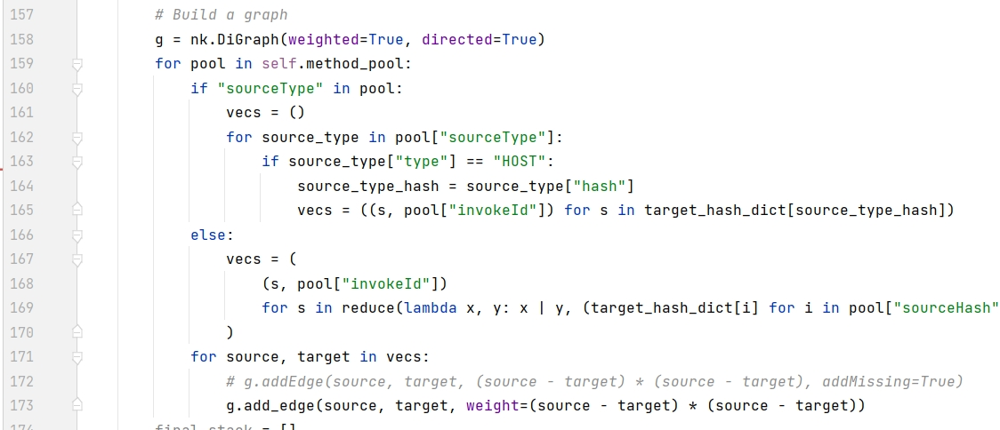

## 4.补充

#### shadow

&emsp;&emsp;对于lib包可能引起的冲突问题，通常有两种做法，本项目则通过shade插件来重命名三方库。

```xml
<shade-prefix>io.dongtai.iast.thirdparty</shade-prefix>

            <plugin>
                <groupId>org.apache.maven.plugins</groupId>
                <artifactId>maven-shade-plugin</artifactId>
                <version>3.1.0</version>
                <executions>
                    <execution>
                        <phase>package</phase>
                        <goals>
                            <goal>shade</goal>
                        </goals>
                        <configuration>
                          ... ...
                            <relocations>
                                <relocation>
                                    <pattern>org.apache</pattern>
                                    <shadedPattern>${shade-prefix}.org.apache</shadedPattern>
                                </relocation>
```


## 5.总结

&emsp;&emsp;有人认为项目的sink规则设置不合理，不够底层，但理解了项目逻辑后发现这么做是有其道理的：项目希望确保sink点的数据源为来自source的，而如果sink点过于底层，这也意味着中间经过更多的复杂处理，这样就无法跟踪数据对象，如果底层sink点的数据源为中间过程生成的新对象数据，则不符合项目 TAINT_TAG_CHECKS 污点类型的思想 。

项目代码本身的一些问题：

- 策略混合，没有做到统一分离：一方面有插桩策略，DispatchPlugin等等又设置了复杂的需要钩挂的目标类策略，且又没有显示地体现出来，一团乱，需要理解整个代码才能发现，另外这种做法也在项目持续维护中容易出错、增加极大维护成本
- 基本没有注解，需要读者猜测相关业务逻辑才能理解相关代码
- 项目很多似乎是没有用的代码，一方面难读，增加理解成本，另外一方面让人十分困惑
- 可能是笔者经验不足，不太理解，真的需要编写这么复杂的逻辑来实现这些功能，比如众多的DispatchPlugin与Adapter，看得头疼
- 某些地方存在隐藏BUG，如 SSRF漏洞中检测中的`addSourceType`中的`hit`没有赋值 ...

该IAST缺点（当然，没有产品做到完美）：

- source类型单一，对于二阶类型的输入的未处理（也很麻烦）
- source验证能力不够强
- 灰盒遗漏，好比一颗多叉树，业务方的正常业务请求就只走其中的部分分叉逻辑
- 误报问题与业务代码有耦合关系，消耗人力专门解决
- 无法直接覆盖逻辑漏洞（这类问题还是需要主动发包）
- 感知不到隐藏的后台接口（或是未主动识别）
- json等内容格式未处理

&emsp;&emsp;该开源项目也为我们提供了“全链路跟踪式IAST”的实践思路，后续合理地实践验证方式应该是对各项漏洞进行详细测试，继续深入了解此框架下的漏洞发现能力与误报情况。而从这种逻辑框架看来，IAST与业务有一定耦合，即是说，如果希望降低误报，需要针对业务中的过滤方法、自定义编码方式新增规则。在逻辑漏洞检测这块，被动方式目前看来是没有能力去实践地，即便最简单的未授权类漏洞的检测也还需要依赖构建相应的请求案例来进行检测。完成本项目的学习后，笔者对实践IAST这块也有了自己的一番思考，后续有价值实现还是以逻辑漏洞检测为切入点，而由于产品运营方的角色定位，我们也会以不产生脏数据为基础。

## 6. 参考

后台代码 https://github.com/HXSecurity/DongTai

docker-compose部署 https://github.com/HXSecurity/DongTai/blob/develop/deploy/docker-compose/README-zh.md

java agent https://github.com/HXSecurity/DongTai-agent-java
