# 初探检测未授权与越权问题

目前阶段研究结果来看，通过codeql静态代码扫描可以发现部分越权问题，框架类的未授权与接口越权问题也可以通过codeql来覆盖，但非框架授权机制下的未授权漏洞就无法通过静态代码扫描进行检测。通过IAST/RASP可以覆盖非框架未授权访问问题，但需要构建相应的测试用例，似乎与人工测试没差别了，所以构建此类工具覆盖非框架问题就好像没必要。

## 1. 现状

...

## 2. 未授权与越权问题

### 2.1. 定义问题

1. 未授权漏洞：没有登录凭证也能访问到敏感接口
2. 越权漏洞中，具体 “权” 的定义：
   - 接口权限：基于接口路径与用户角色的权限管控  （类似垂直越权）
   - 数据权限：根据凭证ID进行权限管控、根据数据状态进行权限管控（优惠券、签到礼品）

### 2.2. 问题模型

权限管理中，可以抽离出三种要素，分别是 用户 、实体、策略

关于逻辑漏洞的未授权访问与越权问题，我们尝试通过以下模型进行分析，后面再给出当前的解决方案、解决思路。

图中说到的DAO方法执行也存在数据不来源用户而来源当前凭证的情况，这种情况我们可不认为有越权问题（在自动检测中）。

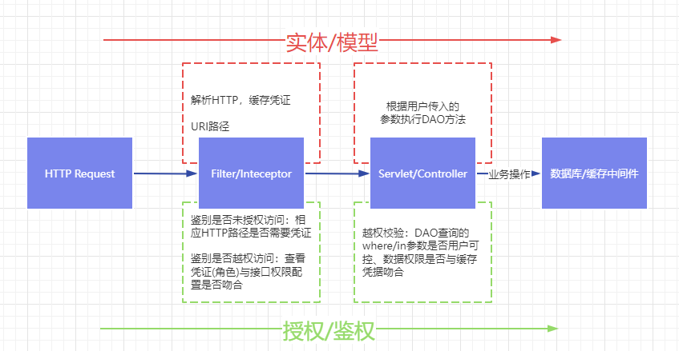


下面我们先简单了解一下 框架是如何进行授权访问、路由鉴权 ，自定义Filter如何授权访问 及 Controller这里的越权校验。


### 2.3. 框架路由授权

下图为shiro框架的路由访问配置，其中 map 的 value 配置为 `anno` 的表示该路径可未授权访问

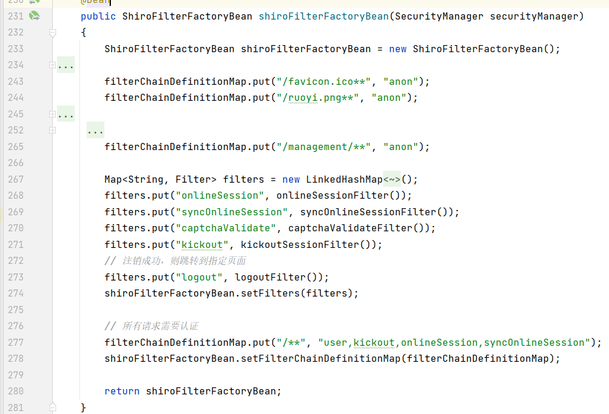


### 2.4. 框架接口鉴权

 `org.apache.shiro.authz.annotation.RequiresPermissions`

后台接口方法这里通过配置注解设置了接口权限标识 `system:notice:list`

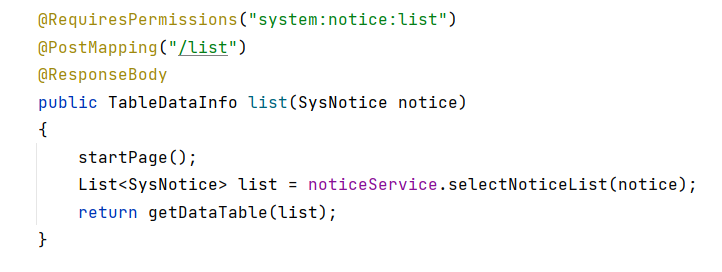

用户已登录的情况下，根据情况设置其拥有的接口权限：

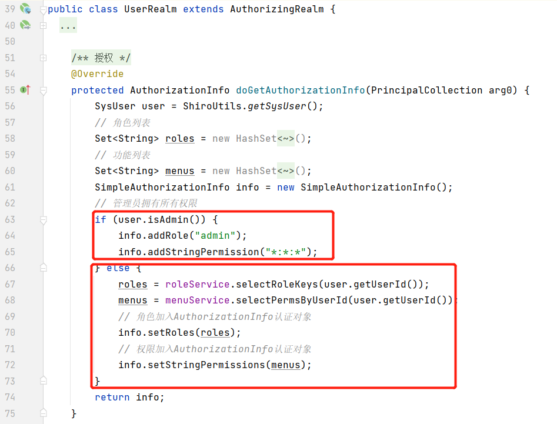

### 2.5. 非框架授权

开发人员编写了一个Filter对用户进行授权问题，可以看到，先排除了一些无需授权访问的路径；随后通过JWT Token鉴别用户是否登录，如果未登录则返回401.

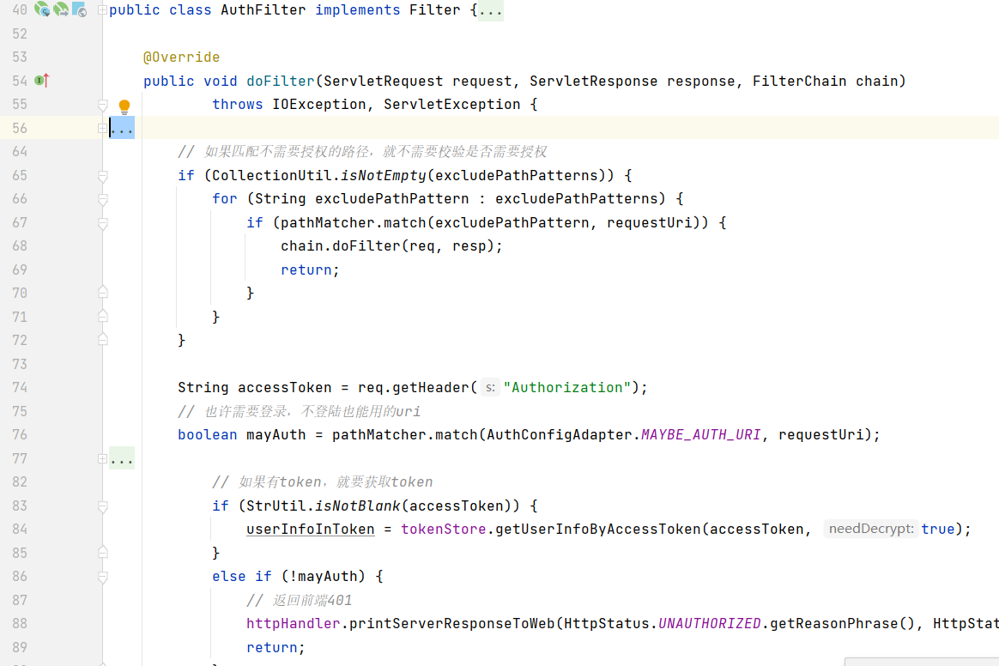

### 2.6. 越权校验

该图中的后台接口功能未设置用户信息，实际上执行了如下这样一个SQL语句

```sql
update user set nickName='xxx',pic='xxx' where userId='xxx' 
```

如果userId是用户可控的，则存在越权问题

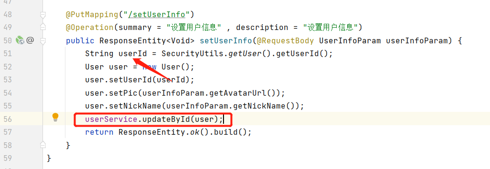


这里的修改密码 `updateById` 的Bean对象User的userId 来源于`userService.getOne`的查询结果，而该查询的输入`nickName`可被用户控制，导致了该接口存在越权问题。

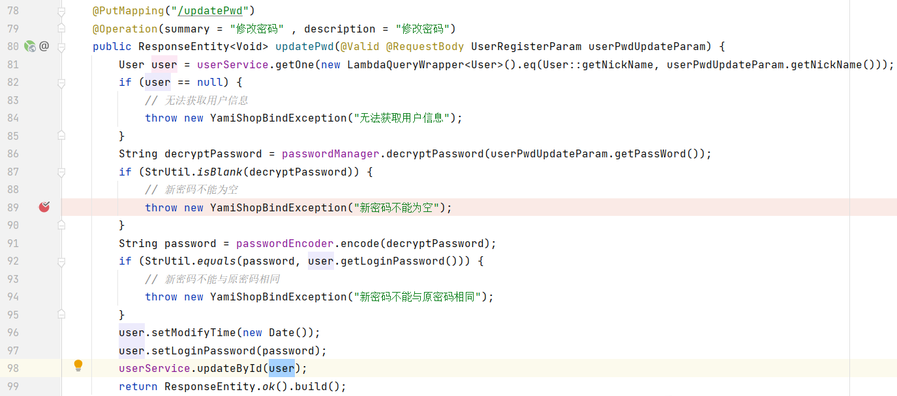

### 2.7. 总结

在filter中，通过RASP/IAST 构建代码流程图检测漏洞

- 未授权访问漏洞：需要构建的测试用例为 已登录用户访问接口、未登录用户访问接口
- 接口越权问题：需要构建的测试用例为 不同角色访问同一接口


在controller中，通过codeql 来检测漏洞

- 越权（根据用户ID进行权限管控）：检测业务操作CRUD的入参是否与凭证ID有数据关联


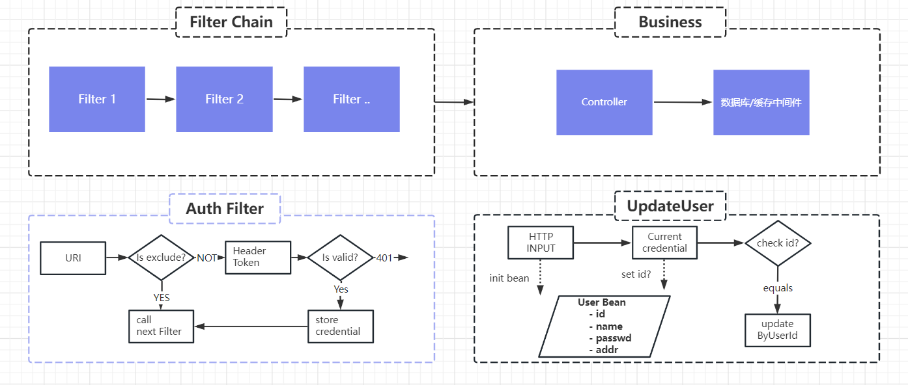

## 3. 检测越权漏洞

首先需要认识到，我们难以或无法检测一些逻辑缺陷的问题，如框架或非框架中对未授权访问路由的鉴别代码逻辑存在缺陷导致的未授权访问，具体一点，Filter中判断HTTP URL路径含有`/image`则放行，但攻击者通过`/test?foo=/image`进行绕过。

在 第2章 提到的问题中，框架类的情况通过codeql检测的话，理论上会相对简单，最复杂的情况是 非框架授权 问题 ，越权检测也比较复杂且意义重大，本章节我们讲述一下目前的思路方案。

### 3.1. 思路

通过codeql白盒工具检测越权问题，我们实践思路是，检查 `用户的输入` 到 `业务方法` 的`数据流`是否经过`可靠的检查`。

业务方法：DAO方法的执行（SQL执行）、数据缓存操作（Redis Set）

可靠的检查有两种方式，分别为 ：

​		1、数据流代码节点上，有调用“可信方法”，即来自不可靠的输入被处理为了可靠的数据，又再作为输入，如 `String userId = SecurityUtlis.getUser().getUserID()`

​		2、数据流代码节中，调用可信方法对，存在某一节点代码通过可信方法对数据进行校验，不符合预期则抛异常，如`if(!Object.equals(userId,SecurityUtlis.getUser().getUserID())){ throw new Exception("error id");}`

可信方法：

​		可将不安全的输入转换为安全的输出、或是检测不安全的输入与已缓存的安全的数据（用户凭证）是否符合。

​		基础可信方法：

​					shiro/spring-security 安全框架获取凭证的方法

​					redis的get、ThreadLocal.get（缓存了凭证）、其他未发掘的情况

​		通过基础可信方法，递归检测源码，获得所有可信方法：将可信方法作为返回值的、或是参数数据与可信方法有关联并抛异常的	

```java
// 不安全的输入 -> 安全的输出 , request是不安全的，通过JWT获取到安全的authToken
// getUserNameFromToken 是可信方法
String authHeader = request.getHeader(this.tokenHeader);
String authToken = authHeader.substring(this.tokenHead.length());
UserDetails userDetails = this.userDetailsService.loadUserByUsername(username);
```

```java
// 检测不安全的输入与已缓存的安全的数据是否符合
// getCurrentMember 是可信方法
UmsMember member = memberService.getCurrentMember();
OmsOrder order = orderMapper.selectByPrimaryKey(orderId);
if(!member.getId().equals(order.getMemberId())){
    Asserts.fail("不能确认他人订单！");
}
```

执行数据操作的`DAO方法`有，CRUD操作，关于DAO方法有以下要点：

​		是否返回前端：SELECT操作，仅查询结果的数据返回给到前端时，才有必要判断是否越权

​		是否敏感数据：如商品信息的查询不需要检测是否越权，这些接口需要标记出来或是作为误报人工忽略

​		DAO方法参数是否SQL约束：DAO方法的参数为多个或为Bean对象时，需要忽略非where查询的字段，如对于`userService.updateById(user)`，我们只需要检查user对象的userId来源是否可靠即可

​				

### 3.2. codeql实践

#### 3.2.1. 获取可信方法

通过codeql的递归语法，我们在定义基础的可信方法后，递归这一结果，从而找到项目源码中所有预期的方法：

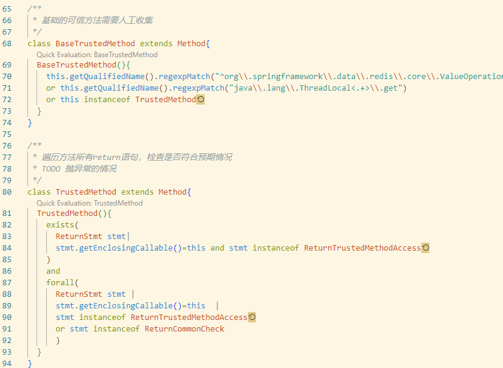

有如下查询demo结果，递归过程如下  `ThreadLocal.get  -> AuthUserContext.get -> SecurityUtils.getSysUser()`

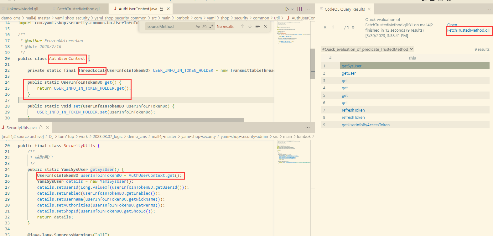

递归获取可信方法 demo2：

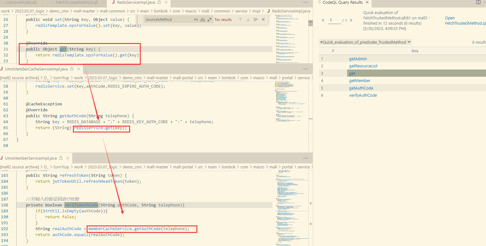


#### 3.2.2. 获取相关DAO方法

可以通过codeql的xml解析模块去解析项目源码中的mapper.xml文件从而获取DAO方法。

目前为了简便，我先用Java代码写了一个mapper xml解析代码：

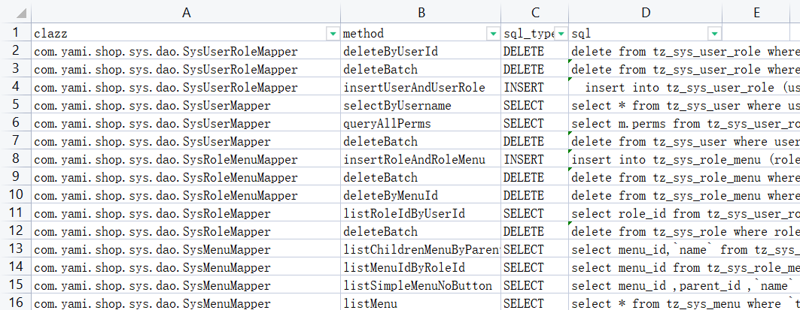

定义相关DAO方法作为sink点：

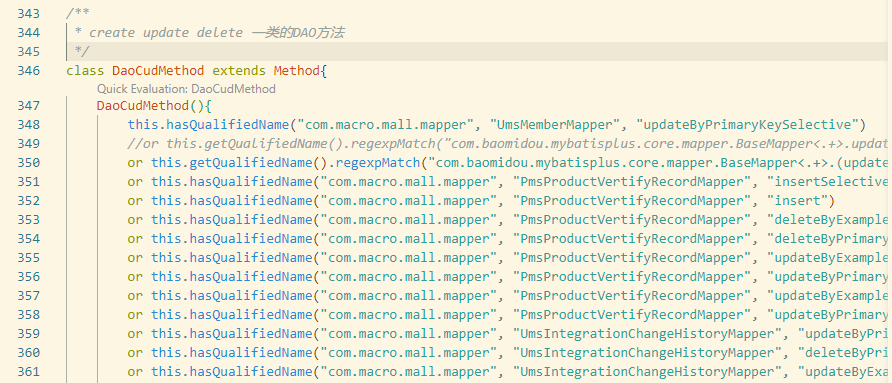

#### 3.2.3. 查询是否越权

在定义了DAO方法污点、可信方法 等谓词（逻辑判断词）的情况下，基于我们 `3.1思路` 去编写codeql查询规则，主要就是在 `HTTP入口->DAO查询` 这条数据链上查询相关节点数据是否经过可信方法的处理。

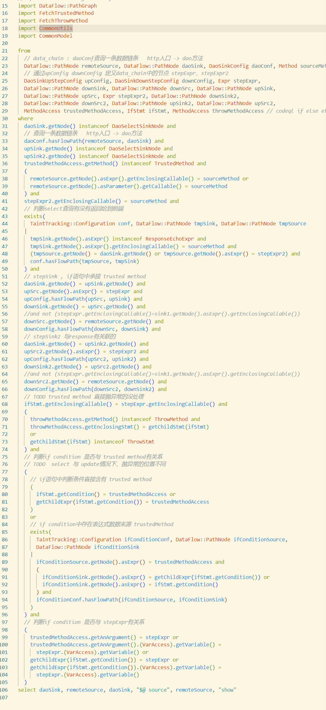

#### 3.2.4. DAO CUD案例

使用codeql查询不存在越权的 DAO CUD情况，该取消订单业务接口中，通过调用 service 方法 cancelOrders 从而调用DAO方法执行SQL进行订单取消，可以看到 order 对象的order.userId已经经过 `!Object.equal(order.getUserId(), userId)` 语句的校验

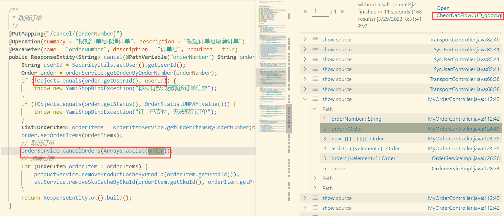

codeql查询存在越权的DAO CUD执行

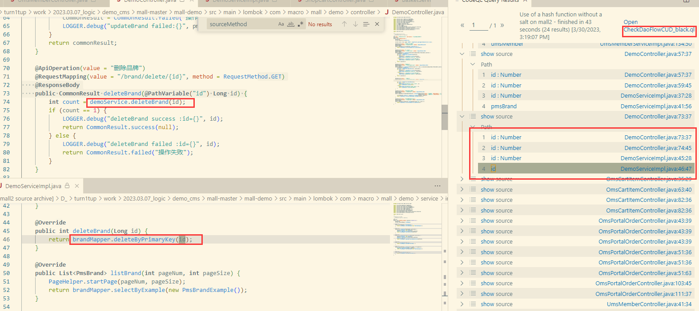

#### 3.2.5. DAO SELECT案例


使用codeql查询不存在越权的DAO SELECT情况：

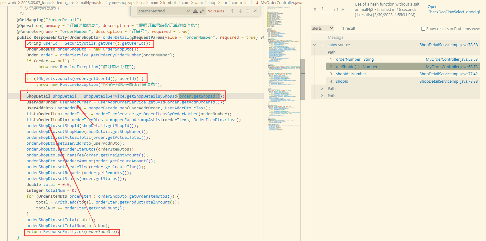


使用codeql查询存在越权情况的 DAO Select方法执行：

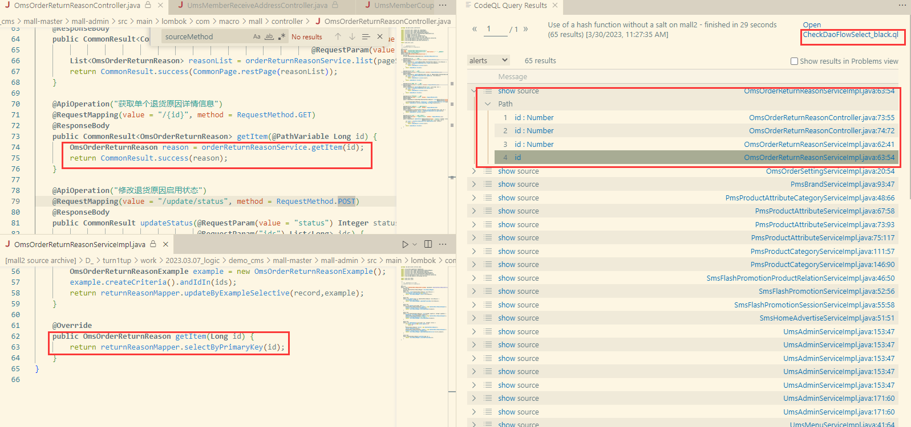

#### 3.2.6. 问题总结

1、DAO方法获取：还需要适配mybatis插件，如 baomidou 中可以直接 调用 servie 来进行DAO查询（通过注解Bean指明表名字段名插件则自动动态生成SQL查询语句）；以及DAO接口继承插件的BaseMapper，污点则为BaseMapper的方法

2、DAO方法参数跟踪：目前还没根据SQL WHERE/IN判断的具体字段 来决定跟踪 DAO方法入参的字段 ，一方面如果项目SQL传参比较复杂或使用了Mybatis插件，我们通过静态的方式无法获取完整的SQL语句；另外就是这个方案也比较复杂，还在考量中。可能做成，只要DAO查询中某个参数经过可靠检查了，就忽略掉其他参数是否存在越权问题，当然，这个做法没有把解决问题做到极致。

3、流中继中断问题：Codeql去查询污点(DAO方法)到源（HTTP接口）的这个过程，如果开发者使用了三方库，我们还需要编写额外的codeql谓词进行流中继，这也是codeql规则编写的通点

4、误报问题：对于后台模块来说，基本不进行此类权限检测，所以本节的方法不使用于后台模块代码；此外，某些数据是操作是不敏感的，如商品信息的查询，这也是误报之一。

## 4. 检测未授权与接口越权

### 4.1. 框架问题

通过codeql去识别接口是否有 框架路由授权、框架接口鉴权 ，从目前看到的shiro/spring-security框架来说，codeql具备可行性。具体的demo还未实践，后面这块就不继续关注了。

### 4.2. 非框架未授权漏洞

自动化检测中，对于自定义Filter/Interceptor， 需要结合IAST/RASP进行处理，但这需要构建相应的测试数据，这似乎又和手工测试同一个维度了，这点让人纠结。

可通过RASP构建一次请求中某Filter的函数调用图，起初想Hook所有class，但是出现字节码错误，就粗略写了个demo稍微进行测试，代码如下：

```java
    String authFilterId = "com.test.filter.AuthFilter#doFilter(Ljavax/servlet/ServletRequest;" +
                "Ljavax/servlet/ServletResponse;Ljavax/servlet/FilterChain;)V";
    // hook哪些包下的代码
    private final String[] includePkgs = new String[]{"com.test"};
    // 多叉树
    ThreadLocal<TreeNode> tree = new ThreadLocal<>();
    // 修改被hook的方法的字节码，将 before 添加到调用前
    public void before(String methodId, Object[] args) throws Exception {
            if (authFilterId.equals(methodId)) {
                if (tree.get() != null) {
                    throw new Exception("递归问题未处理！");
                }
                TreeNode root = new TreeNode(methodId,null);
                tree.set(root);
                root.setCurrent(root);

            } else {
                if (tree.get() == null) {
                    return;
                }
                TreeNode root = tree.get();
                TreeNode parent = root.getCurrent();
                TreeNode node = new TreeNode(methodId,parent);
                parent.addChild(node);
                root.setCurrent(node);
            }

    	}

	// 修改被hook的方法的字节码，将 after 添加到调用后或抛异常后
    public void after(String methodId, Object[] args, Object ret, Exception exception) {

        if (authFilterId.equals(methodId)) {
            TreeNode root = tree.get();
            if (root == null) {
                return;
            }
            System.out.println("show call graph: ");
            TreeNode.PrettyPrint(root);
            System.out.println("------------------------------");
            tree.set(null);

        }else{
            if (tree.get() == null) {
                return;
            }
            TreeNode root = tree.get();
            root.setCurrent(root.getCurrent().getParent());
        }
    }
```
