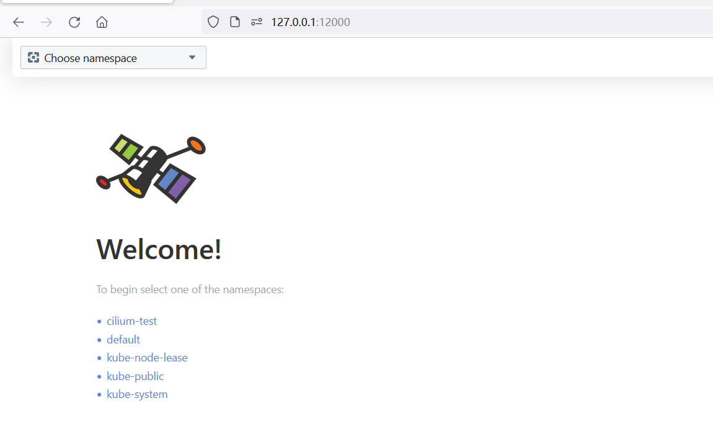
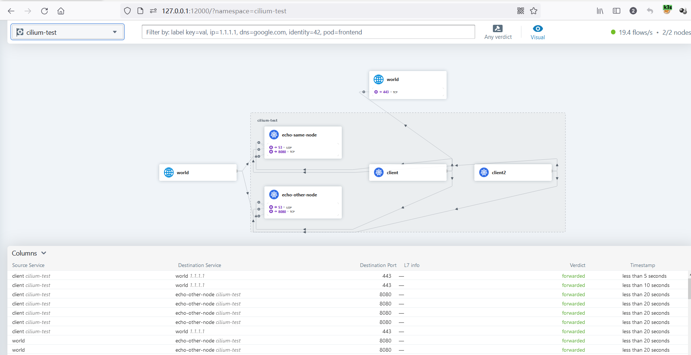
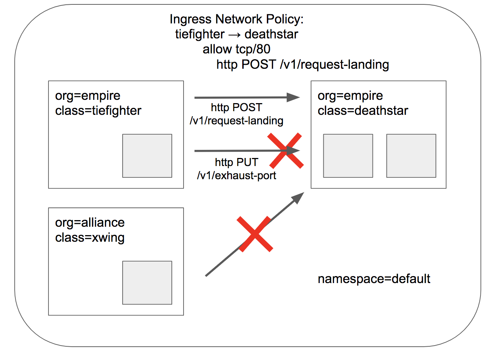

# 初识微隔离与Cilium

## 1. 微隔离

&emsp;&emsp;最近学习了一番cilium与微隔离，此文以作记录。

&emsp;&emsp;对于微隔离，似乎并没有什么比较正式的文档来说明它，而在 cilium 、calio 这些最流行的云原生网络安全产品也未有提及，所以笔者根据自己了解的解释一下。

### 1.1 微隔离释意

&emsp;&emsp;在传统的主机网络环境中，用户会通过划分网络区域来进行网络隔离、网络控制，网络区域之间可能还会有防火墙。此后的流行架构是通过虚拟机部署业务，该阶段使用VLAN、SDN等技术实现网络隔离，传统防火墙厂商也发布虚拟防火墙产品试图覆盖这些场景。（备注：在攻防人员眼中防火墙是规则引擎下的流量防护产品，但其最传统的能力是网络管控这块）

&emsp;&emsp;我们先来了解以下云原生的的相关理念，这也是理解微隔离的前提，云原生下：

- 底层基础设施环境：可编程的、动态的 基础设施，表现为 私有云、公有云、混合云 等形式；
- 应用架构强调分布式：松耦合、高弹性、高容错
- 应用生命周期更高效：业务方只需要关注应用本身，开发与交付方式表现为 快速迭代、稳定交付、自动化 ...

&emsp;&emsp;在很长的一段时间里，很多公司的部分应用环境在架构上转到了云原生，但为了方便维护网络，k8s集群下的网络模式还是主机网络（或说[flat network](https://docs.tigera.io/calico/latest/networking/determine-best-networking#kubernetes-networking-basics)），这也使得攻击者获取pod权限后可以在k8s网络中畅游，可随意访问其他pod、node、apiserver .. 

&emsp;&emsp;云原生是开放的，相关概念也是开放的，对于微隔离（Microsegmentation）我们可以做如下考量：

- 能理解业务，根据业务进行网络隔离
- 便于操作、便于维护的：如 UI（根据过滤条件展现网络通路）、自动化网络探测
- 兼容性？部署方式？
- not only L3/4 ? 支持L7，支持 service mesh？：微隔离是否需要覆盖L7 、service mesh，还尚有疑虑，笔者暂时对业务在云原生的应用不是很清楚。只是在了解cilium后，不免让人认为微隔离与服务网格在技术架构上可一体。

### 1.2 隔离方案

&emsp;&emsp;在云原生架构下的这些思想理念使得应用与IP地址的关联降低（POD形式、应用可扩展），VLAN(VXLAN)则是k8s集群网络的基础架构（CNI插件overlay networks）。所以，通过IP进行隔离在理论上是可以的，但不太聪明：大量动态的pod使得路由表的维护十分困难，且网络抖动很大，或者要让IP分配服从隔离策略。通过VXLAN一类的技术来进行网络隔离，POD创建时自动划分进入相应的VLAN，这个方案则好像可行。

&emsp;&emsp;笔者粗浅地了解到有如下微隔离方案：

- [k8s network-policy](https://kubernetes.io/zh-cn/docs/concepts/services-networking/network-policies/)：k8s中可配置 L3/4 的网络策略，识别方式包括 IP、namespace、pod标签，但只提供API配置方式（用户端表现为配置文件），原生下维护麻烦，相关开源方案有 calico。
- Overlay Network：通过VXLAN一类的方式来隔离各个网络，[某公司产品](https://www.dynarose.com/product_ID-based_segmentation.html)就是使用这个方案（从片语介绍来看），而这个方案让人感觉是上个时代的东西，这个方案也应该被很多商业公司采纳，而上个时代也是商业公司的天下，这块未看到开源产品。这个方案下的网络隔离 “细粒度” 比较有限，只能根据 pod、namespace 的相关标签将他们划分到不同LAN中，至于其他方面是否有缺陷 笔者也不知晓 。
- eBPF：cilium团队在协助linux内核团队将eBPF完善至成熟后，在18年开始发力开发cilium。eBPF好比javascript引擎，通过它我们可以实现 灵活的 、细粒度的 网络隔离策略，且性能十分优异（cilium calcio下层也使用VXLAN方式连接节点网络，这种情况下对比上面的方案不好说），在eBPF层面，我们还能实现很多功能，相关的开源方案有 cilium calico。

&emsp;&emsp;cilium 、calico都支持eBPF，calico 在2020年[v3.13 版本](https://docs.tigera.io/archive/v3.13/release-notes/#new-ebpf-dataplane-technology-preview)开始跟进 eBPF 方案，而其原本是支持k8s network-policy的，可见时代潮流。而目前二者都有UI功能，另外 cilium 十分火爆（1.14.0版本相关contributor就有169位，十分骇人），相对功能也更完善。

## 2. 初识cilium

### 2.1 introduction to cilium

 &emsp;&emsp;官网对cilium有一些[介绍](https://docs.cilium.io/en/latest/overview/intro/)，关于eBPF你也可以查询[what is ebpf](https://ebpf.io/what-is-ebpf/)进行了解。

&emsp;&emsp;cilium是云原生下的下一代网络安全产品，基于eBPF这一强大的内核机制，我们能“看到任何东西，做任何事情”，这是一次变革。

&emsp;&emsp;今天的语境下，我们谈及BPF(Berkeley Packet Filter)时默认指的eBPF，旧有的BPF概念被称为 classic BPF(cBPF)，由于BPF能力不局限于网络包这块，其名称也失去了原本的意义，但这个机制延续了BPF这一称呼，我们也不必纠结于该名称。

&emsp;&emsp;在以前，你在内核中发布一个新特性，你需要10-15年来推动这件事情，而如今通过eBPF你可以 以类似JavaScript的方式在内核中执行你的代码。当然，[eBPF不是万能的](https://docs.tigera.io/calico/latest/operations/ebpf/use-cases-ebpf#when-to-use-ebpf-and-when-not-to)，诸如CPU密集型的处理（包加解密）、L7协议 都不适合直接使用eBPF来处理，eBPF中常用的技术是  tc (traffic control) 、XDP (eXpress Data Path) 。在今天，eBPF的使用其实已经是工业界的一个成熟方案，如安卓手机计算各APP的流量使用情况、，facebook所用的DDOS的防护等等，你看不到它，但你日常生活中可能经常使用到它。

&emsp;&emsp;&emsp;cilium并不是遵从k8s的技术规范，cilium比较重要的概念之一就是 endpoint：endpoint 可以是 虚拟机 、linux cgroup 、namesapce 或其他，cilium能管理任何表现为 cgroup 、网络设备 的东西，简而言之 endpoint是任何带有IP的或能被寻址的。

&emsp;&emsp;&emsp;hubble是cillium中的可视化组件，在开发之初是与cilium独立的，所以二者的名称没有什么关联。开发者将网络中的数据比作银河中的星际、星星，而hubble就是这么一个工具帮助我们观测了解这些数据。

### 2.2 install k3s & cilium

&emsp;&emsp;cilium建议内核版本大于4.9，因此我们选择ubuntu 来进行安装，通过k3s我们能在几分钟内就完成k8s集群的安装，之后参考cilium文档安装cilium即可。

```
root@master:/home/test# uname -a
Linux master.local 5.15.0-78-generic #85-Ubuntu SMP Fri Jul 7 15:25:09 UTC 2023 x86_64 x86_64 x86_64 GNU/Linux

```

#### k3s

&emsp;&emsp;安装k3s https://docs.k3s.io/zh/quick-start

```
root@master:/home/test# curl -sfL https://rancher-mirror.rancher.cn/k3s/k3s-install.sh | INSTALL_K3S_EXEC='--flannel-backend=none --disable-network-policy' INSTALL_K3S_MIRROR=cn sh -
[INFO]  Finding release for channel stable
[INFO]  Using v1.27.4+k3s1 as release
[INFO]  Downloading hash rancher-mirror.rancher.cn/k3s/v1.27.4-k3s1/sha256sum-amd64.txt
[INFO]  Downloading binary rancher-mirror.rancher.cn/k3s/v1.27.4-k3s1/k3s
[INFO]  Verifying binary download
[INFO]  Installing k3s to /usr/local/bin/k3s
[INFO]  Skipping installation of SELinux RPM
[INFO]  Creating /usr/local/bin/kubectl symlink to k3s
[INFO]  Creating /usr/local/bin/crictl symlink to k3s
[INFO]  Creating /usr/local/bin/ctr symlink to k3s
[INFO]  Creating killall script /usr/local/bin/k3s-killall.sh
[INFO]  Creating uninstall script /usr/local/bin/k3s-uninstall.sh
[INFO]  env: Creating environment file /etc/systemd/system/k3s.service.env
[INFO]  systemd: Creating service file /etc/systemd/system/k3s.service
[INFO]  systemd: Enabling k3s unit
Created symlink /etc/systemd/system/multi-user.target.wants/k3s.service → /etc/systemd/system/k3s.service.
[INFO]  systemd: Starting k3s
root@master:/home/test# kubectl get nodes
NAME           STATUS   ROLES                  AGE   VERSION
master.local   Ready    control-plane,master   21s   v1.27.4+k3s1

```

```
root@master:/home/test# cat /var/lib/rancher/k3s/server/node-token
K10eb25e61ff1342401a2ca28c4b53dcf8d7cc863c290890684a2509aba7d2108d9::server:276df10fdf05e05f7e8d2bcf197edf43

```

```
root@node01:/home/test# MYSERVER=192.168.128.131
TOKEN=K10eb25e61ff1342401a2ca28c4b53dcf8d7cc863c290890684a2509aba7d2108d9::server:276df10fdf05e05f7e8d2bcf197edf43
curl -sfL https://rancher-mirror.rancher.cn/k3s/k3s-install.sh | INSTALL_K3S_MIRROR=cn K3S_URL=https://$MYSERVER:6443 K3S_TOKEN=$TOKEN sh -

[INFO]  Finding release for channel stable
[INFO]  Using v1.27.4+k3s1 as release
[INFO]  Downloading hash rancher-mirror.rancher.cn/k3s/v1.27.4-k3s1/sha256sum-amd64.txt
[INFO]  Downloading binary rancher-mirror.rancher.cn/k3s/v1.27.4-k3s1/k3s
[INFO]  Verifying binary download
[INFO]  Installing k3s to /usr/local/bin/k3s
[INFO]  Skipping installation of SELinux RPM
[INFO]  Creating /usr/local/bin/kubectl symlink to k3s
[INFO]  Creating /usr/local/bin/crictl symlink to k3s
[INFO]  Creating /usr/local/bin/ctr symlink to k3s
[INFO]  Creating killall script /usr/local/bin/k3s-killall.sh
[INFO]  Creating uninstall script /usr/local/bin/k3s-agent-uninstall.sh
[INFO]  env: Creating environment file /etc/systemd/system/k3s-agent.service.env
[INFO]  systemd: Creating service file /etc/systemd/system/k3s-agent.service
[INFO]  systemd: Enabling k3s-agent unit
Created symlink /etc/systemd/system/multi-user.target.wants/k3s-agent.service → /etc/systemd/system/k3s-agent.service.
[INFO]  systemd: Starting k3s-agent

```


&emsp;&emsp;设置k8s配置路径变量，cilium会用到，建议添加到 /etc/profile 文件中，避免重启丢失：

```
export KUBECONFIG=/etc/rancher/k3s/k3s.yaml
```

#### cilium

&emsp;&emsp;参考 https://docs.cilium.io/en/stable/gettingstarted/k8s-install-default/#install-the-cilium-cli

&emsp;&emsp;首先下载最新release版本的cilium cli

```
CILIUM_CLI_VERSION=$(curl -s https://raw.githubusercontent.com/cilium/cilium-cli/main/stable.txt)
CLI_ARCH=amd64
if [ "$(uname -m)" = "aarch64" ]; then CLI_ARCH=arm64; fi
curl -L --fail --remote-name-all https://github.com/cilium/cilium-cli/releases/download/${CILIUM_CLI_VERSION}/cilium-linux-${CLI_ARCH}.tar.gz{,.sha256sum}
sha256sum --check cilium-linux-${CLI_ARCH}.tar.gz.sha256sum
sudo tar xzvfC cilium-linux-${CLI_ARCH}.tar.gz /usr/local/bin
rm cilium-linux-${CLI_ARCH}.tar.gz{,.sha256sum}

```

&emsp;&emsp;通过cli安装cilium，这个过程会pull一系列的镜像，我们需要耐心等待：安装过程中将部署相关的 DaemonSet，以及启动agent 

```
root@master:/home/test# cilium install
🔮 Auto-detected Kubernetes kind: K3s
ℹ️  Using Cilium version 1.14.0
🔮 Auto-detected cluster name: default
🔮 Auto-detected datapath mode: tunnel
```

&emsp;&emsp;通过status命令查看cilium的安装状态，如果出现error，则查看相关pods是否都是running状态，等待pods状态为running后再检查status情况

```
root@master:/home/test# cilium status
    /¯¯\
 /¯¯\__/¯¯\    Cilium:             OK
 \__/¯¯\__/    Operator:           OK
 /¯¯\__/¯¯\    Envoy DaemonSet:    disabled (using embedded mode)
 \__/¯¯\__/    Hubble Relay:       OK
    \__/       ClusterMesh:        disabled

DaemonSet              cilium             Desired: 2, Ready: 2/2, Available: 2/2
Deployment             cilium-operator    Desired: 1, Ready: 1/1, Available: 1/1
Deployment             hubble-relay       Desired: 1, Ready: 1/1, Available: 1/1
Deployment             hubble-ui          Desired: 1, Ready: 1/1, Available: 1/1
Containers:            hubble-ui          Running: 1
                       cilium             Running: 2
                       cilium-operator    Running: 1
                       hubble-relay       Running: 1
Cluster Pods:          12/12 managed by Cilium
Helm chart version:    1.14.0
Image versions         hubble-ui          quay.io/cilium/hubble-ui:v0.12.0@sha256:1c876cfa1d5e35bc91e1025c9314f922041592a88b03313c22c1f97a5d2ba88f: 1
                       hubble-ui          quay.io/cilium/hubble-ui-backend:v0.12.0@sha256:8a79a1aad4fc9c2aa2b3e4379af0af872a89fcec9d99e117188190671c66fc2e: 1
                       cilium             quay.io/cilium/cilium:v1.14.0@sha256:5a94b561f4651fcfd85970a50bc78b201cfbd6e2ab1a03848eab25a82832653a: 2
                       cilium-operator    quay.io/cilium/operator-generic:v1.14.0@sha256:3014d4bcb8352f0ddef90fa3b5eb1bbf179b91024813a90a0066eb4517ba93c9: 1
                       hubble-relay       quay.io/cilium/hubble-relay:v1.14.0@sha256:bfe6ef86a1c0f1c3e8b105735aa31db64bcea97dd4732db6d0448c55a3c8e70c: 1

```

&emsp;&emsp;如果pod都运行正常，但依然有error，将cilium重装即可

```
cilium uninstall
cilium install
```

&emsp;&emsp;可跳过，测试网络运行情况(这个只能在没有网络策略、没有pod 的namespace 中运行，默认为 cilium-test ，功能只是测试网络是否正常)

```
cilium connectivity test
```

&emsp;&emsp;pod在cilium视角下表现为endpoint，如果你的 endpoint list只有一两个，说明你的cilium未安装正确：

```
root@master:/home/test# kubectl -n kube-system get pods -l k8s-app=cilium
NAME           READY   STATUS    RESTARTS   AGE
cilium-4rjbd   1/1     Running   0          20m
cilium-mhkgm   1/1     Running   0          20m
root@master:/home/test# kubectl -n kube-system exec cilium-4rjbd -- cilium endpoint list
Defaulted container "cilium-agent" out of: cilium-agent, config (init), mount-cgroup (init), apply-sysctl-overwrites (init), mount-bpf-fs (init), clean-cilium-state (init), install-cni-binaries (init)
ENDPOINT   POLICY (ingress)   POLICY (egress)   IDENTITY   LABELS (source:key[=value])                                                      IPv6   IPv4         STATUS
           ENFORCEMENT        ENFORCEMENT                                                                                                                     
100        Disabled           Disabled          1          k8s:node-role.kubernetes.io/control-plane=true                                                       ready
                                                           k8s:node-role.kubernetes.io/master=true                                                            
                                                           k8s:node.kubernetes.io/instance-type=k3s                                                           
                                                           reserved:host                                                                                      
587        Disabled           Disabled          56660      k8s:first=echo                                                                          10.0.0.60    ready
                                                           k8s:io.cilium.k8s.namespace.labels.kubernetes.io/metadata.name=cilium-test                         
                                                           k8s:io.cilium.k8s.policy.cluster=default                                                           
                                                           k8s:io.cilium.k8s.policy.serviceaccount=echo-other-node                                            
                                                           k8s:io.kubernetes.pod.namespace=cilium-test                                                        
                                                           k8s:kind=echo                                                                                      
                                                           k8s:name=echo-other-node                                                                           
708        Disabled           Disabled          38134      k8s:app=local-path-provisioner                                                          10.0.0.125   ready
                                                           k8s:io.cilium.k8s.namespace.labels.kubernetes.io/metadata.name=kube-system                         
                                                           k8s:io.cilium.k8s.policy.cluster=default                                                           
                                                           k8s:io.cilium.k8s.policy.serviceaccount=local-path-provisioner-service-account                     
                                                           k8s:io.kubernetes.pod.namespace=kube-system                                                        
967        Disabled           Disabled          44580      k8s:io.cilium.k8s.namespace.labels.kubernetes.io/metadata.name=kube-system              10.0.0.5     ready
                                                           k8s:io.cilium.k8s.policy.cluster=default                                                           
                                                           k8s:io.cilium.k8s.policy.serviceaccount=coredns                                                    
                                                           k8s:io.kubernetes.pod.namespace=kube-system                                                        
                                                           k8s:k8s-app=kube-dns                                                                               
1344       Disabled           Disabled          31019      k8s:io.cilium.k8s.namespace.labels.kubernetes.io/metadata.name=kube-system              10.0.0.222   ready
                                                           k8s:io.cilium.k8s.policy.cluster=default                                                           
                                                           k8s:io.cilium.k8s.policy.serviceaccount=metrics-server                                             
                                                           k8s:io.kubernetes.pod.namespace=kube-system                                                        
                                                           k8s:k8s-app=metrics-server                                                                         
1388       Disabled           Disabled          4          reserved:health                                                                         10.0.0.80    ready
1651       Disabled           Disabled          2533       k8s:app=svclb-traefik-d8393996                                                          10.0.0.195   ready
                                                           k8s:io.cilium.k8s.namespace.labels.kubernetes.io/metadata.name=kube-system                         
                                                           k8s:io.cilium.k8s.policy.cluster=default                                                           
                                                           k8s:io.cilium.k8s.policy.serviceaccount=svclb                                                      
                                                           k8s:io.kubernetes.pod.namespace=kube-system                                                        
                                                           k8s:svccontroller.k3s.cattle.io/svcname=traefik                                                    
                                                           k8s:svccontroller.k3s.cattle.io/svcnamespace=kube-system   
```

#### hubble

&emsp;&emsp;参考 [hubble_setup](https://docs.cilium.io/en/stable/gettingstarted/hubble_setup/)，我们首先通过cilium-cli启用hubble功能

```
cilium hubble enable

```

&emsp;&emsp;在各机器安装hubble客户端

```
HUBBLE_VERSION=$(curl -s https://raw.githubusercontent.com/cilium/hubble/master/stable.txt)
HUBBLE_ARCH=amd64
if [ "$(uname -m)" = "aarch64" ]; then HUBBLE_ARCH=arm64; fi
curl -L --fail --remote-name-all https://github.com/cilium/hubble/releases/download/$HUBBLE_VERSION/hubble-linux-${HUBBLE_ARCH}.tar.gz{,.sha256sum}
sha256sum --check hubble-linux-${HUBBLE_ARCH}.tar.gz.sha256sum
sudo tar xzvfC hubble-linux-${HUBBLE_ARCH}.tar.gz /usr/local/bin
rm hubble-linux-${HUBBLE_ARCH}.tar.gz{,.sha256sum}

```

```
root@master:/home/test# cilium hubble port-forward &
[1] 1055748
root@master:/home/test# hubble status --server localhost:4245
Healthcheck (via localhost:4245): Ok
Current/Max Flows: 8,190/8,190 (100.00%)
Flows/s: 19.07
Connected Nodes: 2/2
root@master:/home/test# hubble observe --server localhost:4245
Aug 23 09:46:13.173: kube-system/hubble-relay-79d64897bd-68vgt:52508 (ID:16364) -> 192.168.128.132:4244 (host) to-stack FORWARDED (TCP Flags: ACK)
Aug 23 09:46:13.537: 10.0.1.95:43256 (host) -> cilium-test/echo-same-node-965bbc7d4-pqgt7:8181 (ID:16334) to-endpoint FORWARDED (TCP Flags: SYN)
Aug 23 09:46:13.538: 10.0.1.95:43256 (host) <- cilium-test/echo-same-node-965bbc7d4-pqgt7:8181 (ID:16334) to-stack FORWARDED (TCP Flags: SYN, ACK)
Aug 23 09:46:13.538: 10.0.1.95:43256 (host) -> cilium-test/echo-same-node-965bbc7d4-pqgt7:8181 (ID:16334) to-endpoint FORWARDED (TCP Flags: ACK)

Error: Unable to port forward: unable to execute "kubectl port-forward -n kube-system svc/hubble-relay --address 127.0.0.1 4245:80": exit status 1

root@master:/home/test# netstat -anopt | grep 4245
tcp        0      0 127.0.0.1:4245          0.0.0.0:*               LISTEN      874115/kubectl       off (0.00/0/0)
root@master:/home/test# hubble status
Healthcheck (via localhost:4245): Ok
Current/Max Flows: 6,413/8,190 (78.30%)
Flows/s: 12.55
Connected Nodes: 2/2

```

&emsp;&emsp;开启WEB UI功能

```
root@master:/home/test# cilium hubble enable --ui
root@master:/home/test# cilium hubble ui
ℹ️  Opening "http://localhost:12000" in your browser...


```

&emsp;&emsp;通过moba xterm的MobaSSHTunnel功能进行代理，我们在浏览器访问 hubble-ui 的web页面





#### cli说明

&emsp;&emsp;cilium cli命令行工具的功能

```
CLI to install, manage, & troubleshooting Cilium clusters running Kubernetes.

Usage:
  cilium [flags]
  cilium [command]

Available Commands:
  bgp          Access to BGP control plane
  clustermesh  Multi Cluster Management
  completion   Generate the autocompletion script for the specified shell
  config       Manage Configuration
  connectivity Connectivity troubleshooting
  context      Display the configuration context
  help         Help about any command
  hubble       Hubble observability
  install      Install Cilium in a Kubernetes cluster using Helm
  status       Display status
  sysdump      Collects information required to troubleshoot issues with Cilium and Hubble
  uninstall    Uninstall Cilium using Helm
  upgrade      Upgrade a Cilium installation a Kubernetes cluster using Helm
  version      Display detailed version information

```

&emsp;&emsp;可以充分测试整个网络的连接通路情况（包括外网）

```
root@master:/home/test# cilium connectivity test
ℹ️  Monitor aggregation detected, will skip some flow validation steps
✨ [default] Creating namespace cilium-test for connectivity check...
✨ [default] Deploying echo-same-node service...
✨ [default] Deploying DNS test server configmap...
✨ [default] Deploying same-node deployment...
✨ [default] Deploying client deployment...
✨ [default] Deploying client2 deployment...
✨ [default] Deploying echo-other-node service...
✨ [default] Deploying other-node deployment...
✨ [host-netns] Deploying default daemonset...
✨ [host-netns-non-cilium] Deploying default daemonset...
✨ [default] Deploying echo-external-node deployment...
⌛ [default] Waiting for deployment cilium-test/client to become ready...
⌛ [default] Waiting for deployment cilium-test/client2 to become ready...

```

&emsp;&emsp;cilium pod中的cli

```
CLI for interacting with the local Cilium Agent

Usage:
  cilium [command]

Available Commands:
  bgp          Access to BGP control plane
  bpf          Direct access to local BPF maps
  build-config Resolve all of the configuration sources that apply to this node
  cgroups      Cgroup metadata
  cleanup      Remove system state installed by Cilium at runtime
  completion   Output shell completion code
  config       Cilium configuration options
  debuginfo    Request available debugging information from agent
  encrypt      Manage transparent encryption
  endpoint     Manage endpoints
  fqdn         Manage fqdn proxy
  help         Help about any command
  identity     Manage security identities
  ip           Manage IP addresses and associated information
  kvstore      Direct access to the kvstore
  lrp          Manage local redirect policies
  map          Access userspace cached content of BPF maps
  metrics      Access metric status
  monitor      Display BPF program events
  node         Manage cluster nodes
  nodeid       List node IDs and associated information
  policy       Manage security policies
  prefilter    Manage XDP CIDR filters
  preflight    Cilium upgrade helper
  recorder     Introspect or mangle pcap recorder
  service      Manage services & loadbalancers
  statedb      Inspect StateDB
  status       Display status of daemon
  version      Print version information

```

```
# cilium endpoint list
ENDPOINT   POLICY (ingress)   POLICY (egress)   IDENTITY   LABELS (source:key[=value])                                                      IPv6   IPv4         STATUS
           ENFORCEMENT        ENFORCEMENT
65         Disabled           Disabled          31995      k8s:app.kubernetes.io/name=tiefighter                                                   10.0.0.205   ready
                                                           k8s:class=tiefighter
                                                           k8s:io.cilium.k8s.namespace.labels.kubernetes.io/metadata.name=default
                                                           k8s:io.cilium.k8s.policy.cluster=default
                                                           k8s:io.cilium.k8s.policy.serviceaccount=default
                                                           k8s:io.kubernetes.pod.namespace=default
                                                           k8s:org=empire
100        Disabled           Disabled          1          k8s:node-role.kubernetes.io/control-plane=true                                                       ready
                                                           k8s:node-role.kubernetes.io/master=true
                                                           k8s:node.kubernetes.io/instance-type=k3s
                                                           reserved:host

```

&emsp;&emsp;查看BPF [map](https://ebpf.io/what-is-ebpf/#maps) 中存储的endpoint信息 ，bpf map是一种数据结构，通过hashtable等方式存储数据 ，这里展示了该cilium管理的所有容器

```
root@master:/home/cilium# cilium bpf endpoint list
IP ADDRESS          LOCAL ENDPOINT INFO
10.0.0.240:0        id=829   sec_id=4954  flags=0x0000 ifindex=179 mac=12:8B:D2:8D:C0:05 nodemac=7E:76:A6:B0:AA:60
192.168.128.131:0   (localhost)
10.0.0.28:0         id=403   sec_id=28932 flags=0x0000 ifindex=351 mac=AA:91:43:21:9D:AC nodemac=DE:AC:2C:26:DA:7D
10.0.0.222:0        id=1344  sec_id=31019 flags=0x0000 ifindex=169 mac=0E:D1:E9:4D:4A:EB nodemac=C6:45:5A:8F:07:FB
10.0.0.195:0        id=1651  sec_id=2533  flags=0x0000 ifindex=177 mac=7E:25:AA:F9:D0:02 nodemac=52:D5:FE:38:47:35
10.0.0.63:0         id=3115  sec_id=1653  flags=0x0000 ifindex=353 mac=E6:1C:B3:CF:1E:C2 nodemac=92:90:39:1D:82:69
10.0.0.210:0        id=781   sec_id=4     flags=0x0000 ifindex=349 mac=DA:63:5D:C8:66:ED nodemac=06:B5:DA:6F:CB:6B
10.0.0.24:0         (localhost)
10.0.0.5:0          id=967   sec_id=44580 flags=0x0000 ifindex=165 mac=56:1C:DE:9A:D6:F3 nodemac=3E:19:6B:36:D9:66
10.0.0.205:0        id=65    sec_id=31995 flags=0x0000 ifindex=181 mac=32:3F:91:85:CD:33 nodemac=8E:E4:30:3C:C6:FE
10.0.0.125:0        id=708   sec_id=38134 flags=0x0000 ifindex=171 mac=46:3A:20:33:0B:89 nodemac=B2:04:4B:DA:EC:DF

```

```
root@master:/home/cilium# cilium service list
ID   Frontend             Service Type   Backend
1    10.43.0.1:443        ClusterIP      1 => 192.168.128.131:6443 (active)
3    10.43.0.10:9153      ClusterIP      1 => 10.0.0.5:9153 (active)
4    10.43.0.10:53        ClusterIP      1 => 10.0.0.5:53 (active)
15   10.43.254.208:443    ClusterIP      1 => 10.0.0.222:10250 (active)
18   10.43.172.89:80      ClusterIP      1 => 10.0.1.248:8000 (active)
19   10.43.172.89:443     ClusterIP      1 => 10.0.1.248:8443 (active)
20   10.43.29.252:80      ClusterIP      1 => 10.0.0.240:80 (active)
                                         2 => 10.0.1.156:80 (active)
21   10.43.232.206:443    ClusterIP      1 => 192.168.128.131:4244 (active)
22   10.43.190.63:80      ClusterIP      1 => 10.0.1.49:4245 (active)
23   10.43.17.38:80       ClusterIP      1 => 10.0.0.28:8081 (active)
24   10.43.166.59:8080    ClusterIP      1 => 10.0.1.132:8080 (active)
25   10.43.153.148:8080   ClusterIP      1 => 10.0.0.63:8080 (active)

```


## 3. L7 demo 

&emsp;&emsp;案例来自官方 [L7 DEMO](https://docs.cilium.io/en/stable/gettingstarted/demo/#apply-and-test-http-aware-l7-policy) ，由于这里的L7实际已经将 [L3/4 DEMO](https://docs.cilium.io/en/stable/gettingstarted/demo/#apply-an-l3-l4-policy) 覆盖了，所以就不对L3/4赘述。

&emsp;&emsp;首先创建相关 [pod](https://raw.githubusercontent.com/cilium/cilium/1.14.0/examples/minikube/http-sw-app.yaml)

```
root@master:/home/test# kubectl create -f http-sw-app.yaml
service/deathstar created
deployment.apps/deathstar created
pod/tiefighter created
pod/xwing created
```

&emsp;&emsp;death tiefighter 属于empire“组织” ，xwing 属于 alliance

```
---
apiVersion: v1
kind: Service
metadata:
  name: deathstar
  labels:
    app.kubernetes.io/name: deathstar
spec:
  type: ClusterIP
  ports:
  - port: 80
  selector:
    org: empire
    class: deathstar
---
apiVersion: apps/v1
kind: Deployment
metadata:
  name: deathstar
  labels:
    app.kubernetes.io/name: deathstar
spec:
  replicas: 2
  selector:
    matchLabels:
      org: empire
      class: deathstar
  template:
    metadata:
      labels:
        org: empire
        class: deathstar
        app.kubernetes.io/name: deathstar
    spec:
      containers:
      - name: deathstar
        image: docker.io/cilium/starwars
---
apiVersion: v1
kind: Pod
metadata:
  name: tiefighter
  labels:
    org: empire
    class: tiefighter
    app.kubernetes.io/name: tiefighter
spec:
  containers:
  - name: spaceship
    image: docker.io/tgraf/netperf
---
apiVersion: v1
kind: Pod
metadata:
  name: xwing
  labels:
    app.kubernetes.io/name: xwing
    org: alliance
    class: xwing
spec:
  containers:
  - name: spaceship
    image: docker.io/tgraf/netperf
```

&emsp;&emsp;等待相关pod创建完成

```
root@master:/home/test# kubectl get pods,svc
NAME                             READY   STATUS    RESTARTS   AGE
pod/deathstar-7848d6c4d5-klb2q   1/1     Running   0          2m45s
pod/tiefighter                   1/1     Running   0          2m45s
pod/xwing                        1/1     Running   0          2m45s
pod/deathstar-7848d6c4d5-2k67v   1/1     Running   0          2m45s

NAME                 TYPE        CLUSTER-IP     EXTERNAL-IP   PORT(S)   AGE
service/kubernetes   ClusterIP   10.43.0.1      <none>        443/TCP   42m
service/deathstar    ClusterIP   10.43.29.252   <none>        80/TCP    2m46s``
```

&emsp;&emsp;检查cilium有没有发现我们创建的pod，有没有`k8s:org`标签的：

```
kubectl -n kube-system exec cilium-4rjbd -- cilium endpoint list
```

&emsp;&emsp;我们想通过L7策略限制 /v1/exhaust-port 敏感接口被访问，且禁止其他 “组织” 访问 deathstart



```
root@master:/home/test# kubectl exec xwing -- curl -s -XPOST deathstar.default.svc.cluster.local/v1/request-landing
Ship landed
root@master:/home/test# kubectl exec tiefighter -- curl -s -XPOST deathstar.default.svc.cluster.local/v1/request-landing
Ship landed

root@master:/home/test# kubectl exec tiefighter -- curl -s -XPUT deathstar.default.svc.cluster.local/v1/exhaust-port
Panic: deathstar exploded

```

&emsp;&emsp;创建level 7策略：

```
root@master:/home/test# kubectl apply -f sw_l3_l4_l7_policy.yaml
ciliumnetworkpolicy.cilium.io/rule1 created

```

&emsp;&emsp;L7策略具体内容：

```
apiVersion: "cilium.io/v2"
kind: CiliumNetworkPolicy
metadata:
  name: "rule1"
spec:
  description: "L7 policy to restrict access to specific HTTP call"
  endpointSelector: #带有相关标签的pod才能访问
    matchLabels:
      org: empire
      class: deathstar
  ingress:
  - fromEndpoints:
    - matchLabels:
        org: empire
    toPorts:
    - ports:
      - port: "80"
        protocol: TCP
      rules:
        http:
        - method: "POST"
          path: "/v1/request-landing"

```

&emsp;&emsp;策略应用后，只允许带有org: empire、class: deathstar 标签的pod访问 deathstar 的  /v1/request-landing 接口 

```
root@master:/home/test# kubectl exec tiefighter -- curl -s -XPUT deathstar.default.svc.cluster.local/v1/exhaust-port
Access denied

root@master:/home/test# kubectl exec tiefighter -- curl -s -XPOST deathstar.default.svc.cluster.local/v1/request-landing
Ship landed

```

&emsp;&emsp;其他“组织”无法访问：

```
root@master:/home/test# kubectl exec xwing -- curl -s -XPOST deathstar.default.svc.cluster.local/v1/request-landing1
command terminated with exit code 7

```


## 4. 结语

&emsp;&emsp;cilium的具体应用需要我们熟悉理解业务场景，抛开其较高的内核版本要求，我们在将其投入使用前也需要做一番工作，如规则的管理可能的UI化。cilium 还涵盖了多种功能，如 TLS流量可视化（TLS中间人）、service mesh，具体需要做什么，能做什么，也需要我们理解公司当前业务场景。

## 5. Reference

https://docs.cilium.io

https://www.secrss.com/articles/39606 从Gartner的三次定义，看微隔离技术发展与演进

https://www.youtube.com/watch?v=80OYrzS1dCA eCHO episode 1: Introduction to Cilium