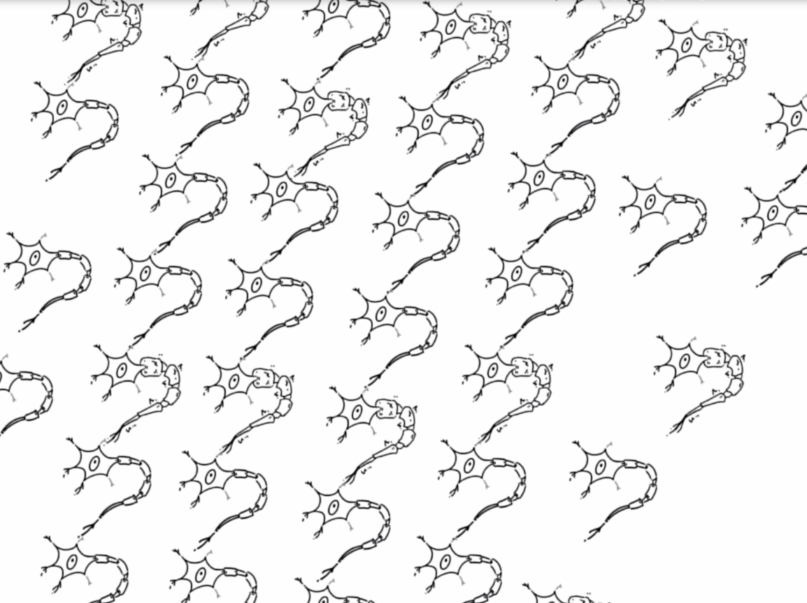
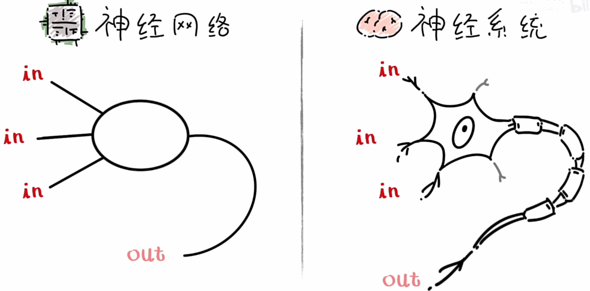
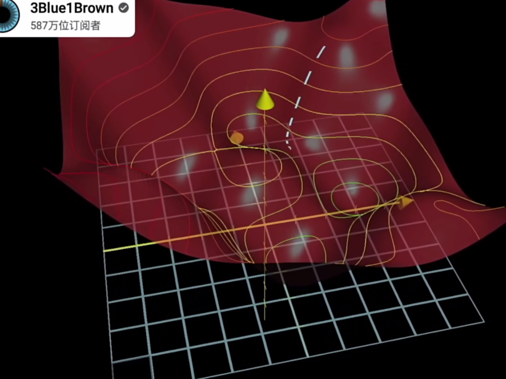

# 大语言模型入门理解（转制）

@turn1tup

从B站视频转制  [从零开始学习大语言模型](https://www.bilibili.com/video/BV1v4421w7pU)，看完大呼过瘾，“噢~原来机器学习是这样”。

## 监督学习

在聊模型是如何进行“学习”之前，我们先通过人类如何学习一门新的语言开始说起，例如我们去学习英语。

左边是意义不明的 字母单词组合，右边是我们能看懂中文解释，我们要做的就是记住这些英文词汇和他们的含义，通过将陌生词汇和他们的含义对照，我们就把对新语言的认知建立起来了，这个过程可以被称为“监督学习”。

监督学习的主要特征是用到了大量“标记数据”，也就是说需要学习的内容，都通过学习者能够理解的方式做了标记，于是我们才能够把未知信息与已知新信息一一对应起来建立联系，然后再往陌生的、更复杂的情况去推导。

比如我们知道time表示时间，fly表示飞行，当我们 看到“time flies very fast”，这种高级的、未见过的用法时就可以进一步分析出它的含义时“时光荏苒”。用有限的知识解决无限的问题。除了这种监督学习，还有另外的情况，我么们可能得不到单词表那样明确指导，就像刚刚出生的婴儿的我们连中文都不会的时候，或者时上世纪很多人再外语都不懂的情况下就闯出去挣外汇，但这两种情况下最大后大家都能适应下来，那这样的情况下大家都是怎么学习的呢？

## 无监督学习

这时候只能通过阅读、听力或者观察语言再日常生活中的使用来进行学习，在这种情况下我们可能会开始识别模式，比如某些词汇总是在类似的情景下反复常出现，或者某些词具有相似的结构或音韵特征，比如fuck、shit 都有强烈的语气词且一看就不是与人礼貌打招呼的用词。

藉此我们就会逐渐魔术出花来一套潜在的规则和分类，比如自然而然地把词汇分成动词、名词和形容词，即使没人明确告诉我们这些分类，这就叫无监督学习。

## 机器学习基本类型

监督学习与无监督学习构成了机器学习领域的两个基本类型，由此衍生的还有一系列诸如半监督学习、自监督学习这些混合学习模式，但归根结底这些方法都是为了让机器能够让人一样学习，随着时间和联系能不断提高知识和节能功能，让计算机能够通过算法自行找出 数据之间的关系和模式，而不需要人类之间编程具体的步骤来执行这一任务，这一概念正式机器学习与传统编程的更笨区别所在。它的深远意义在于只要我们能找到一套有效学习到东西的算法，它就可以广泛地使用到不同的任务中了。

比如目前我们弄了一套算法，喂给它人脸照片它就能够学会定位人脸，那同样这套算法，你让他去学会定位人手也是可以的

给它看大量包含首部的照片就行了，它自己就能学会，而不是向传统编程那样需要重写写一套规则告诉它人手长啥样。

然而当我们正真照着这个思路走的时候呢，许多具体的问题又出来了，其中最主要的两个问题就是数据和模型，我们已经知道，机器学习的本质时构建一套神经网络模型，让模型从大量数据中学习。那怎么获取到足够而且高质量的数据，怎么构建一个能力强、学习效率高的模型，这二者就成了影响学习效果的关键，整个机器学习的发展史也基本就是围绕这两点展开的。

## 机器学习的模型

今天人工只能领域的热词“大语言模型”它就是在这两方面都取得了突破，这里先讲讲模型。模型通常被用来表示对现实世界现象的简化和抽象，而在机器学习领域，我们可以把模型看作一个函数，再直白点就是一个有输入有输出的黑盒子。这个黑盒子的内部结构可能复杂得难以想象，不过我们不用管这点，只需关注它能否针对输入给出正确的输出。

比如你输入一张狗的图片，它的输出应该就是“狗”

它要是看着照片输出是某个人，那就学坏了。

把模型类比成黑盒子后，模型的训练过程就是调整这个盒子里秘密麻麻的小开关，训练完了每个小开关的开闭状态就被锁死了，然后这时候赛一张狗的图片进去，问它是不是狗，那它输出的小灯就得亮起来

问它这是“林哥”吗，这就得灭。这样它就是学明白了。

## 感知机单元

如今流行的语言模型是基于一种叫神经网络的技术，顾名思义，它模仿的是我们大脑神经系统的结构，基本单元神经元，而神经元是大脑中一种能以简单发放时相互交流的细胞，通常来说可以理解它未有很多条腿，大部分腿比较短，用来接收刺激（输入），然后其中一条腿特别长，连接到另外一个神经元，负责向下传递刺激，这样一个结构就可以让神经元根据输入做出一些简单判断

比如某位同学再学习高数，他的神经元接收到的信号就是褪色的教材封面、枯燥的文字、晦涩的公式，汇总到一起 ，这条长腿输出的可能就是完全麻痹的、无动于衷的

这时候给他换个场景，比如玩原神游戏，那这几条短腿接收到的就是鲜艳的花边、精致的人物、优雅的角色服装，这些刺激一过来，神经元的这条长腿就会变得粗壮兴奋起来，输出信号狠狠地刺激下一个神经元

然后成千上万个神经元组成在一起，这些刺激就会汇总成一个更高层级的输出。

比如当生活费到账后，这位同学可能反手就会充一个648，做出一个令人遗憾的决策。

机器学习里的神经网络模型，就是借鉴了这个生物学结构，它的基本单位被称为感知单元，结构和神经元很类似，也是有多个输入和一个输出

感知单元的运行过程就像投票评分，每个输入都是一个分数，而每个分数又对应着不同的权重（分数x，权重w），就好比等级不同，话语权不同的评委

比如有三位评委分别给出了 0.1、0.1、0.4，他们的权重分别是0.5、0.1、0.4，那最终的得分就是这三对数字乘机的和，也就是0.22.

而这个感知机特别的地方就是，它有一个分数线，比如0.5，过了这线就表示激活，没过的话就不激活，这样就模拟了神经元的公桌过程 ，

但这个设计如果真正落实到数学上又出现一个问题，就是我们没法往回追索了。还是回到原神的例子，现在我启动了元神后，我的感知兴奋了，输出了1。可是我怎么知道哪个因素是最关键的因素呢？

一个自然的想法，就是我分别在这三个方向上加大力度，我让画面更鲜艳、人物更精致、或者服装更优雅，可是这么干后我们会发现输出还是1，什么也分析不出来。所以这里 还要做的一个修改，就是我不再粗暴地一过线就输出1，而是把实际分数作为输出，这样我们还是从这三个角度分别加大力度，从输出分数的变化幅度，我们就能追回去知道哪个因素对感知机的影响最大了

而对输出的调整，在今天的深度学习中是最常见的一种激活函数了

那现在我们已知道一个感知机单元式怎么运作的了，把它们连成多层网络结构，它们就也会像神经元组成大脑那样，展现出强大的信息归纳能力。一个简单的多层神经网络模型，包含一个输入，两个隐藏层和一个输出层

## 权重与损失函数

前面说过，模型本质上就是能读入输入如然后输出准确答案的黑盒子，这个答案可能式一个 猫、狗、“林哥”这样的分类标签，也可能是一个预测出来的数值，比如三天后的股票价格，这些都需要在输入和正确答案之间建立起特定的映射关系

在神经网络模型中，每个单元之间的连接都是一个权重数值，这些数值可以在输入输出之间建立起无数种映射关系，可是怎么才能确定这大量的权重数值，每个分别应该是多少呢？ 这就要靠反向传播算法了。

在讲该算法之前，我们还要先回顾一下函数和导数的概念。函数说白了就是一个写死的对应关系，比如y=2x，这里把每个输入都乘2的关系就是函数，而导数就是用来衡量输出相对于输入 的变化速度的。比如输入变量调大一点，2到2.1，这里的输出会增加0.2（4.2-4)，那它的导数就是2，相对的，y=3x的导数就是3，变化速度会更快。不过神经网络又要复杂得多，输入变量远不止一个，比如一张200*200得图片那就是4万个像素，这就涉及到偏导数，它类似于前面元神得例子，场景、任务、服装都是刺激兴奋的元素，其中哪个因素作用最大就是偏导数要求解的东西，它要求解的就是这些不同的输入变量分别对应的权重是多少。

实际在计算机里训练一个神经网络的流程是这样的，首先训练程序会为每个输入变量随机分配一个0到1的权重值，比如场景的权重是0.5、人物是0.1、服装是0.4，然后我们假设这三个输入都是可以量化的，比如在某一个游戏时刻，场景美化0.1、人物精致0.1、服装优雅0.4，在第一轮随机权重下算得分数就是0.22，这就完成了第一轮向前传播，根据输入把输入算了出来，

但是这个时候我们发现这个结果是错的，分数不够高，而0.4的服装就已经让人兴奋了，正确分数是0.6。这里的预测值和实际值就有了偏差，但这个偏差如何衡量呢，这儿就要用到损失函数

损失函数通常是基于统计学的数学模型，场景的有均方误差、交叉熵损失、绝对误差等，损失函数的结果永远是一个非负数值（y=f(x)>=0）,而这个树就被用来衡量模型的判断于实际情况的偏差程度。比如用绝对误差，那上面模型的误差为0.38，那么我们应该如何缩小这个误差？首先我们知道这个模型的输入与输出之间的关系完全是由权重的数值决定的，同样的输入，权重值一旦变化就会不一样，问题就来到了权重值如何修改。此时我们可以把偏差堪称是一个关于这些权重值的函数，或说损失函数。

我们希望找到损失值变化最快的方向，也就是梯度。梯度可以看作一个函数在特定点上的“斜率”或“坡度”，它总是指向函数增长最快的方向。

假设我们在一座山上（三维世界），梯度就是告诉你往哪个方向走能最快地上山。相应地加个负号就是下山最快的方向，一直让权重数值沿着这个方向走，损失函数的值（模型输出与实际偏差）就会越来越小，这个过程就叫梯度下降 

对应到原神的例子，模型给出的映射关系为 `y = w1*x1 + w2*x2 + w3*x3` ，即y关于输入x的线性函数。

这个如果我们反过来把它看成y关于权重w的线性函数 ，对w1、w2、w3分别求导，结果就是x1 x2 x3。

想让偏差减小，就需要把0.22往0.6上拉，也就是让结果沿着 0.1 0.2 0.4的方向就可以

但这只是3个变量，在神经网络的实际使用中，变量、权重的数量可能由成千上万乃至数十亿、数百亿 ，而且是层层向下传导，而我们需要借助链式法则来 解决这个问题

## 链式法则

链式法则是一种计算符合函数导数的方法 ，当一个函数是由多个函数嵌套而成的时候，它的导数就等于外部函数的导数再乘以内部函数的导数

按照这个原则我们就可以把一个很复杂的函数一层层拆解，得到每一层、每一个权重值的偏导，最后汇集成一个超高维度的梯度。就像把洋葱一层层剥开一样，如二刷一部电影，理解每个事件、每个线索是如何影响后续事件，最终影响整个故事的走向。

先把输出算出来，再反向把梯度权重算出来 ，最后让所有的权重沿着这个梯度的方向前进一点点，我们就完成了更新，模型就朝着更“准确”的方向 又靠近了一点

一开始所有的权重都是随机生成的，所以模式的修正速度起初会快一些，但越往后，准确率提高得越来越高这个速度就会逐渐慢下来，这时候我们就说这个模型得训练“收敛”了，等模型收敛是一个耐心的活。但并不是所有的模型都一定能再训练的过程中收敛，如模型本身有问题、训练数据有问题或超参数设置的有问题都可能会导致模型训练不出来，一直在抖动。 

常见的超参数包括批量大小、迭代步数、激活函数、优化器选择、学习率等等，它们不改变模型结构但是会控制模型怎么训练的这个过程，其中最重要的一个超参数类型就是学习率，它决定模型参数的更新幅度。

前端有说到梯度能指出偏差减小最快的方向，但这只是基于损失函数在这一刻所在的这一个点，你要是一步迈大了，反而可能一下子跳到更高的地方上去了，导致下不去（无法收敛）；但如果你移动的特别小也不合适，一方面会让训练过程特别慢，另外一方面，大山谷里面有个小坑，你可能就直接陷进这个小坑里  ，再也走不出来，所以这快需要反复测试积累经验，直到和模型融为一体。其他的超参数设置也都是类似，各有各的特征和局限，都需要 反复磨练，依赖研究人员的测试和直觉进行调整 ，这也是为什么机器学习有时候被称作“炼丹”。

然而超参数还不是最麻烦的，甚至如果经费充足，你也能把超参数丢给机器去学习，真正从底层决定训练能不能成的，其实是模型的结构本身。当年深度学习差点没发展下去就是发现层数增加到一定程度后，模型就“学不明白了”（无法收敛）。

前面说模型的输出越来越准靠的是反向传播的过程调整每一层的权重，但是在一个层数特别多的模型里，这个反向传播的过程会把很多导数值接连相乘，层数越多乘的越多。而模型的权重值一开始都是随机乱给的，所以这些导数值也都是不确定的，假如有很多值都是大于1的，那这些数撑起来就会导致梯度爆炸，而反过来的话，就是梯度消失，模型远远还没有学明白但就是不动了。直到残差网络（ResNet）的出现，这一问题得到了解决。

## 残差网络

残差网络做的事情很简单，在计算网络层输出的时候，从前面再挑一层加到一块，这一在计算梯度的时候就被上层的原始信息给稀释了一部分 ，梯度变化的稳定性就增强了很多 ，不会爆炸也不会消失，构建足够深的网络才成为了可能。	

在残差网络之前，神经网络的深度通常在几层到几十层，著名的AlexNet为8层，VGG为16到19层，残差网络出现后神经网络都是上百乃至上千层了，也就具备解决更加复杂问题的能力，它的作者何凯明也因此拿到了2016年CVPR最佳论文奖。今天的残差网络已经成为神经网络里一个 几乎必备的结构了，几乎所有的大模型都能看到它。

## 欠拟合与过拟合

但是走到这里，把超参数调好、把模型深度拉大，也不一定能让模型收敛，数据也十分重要。如果让你12年只学数学，高考考你英语，你也整不明白。而机器学习中通常也不会犯这样低级的错误，但有时候可能数据太复杂，以至于模型能力根本不足以找到合适的关系，这就会导致欠拟合（underfitting） ，也就是模型准确率提升到一定程度之后就停滞了。

欠拟合问题容易被发现，但另外一种情况就比较隐蔽了。有时候模型能力太强，把数据全原样背下来了，甚至记住一些干扰因素。比如让其记住一张坐在椅子上的人是人，结果它记成坐在椅子上的是人，换个狗坐在椅子上，它还是觉得这是人，它并没有学到真正的普遍规律，这就是过拟合（overfitting）。

## 被颠覆的“泛化”

真正学明白的模型是要具备泛化能力的，泛化指的模型遇到从未见过的数据的时候的能否准确识别处理，它是衡量模型性能的一个关键指标。真实世界的变化是无穷无尽的，只有真正从数据里学到了底层规律才能推而广之解决更多的同类问题。

那怎么来评估一个模型的泛化能力呢？我们会把数据划分为 训练集、验证集、测试集来坐这件事情。

- 训练集：平常的作业和习题，模型通过学习训练集上的数据来识别模式和规律

- 验证集：模拟考试，用来阶段性地评估模型表现，模型 通过训练集的数据更新内部的权重值 ，经过验证集检查能力，验证效果不好就调整超参数或者修改网络结构，直到它在验证集这个模拟考试上能拿到高分。

- 测试集：最后的高考，它评估模型放到现实世界中最终的性能大概会是什么样。之前模型只学习过训练集，然后通过对训练过程的调整把规律推广到验证集上，但测试集它是未接触过的。

一个模型能通过测试集的测试那它大概率就成了，然而当大模型到来后，一个超级超级大、参数几百上千亿的模型把这个“泛化”的概率又给颠覆了。由于这种模型实在太大了，即使是一个装了互联网全部文字的数据集它都有能力完全背下来，那它最终表现出来的能力到底是因为真的理解了人类知识还是在机械地照搬它背下来的文字呢？因此也就有人质疑，就目前的大模型并没有真正体现只能和学习能力，只是背东西比较猛而已。但无论如何， 今天这种从小型专用模型到大型通用模型的转变，标志着深度学习进入了一个重要的发展阶段。