# SpringWeb下的路径鉴权问题

@turn1tup

## 1.问题的模型

&emsp;&emsp;应用的业务功能中，鉴权与授权 Authentication/Authorization是一项重要的功能。通常，不同URL路径对应着web应用的不同的业务功能，开发者编写的web应用中会将鉴权逻辑独立出来，并通过filter/interceptor这些前置的拦截器对用户的请求统一地进行鉴权判断。

&emsp;&emsp;本文给出了不同解析方式下的差异问题表，并对这些解析模式进行了相应的代码分析，最后根据前文的问题模型对漏洞模式进行了分析。

&emsp;&emsp;首先，对于鉴权这块的逻辑缺陷导致的接口未授权访问，实际存在如下实体，并可据此进行系统性地分析，本文实际也围绕如下对象进行叙述：

- URL资源路径：路径的格式，资源路径的解析差异
- 控制层与业务层：分层容易带来“解析不一致”问题
  - 控制层：过滤拦截，鉴权判断
    - 资源路径的解析
    - 鉴权路由的匹配
  - 业务层：资源定位，获取到URL资源路径后，根据路径映射表选择业务类来处理
    - 资源路径的解析
    - 路由匹配模式
- 手动鉴权下可能的逻辑缺陷
  - 黑白鉴权逻辑问题


## 2.解析差异总览

&emsp;&emsp;这里先放两张表格，分别概括了spring 资源路径解析、路由匹配方式 两块不同版本的功能情况，也是对后文分析的直接总结，在浏览后文内容时可以将这里作为“地图”进行阅读。

相关选项的解读以及备注（在后文中也有逐步的说明）：

- 解析路径参数：如“/path;name=value;name2=value2/”，格式化为“/path/”，“/path;”也会格式化为“/path”
- 移除分号内容：即定位到分号“;”，将其和后面的字符都移除，“/path;JESSIONID=123”->“/path”
- URL解码：由于[tomcat7就开始](https://github.com/apache/tomcat/blob/7.0.0/java/org/apache/tomcat/util/buf/UDecoder.java#L34)禁止路径带有编码的路径分割符“%2f"，协议层面就400，tomcat下其实就不必关注%2f这块，所以这里指路径content部分；至少springmvc pathContainer本身也不支持将%2f看作路径分割的。
- 归化多斜线：递归将“//”替换为“/”
- 解析目录跳转
- 后缀匹配：后缀名匹配，当前路由可以命中带某些后缀的路径，如/hello路由可命中 /hello 与 /hello.do 的请求路径
- 尾部匹配：当前路由可以命中尾部带目录分隔符的路径，如/hello/和/hello
- trimTokens：用于消除路径中各个content的空格，如 "/test1%20/test2%20" 消除后变为"/test1/test2"

通过下面的表我们可以找到某个版本其支持的选项且其他版本不支持，随后进行测试，就可以得到当前 spring应用的解析模式与版本情况

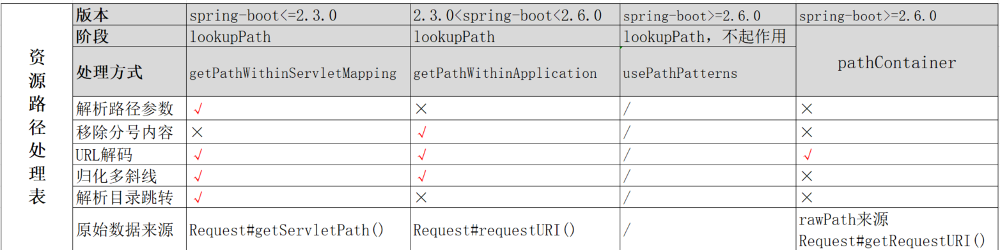

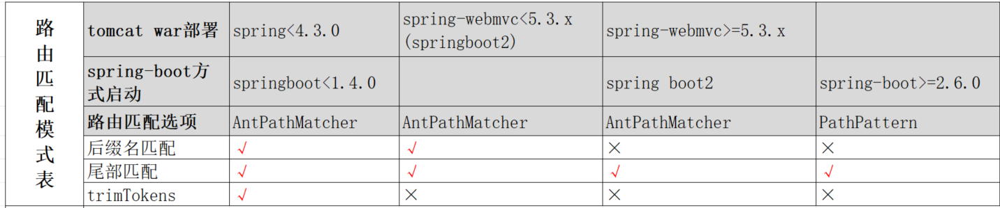

&emsp;&emsp;如针对 spring-boot 2.3.0，我们通过 “/foo/..//path”可以访问到 “/path”，但是其他版本的路径解析有的不支持 目录跳转、有的不支持归化斜线，这样就可以识别目标应用路径解析模式。

&emsp;&emsp;用户、框架、spring自身通常也会频繁用到 getServletPath、getRequestURI 方法，他们有如下的情形：

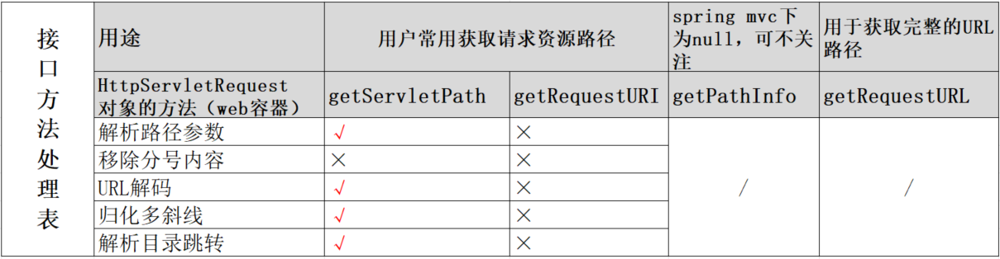

## 3.alwaysUseFullPath变化下的资源路径解析

### 3.1.alwaysUseFullPath的变化

&emsp;&emsp;分层架构下的各方使用不同的解析器来进行同一种事务的处理，这导致了解析不一致的问题。

&emsp;&emsp;springmvc会在DispatcherServlet中获取当前请求的处理器handler，随后调用该handler来处理当前请求，也就走到我们的业务类Controller。而DispatcherServlet会通过调用`UrlPathHelper#getLookupPathForRequest`方法解析并获得当前路径。


spring-boot-2.5.15下对资源路径的解析有如下流程：

DispatcherServlet#getHandler

->AbstractHandlerMapping#initLookupPath() : spring5中在这里增加了一个 usesPathPatterns 判断，后文将进一步说明

​	usesPathPatterns==false

​	->UrlPathHelper#resolveAndCacheLookupPath()

​		->UrlPathHelper#getLookupPathForRequest()

​			->`alwaysUseFullPath == true` ? `getPathWithinApplication()` : `getPathWithinServletMapping()`

&emsp;&emsp;UrlPathHelper#getLookupPathForRequest()：从下图代码可以了解到，在本方法中alwaysUseFullPath决定了使用哪个get path方法来进行具体的解析，这里的两种解析方式将在后文进一步说明。

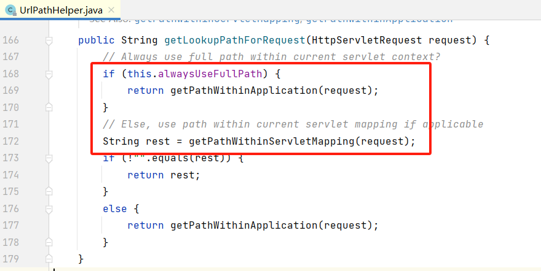

&emsp;&emsp; alwaysUseFullPath 值在 `spring-boot <=2.3.0-release` 下默认被赋值为 false ，即getPathWithinServletMapping；在 `spring-boot>=2.3.1-release` 中被配置为true，getPathWithinApplication。

&emsp;&emsp;下图代码中可以看到，在 spring-boot-autoconfigure-2.3.1.RELEASE 中通过 WebMvcAutoConfigurationAdapter 进行自动装配，将alwaysUseFullPath设置为 true。

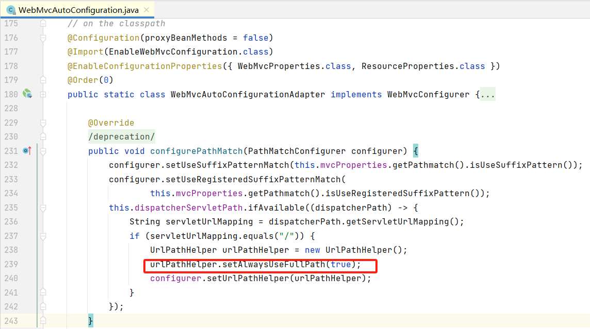


### 3.2.getPathWithinServletMapping解析方式

&emsp;&emsp;alwaysUseFullPath为false时，spring通过getPathWithinServletMapping方法解析并获取路径，之后用于路由匹配中。

&emsp;&emsp;getPathWithinServletMapping 方法可以简单看作getServletPath方法所获得的值（笔者对这里的方法的业务逻辑与目标没看得很懂，但这样理解是没问题的）：

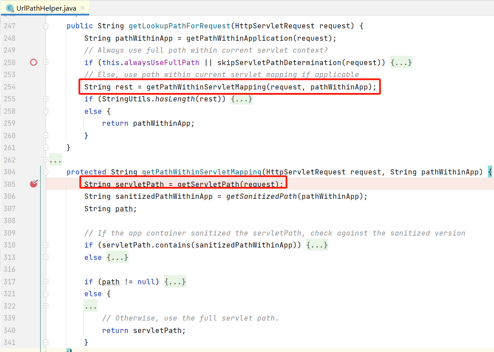

&emsp;&emsp;UrlPathHelper#getServletPath方法最终获取的tomcat容器提供的servlet path，调用流程如下，实际与与

&emsp;&emsp; org.apache.catalina.connector.Request#getServletPath() 值一样：

```
UrlPathHelper#getPathWithinServletMapping

	-> UrlPathHelper#getServletPath

		-> javax.servlet.http.HttpServletRequestWrapper#getServletPath()

```

&emsp;&emsp;getServletPath方法值来源于web容器tomcat，tomcat在协议层连接器connector就对器进行了初始化。

&emsp;&emsp;通过debug我们可以发现getServletPath()的值来源于decodedURI变量，有如下反向数据流说明：

```
HttpServletRequestWrapper#getServletPath()

		<- org.apache.catalina.mapper.MappingData#wrapperPath

			<- org.apache.catalina.connector.CoyoteAdapter#postParseReques()：decodedURI变量
```

&emsp;&emsp;进一步阅读代码可知，tomcat使用 normalize方法 对uri进行格式化

```
CoyoteAdapter#postParseRequest()中的decodedURI变量

	-> parsePathParameters()：解析路径参数，如“/path;name=value;name2=value2/”，格式化为“/path/”
	
	-> normalize() ：对uri进行格式化，包括 反斜线替换为斜线、多斜线归化、目录跳转递归还原，未处理分号
```


### 3.3.getPathWithinApplication解析方式

&emsp;&emsp;alwaysUseFullPath为true时，spring通过getPathWithinApplication方法解析并获取路径，之后用于路由匹配中。

重点解析逻辑在decodeAndCleanUriString中，其做了 移除分号内容、URL解码、归化等操作，调用流程可参考下面：

UrlPathHelper#getPathWithinApplication

​	->getRequestUri

​			->decodeAndCleanUriString

​					->removeSemicolonContent  ：移除分号及分号后面的内容

​					->decodeRequestString ：URL解码

​					->getSanitizedPath：归化“//”为“/”


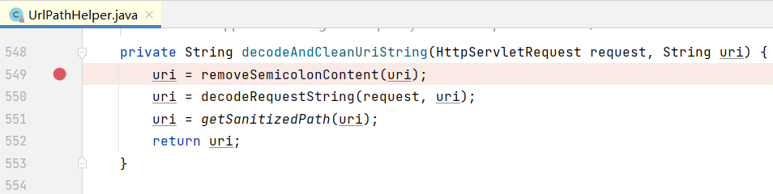


## 4.路由匹配模式下变化

### 4.1.路由匹配

&emsp;&emsp;springmvc目前有PathMatcher、AntPathMatcher 两个内置的路由匹配模式，前者为spring5.0新增的，在 spring-boot>=2.6.0 的情况下，由于PathMatcher默认非空 且 AntPathMatcher为空，导致默认启用PathMatcher匹配模式，关于这点的逻辑我们可以在 RequestMappingInfo#getMatchingCondition 方法中了解到。

&emsp;&emsp;如下图代码所示，RequestMappingInfo#getMatchingCondition 中会获取用于路由匹配的Condition，spring5新增的PathMatcher模式对应着下图第一个红框的代码 pathPatternsCondition。通过阅读代码可以了解到，spring5有PathMatcher、AntPathMatcher、custom 三个选项的路由匹配方式。另外在代码开头可以看到，这里也针对 方法、参数、头部等 获取了相应的匹配Condition，如果我们设置的Mapping为GetMapping，这里的 methods 则会过滤 GET 外的其他请求。 

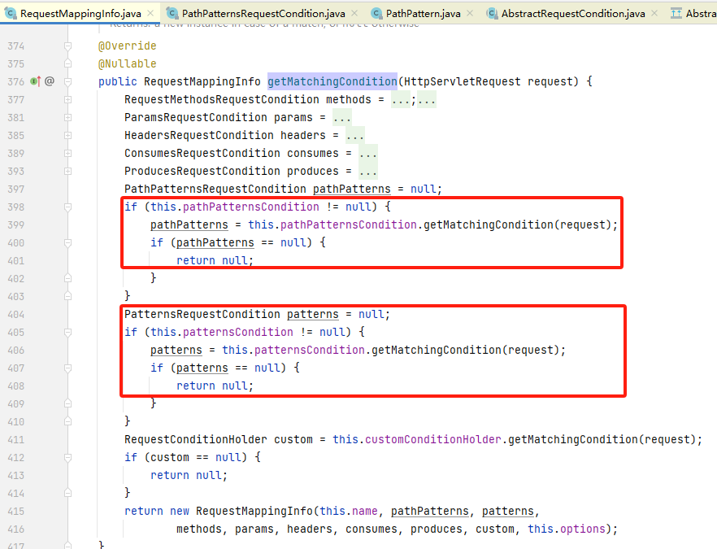

&emsp;&emsp;下图为类继承关系：匹配模式的业务类需要继承AbstractRequestCondition，图片下面的二者分别承载了PathPattern、AntPathMatcher的配置、逻辑。

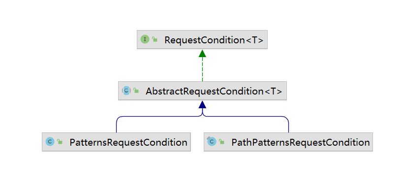

&emsp;&emsp;下图为关系依赖图：我们关注红圈的关系线即可，实际上，RequestMappingInfo执行路由匹配时用到的Condition(PathPatternsRequestCondition、PatternsRequestCondition)最终依赖PathPattern、AntPathMatcher

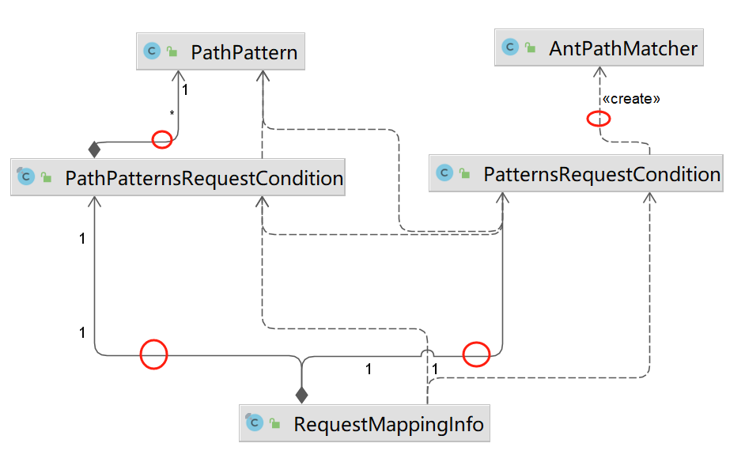

### 4.2.AntPathMatcher路由解析

&emsp;&emsp;我们先了解一下AntPathMatcher路由匹配模式下的关键选项：

- useSuffixPatternMatch：
  - 后缀名匹配，置为ture后，当前路由可以命中带某些后缀的路径，如/hello路由可命中 /hello 与 /hello.do 的请求路径
  - `>=spring-webmvc 5.3.x` 情况下默认为false；spring-boot 2中皆为false，这是由于
- useTrailingSlashMatch：
  - 尾部匹配，置为true后，当前路由可以命中尾部带目录分隔符的路径，如/hello和/hello
  - 全版本都为true
- trimTokens：
  - 用于消除路径中各个content的空格，如 "/test1%20/test2%20" 消除后变为"/test1/test2"
  - `>=spring 4.3.0 /spring-boot>=1.4.0.RELEASE` 情况下，AntPathMatcher模式默认为 false

&emsp;&emsp;useSuffixPatternMatch在spring-boot中收到spring-boot-autoconfigure的PathMatch影响，由于其默认为false，所以用户未配置的情况下，spring-boot2皆为false

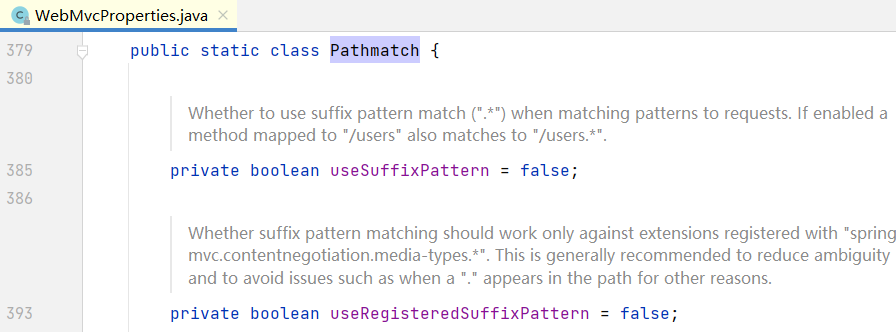

&emsp;&emsp;我们前面有说到，AntPathMatcher是由PatternsRequestCondition来引导实现的。

&emsp;&emsp;具体来看下图的PatternsRequestCondition.getMatchingPattern方法，入参分别为路由、被匹配的路径，这里可以看到 useSuffixPatternMatch、useTrailingSlashMatch选项的实现，另外trimTokens选项则在 pathMatcher.match 中通过调用tokenizePattern来实现。

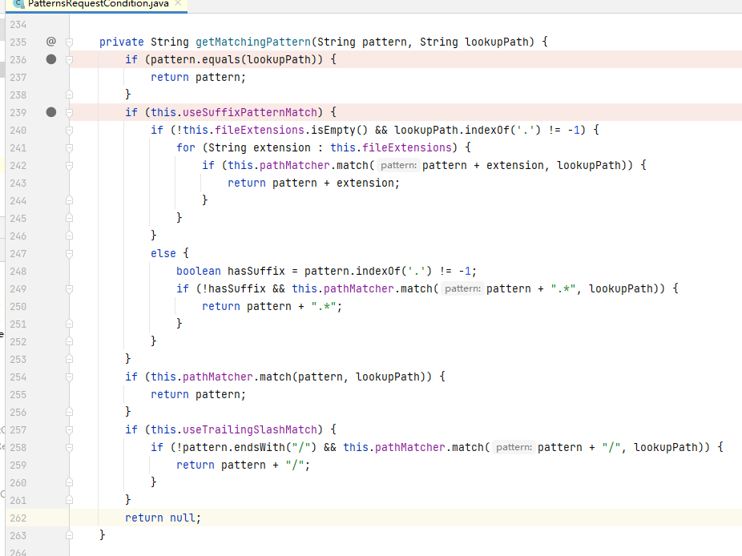

&emsp;&emsp;而pathMatcher.match也就是AntPathMatcher.match，AntPathMatcher实现了 ant风格的匹配，可以让路由拥有 “？”、“*”、“**”等灵活的匹配方式：

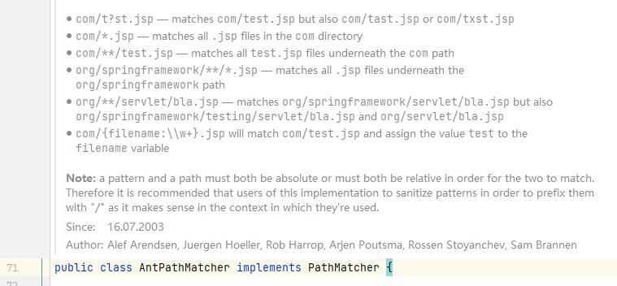

### 4.3.PathPattern

&emsp;&emsp;PathPattern路由匹配方式在spring-boot>=2.6.0下默认开启

#### 4.3.1.PathPattern下的资源路径解析

&emsp;&emsp;是这样的，该模式下有个 usePathPatterns  被置为 true，如下图所见，这样一来就不会走到我们前文所说的 getPathWhithin 一类的资源解析流程（图片中的else），而是走到 if 中，但是，需要注意的是，这里返回的对象实际没被使用，也就是说我们不需要关注这里的代码（好吧~）。

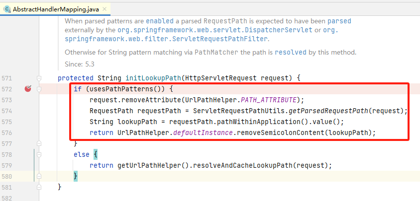

&emsp;&emsp;HTTP请求的资源路径实际上会被解析为Element数组对象，斜线即目录分隔符“/”使用Separator封装，目录内容则使用PathSegment来封装，且这个Element数组对象保存在 MatchingContext中，以供 PathPattern对象使用。

&emsp;&emsp;下图展现了Element的子类，且 MatchingContext 依赖了 Element （保持数组对象）。

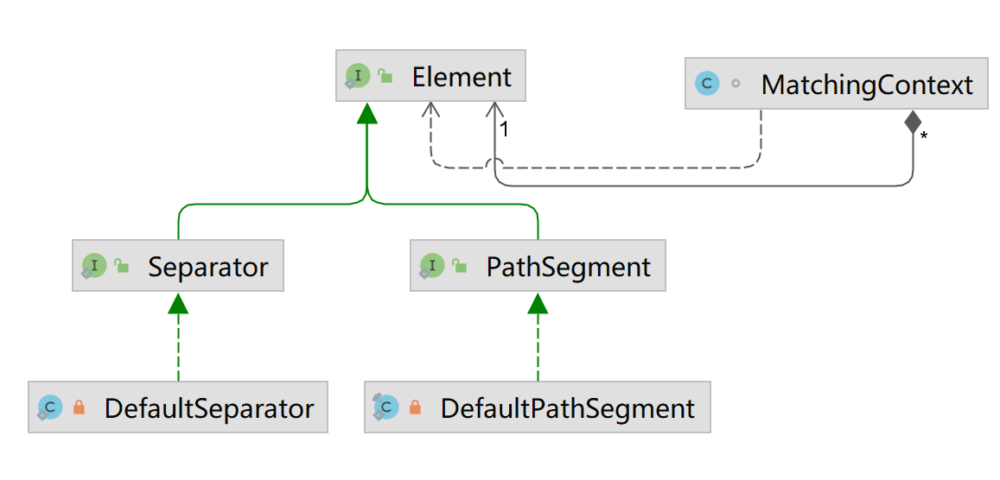

&emsp;&emsp;PathPattern$MatchingContext：


&emsp;&emsp;elements数组对象实际为PathContainer对象中的一个字段，PathContainer对象即下面方法中的 this.pathWithinApplication/this.fullPath 对象（区别不大）

```java
//DefaultRequestPath#DefaultRequestPath(java.lang.String, java.lang.String)
	DefaultRequestPath(String rawPath, @Nullable String contextPath) {
		this.fullPath = PathContainer.parsePath(rawPath);
		this.contextPath = initContextPath(this.fullPath, contextPath);
		this.pathWithinApplication = extractPathWithinApplication(this.fullPath, this.contextPath);
	}
```

&emsp;&emsp;断点下到DefaultRequestPath构造方法，查看前面的代码流程可以发现这里的 rawPath 值实际来源于 o.a.c.c.Request#getRequestURI，也就是说 elements分割的请求的路径的值和我们编写程序时候 拿到的req.getRequestURI()值是一样的，该值为 MessageBytes.uriMB，未经过处理。

&emsp;&emsp;createFromUrlPath方法将 rawPath  转换为我们需要的 PathContainer对象，通过“/”分割路径的过程中，对遇到的content会进行URL解码，因此，路由匹配时被匹配的路径实际是经过URL解码的； 但pathContainter路径解析过程中，只通过“/”来分割路径，所以在此情况下会将“%2f”看作目录contont而非slash。

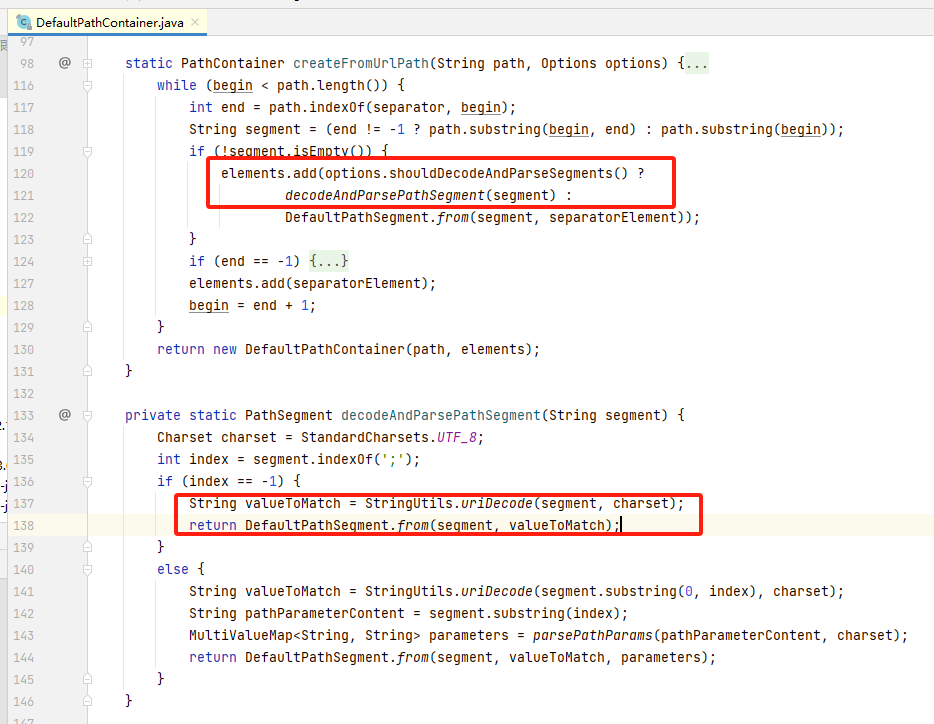

#### 4.3.2.PathPattern下的路由匹配

&emsp;&emsp;路由匹配中，会将Mapping注解路径解析为一个双向链表数据结构的对象，对应的类为 PathElement，并将这个路由匹配对象保存在PathPatterns的heads。

&emsp;&emsp;从 PathElement的相关字段 next、prev 可以看出其为链表数据结构：

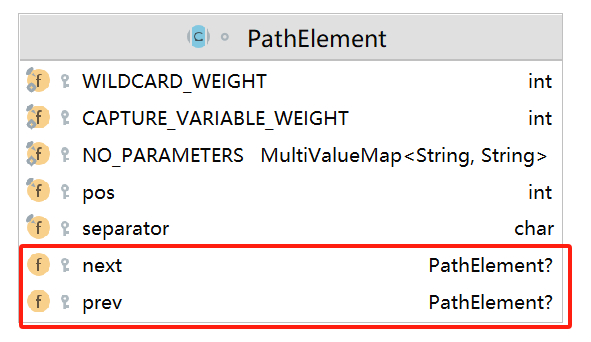

&emsp;&emsp;资源路径解析中的PathContainer将路径分为两种类型，PathPatterns除了通过下图左边的 SeparatorPathElement、LiteralPathElement来覆盖与之类似的两种类型外，为了提供丰富的路由匹配模式，如通配符匹配，则会通过使用各类型PathElement来实现这些功能。

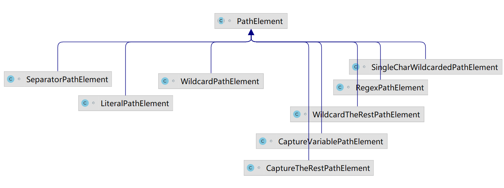

&emsp;&emsp;前文我们有说到，PathPattern的路由匹配是由PathPatternsRequestCondition来引导实现的。

&emsp;&emsp;下图代码中可以了解到，路由匹配的匹配者为PathPattern，被匹配者为 PathContainer，由于二者都是 “节点”类型的数据结构，所以其匹配逻辑也就可以理解了。

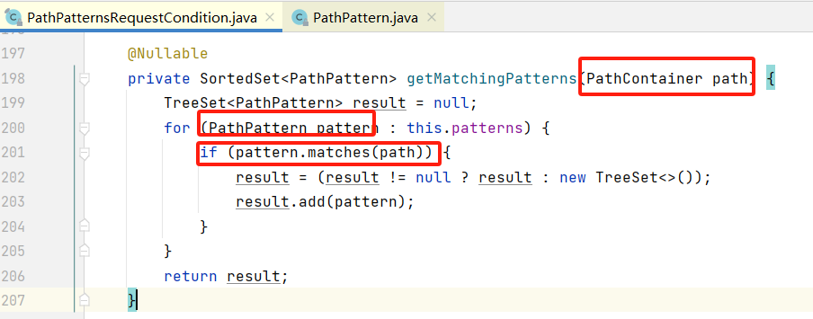

&emsp;&emsp;PathPattern的matchOptionalTrailingSeparator字段的值默认为true，即该模式下允许尾部匹配，当然，实际处理逻辑则是在 LiteralPathElement 中实现的，下图为PathPattern的相关字段：

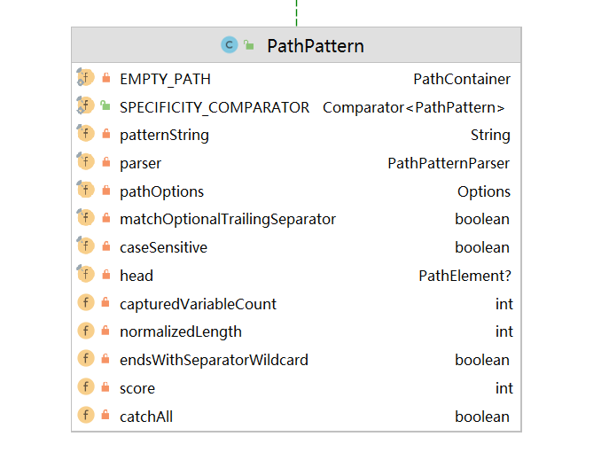

## 5.漏洞模式与案例

### 5.1.鉴权框架下的解析不一致

&emsp;&emsp;在过滤器层面对用户的请求路径做鉴权处理，和应用类似，这里有两个解析处理点：

- 资源路径的解析处理，结果也是作为被匹配的对象
- 鉴权路由的匹配或排除：使用用户配置的匿名接口、鉴权接口 去匹配 当前解析到的资源路径

#### shiro


&emsp;&emsp;下面以shiro 1.5.1权限绕过作为案例。

&emsp;&emsp;通过debug shiro的认证处理流程PathMatchingFilter，我们可以发现 shiro 针对 资源路径的解析方式是模仿的spring getPathWithinApplication的，而其 鉴权路由的匹配 则也是类似 spring **AntPathMatcher**的。

&emsp;&emsp;在spring-boot 2.3.0 集成 shiro 1.5.1 情况下，针对资源路径的解析有如下差异问题：

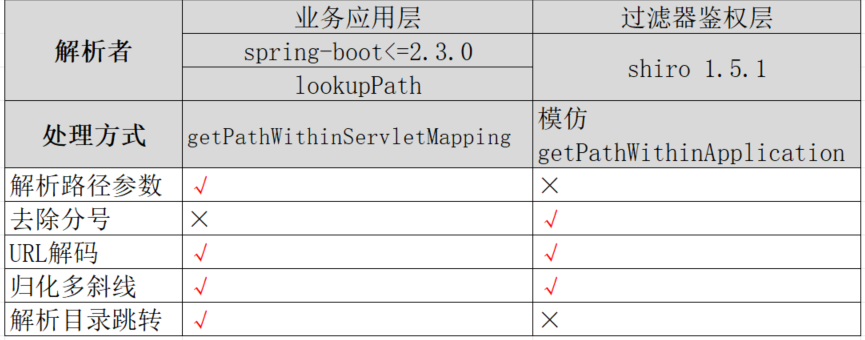

&emsp;&emsp;于是，在这种分层的情况中，对于资源路径“/image/..;/test”的资源路径解析有：

-  shiro ，“/image/..”
- spring mvc，“/test”

#### spring security

### 5.2.黑白鉴权逻辑问题

&emsp;&emsp;这里做一个简单的定义，如果一个逻辑单元为需要鉴权，对应的配置数据可以看作黑名单，该方式我们简称黑名单鉴权；如果一个逻辑单元为不进行鉴权，对应的配置数据可以看作白名单，该方式我们简称白名单免鉴权。

如下面的代码为黑名单鉴权：

```java
public class AuthFilter implements Filter {
    
    @Override
    public void doFilter(ServletRequest request, ServletResponse response, FilterChain chain){
        
    if(request.getRequestURI().startswith("/admin")){
        // 鉴权操作 
        // TODO
    }else{
        // 免鉴权接口  
        // TODO 
    }

```

&emsp;&emsp;假设一个攻击目标，攻击者需要绕过该逻辑判断，访问 /admin 路径

&emsp;&emsp;我们打开前文的“解析差异总览”，找到“资源路径处理表”与“接口方法处理表”，对比可知，在不同版本下我们都可以针对该判断条件进行绕过，全版本通杀的方式是对请求的路径进行 URL编码，即可绕过 。

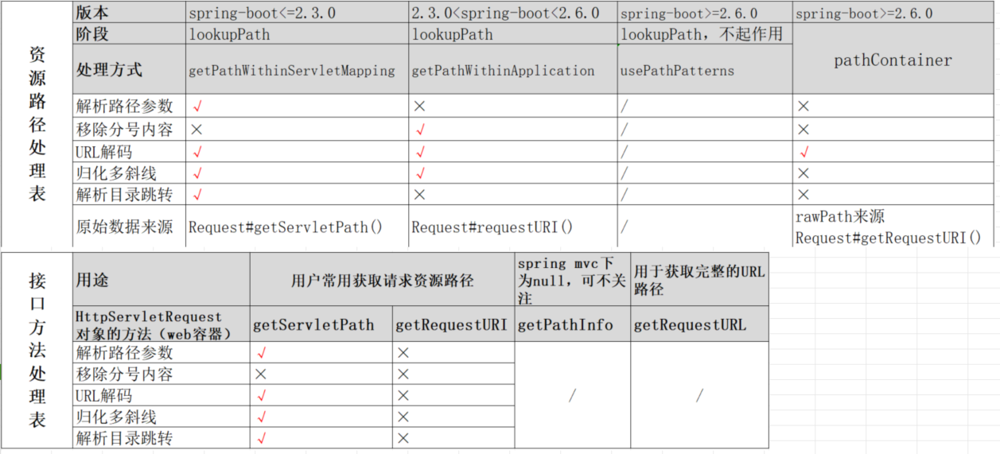

如下面的代码为白名单免鉴权：

```java
public class AuthFilter implements Filter {
    
    @Override
    public void doFilter(ServletRequest request, ServletResponse response, FilterChain chain){
        
    if(request.getRequestURI().startswith("/static")){
        // 免鉴权接口  
        // TODO
    }else{
        // 鉴权操作 
        // TODO
    }

```

&emsp;&emsp;假设一个攻击目标，攻击者需要利用该逻辑判断，从而能访问其他需要鉴权的接口。

&emsp;&emsp;继续查看 “资源路径处理表”与“接口方法处理表” 两种表格，我们需要让过滤层认为当前路径为 /static，那么我们可以利用目录跳转符号，但是，根据表格，该手法只在 spring-boot<=2.3.0 或 springmvc<5.3.0 下生效，对应的poc为 “/static/../admin”


## 6.总结

&emsp;&emsp;匆忙之下编写的此文，对spring下路由匹配前面还有一些逻辑本文未尽善说明，另外这块细节较多，本文难免错漏，欢迎大家补充或修正。此外，本文所总结的问题模型却也不仅仅局限于spring web，以此为思路模板也能让我们分析不同鉴权框架与web容器/mvc框架的情况。

&emsp;&emsp;本文算是对这块的总结与笔记，仔细分析下来，这块比想象中的多了一些门道。

## 7.参考

浅谈springweb路由解析与权限绕过 https://bytedance.larkoffice.com/file/QMAWb533wo7eHExGRMGcZFM7nkh

这个鉴权到底能不能绕 https://forum.butian.net/share/829

Shiro 历史漏洞分析 https://xz.aliyun.com/t/11633

 
