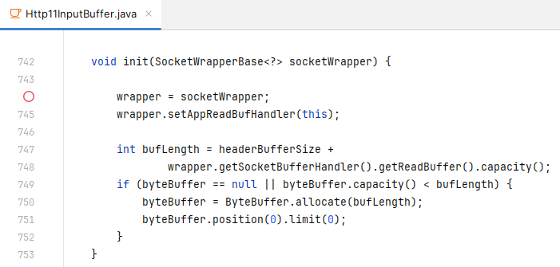

# Apache Tomcat 信息泄露漏洞分析（CVE-2024-21733）

[TOC]

@turn1tup

## 基本信息

&emsp;&emsp;8月13日下发的漏洞演习为该CVE漏洞，这边快速进行了漏洞复现，当时给出了一个简单的分析，这个漏洞也是挺有意思的，今天闲下在家，回顾一下这个漏洞并仔细瞧瞧。

&emsp;&emsp;通过阅读以下CVE披露的漏洞版本信息（3个CVE都影响8.5.7~8.5.63、9.0.0-M11~9.0.43），我们可以了解到，CVE-2024-21733很可能是“老问题新利用”，这也就让我们大致清楚了漏洞情形，并非“全新问题”，而实际与 keep-alive 机制有关。

>https://cve.mitre.org/cgi-bin/cvename.cgi?name=CVE-2024-21733
>
>This issue affects Apache Tomcat: from 8.5.7 through 8.5.63, from 9.0.0-M11 through 9.0.43.

>https://cve.mitre.org/cgi-bin/cvename.cgi?name=CVE-2023-46589
>
>Tomcat from 11.0.0-M1 through 11.0.0-M10, from 10.1.0-M1 through 10.1.15, from 9.0.0-M1 through 9.0.82 and from 8.5.0 through 8.5.95 did not correctly parse HTTP trailer headers.

>https://cve.mitre.org/cgi-bin/cvename.cgi?name=CVE-2021-33037
>
>Apache Tomcat 10.0.0-M1 to 10.0.6, 9.0.0.M1 to 9.0.46 and 8.5.0 to 8.5.66 did not correctly parse the HTTP transfer-encoding request header ...

&emsp;&emsp;[官方披露信息](https://tomcat.apache.org/security-9.html#Fixed_in_Apache_Tomcat_9.0.44)中的[commit](https://github.com/apache/tomcat/commit/86ccc43940861703c2be96a5f35384407522125a)通过try-finally对byteBuffer保持postion、limit字段值被正确设置，我们可以参考这点来指导相关漏洞复现、漏洞分析。


&emsp;&emsp;在HTTP协议中，为了降低TCP握手带来的开销，通过keep-alive，客户端与服务端的HTTP会话可以保持在一个TCP连接中，这个机制也被称为HTTP长连接。

&emsp;&emsp;HTTP请求透中的`Connection`头部可声明客户端期望的HTTP连接类型（close/keep-alive），而协议这块，RFC给出了各种规范，关于该头部则规定服务器应当在客户端未设置该头部时，对于HTTP/1.1将其看作  keep-alive，而HTTP/1.0则为close ，而 tomcat 遵循了这一规范，对于 这点我们也是需要注意到的。

&emsp;&emsp;这里在开头先把POC给出来，后面我们先从整体的逻辑开始讲起，谈谈tomcat在连接与缓存数据上是如何处理HTTP请求的，理解了这点我们就基本明白漏洞底层诱因，接着我们再来说说漏洞细节。

## 漏洞复现与POC

&emsp;&emsp;tomcat8下存在漏洞的版本为 8.5.7~8.5.63 ，我们选择 apache-tomcat-8.5.63 进行 漏洞复现，并注意将tomcat设置为英文。

&emsp;&emsp;发送HTTP请求1

```
GET / HTTP/1.0
Host: localhost

111111111111111111111
111111111111111111111
111111111111111111111
111111111111111111111
111111111111111111111
111111111111111111111
111111111111111111111
111111111111111111111
111111111111111111111
111111111111111111111
111111111111111111111
```

&emsp;&emsp;漏洞的触发需要被访问的页面解析请求Body，藉此攻击者才能去触发超时机制，因此，我们在服务器ROOT下放置如下jsp脚本

```jsp
<% out.write(request.getParameter("p")); %>
```

&emsp;&emsp;由于如果HTTP响应非200等情况，会被退出keep-alive循环处理，因此我们构造如下请求，一方面保证第一个响应页面为status code 为200，另外则让Content-Length大于实际发送的BODY

```http
POST /test3.jsp?p=1 HTTP/1.0
Host: 192.168.150.131
Connection: keep-alive
Content-Type: application/x-www-form-urlencoded
Content-Length: 2

1
```

漏洞复现结果如图：


## 处理器与初始缓存

&emsp;&emsp;Apache Tomcat处理通过Processor处理器来处理处理HTTP请求，而tomcat的配置文件server.xml中默认有 `protocol="HTTP/1.1"`，因此我们通常只需要关注Http11Processor即可。

&emsp;&emsp;tomcat线程池调用Processor，但不对Processor负责，从下图代码可以看到，Processor的获取是从一个 recycledProcessors 池子中拿，当池子为空或者数量不够用时，会注册一个新的Processor放进去，这个扩容行为可能是由更多的并发请求触发的。

java/org/apache/coyote/AbstractProtocol.java:809：


&emsp;&emsp;每个Http11Processor维护着自己唯一的inputBuffer，对应维护着byteBuffer对象，Processor通过byteBuffer缓存用户的请求数据，当本次HTTP请求数据大于先前的，会造成byteBuffer扩容，这样来看，tomcat运行后占用的内存会越来越大。

org.apache.coyote.http11.Http11InputBuffer#init：



&emsp;&emsp;可以注意到，byteBuffer的数据在HTTP会话结束后是不会做清理的，通过查看 init 方法运行时的情况可以印证这点，如下图所示，在init方法中，此时Processor还未从socketWrapper即tcp套接字读取数据，而byteBuffer已经存在数据，这些数据正式先前的用户请求数据（通常情况下，byteBuffer的数据不会被清除，但有些情况下会触发byteBuffer.compact()，如漏洞POC，这样一来就会清除部分数据 ）。这样看来，该CVE漏洞泄露的数据实际就是本次byteBuffer缓存的数据。

org.apache.coyote.http11.Http11InputBuffer#init：


&emsp;&emsp;逻辑梳理后，我们可以想到，泄露的数据可能是其他用户的HTTP请求的Body或HTTP请求头部，但其他用户的len(request line + headers)>len(攻击者HTTP请求)时，攻击者7应该可以获取到 用户的头部数据。另外，普通用户的HTTP请求可以是非长连接的。

&emsp;&emsp;随后我们可以进行如下验证，发送HTTP请求1，带有多个头部且会话设置为close；发送HTTP请求2，即我们的POC，在泄露的数据中我们看到HTTP请求1的头部数据，当然，由于tomcat把header name都统一转小写了，所以我们看到的是小写的 a。

HTTP请求1：


HTTP请求2：


## 长连接的循环处理

&emsp;&emsp;Processor通过其service方法来处理NIO中过来的socketWrapper，如下图所示，HTTP解析的处理逻辑在一个while循环的代码块中的，注意该while循环的判断条件之一为当前HTTP请求需要为keep-alive长连接。而漏洞POC实际上会触发两次HTTP解析，具体的漏洞触发会在第二次HTTP解析处，也就是第二次进入该while代码块处理逻辑时。

org.apache.coyote.http11.Http11Processor#service ：


&emsp;&emsp;另外，当请求1的响应码为400等情况时，keepAlive值会被设置为false导致无法继续while循环，因此我们在漏洞利用时需要注意这一点。

org.apache.coyote.http11.Http11Processor#statusDropsConnection：


&emsp;&emsp;实际上，对于长连接，如果是一个正常的HTTP请求包，该代码也会走到循环2，但随后服务器发现客户端没有更多数据，因此会直接关闭本次TCP连接。

&emsp;&emsp;前文说到“每个Http11Processor维护着自己唯一的inputBuffer，对应维护着byteBuffer对象”，服务器通过这里的  `Http11InputBuffer#fill`方法来从byteBuffer获取客户端的数据。我们前面也讲到，byteBuffer数据不会在使用后格式化，这是因为通过严格控制相关边界即可保证第二次使用byteBuffer不会越界读取到上一次的数据。这里将 `Http11InputBuffer#fiil`方法进行注释，通过阅读下面文字可以了解该代码的业务逻辑：

```java
private boolean fill(boolean block) throws IOException {
    	... ...
    	byteBuffer.mark(); // 记录当前position；postion记录着应用从byteBuffer读取的数据位置。
        if (byteBuffer.position() < byteBuffer.limit()) {
            byteBuffer.position(byteBuffer.limit()); //将postion移动到先前读取到的数据的末尾，避免读取tcp数据的时候当前数据被覆盖
        }
        byteBuffer.limit(byteBuffer.capacity());//设置byteBuffer额外的空间大小，8K
        int nRead = wrapper.read(block, byteBuffer);//从tcp客户端读取数据，写入byteBuffer，此过程中会设置 postion+=nRead
        byteBuffer.limit(byteBuffer.position()).reset();//将byteBufer目前边界limit设置为postion，之后调用者读取的数据不超过limit；此外，调用rest，将postion重写设置为开头mark记录的值
		// 这样一来，通过这个过程保证了边界值postion与实际tcp客户端发送的数据一致。
```

Http11InputBuffer#fiil：


&emsp;&emsp;实际上，在正常流程的keep-alive请求中，单个HTTP请求在解析完成后，进行的下一个 Http11Processor#service 中的while逻辑尝试解析第二个请求过程中，也会触发异常中断 wrapper.read(...) ，导致 byteBuffer.limit还是8192的大小，但由于此时已经是“空包”，后续无法再有“空包”接着触发这个问题。

&emsp;&emsp;如下面的HTTP请求，会触发两次while的代码块，第二次空包解析中也会中断 wrapper.read ：

```
POST /test3.jsp?p=1 HTTP/1.0
Host: 192.168.150.131
Connection: keep-alive
Content-Type: application/x-www-form-urlencoded
Content-Length: 2

12
```

org.apache.coyote.http11.Http11InputBuffer#nextRequest ，该方法代码见下图：

- 每次while代码块，即HTTP请求的处理，在结尾会调用 `Http11InputBuffer#nextRequest` 来重置相关对象数据，正常HTTP请求中，当一个HTTP Request被解析处理后，byteBuffer.limit与byteBuffer.postion值是一致的，即已经读取完了所有数据，因此会调用else代码块中的`.postion(0).limit(0)`，这样一来，在第二次while代码块中，相当于全新的一次请求处理。

- 而漏洞利用中，第一个HTTP请求的Content-Length大于实际Body长度，导致第一次while代码块的处理中就抛出异常，此时limit未被正确设置，即为8192，postion也未被正确设置，即为第一个HTTP请求的大小。因此byteBuffer.remaining=limit-postion大于0，表示当前数据未读取完，不会进入else重置limit、postion。
- **值得注意的是，compact 会移动byteBuffer内的数据，可以看作将开头 len(poc_request1) 大小的数据片切除**，之后flip，postion从0开始。


&emsp;&emsp;下图中，左边未被中断的read方法，右边为超时抛出的异常：


## 解析异常抛出数据

&emsp;&emsp;抛出超时异常后，被上层代码捕获异常，之后进入第二次while代码流程，首先是请求行的解析 ，即 parseRequestLine 方法。

parseRequestLine 中，首先注意 postion对于limit的逻辑，由于当前postion是小于limit的，表示已经读取了一些数据，可直接处理，不需要再读取，因此这里不会进入 fille(false) 方法中。由于未被重置，此时 **limit = 8192**，所以这里的 chr 字符串数据实际为 byteBuffer[0] = `normal_request1[len(poc_request1)-1]` 的数据。当这里的 chr 不是回车换行符号，就会进入 ` parsingRequestLinePhase == 2 `的逻辑。

org.apache.coyote.http11.Http11InputBuffer#parseRequestLine：


&emsp;&emsp;在 parsingRequestLinePhase == 2 的代码流程中，由于 `normal_request1[len(poc_request1)-1 +1]` 的数据非正预期字符，因此这里抛出异常给到用户。另外，值得注意的是，这里抛出的是字符串类型的数据，原始数据为bytes。此为由于英文版本的信息提示与中文版本的信息提示有所不同，在中文中不会携带该异常或是很可能是乱码，因此漏洞利用通常只能针对英文等语言的tomcat。


## 结语

&emsp;&emsp;这个漏洞在国外还是具备一定的杀伤力，漏洞复现过程中也是被这个语言问题卡了，令人感到诧异。整个漏洞问题还是比较有意思，这个过程下来对tomcat底层这块机制也是有所了解。
