# 被动式检测水平越权漏洞

@turn1tup

## 前言

&emsp;&emsp;越权漏洞在分类上，常规来说有水平越权与垂直越权，但在解决具体问题上，本文是不认可这一分类的。实际上，从根本的事物出发，越权漏洞常规上可以分类为 row level security 一类 与 role based access control 一类，前者的权限被数据库的行级数据或是说外键所约束，后者则以代码逻辑方式来实现 xxx-based 的权限控制。

&emsp;&emsp;在知晓这一情况后，我们对解决越权问题也就大致可以有一个思路，rbac类问题需要通过网关来统一进行权限校验，在没有统一网关约束的情况下，垂直越权漏洞维度可能有 代码缺陷、解析不一致、组件漏洞、配置错误；经过网关后，可以做到尽可能地降低为单一的 配置错误 漏洞维度。而rls越权的检测问题则由于与业务数据的耦合特性，因此比较难以解决，而通过扫描器配置不同用户访问凭证来一定程度自动化扫描接口这一做法通常对“垂直”权限类的效果更好。本文提出一种在被动式IAST（运行时）中自动化检测RLS问题的思路。

&emsp;&emsp;关键思路可查看为 3.4小节、4.3小节 中的示意图，理解这两张图也就基本理解笔者所说。

## 理解水平越权

### 水平越权概念

&emsp;&emsp;本节带大家了解越权的本质问题，而水平越权与垂直越权需要一起对照着看才能让人真正理解：

- 垂直越权：当用户拥有“管理”类的职权时，这些管理类的后台接口影响的数据的查询与更新非围户来发生，而是通过组、部门、公司 等单一、多个或组合的形式来鉴别用户职权并产生 查询、更新的行为。这种权限管理，是由多个业务实体组合而成，**最终由代码逻辑控制**（组合配置可能解耦存放），相应问题的本质是 代码逻辑缺陷、组合配置错误。
- 水平越权：在普通用户接口下，绝大部分数据围绕用户产生，数据的查询、更新行为通常伴随某用户，相关接口在查询（并返回给前端）或更新前需要检查当前操作者是否数据所属用户，开发者在获取/更新数据时，没有对数据所属用户进行检查，则会存在“水平越权”问题。数据的入库必然伴随用户ID或用户表唯一ID，因此用户表与数据表存在”外键“（建表时不一定标明）这一紧密的联系，**问题的本质是用户表与数据表的关系**。

>提问：有部门管理员、公司管理员，预期外，部门管理员A能查看部门管理员B的数据，这个属于什么漏洞？

>答：在黑盒场景下写渗透测试报告，可以说是水平越权；在白盒情况下，我们需要了解数据限制身份查询的这个控制是如何编写的，实际是通过 代码逻辑控制的、还是通过表关系控制的。

### 越权案例说明

&emsp;&emsp;下图有两个接口为面向普通用户的接口，且都是关于获取用户订单号的，其中一个存在水平越权漏洞。不难发现，开发者需要通过检查请求所查询的order对应的userId与当前登陆用户的userId是否一致来避免越权问题。

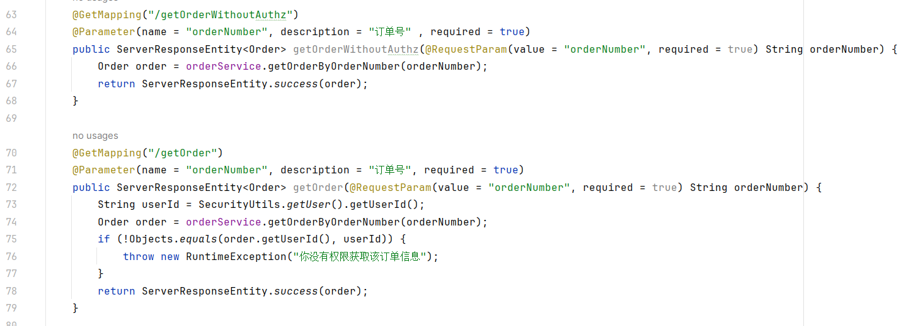

&emsp;&emsp;实际上表在设计的时候就会有这样一个“外键”关联到User表，针对这个order数据表的来自普通用户的操作都应围绕着userId来进行权限的校验：

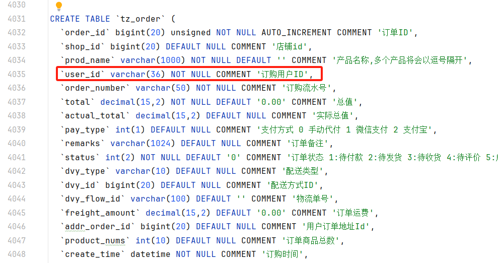

##  越权问题模型

针对水平越权的漏洞检测，我们的问题模型有如下几个方面 应用分层、数据库表、数据传播类型、SQL执行。

### 应用分层

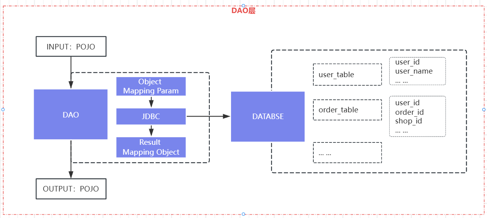

- 分层：
  - 控制层：应用在控制层（fliter/interceptor）对用户进行了鉴权，走到业务层的都是有效凭证的用户（在水平越权视角下）
  - 业务层：业务层可获取缓存的凭证/对象，操作DAO层时需要利用缓存的凭证与DAO交互，避免单纯采信用户的输入导致越权（用户访问的数据与所属用户不符）
  - DAO层：封装SQL执行，入参出参都是对象形式，DAO层会对数据做装箱

### 数据库表

- 数据库表：表在设计时已经含有了“用户”与“用户数据”关系的这一逻辑，我们只关注 data table 的操作。
  - user table：unique key一类的表字段都具备标记唯一用户的功能，统一记为 **owner** 。
  - data table：包含owner的表为用户数据表，自身的unqiue可标识该行，单独的owner则确定以user为分段的结果区间。
  - ignore table：不包含onwer的或被手工排除的，如商品评论表，包含user_id这一owner，但商品评论信息的查询不需要鉴别用户权限。

  tz_user表如下，当用户指定该表为用户表时，这里的 user_id user_mail user_mobile 由于都是关于user表的unique key，因此都被自动标记为owner。

  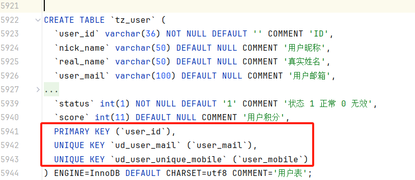

  订单表如下，由于其含有 user_id 这一owner，默认会自动将该表标记为data table（但是如果名称不一致，则需要额外处理），另外这里的 order_id order_number 都为unique key。

  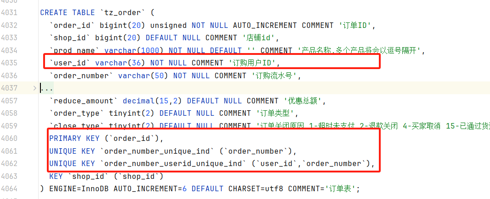

  商品评论表如下，虽然含有user_id这一 owner，但是商品的评论的查看不需要做权限的校验，因此需要用户手动排除此类表，将其标记为ignore table。

  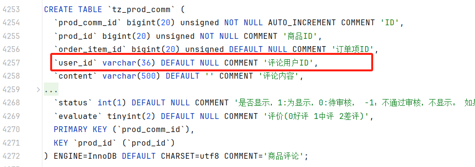

商品目录表如下，由于其不包含owner，自动将其标记为ignore table，不做越权检测。

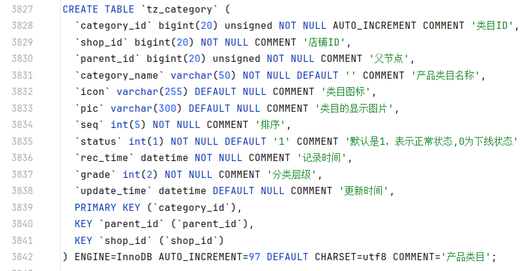

### 数据传播类型

- 数据传播类型：与 SAST/IAST 一样，需要跟踪数据的传播，而项目中多了一个新的概念——pure。
  - source：来自用户的输入，默认是不可信任的
  - pure：来自缓存的凭证/对象，或是被pure影响的数据也可能会标记为pure，表示这是一个可信任的数据
  - sink：dao update、mapping result
- DAO层与业务操作者之间进行数据流转，DAO层的数据来源可能是HTTP输入、其他DAO Query的结果、缓存的凭证等等，在数据流转的过程中，我们进行数据跟踪，根据算法逻辑对其进行标记

### SQL执行

- SQL执行：
  - SQL上下文：SQL执行在 JDBC层，而通过DAO我们得以将其与业务层入参出参对象进行关联
  - SQL类型：存在query、update两种类型，对于query，当且其结果输出给到前端时，我们才能判断其是否存在越权。
  - 输入与输出：我们可以把一次SQL执行看作一次函数执行，owner约束输出在某个用户的数据区间段，unique可直接约束输出为某个唯一数据且属于某个用户，当输入为pure时，则SQL执行或输出不存在越权问题
  - SQL约束项：这里把where语句中的条件称为约束项，我们需要根据约束项的**传播类型**与**表列情况**来判断本次SQL执行是否存在越权问题（目前未去理解where的具体语义即约束项生效情况，但通常时起作用的）
    - 基础判断逻辑：约束项中，任意一个unique/owner为pure，则本次SQL执行不存在越权问题；
    - 场景1：SQL执行时的约束项含有owner，藉此来避免数据被非属用户访问，当owner为pure，则输出也为pure；
    - 场景2：SQL执行时的约束项为存在一个unique为pure时，输出则为pure，此时该unique的数据上游必然来自场景1；
    - 场景3：SQL执行未作约束，如果是普通用户接口，则存在漏洞。

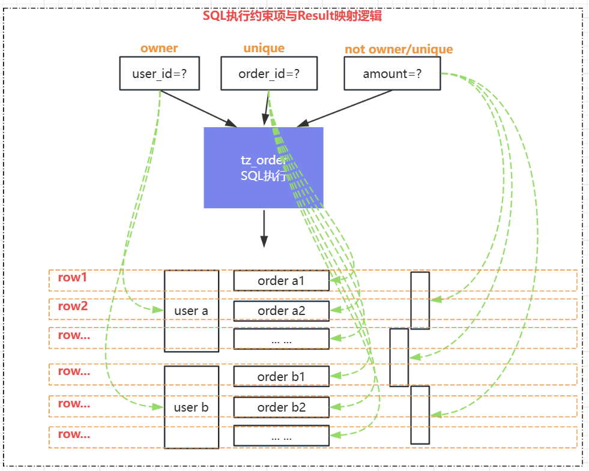

## 数据的跟踪

### 数据跟踪基础知识

我们先来理解Java运行时中数据跟踪的几个基础思想：

- 通过hashid识别对象：Java中我们可以通过System.identifyHashCode拿到一个对象的内存地址的哈希映射（64bit到32bit），这是一个int值；我们钩挂不同方法，在这些方法中通过对象的hashid可以判断是否是之前记录的某个对象，继而进一步处理。
- 通过hashcode了解对象“值”的变化：对象的hashcode方法是其内容值的一个哈希值且为int类型，在IAST中通常只关注基础数据类型String的hashcode。如果在方法1我们观察到的对象的hashcode与在方法2观察到的值不同，说明对象内容发生了变化，如果我们没有对应的propagator了解这个变化的过程，则会降低我们检测相应的问题的准确率、覆盖层度。
- 通过不同的切点知晓对象父子情况：对象可能被加解密、编码解码、字符串拼接切割等等，这些就带上了业务逻辑，我们需要自行处理其间的逻辑，如加密了的不需要关注；另外一方面，如果没有相应的切点作为propagator，我们也无法继续跟踪这个对象，如数据被解密之后产生的新的对象。
- 通过对象拆分获取可见对象：我们通过钩挂的各个方法，拿到的可能是一个业务对象，由于业务对象在我们的视角是一个表象或不可见的，因此我们需要拿到业务对象中具体的基础类型数据对象（boxed），才能进行相应的数据跟踪。
- 数据跟踪实为对象跟踪：由于技术上的限制，我们对于非装箱的int等数据类型无法做到真正的跟踪，因此一方面我们要求POJO字段中的基础数据类型都应该装箱，另外一方面，我们在兼容处理各个框架时要注意这一点，其中对于fastjson的兼容则难度很高。表的unique字段不太可能参与数学计算，因此装箱不会影响性能，此外，数据在DAO层无论如何也都是会被装箱的。
- 数据跟踪的两种方式：
  - 数据传播：
    - normal propagator：传播source、pure属性
    - dao propagator：如果SQL执行中的约束项（unique/owner）是pure，则SQL执行结果也为pure；此外，如果SQL执行的其他入参的表列与执行结果的表列一致，则该入参对象也标记为pure
  - 流程控制：当一个数据对象与pure进行equals对比且return为true，则该数据对象也被标记为pure。这个判断逻辑的依据是，我们假设这里发生会流程控制（与pure对比，false就中断流程/抛异常）。如查询订单，订单号来自HTTP输入，开发者应先查询这个订单的所属用户，之后有 “订单用户ID”.equals(“凭证用户ID”) 的判断，当结果为true时  “订单用户ID” 才能被使用，否则应抛出异常。

### 图的基础逻辑

在java agent中我们钩挂各个类方法，收集当前上下文感兴趣的对象数据并上报到后台云端，后台会负责将数据写入到Nebula图数据库中。

一个方法中，入参是父对象，产生的结果是子对象，使用的边为ObjRelative，对应到如下图，每个圆圈为一个顶点，每个顶点可以有多个标签。

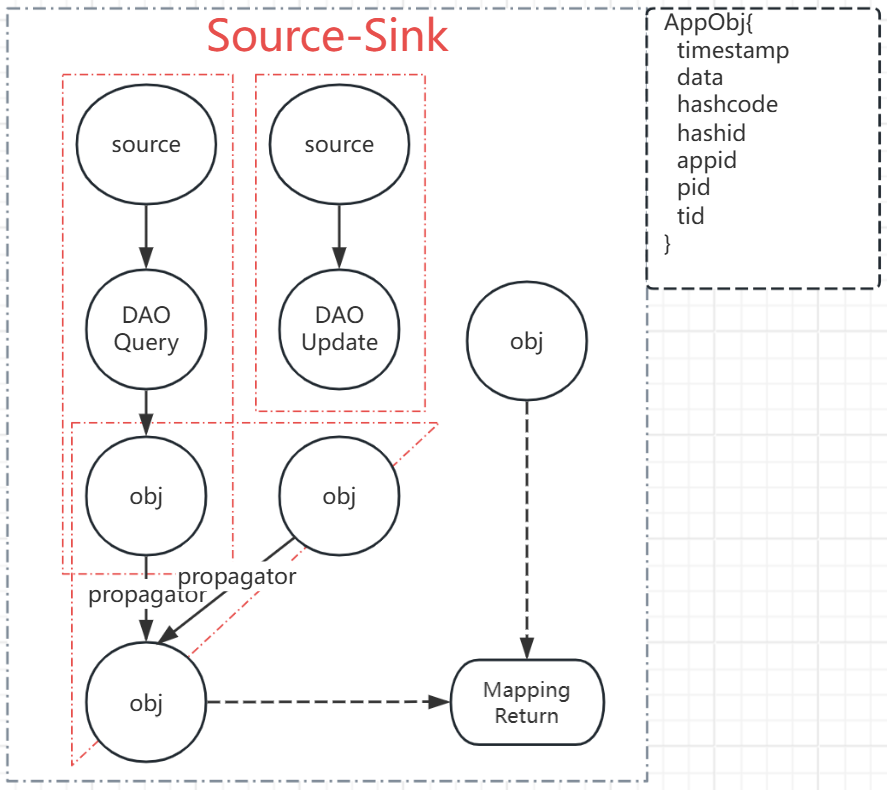

每个顶点会有多个标签Tag，项目中有以下Tag

- 基础信息的：
  - AppObj 
  - Eventinfo
  - Sink：标明对象为sink及sink类型，dao updater、mapping result
  - TraceMark 标记 source pure queryTaint
- DAO即SQL执行的：
  - SqlParam
  - SqlResult
  - Sql
- RPC即远程调用的：
  - Request
  - Response
  - Flow
  - Content
  - Value

### Pure传播

pure传播逻辑比较复杂

- pure数据的起点通常来自缓存，如ThreadLoca.get() 、BeanFactory.getBean() ；

- 与起点pure打交道的逻辑上来说肯定是owner，但目前的检测逻辑暂未限制这点；

- pure数据通过guide影响source，使得source也标记为pure；

- query结果与入参表列一致的，结果为pure则入参也会被设置为pure

- ...

  

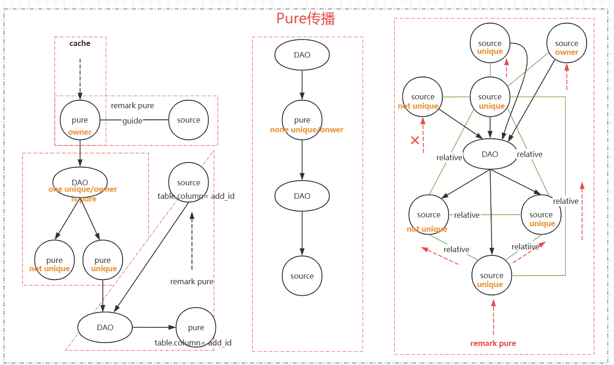

guide逻辑案例：

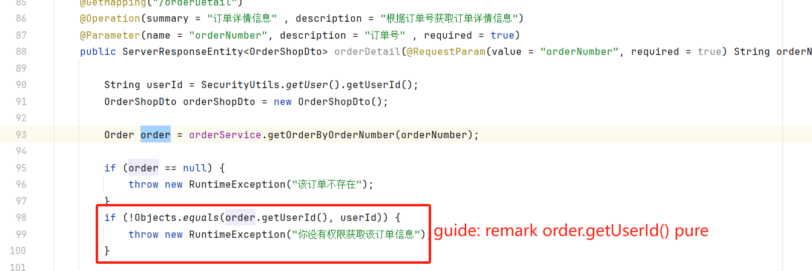

query结果与入参表列一致的，入参被标记为pure的案例：

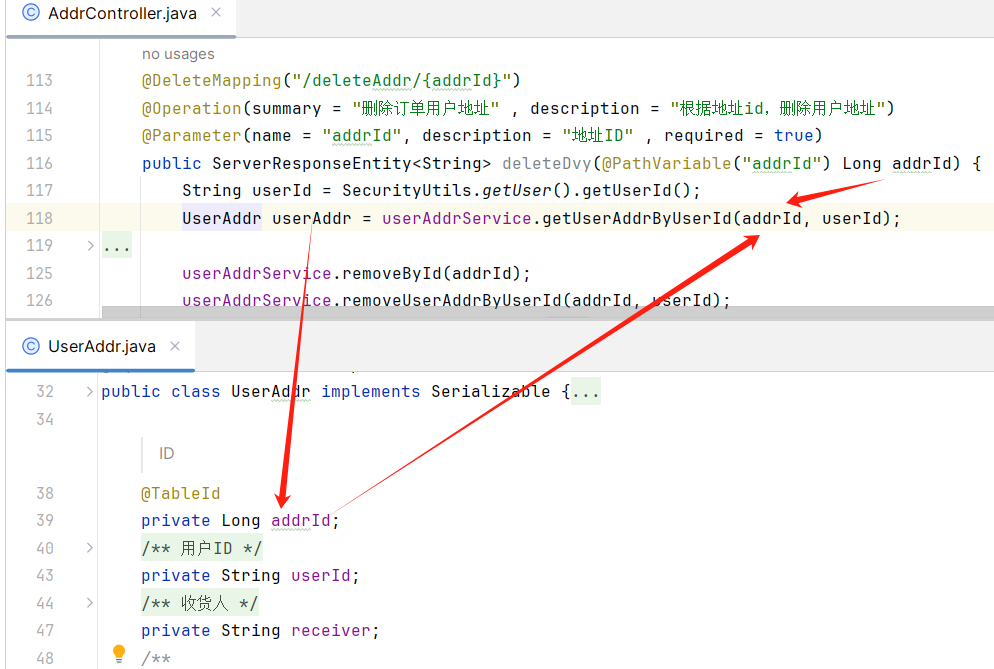

入参是unique key类型的约束且为source，查询出的结果是起初也是source，但随后可证明其是pure，因此我们需要把该入参也标记为pure

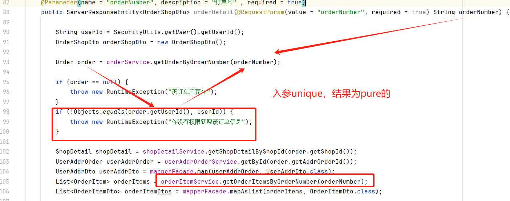

### DAO层

- 入参：参数的表列的解析，目前是基于alibaba druid语法引擎，由于需要处理子查询等复杂情况，因此目前会做两次SQL解析，第一次给出SQL结构，第二次做子查询处理。
- 出参：执行结果的解析目前是直接使用的JDBC提供的结果（一开始也是用的语法引擎，后面废弃这个方案）

- list问题：由于一个Param可能指定不同的SQL对象，Nebula不支持List数据类型，因此Param内部的字段数据会以拼接的形式存在，”table1,table2,table3“，”column1,column2...“，result也同样如此。

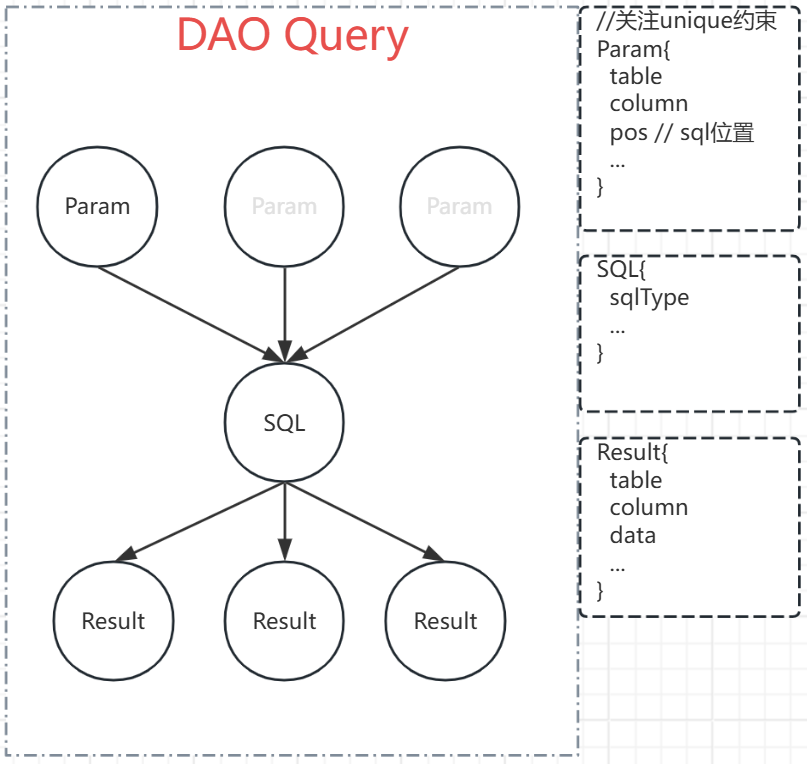

## 跨进程跟踪

### 接口拆分问题

应用存在接口 /orderDetail 

1. 从HTTP输入中拿到orderId，查询得到订单order，此时order对象是不可信的
2. 从缓存中拿到用户凭证userId，该userId是可信的
3. 对比两个id ，即 order.getUserId().equals(userId)  ，当结果为false时进行流程控制，退出接口流程；结果为true表面order对象为当前用户数据
4. 使用orderId获取orderDetail，返回orderDetail数据给前端。

在微服务下，orderDetail的查询可能被拆分到另外一个应用上，由另外的应用负责执行，此时，我们就需要进行跨进程的数据跟踪。

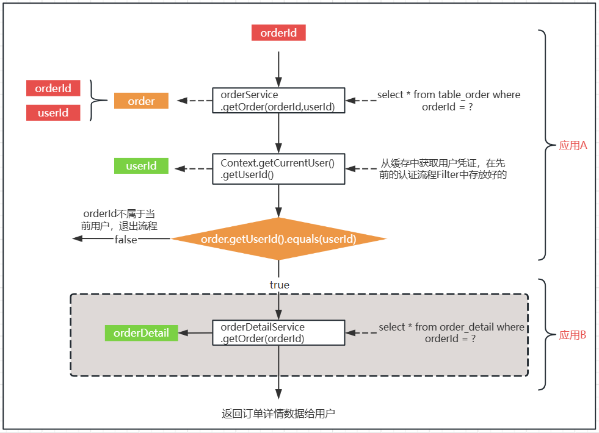

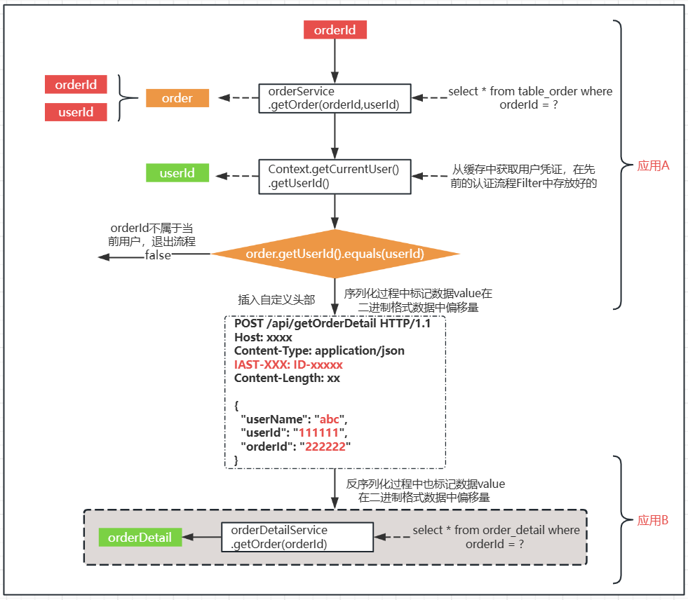

### content pack&unpack

目前兼容测试了jackson、fastjson，还待兼容gson ...

value在content中的偏移量的计算，统一将content转换为字符串后再进行处理

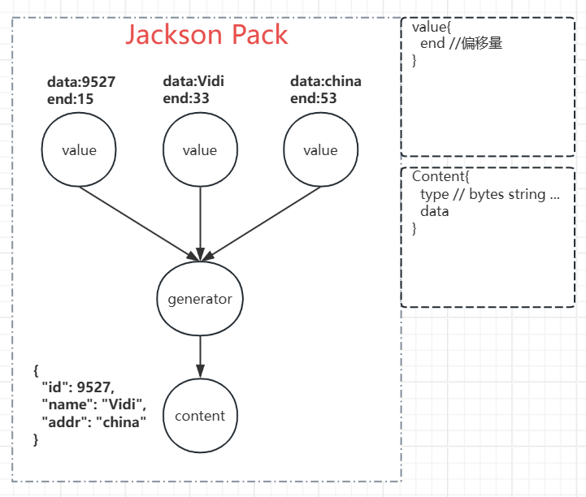

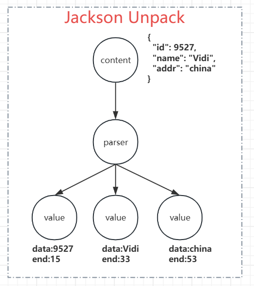

### http pack&unpack

&emsp;&emsp;这里为了进行统一的封装表述，序列化在项目中被称为pack，反序列化则为unpack。HTTP请求的发包、URL表单的生成、http响应包的生成 等等也称为pack；http请求的解析、http响应包的解析称为unpack，这样一来，我们就对我们要做的事情有一个统一对称的模型。

&emsp;&emsp;原始数据value/obj 被pack，可变为content，content可被pack为request，到 request被unpack为content，content被unpack为value，我们可以将两个节点上的value进行关联，从而进行跨应用的数据跟踪。

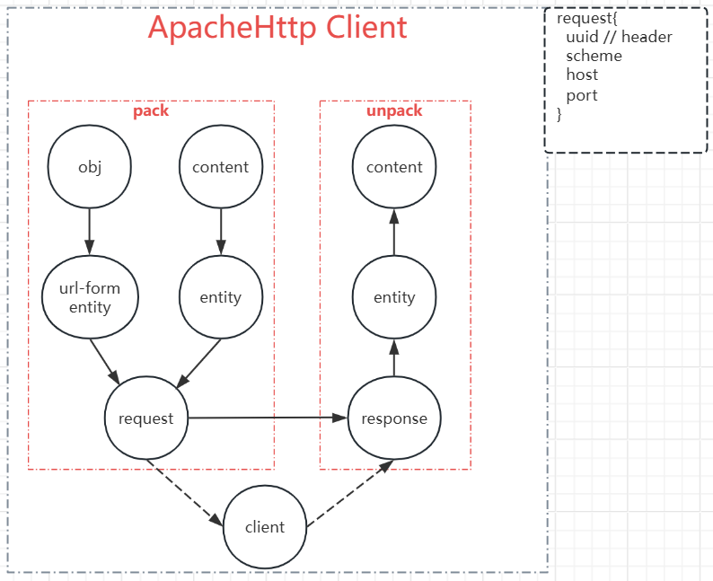

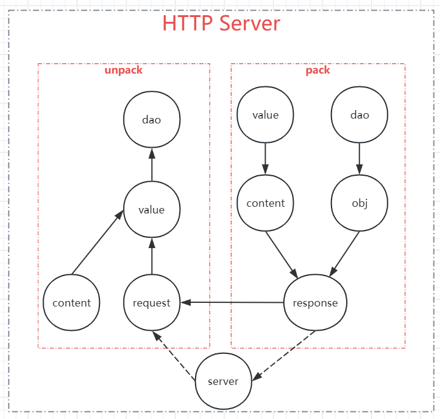

## 链路问题

### 链路双向处理问题

节点B接收A的数据并进行处理，在A之后才能知晓数据具体情况，如是哪个表的、是否pure；

节点A接收相应包数据rspB，只有在B节点完全处理完后（包括其后续链路）才好知道接收到的数据的具体情况，以此类推。

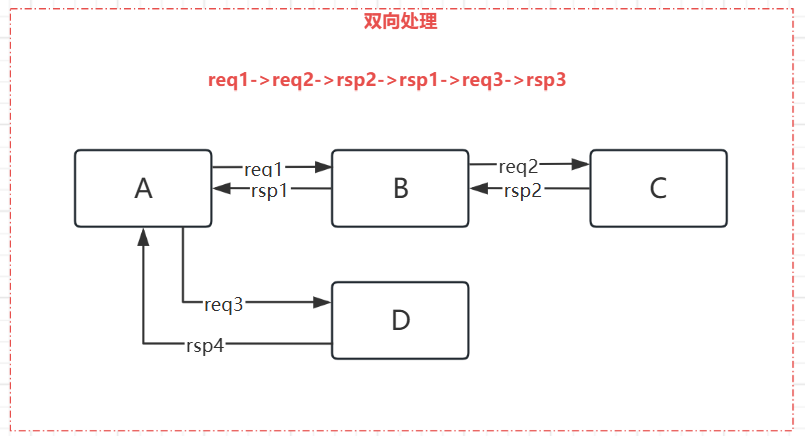

为了解决这个问题，在应用发送HTTP请求时，直接构造一条 unpack request(server) 指向 pack request(client）的边，这样我们在做图查询时先构造这样一个链路树，基于词做图查询做越权检测即可。

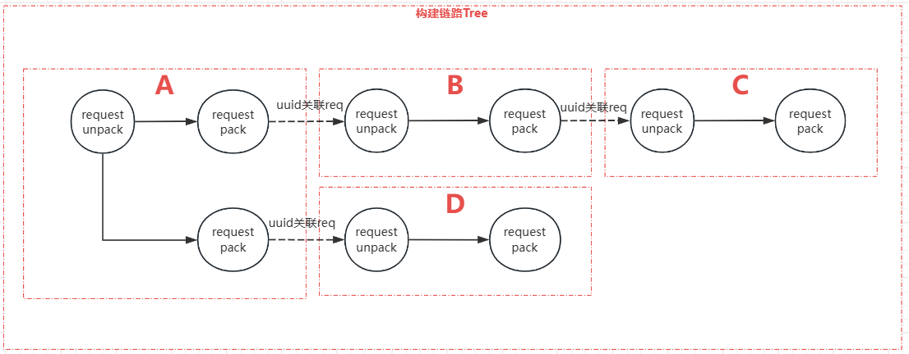

### 获取唯一链路

&emsp;&emsp;在起始点，计算当前请求的分别得到关于流量特征的WordNode与关于业务特征的BeanNode，之所有有这么一说，流量特征上是指的头部字段key、表单name，由于开发者可能通过web中间件getHeader、getParameter等方法拿到这些数据，但是我们在计算请求特征时是无从知晓这些数据是否被使用，在我们视角下都只是流量特征；而到了SpringMVC 这里，我们可以拿到业务方法的入参，而这里就是具体的业务对象，计算该业务对象的内容情况，从而可得到业务特征。

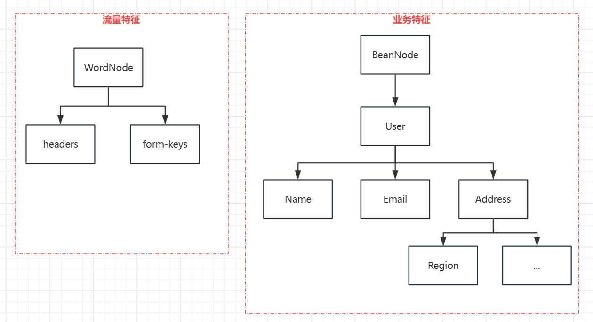

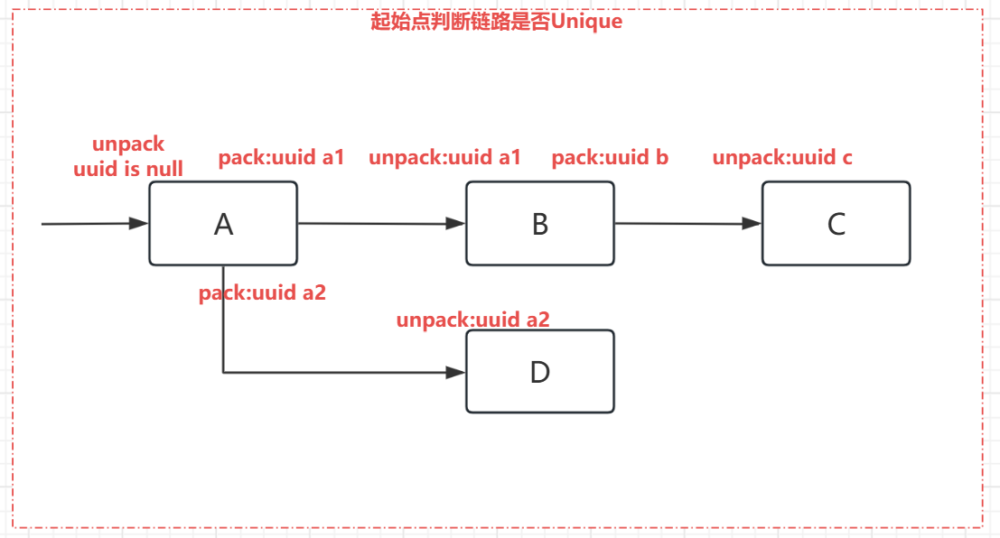

## 结语

&emsp;&emsp;项目有一定难度，尤其是图查询这块十分复杂，进度卡在图查询上比较长时间，整个项目也还需要逐步兼容适配，效果也需要开发一定的配合（装箱），项目前后端还需要相应的配套，期望后续稳步推进。

- 漏报的风险点
  - SQL约束项语义不符合预期
  - 数据未装箱（实际上数据的装箱是不影响性能的，只要不使用装箱数据来进行math计算，而从我DEBUG结果来看，涉及到DAO层数据无论无何都会被装箱）
  - 预期的控制流程代码不存在
  - 相关库未兼容