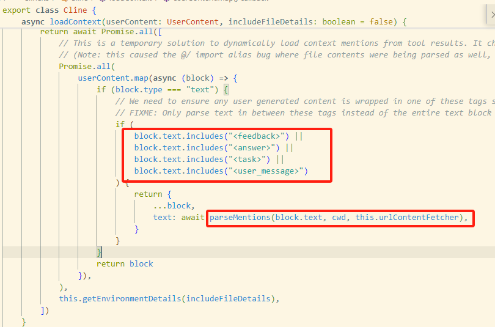

# 从Cline开始了解LLM实践

@turn1tup

## 前言

Cline是一款类似cursor的AI代码智能助手，通过Cline我们能通过对话的方式来理解当前项目代码、修改完善项目代码，令人兴奋的是[Cline](https://github.com/cline/cline)是基于apache license的开源项目，其衍生开源项目另有 [Roo-Code](https://github.com/RooVetGit/Roo-Code)。

让我们从Cline的开源代码开始理解LLM应用应如何开发，这也启导我们后续做LLM review code等工作，而在看cline代码时笔者并没有LLM开发的基础知识，因此本文会相对小白一些，将一些基础知识也一并记录下来。

## 接口调用方式

### completaions

参考aliyun、deepseek的关于API接口的调用说明可以了解到，API接口是`无状态`的，服务端不会保存每次会话的上下文，用户每次与LLM对话需要自己将之前的所有历史对话拼接上去。

https://help.aliyun.com/zh/model-studio/user-guide/multi-round-conversation

https://api-docs.deepseek.com/zh-cn/guides/multi_round_chat

cline通过completions调用进行对话：


cline多次对话中发送的数据，将之前的数据合并发送，发送的流量会累加：


### function calling

cline通过在sytem提示中构造一系列的XML标签说明从而提供给LLM工具调用的能力，但阅读LLM产品的接口调用文档，我们可以了解到LLM产品的接口调用提供了 function calling这机制，因此似乎通过funtion calling来实现工具的调用会更友好。

https://platform.openai.com/docs/guides/function-calling


但在翻阅更多LLM产品后，我们可以了解到，不是所有的LLM都支持function calling，此外，funtion calling自身也会有各种BUG。

百炼上的模型可不只这些，只有部分支持：


deepseek文档中坦言function calling不稳定（当然，system prompt中提供工具的方式也不一定稳定，cline通过few-shot与检查llm回答来强制llm的回复格式）


### 提示词role

https://platform.openai.com/docs/guides/text-generation#messages-and-roles

| `role` 值            | 说明                                              | 示例                                                         |
| -------------------- | ------------------------------------------------- | ------------------------------------------------------------ |
| **system**/developer | 系统指令，设定整体行为，优先级高于user            | `"You are a helpful assistant."`                             |
| **user**             | 用户输入，表示用户提出的问题或请求                | `"Translate this sentence to French."`                       |
| **assistant**        | AI 上轮会话生成的回复，由用户手动拼接到当轮会话。 | `"La traduction est..."`                                     |
| **tool**             | Function calling （OpenAI 2023.12 后支持）        | `{"name": "web_search", "arguments": {"query": "latest AI news"}}` |


## 提示词构造

### markdown风格

system prompt主要呈现为markdown结构，通过一级标题将提示词划方为不同部分，本文这里将提示词保存为markdown文件，通过typeora可以看到相应的提示词目录结构；具体的提示词内容也是markdown格式，后面关于user角色的一些会话如tool调用结果cline也在尽力往markdown风格靠。


### token size

由于cline的system prompt十分大，我们这里关注一下其对应的token大小。

在[open ai tokenizer](https://platform.openai.com/tokenizer)或其他网站上可以计算对应的token大小，[cline原版英文版本](https://github.com/cline/cline/blob/main/src/core/prompts/system.ts)tokens大约为10909：


中文相对英文的香农信息熵会更高，所以我认为这段英文转为中文后token会小，但实际好像并非如此。

计算[cline的中文提示词](https://github.com/HybridTalentComputing/cline-chinese/blob/main/src/core/prompts/system.ts)的token size，可以看到字符数是少了，token大小反而增加了，但我们回头再看上面的英文提示词token计算图，图中明确表示token是与单词相关而非字母，所以这个token大小与香农信息熵大小不符问题也就了然。


### SYSTEM提示词入参


- cwd为用户当前vs code打开的项目的路径，会拼接项目的绝对路径到system prompt中
- supportsComputerUse为true时，system prompt会赋予llm包括使用浏览器的能力
- mpcHub为mcp服务器一系列配置


### 指示工具调用

cline在system提示词中提供给LLM的工具有如下类型，针对有必要说明的部分笔者进行额外描述：

```
execute_command
read_file
write_to_file
replace_in_file
search_files：给定正则在指定文件夹中递归匹配各个文件
    <search_files>
    <path>Directory path here</path>
    <regex>Your regex pattern here</regex>
    <file_pattern>file pattern here (optional)</file_pattern>
    </search_files>
list_files
list_code_definition_names：指定代码文件夹，给出代码的顶层结构，包括代码文件名、类名、函数名
    <list_code_definition_names>
    <path>Directory path here</path>
    </list_code_definition_names>
use_mcp_tool
access_mcp_resource
ask_followup_question：当LLM遇到用户的问题存在歧义、不清晰或细节不足的情况时，应通过该工具香用户获取更多信息
    <ask_followup_question>
    <question>Your question here</question>
    </ask_followup_question>
attempt_completion 在每次使用工具后，用户（这里指的应该是cline）会反馈使用结果和原因，一旦你受到后且能确定任务已经完成，使用本工具来表达你已经完成这个任务
    <attempt_completion>
    <result>
    Your final result description here
    </result>
    <command>Command to demonstrate result (optional)</command>
    </attempt_completion>
plan_mode_response：响应用户的询问，努力规划解决用户任务的方案。当你需要回应用户关于如何完成任务的问题或陈述时，应使用此工具。此工具仅在计划模式下可用。environment_details 将指定当前模式，如果不是计划模式，则不应使用此工具。根据用户的消息，你可以提出问题以澄清用户的请求，设计任务的解决方案，并与用户进行头脑风暴。例如，如果用户的任务是创建一个网站，你可以从提出一些澄清问题开始，然后根据上下文提出一个详细的计划来完成任务，并可能进行来回讨论以确定细节，然后用户将你切换到执行模式来实施解决方案。
    <plan_mode_response>
    <response>Your response here</response>
    </plan_mode_response>
```

### few-shot

可以看到，cline提供了5个example给llm：


### 核心提示词

ART是ReAct的超集，ReAct是CoT的超集，整个工程可以看作ART的一种实现，我们来看看一些关键的提示词。

开头提示词强调CoT，我们也可以让其使用ToT思维树。之前在一些代码审计案例中，ToT效果会比CoT更强，但是LLM输出的reasoning会占用很多token。


在工具的使用这一核心指导中，强调在thinking标签中输出当前已有信息与下一步要做什么；强调选择当前最合适的工具；强调每个消息只能使用一个工具，可以通过迭代方式完成一个任务。这样也方便


### 多模态

用户会话中有image变量，但是目前测试的模型不支持多模块，这块先暂时不看。

## 代码实现

我们以业务功能视角来析构cline的代码并进行阐述。

### shadow git

当用户创建task，给出一个问题后，cline会创建一个影子git，路径为 `%HOMEPATH%\AppData\Roaming\Code\User\globalStorage\saoudrizwan.claude-dev\tasks\任务ID\checkpoints\.git`

由于cline可以被用户授权来修改文件，所以这里可能是进行代码备份便于回退。


### 会话逻辑

核心类Cline中关于会话消息有三个关键的字段：

- userContent：用户的提问或因此产生的cline的工具回答
- apiConversationHistory ：来源于userContent，调用LLM的API时直接使用到该数据。
- clineMessages :前端展示，此外记录会话数据string从而计算token，这个字段不关注。

#### task

项目以初始化一个task任务开始，不会主动中断一个会话，当用户取消会话时会话会中断，否则会话可以一直持续。


- 

#### userContent

每次提问产生的userContent 被parsedUserContent替换，此外向userContent添加当前环境信息environmentDetails，最后我们可以看到，userContent被添加到 apiConversationHistory。


当userContent为task feeback answer user_message 四种标签之一时，将content内容通过`parseMetions`进行转换



`parserMethods`方法主要就是将userContent中的 HTTP链接、路径、problems 三种资源/情况 识别到，并替换为更具体的资源


HTTP链接就是替换为具体的网页内容，路径则是找到当前项目中关于该路径都有哪些文件夹或该文件内容是什么，这个problem笔者暂时还不理解具体意图。


#### 内容块转markdown

`formatContentBlockToMarkdown`：对于工具的调用结果，会在其前面添加中括号进行声明，但这种格式似乎也不是markdownd的后续提问也相当于 attempt_completion 工具的调用结果，因此用户的提问也可能会被追加 `[attempt_completion] Result:`。

关于用户的回答/工具的回答，我在调试时都命中不了这个函数，可能这里还没调试清楚。


传输的数据案例：

```json
        {
            "role": "user",
            "content": [
                {
                    "type": "text",
                    "text": "[attempt_completion] Result:"
                },
                {
                    "type": "text",
                    "text": "The user has provided feedback on the results. Consider their input to continue the task, and then attempt completion again.\n<feedback>\n这个项目是干什么的？\n</feedback>"
                },
                {
                    "type": "text",
                    "text": "<environment_details>\n# VSCode Visible Files\n(No visible files)\n\n# VSCode Open Tabs\n(No open tabs)\n\n# Current Time\n2/28/2025, 1:50:47 PM (Asia/Shanghai, UTC+8:00)\n\n# Current Mode\nACT MODE\n</environment_details>"
                }
            ]
        }
```


#### 强制工具使用

在对话中会强制LLM的回答必须使用tool，这也是整个工程不可缺少的一环。


#### attemptApiRequest

调用 attemptApiRequest 请求LLM API接口，方法中处理了context token超出限制的情况，本文在 4.2.5. 中对此进行说明。

针对api的text响应内容，调用 parseAssistantMessage 对LLM答复的tool标签进行解析处理，并进行具体的调用。


attemptApiRequest 最终通过 ApiHandler.createMessage 来调用LLM平台提供的具体接口，ApiHandler相关实现在api/prividers下。


#### 会话截断与再续

在发出API请求时cline会检查当前会话total tokens是超过最大限制（用户一次的提问也可能由多轮对话完成），如果对话已经超过则会将当前会话进行分割从而缩减tokens进行下一轮会话，分割会话历史的方法为 getNextTruncationRange。

由于考虑到用户在当前会话的对话过程中可能修改配置为其他更小contenxt的模型，因此在截断历史消息`apiConversationHistory `时，可能会将其截断为1/4 或 1/2。


与LLM API交互时，使用的会话数据为`apiConversationHistory `，当截断范围`conversationHistoryDeletedRange`不为空时，则将使用conversationHistoryDeletedRange对apiConversationHistory进行截断从而开启会话。


这里有必要解释一下其中一段代码：

messages.slice(0, start)：获取 `messages` 数组中索引 **`0` 到 `start-1`** 的元素（不包含 `start`）。

messages.slice(end + 1)：获取 `messages` 数组中索引 **`end+1` 及之后的元素**（不包含 `end`）。

[...A, ...B]：用**扩展运算符（`...`）**拼接两个数组，形成一个新的数组。

```typescript
[...messages.slice(0, start), ...messages.slice(end + 1)]
```


阅读分割会话的代码，我们可以了解到其核心处理逻辑为

- 从数组下标1开始截取，确保能保留第一个会话，即user role的第一个会话（system prompt在system role中），用户的第一次提问生成的相关数据

  

- 删除消息时保留 user+assistant 这样成对的结构

- 

```typescript
/*
getNextTruncationRange: Calculates the next range of messages to be "deleted"
- Takes the full messages array and optional current deleted range
- Always preserves the first message (task message)
- Removes 1/2 of remaining messages (rounded down to even number) after current deleted range
- Returns [startIndex, endIndex] representing inclusive range to delete

getTruncatedMessages: Constructs the truncated array using the deleted range
- Takes full messages array and optional deleted range
- Returns new array with messages in deleted range removed
- Preserves order and structure of remaining messages

The range is represented as [startIndex, endIndex] where both indices are inclusive
The functions maintain the original array integrity while allowing progressive truncation 
through the deletedRange parameter

Usage example:
const messages = [user1, assistant1, user2, assistant2, user3, assistant3];
let deletedRange = getNextTruncationRange(messages); // [1,2] (assistant1,user2)
let truncated = getTruncatedMessages(messages, deletedRange); 
// [user1, assistant2, user3, assistant3]

deletedRange = getNextTruncationRange(messages, deletedRange); // [2,3] (assistant2,user3) 
truncated = getTruncatedMessages(messages, deletedRange);
// [user1, assistant3]
*/

export function getNextTruncationRange(
	messages: Anthropic.Messages.MessageParam[],
	currentDeletedRange: [number, number] | undefined = undefined,
	keep: "half" | "quarter" = "half",
): [number, number] {
	// Since we always keep the first message, currentDeletedRange[0] will always be 1 (for now until we have a smarter truncation algorithm)
	const rangeStartIndex = 1
	const startOfRest = currentDeletedRange ? currentDeletedRange[1] + 1 : 1

	let messagesToRemove: number
	if (keep === "half") {
		// Remove half of user-assistant pairs
		messagesToRemove = Math.floor((messages.length - startOfRest) / 4) * 2 // Keep even number
	} else {
		// Remove 3/4 of user-assistant pairs
		messagesToRemove = Math.floor((messages.length - startOfRest) / 8) * 3 * 2
	}

	let rangeEndIndex = startOfRest + messagesToRemove - 1

	// Make sure the last message being removed is a user message, so that the next message after the initial task message is an assistant message. This preservers the user-assistant-user-assistant structure.
	// NOTE: anthropic format messages are always user-assistant-user-assistant, while openai format messages can have multiple user messages in a row (we use anthropic format throughout cline)
	if (messages[rangeEndIndex].role !== "user") {  //如果 messages[rangeEndIndex].role 不是user，则messages[rangeEndIndex].role+1是user，+1 是实际开始保留的数据...按照这个逻辑这里的条件语句好像写反了
		rangeEndIndex -= 1
	}

	// this is an inclusive range that will be removed from the conversation history
	return [rangeStartIndex, rangeEndIndex]
}
```


## 总结

cline作为一款开源AI代码工具，给我们提供一些LLM实践的基本思路，包括提示词的构造思路、工程上避免AI回答预期外、context limit问题的解决等，在具体的一些使用场景上，我们可以需要通过few-shot来增强其能力，对于LLM思考的主动性上（尤其是代码审计）我们也需要通过提示词增强LLM这一特定。
